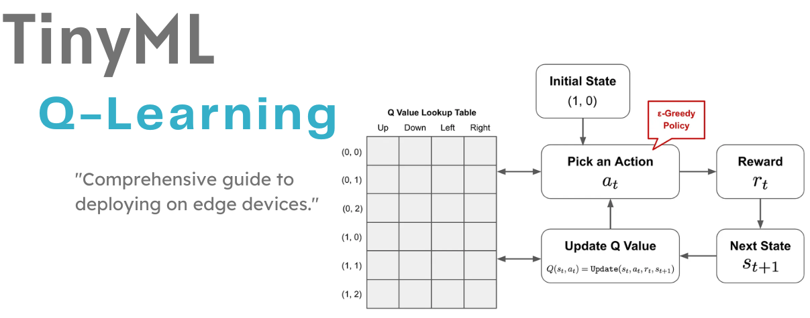
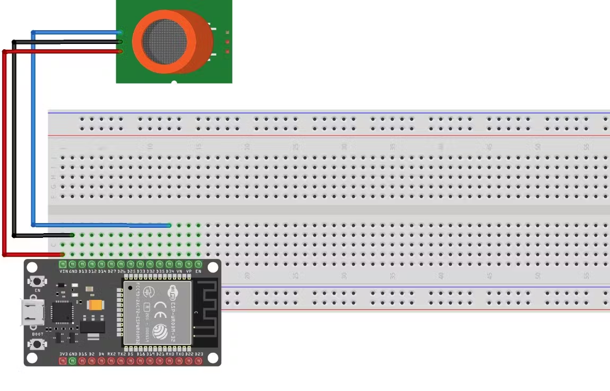
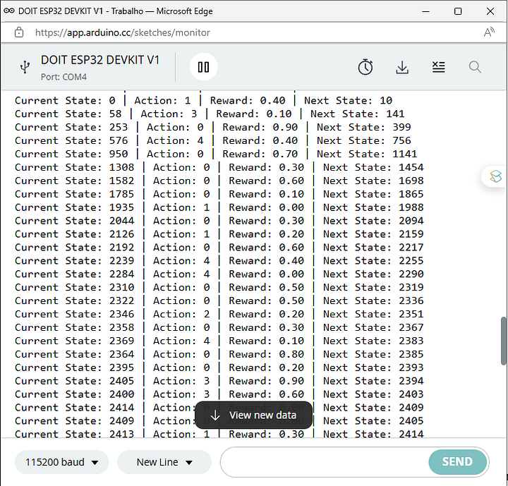

# TinyML - Q-Learning

*From mathematical foundations to edge implementation*

**Social media:**


👨🏽‍💻 Github: [thommaskevin/TinyML](https://github.com/thommaskevin/TinyML)

👷🏾 Linkedin: [Thommas Kevin](https://www.linkedin.com/in/thommas-kevin-ab9810166/)

📽 Youtube: [Thommas Kevin](https://www.youtube.com/channel/UC7uazGXaMIE6MNkHg4ll9oA)

:pencil2:CV Lattes CNPq: [Thommas Kevin Sales Flores](http://lattes.cnpq.br/0630479458408181)

👨🏻‍🏫 Research group: [Conecta.ai](https://conect2ai.dca.ufrn.br/)





## SUMMARY

1 - Introduction to Reinforcement Learning

2 - Mathematical Foundations of Q-Learning

 2.1 - Basic Definitions
 
 2.2 - Bellman Equation
 
 2.3 - Q-Learning Algorithm
 
 2.4 - Convergence Considerations
 
 2.5 - Forecasting Numeric Example
 
3 - TinyML Implementation


## 1 - Introduction to Reinforcement Learning

Reinforcement Learning (RL) is a paradigm in machine learning where an agent learns to make decisions by interacting with an environment. Unlike supervised learning, where the model is trained on labeled data, RL focuses on learning from the consequences of actions. The agent’s goal is to maximize a cumulative reward by choosing actions that influence future states.

In RL, the agent perceives the environment through states, takes actions, and receives feedback in the form of rewards or penalties. Over time, the agent learns a policy—a mapping from states to actions—that maximizes the expected long-term reward. One of the key challenges in RL is balancing exploration (trying new actions) and exploitation (choosing the best-known actions). Q-Learning, a model-free RL algorithm, is widely used to tackle this challenge by learning an action-value function that estimates the quality of actions taken in various states.


## 2 - Mathematical Foundations of Q-Learning


At the heart of Q-Learning is the idea of learning an action-value function $Q(s, a)$, which estimates the expected future reward of taking an action $a$ in a state $s$, following the best possible policy from that point.


###  2.1 - Basic Definitions


- **State $s$**: Represents a particular configuration of the environment.

- **Action $a$**: A decision or move that the agent can make in a state $s$.
- **Reward $r$**: A value received after taking an action, reflecting the immediate benefit.

- **Policy $\pi(s)$**: A rule or function that maps states to actions. The goal is to find the optimal policy $\pi^*(s)$.

- **Action-Value $Q(s, a)$**: The expected reward for taking action $a$ in state $s$ and following policy $\pi$ thereafter.


###   2.2 - Bellman Equation

The action-value function $Q(s, a)$ can be expressed recursively using the Bellman equation:

$Q(s, a) = \mathbb{E} \left[ r + \gamma \cdot \max_{a'} Q(s', a') \mid s, a \right]$

where:

- $\gamma \in [0, 1]$ is the discount factor that weighs the importance of future rewards relative to immediate rewards.

- $\mathbb{E}$ denotes the expected value, considering the transition probabilities between states.


###   2.3 - Q-Learning Algorithm

Q-Learning is an off-policy algorithm that iteratively updates the function $Q(s, a)$ without requiring a model of the environment.

**Step by Step:**

1. **Initialization**:
   
   - Initialize the Q-table arbitrarily: $Q(s, a) = 0$ for all $s$ and $a$.

3. **Iteration**:
   - For each episode (a set of steps until the terminal state):
     
     1. **Observation of Initial State**: Observe the initial state $s$.
        
     3. **Action Selection**: Choose an action $a$ using an exploration policy (e.g., ε-greedy).
        
     4. **Action Execution and Reward Observation**: Execute the action $a$, observe the reward $r$ and the new state $s'$.
     5. **Q-Table Update**:
        
        $Q(s, a) \leftarrow Q(s, a) + \alpha \left[ r + \gamma \max_{a'} Q(s', a') - Q(s, a) \right]$
        
        - $\alpha \in [0, 1]$ is the learning rate that controls how quickly new values replace old ones.

     6. **Transition to the New State**: Update the current state $s$ to the new state $s'$.
     7. **Episode Termination**: If $s'$ is a terminal state, restart the process with a new initial state.

4. **Convergence**:
   
   - Repeat the process until the Q-table $Q(s, a)$ converges to stable values. Ultimately, the optimal policy $\pi^*(s)$ is given by:
     
   $\pi^*(s) = \arg\max_a Q(s, a)$

###   2.4 - Convergence Considerations

Q-Learning converges to the optimal policy $\pi^*(s)$, assuming all actions are explored infinitely often and the sum of the learning rates $\alpha$ over time also converges to zero.

- **Exploration vs. Exploitation**: The ε-greedy policy is often used, where with probability ε the agent chooses a random action (exploration), and with probability $1 - ε$ chooses the best action based on the Q-table (exploitation).
  
- **Learning Rate $\alpha$**: It should decrease, but not too quickly, to ensure that new learning can be incorporated while not completely discarding old knowledge.


###   2.5 - Numerical Example of Q-Learning for Forecasting

Let's walk through a numerical example of using Q-Learning to make forecasting decisions in a time series context, such as predicting stock price movements. The goal is to decide whether to "buy," "sell," or "hold" a stock based on observed price changes.

####  2.5.1 - Problem Setup

- **States ($s_t$)**: The state represents recent price movements. For simplicity, we'll define the state as the price movement over the last two time steps: $s_t = (p_{t-1}, p_{t-2})$, where $p_t$ is the price at time $t$.
  
- **Actions ($a_t$)**: The possible actions are:
  1. Buy (B)
  2. Sell (S)
  3. Hold (H)

- **Rewards ($r_t$)**:
  - If the agent buys at $t$ and the price increases at $t+1$, reward = +1.
  - If the agent sells at $t$ and the price decreases at $t+1$, reward = +1.
  - Otherwise, reward = 0.

- **Discount Factor ($\gamma$)**: Let's assume $\gamma = 0.9$.

####  2.5.2 - Step-by-Step Example

#####  2.5.2.1 - Initialize Q-Table

We'll initialize the Q-Table for the three possible actions across all states. Initially, all Q-values are set to 0.

| State ($s_t$)  | Buy (B) | Sell (S) | Hold (H) |
|------------------|---------|----------|----------|
| (Up, Up)         | 0       | 0        | 0        |
| (Up, Down)       | 0       | 0        | 0        |
| (Down, Up)       | 0       | 0        | 0        |
| (Down, Down)     | 0       | 0        | 0        |

#####  2.5.2.2 - Simulate Time Series Data

Assume we have the following price movements over 5 time steps:

| Time | Price ($p_t$) | Price Change |
|------|-----------------|--------------|
| 1    | 100             | —            |
| 2    | 102             | Up           |
| 3    | 101             | Down         |
| 4    | 103             | Up           |
| 5    | 104             | Up           |

The corresponding states over time are:

| Time | State ($s_t$) |
|------|-----------------|
| 3    | (Up, Up)        |
| 4    | (Down, Up)      |
| 5    | (Up, Down)      |

#####  2.5.2.3 - Apply Q-Learning

Let's simulate the Q-Learning update process for these steps.

**At Time 3**:

- **State**: $s_3 = (Up, Up)$
  
- **Action**: Assume the agent randomly selects "Buy (B)" (exploration).
  
- **Reward**: The next price decreases, so $r = 0$.
  
- **Next State**: $s_4 = (Down, Up)$
  
- **Q-Table Update**:
  
  $Q((Up, Up), B) = Q((Up, Up), B) + \alpha \left[ r + \gamma \max_{a'} Q((Down, Up), a') - Q((Up, Up), B) \right]$
  
  - Assuming $\alpha = 0.1$, and the maximum Q-value in the next state is 0 (as all Q-values are still 0):
    
  $Q((Up, Up), B) = 0 + 0.1 \times \left[ 0 + 0.9 \times 0 - 0 \right] = 0$
  
  The Q-value remains 0.

**At Time 4**:
- **State**: $s_4 = (Down, Up)$
  
- **Action**: Assume the agent selects "Sell (S)".
  
- **Reward**: The price increases, so $r = 0$.
  
- **Next State**: $s_5 = (Up, Down)$
  
- **Q-Table Update**:
  
  $Q((Down, Up), S) = Q((Down, Up), S) + \alpha \left[ r + \gamma \max_{a'} Q((Up, Down), a') - Q((Down, Up), S) \right]$

  - Again, assuming $\alpha = 0.1$ and the maximum Q-value in the next state is 0:
    
  $Q((Down, Up), S) = 0 + 0.1 \times \left[ 0 + 0.9 \times 0 - 0 \right] = 0$

**At Time 5**:
- **State**: $s_5 = (Up, Down)$
  
- **Action**: Assume the agent selects "Hold (H)".
  
- **Reward**: The price increases, so $r = 0$ (since no profit or loss is realized).
  
- **Q-Table Update**:
  
  $Q((Up, Down), H) = Q((Up, Down), H) + \alpha \left[ r + \gamma \max_{a'} Q(s', a') - Q((Up, Down), H) \right]$
  
  - The Q-value remains 0 as before.

#####  2.5.2.4 - **Q-Table After Updates**

After these updates, the Q-Table remains unchanged with all values at 0 because the rewards for these actions were zero. Over many episodes with different price movements, the agent would learn to adjust the Q-values based on observed rewards, leading to a more informed decision-making policy.


## 3 - TinyML Implementation

With this example you can implement the machine learning algorithm in ESP32, Arduino, Arduino Portenta H7 with Vision Shield, Raspberry and other different microcontrollers or IoT devices.




### 3.0 - Include Libraries

- **EEPROM Library**: This library is included to store the Q-Table in non-volatile memory. It ensures that the learned Q-values are retained even after the system is reset or powered off.


```cpp
#include <EEPROM.h> // To store the Q-Table in non-volatile memory
```

### 3.1 - Define Constants

- **ALPHA**: The learning rate, controlling how quickly the agent updates its knowledge.

- **GAMMA**: The discount factor, determining the importance of future rewards.

- **EPSILON**: The exploration rate, specifying the probability of choosing a random action.

- **NUM_STATES**: Total number of possible states the agent can be in.

- **NUM_ACTIONS**: Total number of possible actions the agent can take.


```cpp
#define ALPHA 0.5     // Learning rate
#define GAMMA 0.9     // Discount factor
#define EPSILON 0.5   // Probability of choosing a random action
#define NUM_STATES 4095 // Number of possible states
#define NUM_ACTIONS 5 // Number of possible actions
```


### 3.2 - Declare Variables


- **qTable**: A 2D array representing the Q-Table, storing the Q-values for all state-action pairs.

- **currentState**: The variable that holds the current state of the system.

- **action**: The variable that stores the action selected by the agent.

- **reward**: The variable that holds the reward received after taking an action.

```cpp
float qTable[NUM_STATES][NUM_ACTIONS];
int currentState = 0;
int action = 0;
float reward = 0;
```


### 3.3 - Initialize Q-Table

- **initializeQTable**: This function initializes the Q-Table, setting all Q-values to 0. This step prepares the table for learning by clearing any previous data.


```cpp
void initializeQTable() {
  for (int i = 0; i < NUM_STATES; i++) {
    for (int j = 0; j < NUM_ACTIONS; j++) {
      qTable[i][j] = 0.0;
    }
  }
}
```


### 3.4 - Choose an Action

- **chooseAction**: This function selects an action based on the current state using the epsilon-greedy strategy:

  - With a probability of EPSILON, the agent picks a random action (exploration).

  - Otherwise, it selects the action with the highest Q-value for the current state (exploitation).


```cpp
int chooseAction(int state) {
  if (random(0, 100) < (EPSILON * 100)) {
    return random(0, NUM_ACTIONS); // Choose a random action
  } else {
    int maxAction = 0;
    float maxValue = qTable[state][0];
    for (int i = 1; i < NUM_ACTIONS; i++) {
      if (qTable[state][i] > maxValue) {
        maxAction = i;
        maxValue = qTable[state][i];
      }
    }
    return maxAction; // Choose the best action
  }
}


```


### 3.5 - Update Q-Table

- **updateQTable**: This function updates the Q-Table based on the action taken and the reward received. It uses the Bellman Equation to adjust the Q-value:

  - The new Q-value is a weighted sum of the old Q-value and the learned value, which includes the reward and the maximum future reward from the next state.


```cpp
void updateQTable(int state, int action, float reward, int nextState) {
  float oldQValue = qTable[state][action];
  float maxNextQValue = qTable[nextState][0];
  for (int i = 1; i < NUM_ACTIONS; i++) {
    if (qTable[nextState][i] > maxNextQValue) {
      maxNextQValue = qTable[nextState][i];
    }
  }
  qTable[state][action] = oldQValue + ALPHA * (reward + GAMMA * maxNextQValue - oldQValue);
}
```


### 3.6 - Read Sensor Value

- **readSensor**: This function reads the value from an analog sensor (connected to pin 34) and maps it to a discrete state. This state is used by the Q-learning algorithm to decide on actions.

```cpp
int readSensor() {
  int sensorValue = analogRead(34); // Assuming the MQ-135 is connected to pin 34
  // Convert the read value to a discrete state
  return map(sensorValue, 0, 4095, 0, NUM_STATES - 1);
}  
```


### 3.7 - Setup Function


- **setup**: This function runs once at the start:

  - It initializes serial communication for debugging.

  - Calls initializeQTable to prepare the Q-Table.
Sets pin 34 as an input for reading sensor values.

```cpp
void setup() {
  Serial.begin(115200);
  initializeQTable();
  pinMode(34, INPUT);
}  
```


### 3.8 - Main Loop

- **loop**: The main loop where Q-learning takes place:

  - The current state is read from the sensor.
An action is chosen based on the current state.

  - The system waits for 1 second to simulate action taking.

  - The next state is read from the sensor.

  - A fictitious reward is generated for demonstration purposes.

  - The Q-Table is updated based on the state, action, reward, and next state.

  - Debugging information (state, action, reward, and next state) is printed to the serial monitor.

  - The loop repeats after another 1-second delay.


```cpp
void loop() {
  currentState = readSensor();
  action = chooseAction(currentState);

  // Perform the action (in this example, we won't do anything specific)
  delay(1000); // Wait one second between readings

  int nextState = readSensor();

  // Set the reward (in this example, we'll use a fictitious reward)
  reward = random(0, 10) / 10.0;

  updateQTable(currentState, action, reward, nextState);

  Serial.print("Current State: ");
  Serial.print(currentState);
  Serial.print(" | Action: ");
  Serial.print(action);
  Serial.print(" | Reward: ");
  Serial.print(reward);
  Serial.print(" | Next State: ");
  Serial.println(nextState);

  delay(1000);
}  
```

### 3.9 - Full Code

```cpp
#include <EEPROM.h>     // To store the Q-Table in non-volatile memory
#define ALPHA 0.5       // Learning rate
#define GAMMA 0.9       // Discount factor
#define EPSILON 0.5     // Probability of choosing a random action
#define NUM_STATES 4095 // Number of possible states
#define NUM_ACTIONS 5   // Number of possible actions

float qTable[NUM_STATES][NUM_ACTIONS];
int currentState = 0;
int action = 0;
float reward = 0;

void initializeQTable()
{
    for (int i = 0; i < NUM_STATES; i++)
    {
        for (int j = 0; j < NUM_ACTIONS; j++)
        {
            qTable[i][j] = 0.0;
        }
    }
}

int chooseAction(int state)
{
    if (random(0, 100) < (EPSILON * 100))
    {
        return random(0, NUM_ACTIONS); // Choose a random action
    }
    else
    {
        int maxAction = 0;
        float maxValue = qTable[state][0];
        for (int i = 1; i < NUM_ACTIONS; i++)
        {
            if (qTable[state][i] > maxValue)
            {
                maxAction = i;
                maxValue = qTable[state][i];
            }
        }
        return maxAction; // Choose the best action
    }
}

void updateQTable(int state, int action, float reward, int nextState)
{
    float oldQValue = qTable[state][action];
    float maxNextQValue = qTable[nextState][0];
    for (int i = 1; i < NUM_ACTIONS; i++)
    {
        if (qTable[nextState][i] > maxNextQValue)
        {
            maxNextQValue = qTable[nextState][i];
        }
    }
    qTable[state][action] = oldQValue + ALPHA * (reward + GAMMA * maxNextQValue - oldQValue);
}

int readSensor()
{
    int sensorValue = analogRead(34); // Assuming the MQ-135 is connected to pin 34
    // Convert the read value to a discrete state
    return map(sensorValue, 0, 4095, 0, NUM_STATES - 1);
}

void setup()
{
    Serial.begin(115200);
    initializeQTable();
    pinMode(34, INPUT);
}

void loop()
{
    currentState = readSensor();
    action = chooseAction(currentState);

    // Perform the action (in this example, we won't do anything specific)
    delay(1000); // Wait one second between readings

    int nextState = readSensor();

    // Set the reward (in this example, we'll use a fictitious reward)
    reward = random(0, 10) / 10.0;

    updateQTable(currentState, action, reward, nextState);

    Serial.print("Current State: ");
    Serial.print(currentState);
    Serial.print(" | Action: ");
    Serial.print(action);
    Serial.print(" | Reward: ");
    Serial.print(reward);
    Serial.print(" | Next State: ");
    Serial.println(nextState);

    delay(1000);
}  
```

### 3.10 - Result



