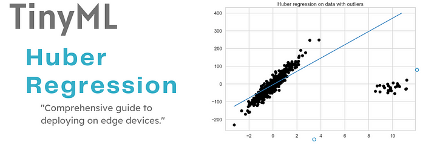
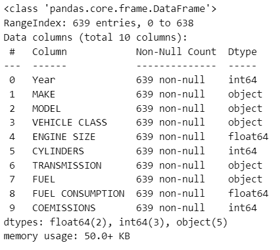
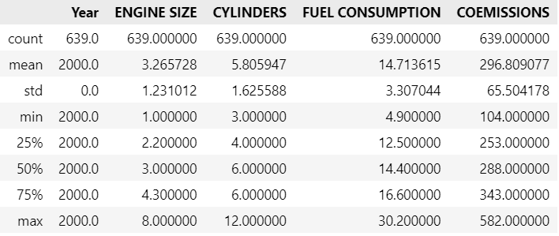
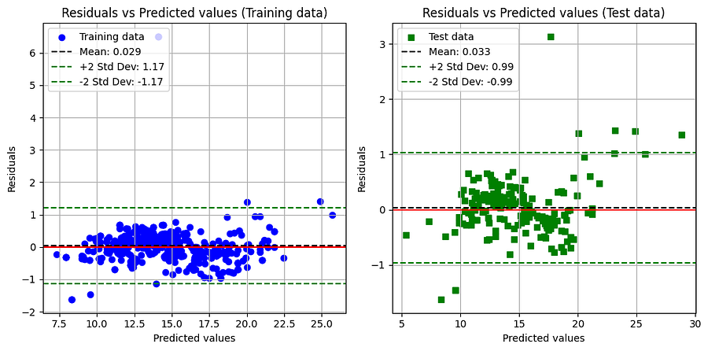
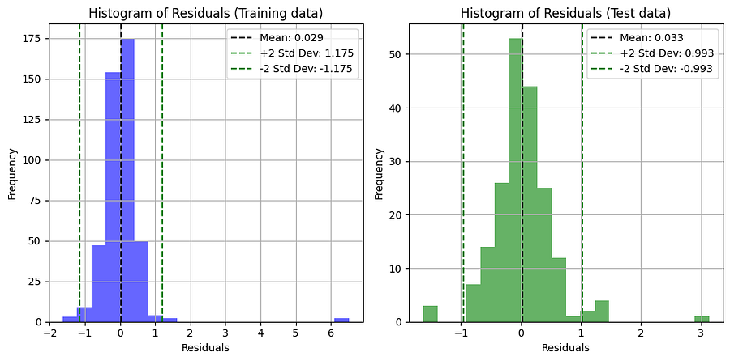
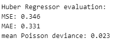
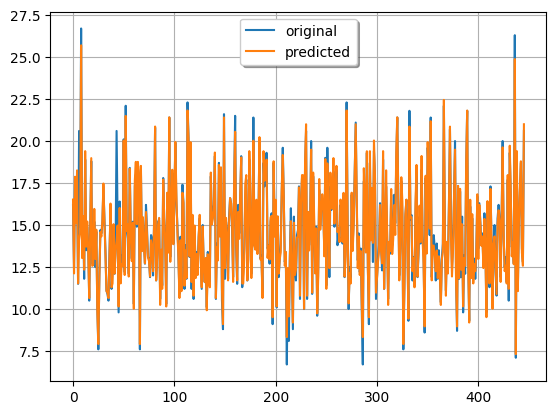
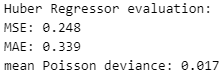
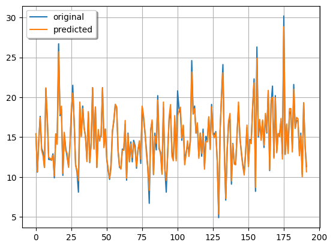
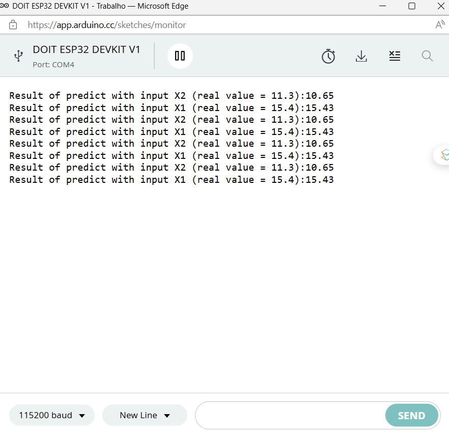

# TinyML - Huber Regression

*From mathematical foundations to edge implementation*

**Social media:**


👨🏽‍💻 Github: [thommaskevin/TinyML](https://github.com/thommaskevin/TinyML)

👷🏾 Linkedin: [Thommas Kevin](https://www.linkedin.com/in/thommas-kevin-ab9810166/)

📽 Youtube: [Thommas Kevin](https://www.youtube.com/channel/UC7uazGXaMIE6MNkHg4ll9oA)

:pencil2:CV Lattes CNPq: [Thommas Kevin Sales Flores](http://lattes.cnpq.br/0630479458408181)

👨🏻‍🏫 Research group: [Conecta.ai](https://conect2ai.dca.ufrn.br/)





## SUMMARY

1 - Introduction

2 - Mathematical Foundations

 2.1 - Huber Loss Function
 
 2.2 - Bellman Equation
 
 2.3 - Q-Learning Algorithm
 
 2.4 - Convergence Considerations
 
 2.5 - Forecasting Numeric Example
 
3 - TinyML Implementation


## 1 - Introduction

Linear regression is widely used to model relationships between variables, but it is very sensitive to outliers - extreme values that can distort the model's fit. Huber Regressor has emerged as a robust alternative to deal with these cases, combining the benefits of linear regression and robust regression, reducing the impact of outliers on the model's fit.


The Huber Regressor was introduced by Peter J. Huber in 1964 and uses a hybrid loss function between the quadratic loss function of linear regression and the absolute loss function of robust regression. It minimizes a loss function that is quadratic for small errors and linear for large errors, which helps reduce the impact of outliers.


## 2 - Mathematical Foundations

The Huber Regressor is a robust regression method designed to minimize the impact of outliers in data by combining the advantages of ordinary least squares (OLS) regression and absolute deviation regression. It is particularly useful when the data is mostly normally distributed but contains some outliers.


###  2.1 - Huber Loss Function


The Huber Regressor minimizes the **Huber loss function** instead of the usual squared error used in OLS. The Huber loss is quadratic for small residuals and linear for large residuals, making it a blend of mean squared error (MSE) and mean absolute error (MAE).

Mathematically, the Huber loss function $L_{\delta}(r_i)$ for a residual $r_i = y_i - \hat{y}_i$ is defined as:

$L_{\delta}(r_i) = 
\begin{cases} 
\frac{1}{2} r_i^2 & \text{if } |r_i| \leq \delta \\
\delta \cdot (|r_i| - \frac{1}{2} \delta) & \text{if } |r_i| > \delta
\end{cases}$

Where:
- $r_i$ is the residual, or the difference between the observed value $y_i$ and the predicted value $\hat{y}_i$.
- $\delta$ is a threshold parameter that controls the point where the loss function transitions from quadratic to linear.


###   2.2 - Behavior of the Loss Function

The Huber loss function exhibits two distinct behaviors depending on the magnitude of the residual $r_i$:

- **Quadratic (MSE-like) for small residuals**: When $|r_i| \leq \delta$, the loss is quadratic ($\frac{1}{2} r_i^2$). This makes the model sensitive to small errors, similar to the mean squared error (MSE), ensuring that it fits the data points closely when errors are small.
  
- **Linear (MAE-like) for large residuals**: When $|r_i| > \delta$, the loss becomes linear ($\delta \cdot (|r_i| - \frac{1}{2} \delta)$). This limits the influence of outliers by reducing the penalty for large residuals, similar to the mean absolute error (MAE), making the model more robust to extreme values.

This behavior allows the Huber Regressor to be robust to outliers while still being sensitive to small deviations in the data.


###   2.3 - Why Use the Huber Regressor?

- **Outlier robustness**: The Huber loss reduces the influence of outliers by switching from quadratic to linear penalties for large residuals. This prevents outliers from dominating the model’s solution as they do in ordinary least squares.

- **Sensitivity to small errors**: For small residuals, the quadratic penalty ensures that the model still focuses on fitting most data points well.

- **Smooth transition**: The Huber loss offers a smooth transition between the two types of penalties (quadratic and linear), making it effective in scenarios with both normally distributed data and some outliers.


###   2.4 - Optimization Problem

Similar to OLS, the Huber Regressor minimizes the sum of the losses for all data points:

$\text{Minimize:} \quad \sum_{i=1}^{n} L_{\delta}(r_i)$

Where $n$ is the number of observations in the dataset.

This minimization is typically done using iterative methods because the Huber loss function is non-smooth at $|r_i| = \delta$, meaning there is a transition in behavior that complicates analytical solutions.


###   2.5 - Choosing the Parameter $\delta$

The parameter $\delta$ controls the point at which the Huber loss transitions from quadratic to linear. The choice of $\delta$ directly affects the model’s behavior:

- **Small $\delta$**: The model will be more robust to outliers, but less sensitive to normal data points.

- **Large $\delta$**: The model behaves more like OLS, being more sensitive to small errors but also more influenced by outliers.

Typically, the ideal value of $\delta$ is determined using cross-validation.


###   2.6 - Comparison with OLS and MAE

- **OLS (Ordinary Least Squares)**: Uses a fully quadratic loss, making it very sensitive to outliers, as large errors are penalized more heavily.

- **MAE (Mean Absolute Error)**: Uses a fully linear loss, making it robust to outliers, but it may underperform in capturing small deviations in the data.

- **Huber Regressor**: Combines the two approaches, being quadratic for small residuals (like OLS) and linear for large residuals (like MAE), offering a balance between precision and robustness.


## 3 - TinyML Implementation

With this example you can implement the machine learning algorithm in ESP32, Arduino, Arduino Portenta H7 with Vision Shield, Raspberry and other different microcontrollers or IoT devices.


### 3.0 - Install the libraries listed in the requirements.txt file


```python
!pip install -r requirements.txt
```

### 3.1 - Importing libraries

```python
from sklearn.model_selection import train_test_split
from sklearn.linear_model import HuberRegressor
from sklearn.metrics import (
    mean_absolute_error,
    mean_poisson_deviance,
    mean_squared_error,
)

import m2cgen as m2c
import numpy as np
import pandas as pd
import seaborn as sns

from matplotlib import pyplot as plt

import warnings
warnings.filterwarnings('ignore')
```


### 3.2 - Load Dataset


The "Vehicle Attributes and Emissions Dataset" contains comprehensive information on various vehicles manufactured in the year 2000. It includes details such as make, model, vehicle class, engine size, cylinder count, transmission type, and fuel type. Additionally, the dataset provides ranges for fuel consumption and CO2 emissions, offering insights into the environmental impact of each vehicle. The dataset encompasses a wide range of vehicle types, from compact to mid-size, and includes both conventional and high-performance models. With this information, analysts and researchers can study trends in vehicle characteristics, fuel efficiency, and emissions . This dataset serves as a valuable resource for understanding the automotive landscape and informing discussions on environmental sustainability and transportation policies.


link: https://www.kaggle.com/datasets/krupadharamshi/fuelconsumption/data


```python
df = pd.read_csv('./data/FuelConsumption.csv')
df.head()
```


```python
df.info()
```




```python
df.describe()
```




### 3.3 - Clean Data

```python
# 1. Removing rows with missing values
df.dropna(inplace=True)
# 2. Removing duplicates if any
df.drop_duplicates(inplace=True)
```

```python
# Display the dataframe after cleaning
df.describe()
```


### 3.4 - Exploratory Data Analysis


```python
sns.pairplot(df[['ENGINE SIZE','CYLINDERS','FUEL CONSUMPTION','COEMISSIONS ']])
plt.savefig('.\\figures\\pairplot.png', dpi=300, bbox_inches='tight')
```


```python
corr = df[['ENGINE SIZE','CYLINDERS','FUEL CONSUMPTION','COEMISSIONS ']].corr('spearman')
```

```python
# Adjusting the size of the figure
plt.figure(figsize=(18,10))
# Your existing code for generating the heatmap
heatmap = sns.heatmap(corr, xticklabels=corr.columns, yticklabels=corr.columns, cmap='coolwarm')
# Adding values to the heatmap
for i in range(len(corr.columns)):
    for j in range(len(corr.columns)):
        plt.text(j + 0.5, i + 0.5, f"{corr.iloc[i, j]:.2f}", ha='center', va='center', color='black', fontsize=18)

plt.xticks(fontsize=20, rotation=45)
plt.yticks(fontsize=20, rotation=0)
cbar = heatmap.collections[0].colorbar
cbar.ax.tick_params(labelsize=20)

plt.savefig('.\\figures\\heatmap.png', dpi=300, bbox_inches='tight')

# Display the heatmap
plt.show()
```


### 3.5 - Split into training and test data

```python
X=df[['ENGINE SIZE','CYLINDERS', 'COEMISSIONS ']]
y=df[['FUEL CONSUMPTION']]
```


```python
# Split the data into training and test sets
X_train, X_test, y_train, y_test = train_test_split(X, y, test_size=0.3, random_state=42)
```


### 3.6 - Create the regressor model


```python
def score_estimator(y_pred , y_true):

    print(
        "MSE: %.3f"
        % mean_squared_error(
            y_true, y_pred
        )
    )
    print(
        "MAE: %.3f"
        % mean_absolute_error(
            y_true, y_pred, 
        )
    )

    # Ignore non-positive predictions, as they are invalid for
    # the Poisson deviance.
    mask = y_pred > 0
    if (~mask).any():
        n_masked, n_samples = (~mask).sum(), mask.shape[0]
        print(
            "WARNING: Estimator yields invalid, non-positive predictions "
            f" for {n_masked} samples out of {n_samples}. These predictions "
            "are ignored when computing the Poisson deviance."
        )

    print(
        "mean Poisson deviance: %.3f"
        % mean_poisson_deviance(
            y_true ,
            y_pred  
        )
    )
```


```python
model =  HuberRegressor(alpha=0.0, epsilon=1)
```


### 3.7 - Train the model


```python
model.fit(X_train, y_train)
```


### 3.8 - Model evaluation

```python
y_train_pred = model.predict(X_train)
y_test_pred = model.predict(X_test)
```

```python
# Calculate residuals
train_residuals = y_train.values.reshape(1,-1).tolist()[0] - y_train_pred
# Calculate mean and standard deviation of residuals
train_residuals_mean = np.mean(train_residuals)
train_residuals_std = np.std(train_residuals)
# Calculate residuals
test_residuals = y_test.values.reshape(1,-1).tolist()[0] - y_test_pred
# Calculate mean and standard deviation of residuals
test_residuals_mean = np.mean(test_residuals)
test_residuals_std = np.std(test_residuals)

# Plot residuals
plt.figure(figsize=(10, 5))
plt.subplot(1, 2, 1)
plt.scatter(y_train_pred, train_residuals, c='blue', marker='o', label=f'Training data')
plt.axhline(y=0, color='r', linestyle='-')
plt.axhline(y=train_residuals_mean, color='k', linestyle='--', label=f'Mean: {train_residuals_mean:.3f}')
plt.axhline(y=train_residuals_mean + 2 * train_residuals_std, color='g', linestyle='--', label=f'+2 Std Dev: {2*train_residuals_std:.2f}')
plt.axhline(y=train_residuals_mean - 2 * train_residuals_std, color='g', linestyle='--', label=f'-2 Std Dev: {-2*train_residuals_std:.2f}')  
plt.xlabel('Predicted values')
plt.ylabel('Residuals')
plt.title('Residuals vs Predicted values (Training data)')
plt.legend(loc='upper left')
plt.grid(True)
plt.subplot(1, 2, 2)
plt.scatter(y_test_pred, test_residuals, c='green', marker='s', label=f'Test data')
plt.axhline(y=0, color='r', linestyle='-')
plt.axhline(y=test_residuals_mean, color='k', linestyle='--', label=f'Mean: {test_residuals_mean:.3f}')
plt.axhline(y=test_residuals_mean + 2 * test_residuals_std, color='g', linestyle='--', label=f'+2 Std Dev: {2*test_residuals_std:.2f}')
plt.axhline(y=test_residuals_mean - 2 * test_residuals_std, color='g', linestyle='--', label=f'-2 Std Dev: {-2*test_residuals_std:.2f}')  
plt.xlabel('Predicted values')
plt.ylabel('Residuals')
plt.title('Residuals vs Predicted values (Test data)')
plt.legend(loc='upper left')
plt.grid(True)
plt.tight_layout()
plt.show()

# Check for normality
plt.figure(figsize=(10, 5))
plt.subplot(1, 2, 1)
plt.hist(train_residuals, bins=20, color='blue', alpha=0.6)
plt.title('Histogram of Residuals (Training data)')
plt.xlabel('Residuals')
plt.ylabel('Frequency')
plt.axvline(x=train_residuals_mean, color='k', linestyle='--', label=f'Mean: {train_residuals_mean:.3f}')
plt.axvline(x=train_residuals_mean + 2 * train_residuals_std, color='g', linestyle='--', label=f'+2 Std Dev: {2*train_residuals_std:.3f}')
plt.axvline(x=train_residuals_mean - 2 * train_residuals_std, color='g', linestyle='--', label=f'-2 Std Dev: {-2*train_residuals_std:.3f}')  
plt.legend(loc='upper right')
plt.grid(True)
plt.subplot(1, 2, 2)
plt.hist(test_residuals, bins=20, color='green', alpha=0.6)
plt.title('Histogram of Residuals (Test data)')
plt.xlabel('Residuals')
plt.ylabel('Frequency')
plt.axvline(x=test_residuals_mean, color='k', linestyle='--', label=f'Mean: {test_residuals_mean:.3f}')
plt.axvline(x=test_residuals_mean + 2 * test_residuals_std, color='g', linestyle='--', label=f'+2 Std Dev: {2*test_residuals_std:.3f}')
plt.axvline(x=test_residuals_mean - 2 * test_residuals_std, color='g', linestyle='--', label=f'-2 Std Dev: {-2*test_residuals_std:.3f}')  
plt.legend(loc='upper right')
plt.grid(True)
plt.tight_layout()
plt.show()
```







#### 3.8.1 - Evaluating the model with train data


```python
print("Huber Regressor evaluation:")
score_estimator(y_train_pred, y_train)
```





```python
plt.plot(y_train.values, label="original")
plt.plot(y_train_pred, label="predicted")
plt.legend(loc='best',fancybox=True, shadow=True)
plt.grid()
```




#### 3.8.2 - Evaluating the model with test data


```python
print("Huber Regressor evaluation:")
score_estimator(y_test_pred, y_test)
```





```python
plt.plot(y_test.values, label="original")
plt.plot(y_test_pred, label="predicted")
plt.legend(loc='best',fancybox=True, shadow=True)
plt.grid()
```




### 3.9 - Obtaining the model to be implemented in the microcontroller

```python
code = m2c.export_to_c(model)
print(code)
```

```cpp
double score(double * input) {
    return 0.055454859886876616 + input[0] * 0.00900332318983459 + input[1] * 0.18410431672672556 + input[2] * 0.04558472576852831;
}
```

### 3.10 - Saves the template in a .h file

```python
with open('./HuberRegressor/HuberRegressor.h', 'w') as file:
    file.write(code)
```

### 3.11 - Deploy Model


#### 3.11.1 - Complete Arduino Sketch


```cpp
#include "HuberRegressor.h"

void setup()
{
  Serial.begin(115200);
}
void loop()
{
  double X_1[] = {4.6, 8, 304};
  float result_1 = score(X_1);
  Serial.print("Result of predict with input X1 (real value = 15.4):");
  Serial.println(result_1);
  delay(2000);
  double X_2[] = {1.5, 4, 216};
  float result_2 = score(X_2);
  Serial.print("Result of predict with input X2 (real value = 11.3):");
  Serial.println(result_2);
  delay(2000);
}
```


### 3.12 - Result



