# TinyML - Huber Regression

*From mathematical foundations to edge implementation*

**Social media:**


👨🏽‍💻 Github: [thommaskevin/TinyML](https://github.com/thommaskevin/TinyML)

👷🏾 Linkedin: [Thommas Kevin](https://www.linkedin.com/in/thommas-kevin-ab9810166/)

📽 Youtube: [Thommas Kevin](https://www.youtube.com/channel/UC7uazGXaMIE6MNkHg4ll9oA)

:pencil2:CV Lattes CNPq: [Thommas Kevin Sales Flores](http://lattes.cnpq.br/0630479458408181)

👨🏻‍🏫 Research group: [Conecta.ai](https://conect2ai.dca.ufrn.br/)


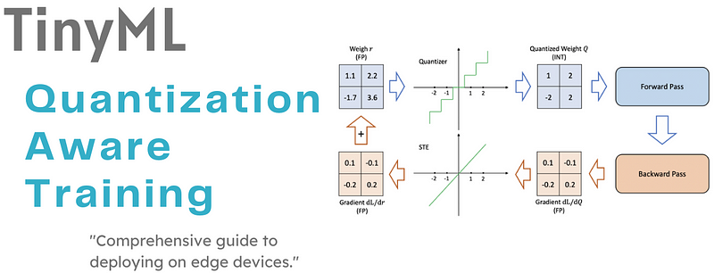


## SUMMARY

1 - Introduction

 1.1 - Floating Point

 1.2 - Fixed Point

2 -Quantization Aware Training

 2.1 -Simulating Quantization During Training

 2.2 -Quantization of Weights and Activations

 2.3 - Dequantization

 2.4 -Gradient Computation

 2.5 -Straight-Through Estimator (STE)

2.6 - Loss Function and Optimization

2.7 - Final Quantized Model

3 - TinyML Implementation


## 1 - Introduction


While it is possible to train a quantized neural network (NN) from scratch, the majority of research has shown that starting with a pre-trained model is generally more effective at minimizing accuracy loss during the quantization process. There are two main methods for quantizing pre-trained NNs: Quantization-Aware Training (QAT) and Post-Training Quantization (PTQ).

QAT involves first quantizing the NN and then retraining it. This retraining phase allows the model to adjust and learn how to work efficiently with the newly quantized values. This approach is especially useful when a sufficient amount of training data is available, as the additional training can help mitigate potential accuracy losses that occur during quantization.

However, in some cases, sufficient training data may not be readily available. In such scenarios, PTQ is employed. PTQ involves quantizing a pre-trained NN without requiring any additional training. This method is particularly advantageous in situations where time, computational resources, or access to the original training data is limited.

Figure 1 provides an overview of both QAT and PTQ, highlighting the key differences and use cases for each method in the context of NN quantization.

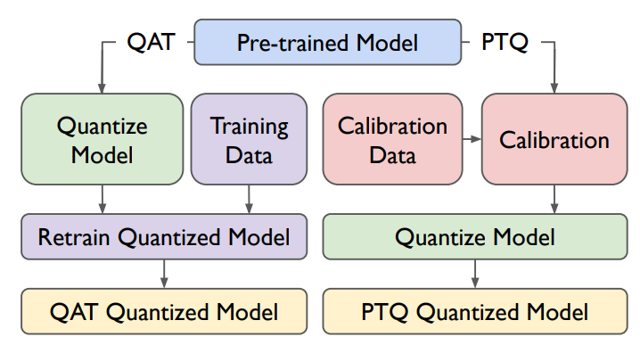

**Figure 1**: How to quantize a pre-trained model via either Quantization-Aware Training (QAT) or Post-Training Quantizatino (PTQ). Calibration data can be either a subset of training data or a small set of unlabelled input data. Refer to Section 3 to review calibration.


Quantization, as the name implies, is to let the weight and activation of the forward propagation calculation in the neural network and the 32-bit or 64-bit floating point number of the gradient value of the back propagation calculation are represented by low-bit floating point or fixed-point number, and can even be directly calculated. Figure 2 shows the basic idea of converting floating-point numbers into signed 8-bit fixed-point numbers.


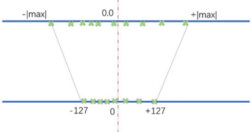

**Figure 2**: The process of quantization.

Quantization itself can be divided into linear quantization and non-linear quantization. The steps of non-linear quantization are not fixed, and the method is not fixed, too. Basically, it only reduces the storage size of the model. There is no acceleration and even time complexity in model inference and data processing. So the main discussion is linear quantization. The basic principle of linear quantization is relatively clear. Take the 32-bit floating point to 8-bit integer as an example. Establish the data mapping relationship between the two, from the original data accuracy value to the corresponding quantized value. Its general form can be expressed as:

$q =  round(s \cdot x + z)$


Among them, x and q are the numbers before and after quantization, s is called the scaling factor, and z is called the zero point. The zero point is the quantized value of "0" in the original value range. There will be a lot of 0 in the weight or activation (such as zero padding, or through the ReLU function), so we need to make "0" accurately represented after quantization when we quantize. In order to quantize in the range of n-bit integers, then:


$s = \frac{2^n - 1}{{max}^x - {min}^x}$


Among them, the denominators are the lower (min in above equation or −|max| in Figure 1) and upper bounds of the value range of the mapping value (such as weight or activation) respectively.


### 1.1 - Floating Point

The idea behind floating point is to represent numbers in scientific notation, $𝑛 \cdot 2^m$, wherein we need only keep track of 𝑛 and 𝑚 in our representation. IEEE floating point defines a floating point number 𝑛 as


$n = (-1)^s \cdot m \cdot 2^E$

where

- 𝑠 is the sign bit, 0 for positive and 1 for negative;
 
- 𝑚 is the mantissa, also called the significand, which defines the precision, and;

- 𝐸 is the exponent, which determines the range.


A floating point number encodes the sign bit, mantissa, and exponent in its binary representation. In single precision floating point - the most common precision used for NN training on GPUs - , 32 total bits are given, in which 8 bits are allocated for the exponent, 23 bits are allocated for the mantissa, and 1 bit is allocated for the sign bit, as seen in Figure 3.

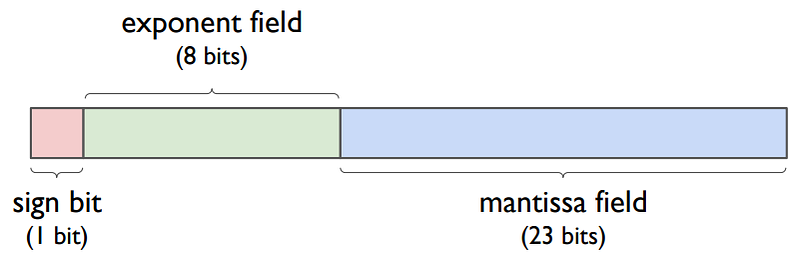

**Figure 3**: IEEE single-precision floating point bit fields. The binary of a floating point value is broken up, from least significant to most significant bit, into 23 bits for the mantissa field, 8 bits for the exponent field, and 1 bit for the sign bit.


Depending on the value in the exponent field, there are three ways to interpret the values encoded in the exponent and mantissa bit fields (the sign bit is always interpreted as 0 or 1):


#### 1.1.1 - Normalized Values


When the exponent field 𝐸 is neither 0 (all zeroes) nor 255 (all ones), we are working with normalized values. In this case, the bit fields are interpreted as follows:

- 𝐸 = 𝑥 −𝐵𝑖𝑎𝑠, where 𝑥 is the unsigned integer actually stored in the exponent bit field, and 𝐵𝑖𝑎𝑠 is 2 8 − 1 = 127 (since we are given 8 exponent bits). Thus, −126 ≤ 𝐸 ≤ 127;


- 𝑚 = 1 + 𝑓 , where 𝑓 is the fractional binary value actually stored in the mantissa bit field. By fractional, we mean 0 ≤ 𝑓.


Based on these definitions, we compute normalized values 𝑛 from the bit fields as


$n = (-1)^s \cdot (1 + f) \cdot 2^{x-127}$


The floating point number is effectively scaled based on the value 𝑥 stored in the exponent field. This allows the radix point to "float" to various positions in the binary value as needed, providing floating point with a large range and thus more precision.


#### 1.1.2 - Denormalized Values

When the exponent field 𝐸 is all zeroes, we are working with denormalized values. In this case, the bit fields are interpreted as follows:

- 𝐸 = 1 − 𝐵𝑖𝑎𝑠, where 𝐵𝑖𝑎𝑠 is still 2 8 − 1 = 127, so 𝐸 = −126;

- 𝑚 = 𝑓 , where 𝑓 is the fractional binary value stored in the mantissa bit field, as in the normalized value case.


Based on these settings, we compute denormalized values 𝑚 from the bit fields as


$n = (-1)^s \cdot f \cdot 2^{-126}$


#### 1.1.3 - Denormalized Values

When the exponent field 𝐸 is all ones, we represent special non-numerical values. For completeness, we include these special values. The value is 
determined by the bits residing in the mantissa bit field:

- 𝑚 = 0. Depending on the sign bit, this value is −∞ or +∞;
 
- 𝑚 ≠ 0. This is 𝑁𝑎𝑁, also known as Not a Number.


Even though much of this arithmetic has been optimized, there is still an overhead cost that needs to be paid when using floating point values; case in point, a floating point unit is required, making floats significantly more expensive to compute in hardware than say integers, which have no such overhead. Moreover, there are as many normalized values (𝑛 ≥ 1) as there are denormalized values (0 ≤ 𝑛)


### 1.2 - Fixed Point

Fixed point is similar to floating point in that it is also encoded using a sign bit and a mantissa, but it uses a single global fixed exponent value that is shared across all fixed point values. Since the exponent is fixed, there is no need to store it in the binary, and the remaining bits are allocated as the integer field. Figure 2 depicts an example 32-bit fixed point value that is broken up into 24 mantissa bits, 7 integer bits, and 1 sign bit. The global exponent effectively places the radix point at a fixed position; hence, "fixed point." The shared exponent is also referred to as a global scaling factor and is typically a power of 2, so that the scaling multiplication can be implemented using bit shifts. Based on the fixed point definition in Figure 2, given 24 mantissa bits, the global scaling factor is 2 −24. 


Depending on the application, we might want more or less prcision in our fixed point values. For instance, Vivado High-Level Synthesis defines a fixed point data type for its FPGA synthesis called ap_fixed < T, I > that allows users to choose the fixed point format, where 𝑇 is the total number of bits allocated for the fixed point number and 𝐼 is how many integer bits are allocated. Since the global exponent is fixed and is based on how many bits are allocated to the mantissa, there is a trade-off involved in choosing 𝑇 and 𝐼. Fewer integer bits means there is more bits left for the mantissa, implying high precision but a small range. More integer bits means there are fewer bits left for the mantissa, leading to low precision but a larger range.

Fixed point is typically used in embedded systems that cannot afford to have a floating point unit but still need some precision in their computations. Without a floating point unit, the fixed point bit fields are all interpreted as integers (as opposed to fractional binary values like the floating point mantissa is), which are much cheaper to compute on. To explain how this works, let us walk through an example. Based on the fixed point format depicted in Figure 3, let us encode 1/3.


**Figure 4**: Example 32-bit fixed point format, where, from least significant to most significant bit, 24 bits are chosen for the mantissa, 7 bits are chosen for the integer, and 1 bit is for the sign bit. The value of the global fixed exponent depends on the number of bits allocated for the mantissa. In this case, there are 24 mantissa bits, implying that the global fixed exponent is $2^{−24}$.


Since our value is a fraction, we do not need any integer bits, so this field is all zeroes. For the mantissa field, given 24 bits and a global exponent of $2^{−24}$, we store the integer 5,592,405 in the mantissa field because 5592405 × $2^{−24}$ ≈ 1/3 . This can be derived for any real number fraction 𝑟 and 𝑚 mantissa bits, where the corresponding fixed point mantissa value is ⌊𝑟 · 2 𝑚⌋. As such, to determine based on the sign bit, integer field, mantissa field, and global exponent the fixed point value 𝑛, we compute


$n = (-1)^s \cdot (I + m \cdot E)$


where 𝑠 is the sign bit, 𝐼 is the integer encoded value, 𝑚 is the mantissa encoded value, and 𝐸 is the global exponent. Although this equation looks similar to the floating point equations, note that all of the values are integers and 𝐸 is typically a power of 2, so all the computation can be performed using integer arithmetic and bit shifts, which is significantly cheaper than floating point arithmetic.


## 2 - Quantization Aware Training

Quantization Aware Training (QAT) is a technique used to train neural networks while considering the effect of quantizing the weights and activations during inference. It helps reduce the precision (e.g., from 32-bit floating point to 8-bit integers) without significantly sacrificing accuracy. In QAT, the network is trained with quantization effects simulated during the training process, making the network more robust to quantization during inference.


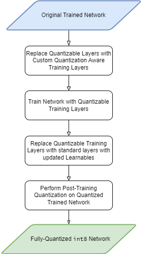

**Figure 5**: Quantization Aware Training Scheme.


###  2.1 - Simulating Quantization During Training

- QAT models simulate the behavior of quantized weights and activations during the forward and backward passes;

 
- The actual computations during training are performed in full precision (floating-point), but quantized versions of weights and activations are used in forward propagation to mimic the behavior of quantized models.


###  2.2 - Quantization of Weights and Activations


- Both weights and activations are quantized using a quantization scheme. In the typical case of 8-bit quantization, this can be done by mapping the floating-point values to integers.


####  2.2.1 - Symmetric Quantization

In symmetric quantization, the quantization range is symmetric around zero. This means that both positive and negative floating-point values are mapped uniformly, without any zero-point offset.

For a tensor x (either weights or activations) with a maximum value $x_{max}$​ and a minimum value $x_{min}$​, the quantization process can be expressed as follows:

$x_{quant} = round(\frac{x}{s_x})$

where the scaling factor $s_x​$ is calculated as:

$s_x = \frac{x_{max}}{2^{b-1} - 1}$

Here:

- b is the bit-width (e.g., b=8 for 8-bit quantization);

- $2^{b-1} - 1$ is the maximum representable integer for the positive range (for 8-bit quantization, this is 127).


**Example of Symmetric Quantization:** Consider a weight tensor www with values ranging between −1.0 and 1.0. For 8-bit quantization:


$s_w = \frac{1.0}{127} = 0.007874$


A weight value of $w = 0.5$ is quantized as:


$W_{quant} =  round(\frac{0.5}{0.007874}) = round(63.5) = 64$


Dequantizing it back:


$W_{dequant} =  64 \cdot 0.007874 = 0.503936$


####  2.2.2 - Asymmetric Quantization

In asymmetric quantization, the quantization range is not symmetric, and there is a non-zero offset called the zero-point. This allows the quantization range to cover values that are not centered around zero, which is useful when the input data (activations or weights) has a skewed distribution or is strictly positive (e.g., ReLU activations).

For a tensor x, the quantization equation in asymmetric quantization becomes:


$x_{quant} = round(\frac{x - z_x}{s_x})$


where:

- Is the scaling factor:

$s_x = \frac{x_{max} - x_{min}}{2^b - 1}$


- $z_x$​ is the zero-point, computed as:


$z_x = round(-\frac{x_{min}}{s_x})$


This ensures that x_quant​=0 corresponds to x=x_minx, shifting the quantization range as needed.


The quantized values are then constrained between 0 and 255 for 8-bit quantization, and they can be dequantized as:


$x_{dequant} = x_{quant} \cdot s_x + z_x$


**Example of Asymmetric Quantization:** Suppose we have activation values a with a_min ​= 0.0 and a_max ​= 1.0. For 8-bit quantization:


$s_a = \frac{1.0 - 0.0}{ 255} = 0.003922$


and the zero-point $z_a = 0$  because $a_{min}​=0$.


A value $a = 0.5$ is quantized as:


$a_{quant} = round(\frac{0.5 - 0.0}{0.003922}) = round(127.5) = 128$


Dequantizing it back:


$a_{dequant} = 128 \cdot 0.003922 + 0 = 0.501$


**Comparison between Symmetric and Asymmetric Quantization**

- **Weights** are typically quantized symmetrically, as weights are usually centered around zero.
- **Activations**, on the other hand, often use asymmetric quantization, especially after non-linear functions like ReLU, where values are non-negative.


| **Aspect**             | **Symmetric Quantization**                                   | **Asymmetric Quantization**                                 |
|------------------------|------------------------------------------------------------|------------------------------------------------------------|
| **Zero-point**          | No zero-point; symmetric around 0.                | Has zero-point to handle ranges not centered on 0. |
| **Quantization Range** | Quantized values are centered around zero (e.g., -127 to 127 for 8-bit). | Quantized values can start from zero (e.g., 0 to 255 for 8-bit). |
| **Use Cases**        | Best for weights and data centered around zero, like in convolution layers. | Useful for non-negative activations (like after ReLU) or those with non-zero minima. |
| **Performance**          | Simpler and faster; no need for zero-point computation. | More flexible for data distributions that aren’t symmetric. |


###  2.3 - Dequantization

Before passing the quantized values for further computations, they are dequantized to full precision to simulate the floating-point nature of training. This is performed using the scaling factors $s_w$ ​ and $s_a$​:


###  2.4 - Gradient Computation

During backpropagation, the gradients are computed as if no quantization has occurred, allowing the network to update weights as if it were in full precision. This allows for standard optimization techniques like Stochastic Gradient Descent (SGD) to work effectively.

However, during the forward pass, simulated quantized values are used to ensure that the network becomes robust to quantization errors.


###  2.5 - Straight-Through Estimator (STE)


- One challenge is that quantization involves rounding, which is not differentiable. To handle this, QAT employs the Straight-Through Estimator (STE).

- In the forward pass, the rounding operation is used to simulate quantization. In the backward pass, gradients are passed through as if the rounding operation were an identity function (i.e., it ignores the non-differentiability of rounding).

- Mathematically, for some function f, the rounding function round(x) has the following gradient:


$\frac{\partial}{\partial x} \text{round}(x) \approx 1$

Thus, the gradients propagate as if no rounding occurred.

###  2.6 - Loss Function and Optimization

- The standard loss function (e.g., cross-entropy for classification) is used. Since the quantization effects are simulated in the forward pass, the training process adjusts weights to minimize the loss considering quantization errors.

- This leads to weight adjustments that are resilient to the quantization effects observed during inference.

###  2.7 - Final Quantized Model


Once training is complete, the weights and activations are fully quantized, and the model can be deployed using lower-precision operations (e.g., 8-bit integer calculations). Since the network was trained to handle quantization during training, it will perform well under these constraints.


## 3 - TinyML Implementation

With this example you can implement the machine learning algorithm in ESP32, Arduino, Arduino Portenta H7 with Vision Shield, Raspberry and other different microcontrollers or IoT devices.


### 3.0 - Install the libraries listed in the requirements.txt file


```python
!pip install -r requirements.txt
```

### 3.1 - Importing libraries

```python
from sklearn.model_selection import train_test_split
import os
import time
import tensorflow as tf
import tensorflow_model_optimization as tfmot
from sklearn.metrics import mean_absolute_error, mean_squared_error, r2_score
import numpy as np

from tensorflow.keras import layers, regularizers
from sklearn.preprocessing import MinMaxScaler
from sklearn.metrics import accuracy_score
import keras
import pandas as pd
import matplotlib.pyplot as plt
import seaborn as sns
import warnings
warnings.filterwarnings('ignore')
```


### 3.2 - Load Dataset


The "Vehicle Attributes and Emissions Dataset" contains comprehensive information on various vehicles manufactured in the year 2000. It includes details such as make, model, vehicle class, engine size, cylinder count, transmission type, and fuel type. Additionally, the dataset provides ranges for fuel consumption and CO2 emissions, offering insights into the environmental impact of each vehicle. The dataset encompasses a wide range of vehicle types, from compact to mid-size, and includes both conventional and high-performance models. With this information, analysts and researchers can study trends in vehicle characteristics, fuel efficiency, and emissions . This dataset serves as a valuable resource for understanding the automotive landscape and informing discussions on environmental sustainability and transportation policies.


link: https://www.kaggle.com/datasets/krupadharamshi/fuelconsumption/data


```python
df = pd.read_csv('./data/FuelConsumption.csv')
df.head()
```

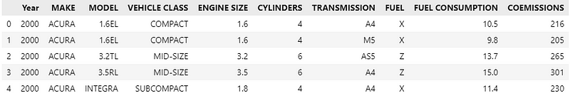

```python
df.info()
```

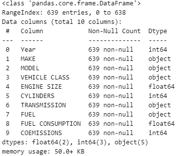


```python
df.describe()
```


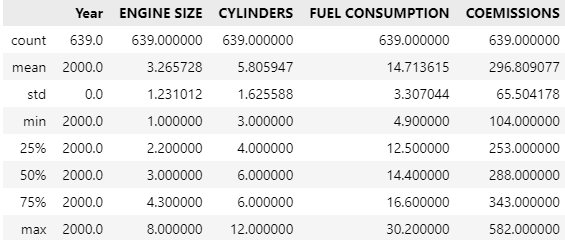

### 3.3 - Clean Data

```python
# 1. Removing rows with missing values
df.dropna(inplace=True)
# 2. Removing duplicates if any
df.drop_duplicates(inplace=True)
```

```python
# Display the dataframe after cleaning
df.describe()
```


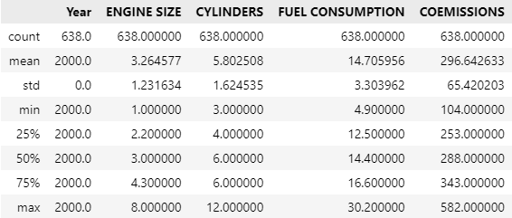

### 3.4 - Exploratory Data Analysis


```python
sns.pairplot(df[['ENGINE SIZE','CYLINDERS','FUEL CONSUMPTION','COEMISSIONS ']])
plt.savefig('.\\figures\\pairplot.png', dpi=300, bbox_inches='tight')
```

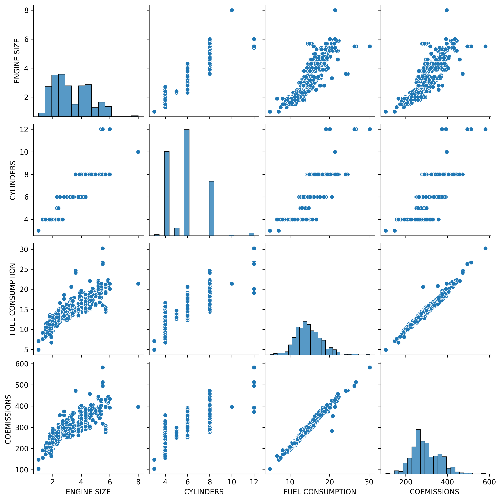


```python
corr = df[['ENGINE SIZE','CYLINDERS','FUEL CONSUMPTION','COEMISSIONS ']].corr('spearman')
```

```python
# Adjusting the size of the figure
plt.figure(figsize=(18,10))
# Your existing code for generating the heatmap
heatmap = sns.heatmap(corr, xticklabels=corr.columns, yticklabels=corr.columns, cmap='coolwarm')
# Adding values to the heatmap
for i in range(len(corr.columns)):
    for j in range(len(corr.columns)):
        plt.text(j + 0.5, i + 0.5, f"{corr.iloc[i, j]:.2f}", ha='center', va='center', color='black', fontsize=18)

plt.xticks(fontsize=20, rotation=45)
plt.yticks(fontsize=20, rotation=0)
cbar = heatmap.collections[0].colorbar
cbar.ax.tick_params(labelsize=20)

plt.savefig('.\\figures\\heatmap.png', dpi=300, bbox_inches='tight')

# Display the heatmap
plt.show()
```


### 3.5 - Split into training and test data

```python
X=df[['ENGINE SIZE','CYLINDERS', 'COEMISSIONS ']]
y=df[['FUEL CONSUMPTION']]
```

```python
# Normalización min-max
scaler = MinMaxScaler()
normalized_X = scaler.fit_transform(X)
```

```python
# Split the data into training and test sets
X_train, X_test, y_train, y_test = train_test_split(normalized_X, y, test_size=0.3, random_state=42)
```


### 3.6 - Define the model


```python
# Define the model
model = tf.keras.Sequential([
    layers.Dense(32, activation='relu', kernel_regularizer=regularizers.l2(0.0001)),
    layers.Dense(16, activation='relu', kernel_regularizer=regularizers.l2(0.0001)),
    layers.Dense(8, activation='relu', kernel_regularizer=regularizers.l2(0.0001)),
    layers.Dense(1, activation='linear')
])
```

### 3.7 - Compile the model


```python
# Compile the model
model.compile(optimizer='Adam', loss='mse', metrics=[ 'mse'])
```


### 3.8 - Training model

```python
history = model.fit(X_train, y_train,
                      batch_size=64,
                      epochs=300,
                      validation_split=0.1,
                      verbose=1)
```


```python
model.save('.\models\model.keras')
```


```python
loss = history.history['loss']
val_loss = history.history['val_loss']
epochs = range(1, len(loss) + 1)
plt.plot(epochs, loss, 'r.', label='Training loss')
plt.plot(epochs, val_loss, 'y', label='Validation loss')
plt.title('Training and validation loss')
plt.xlabel('Epochs')
plt.ylabel('Loss')
plt.grid()
plt.legend()
plt.savefig('.\\figures\\history_traing.png', dpi=300, bbox_inches='tight')
plt.show()
```


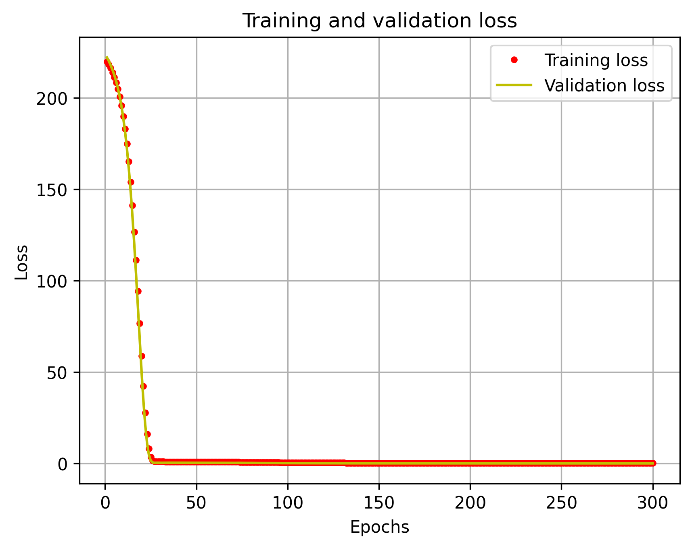


### 3.9 - Retrain Quantized Model

```python
quantize_model = tfmot.quantization.keras.quantize_model

# q_aware stands for for quantization aware.
q_aware_model = quantize_model(model)

# `quantize_model` requires a recompile.
q_aware_model.compile(optimizer='adam',
                      loss='mse',
                      metrics=['mse'])
```

```python
X_train_subset = X_train
y_train_subset = y_train

history_q =  q_aware_model.fit(X_train_subset, y_train_subset,
                  batch_size=64, epochs=300, validation_split=0.3)
```

```python
loss = history_q.history['loss']
val_loss = history_q.history['val_loss']
epochs = range(1, len(loss) + 1)
plt.plot(epochs, loss, 'r.', label='Training loss')
plt.plot(epochs, val_loss, 'y', label='Validation loss')
plt.title('Training and validation loss')
plt.xlabel('Epochs')
plt.ylabel('Loss')
plt.grid()
plt.legend()
plt.savefig('.\\figures\\history_traing_q.png', dpi=300, bbox_inches='tight')
plt.show()
```

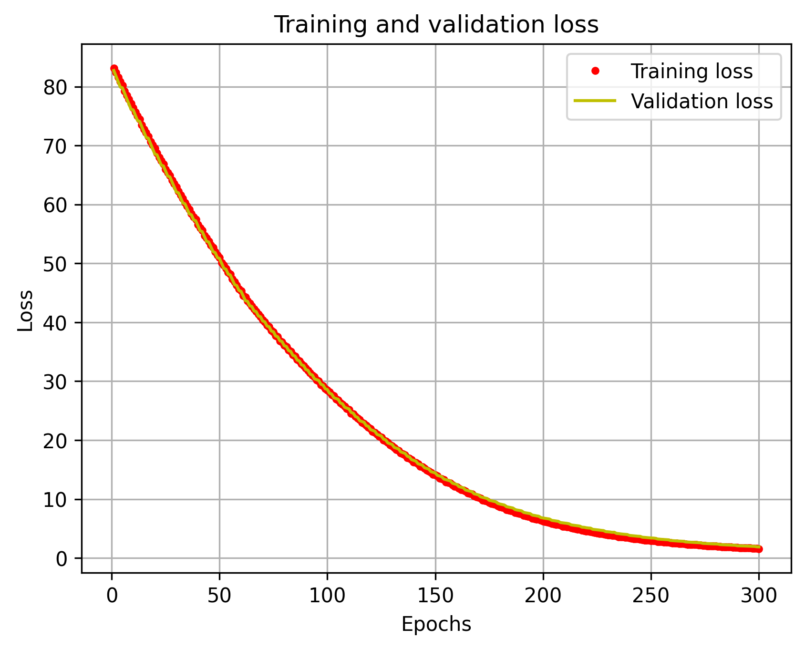


### 3.10 - Quantization-Aware Training Model


```python
_, baseline_model_MSE = model.evaluate(
    X_test, y_test, verbose=0)

_, q_aware_model_MSE = q_aware_model.evaluate(
   X_test, y_test, verbose=0)

print('Without test MSE:', baseline_model_MSE)
print('Quant test MSE:', q_aware_model_MSE)
```

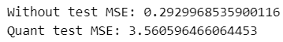


```python
def plot_histogram(error,name):

    error_mean = np.mean(error)
    error_std = np.std(error)
    error_max = np.max(error)
    error_min = np.min(error)

    plt.figure(figsize=(10, 6))
    sns.distplot(error, hist=True, kde=True, bins=20, color='blue', hist_kws={'edgecolor':'black'}, kde_kws={'linewidth': 2})
    plt.xlabel('Error', fontsize=13)
    plt.ylabel('Density', fontsize=13)
    plt.title('Error Distribution with Density Curve', fontsize=15)
    plt.xticks(fontsize=13)
    plt.yticks(fontsize=13)
    plt.grid(True)

    plt.axvline(x=error_mean, color='red', linestyle='--', label='Mean')
    plt.axvline(x=error_mean - error_std, color='green', linestyle='--', label='Mean - Std')
    plt.axvline(x=error_max, color='purple', linestyle='--', label='Max')
    plt.axvline(x=error_min, color='orange', linestyle='--', label='Min')

    plt.text(error_mean, plt.ylim()[1]*0.9, f'Mean: {error_mean:.2f}', color='red', fontsize=12, ha='center')
    plt.text(error_mean - error_std, plt.ylim()[1]*0.85, f'Std: {error_std:.2f}', color='green', fontsize=12, ha='center')
    plt.text(error_max, plt.ylim()[1]*0.8, f'Max: {error_max:.2f}', color='purple', fontsize=12, ha='center')
    plt.text(error_min, plt.ylim()[1]*0.75, f'Min: {error_min:.2f}', color='orange', fontsize=12, ha='center')
    plt.savefig(f'.\\figures\\hist_{name}.png', dpi=300, bbox_inches='tight')
    plt.grid(True)
    plt.show()
```

#### 3.10.1 - Training Data


#### 3.10.1.1 - Not Quantized


```python
y_train_pred = model.predict(X_train)
error_training = y_train_pred - y_train.values
```

```python
mae = mean_absolute_error(y_train, y_train_pred)
mse = mean_squared_error(y_train, y_train_pred)
rmse = np.sqrt(mse)
r2 = r2_score(y_train, y_train_pred)

print("Mean Absolute Error (MAE):", mae)
print("Mean Squared Error (MSE):", mse)
print("Root Mean Squared Error (RMSE):", rmse)
print("R-squared (R²):", r2)
```


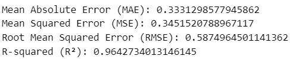


```python
plot_histogram(error_training, 'training')
```

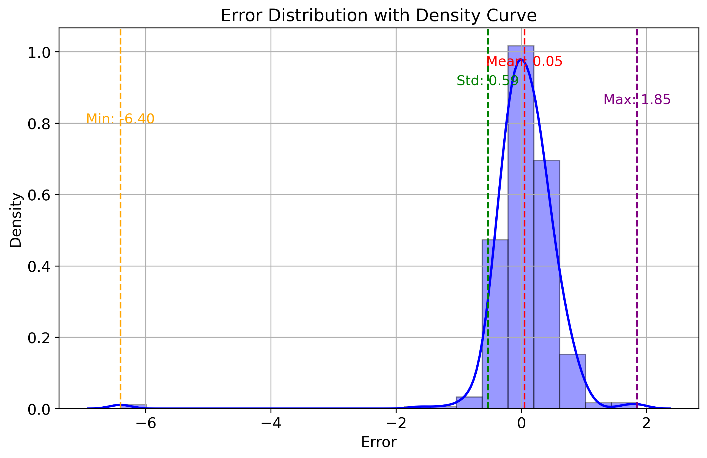


#### 3.10.1.2 - Quantization Aware Training


```python
y_train_pred = model.predict(X_train)
error_training_q = y_train_pred_q - y_train.values
```

```python
mae = mean_absolute_error(y_train, y_train_pred_q)
mse = mean_squared_error(y_train, y_train_pred_q)
rmse = np.sqrt(mse)
r2 = r2_score(y_train, y_train_pred_q)

print("Mean Absolute Error (MAE):", mae)
print("Mean Squared Error (MSE):", mse)
print("Root Mean Squared Error (RMSE):", rmse)
print("R-squared (R²):", r2)
```


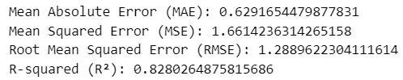


```python
plot_histogram(error_training_q, 'training_q')
```

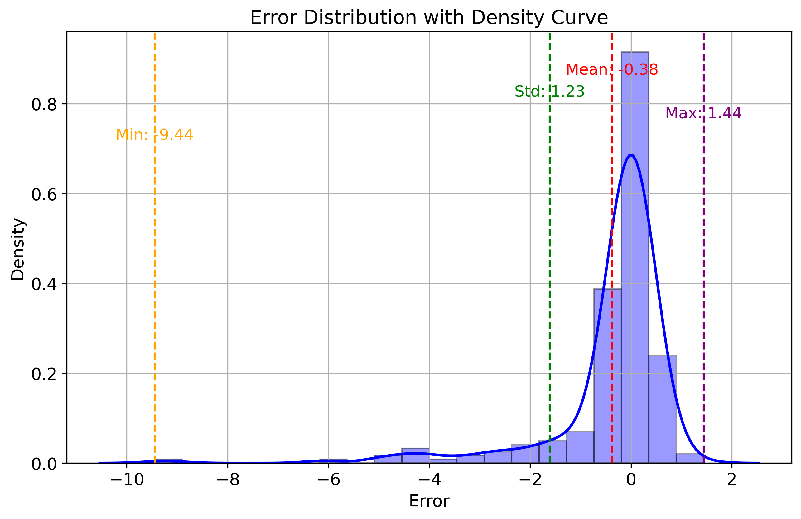


#### 3.10.2 - Test Data


#### 3.10.1.1 - Not Quantized


```python
y_test_pred = model.predict(X_test)
error_testing = y_test_pred - y_test.values
```

```python
mae = mean_absolute_error(y_test, y_test_pred)
mse = mean_squared_error(y_test, y_test_pred)
rmse = np.sqrt(mse)
r2 = r2_score(y_test, y_test_pred)

print("Mean Absolute Error (MAE):", mae)
print("Mean Squared Error (MSE):", mse)
print("Root Mean Squared Error (RMSE):", rmse)
print("R-squared (R²):", r2)
```


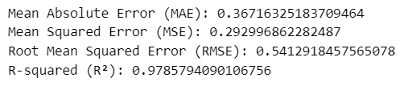


```python
plot_histogram(error_testing, 'testing')
```

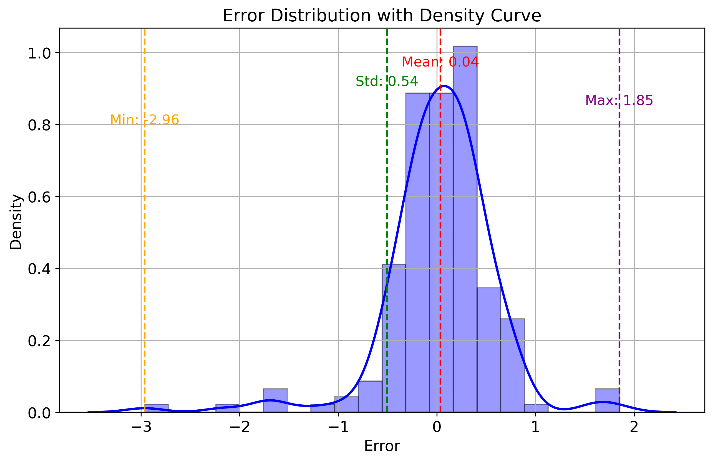


#### 3.10.2.2 - Quantization Aware Training


```python
y_test_pred_q = q_aware_model.predict(X_test)
error_testing_q = y_test_pred_q - y_test.values
```

```python
mae = mean_absolute_error(y_test, y_test_pred_q)
mse = mean_squared_error(y_test, y_test_pred_q)
rmse = np.sqrt(mse)
r2 = r2_score(y_test, y_test_pred_q)

print("Mean Absolute Error (MAE):", mae)
print("Mean Squared Error (MSE):", mse)
print("Root Mean Squared Error (RMSE):", rmse)
print("R-squared (R²):", r2)
```


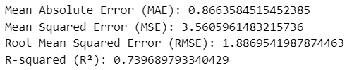


```python
plot_histogram(error_testing_q, 'testing_q')
```

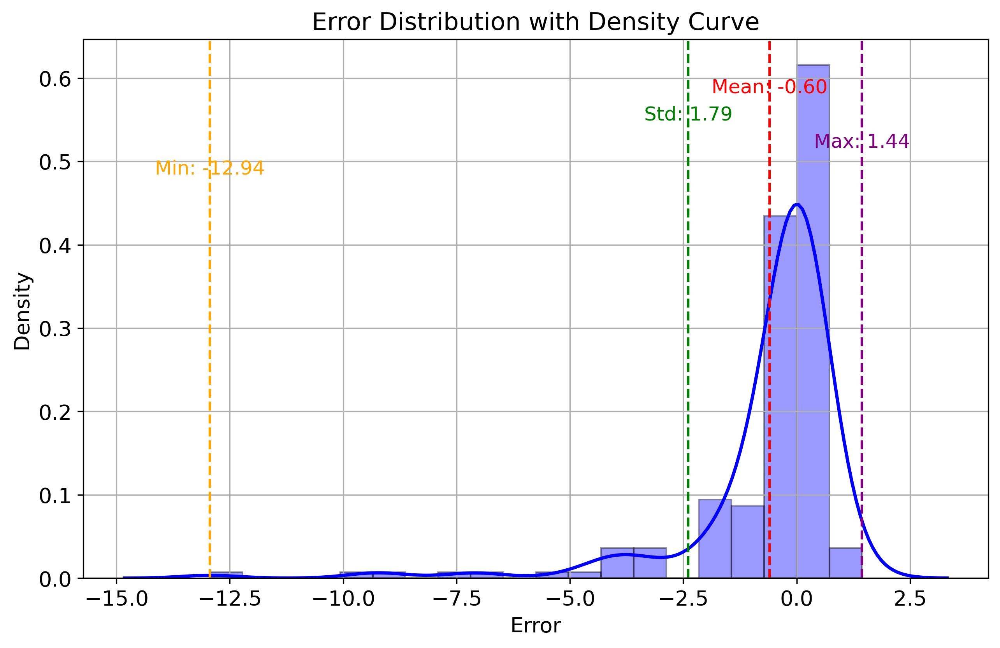


### 3.11 - Obtaining the model to be implemented in the microcontroller

```python
# Function: Convert some hex value into an array for C programming
def hex_to_c_array(hex_data, var_name):

  c_str = ''

  # Create header guard
  c_str += '#ifdef __has_attribute\n'
  c_str += '#define HAVE_ATTRIBUTE(x) __has_attribute(x)\n'
  c_str += '#else\n'
  c_str += '#define HAVE_ATTRIBUTE(x) 0\n'
  c_str += '#endif\n'
  c_str += '#if HAVE_ATTRIBUTE(aligned) || (defined(__GNUC__) && !defined(__clang__))\n'
  c_str += '#define DATA_ALIGN_ATTRIBUTE __attribute__((aligned(4)))\n'
  c_str += '#else\n'
  c_str += '#define DATA_ALIGN_ATTRIBUTE\n'
  c_str += '#endif\n\n'

  # Declare C variable
  c_str += 'const unsigned char ' + var_name + '[]  DATA_ALIGN_ATTRIBUTE = {'
  hex_array = []
  for i, val in enumerate(hex_data) :

    # Construct string from hex
    hex_str = format(val, '#04x')

    # Add formatting so each line stays within 80 characters
    if (i + 1) < len(hex_data):
      hex_str += ','
    if (i + 1) % 12 == 0:
      hex_str += '\n '
    hex_array.append(hex_str)

  # Add closing brace
  c_str += '\n ' + format(' '.join(hex_array)) + '\n};\n\n'

  # Close out header guard
  c_str += 'const int ' + var_name + '_len = ' + str(len(hex_data)) + ';\n'

  return c_str
```


#### 3.11.1 - Convert o model to Float32 and Int8

```python
def representative_dataset():
    for i in range(len(X_train)):
        input_data = np.array([X_train[i]], dtype=np.float32)
        yield [input_data]

def converter_quantization_model(model, model_name):

    # Convert o model to float32
    converter_float32 = tf.lite.TFLiteConverter.from_keras_model(model)
    converter_float32.optimizations = [tf.lite.Optimize.DEFAULT]
    converter_float32.target_spec.supported_types = [tf.float32]
    converter_float32._experimental_lower_tensor_list_ops = False
    converter_float32.supported_ops = [tf.lite.OpsSet.TFLITE_BUILTINS, tf.lite.OpsSet.SELECT_TF_OPS]
    converter_float32.representative_dataset = representative_dataset
    tflite_model_float32 = converter_float32.convert()
    print(tflite_model_float32)
    with open(model_name+'_quant_float32' + '.h', 'w') as file:
        file.write(hex_to_c_array(tflite_model_float32, model_name+'_quant_float32'))
    with open(model_name+'_quant_float32.tflite', 'wb') as f:
        f.write(tflite_model_float32)
    size_model_tflite_float32 = os.path.getsize(model_name+'_quant_float32.tflite')
    print(model_name+f'_quant_float32.tflite: {size_model_tflite_float32} Bytes')

    # Convert o model to Int8
    converter_int8 = tf.lite.TFLiteConverter.from_keras_model(model)
    converter_int8.optimizations = [tf.lite.Optimize.DEFAULT]
    converter_int8.target_spec.supported_types = [tf.int8]
    #converter_int8._experimental_lower_tensor_list_ops = False
    converter_int8.representative_dataset = representative_dataset
    converter_int8.target_spec.supported_ops = [
        tf.lite.OpsSet.TFLITE_BUILTINS_INT8,
        tf.lite.OpsSet.SELECT_TF_OPS,
    ]
    converter_int8.target_spec.supported_ops = [tf.lite.OpsSet.TFLITE_BUILTINS]
    converter_int8.target_spec.supported_ops = [tf.lite.OpsSet.TFLITE_BUILTINS_INT8]
    converter_int8.experimental_new_converter = True
    converter_int8.experimental_new_quantizer = True
    converter_int8.experimental_new_calibrator = True
    tflite_model_int8 = converter_int8.convert()
    with open(model_name+'_quant_int8' + '.h', 'w') as file:
        file.write(hex_to_c_array(tflite_model_int8, model_name+'_quant_int8'))
    with open(model_name+'_quant_int8.tflite', 'wb') as f:
        f.write(tflite_model_int8)
    size_model_tflite_int8 = os.path.getsize(model_name+'_quant_int8.tflite')
    print(model_name+f'_quant_int8.tflite: {size_model_tflite_int8} Bytes')

    return None
```


##### 3.11.1.1 - Not Quantized

```python
model_name='.\models\model'
converter_quantization_model(model, model_name)
```

##### 3.11.1.2 - Quantization Aware Training

```python
model_name='.\models\q_aware_model'
converter_quantization_model(q_aware_model, model_name)
```


### 3.12 - Converted Model Evaluation

```python
def evaluate_quantization(model_path, X_test, y_test, quantization_type):
    interpreter = tf.lite.Interpreter(model_path=model_path)
    interpreter.allocate_tensors()

    # Avaliar o modelo quantizado
    input_index = interpreter.get_input_details()[0]['index']
    output_index = interpreter.get_output_details()[0]['index']
    predictions = []
    processing_times = []

    X_test = np.array(X_test, dtype=np.float32)
    
    for X in X_test:
        interpreter.set_tensor(input_index, [X])
        
        start_time = time.time()
        interpreter.invoke()
        end_time = time.time()
        processing_time = end_time - start_time
        processing_times.append(processing_time)
        output = interpreter.get_tensor(output_index)
        predictions.append(output[0])

    mse = mean_squared_error(y_test, predictions)
    mae = mean_absolute_error(y_test, predictions)
    r2 = r2_score(y_test, predictions)
   
    # Calcular a média e o desvio padrão das diferenças
    result = { "MSE":mse,
                "MAE": mae,
                "R2-Score": r2,
                "Process time": np.mean(processing_times)
            }

    return result
```


#### 3.12.1 - Not Quantized

```python
model_name = '.\models\model'
```

```python
eval_quant_float32 = evaluate_quantization(model_name + '_quant_float32.tflite', X_test, y_test, 'float32')
eval_quant_float32
```

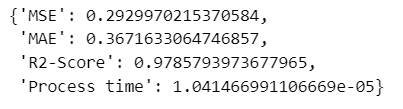

```python
eval_quant_int8 = evaluate_quantization(model_name + '_quant_int8.tflite', X_test, y_test, 'int8')
eval_quant_int8
```

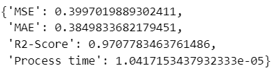


#### 3.12.2 - Quantization Aware Training


```python
model_q_name = '.\models\q_aware_model'
```

```python
eval_quant_float32 = evaluate_quantization(model_q_name + '_quant_float32.tflite', X_test, y_test, 'float32')
eval_quant_float32
```

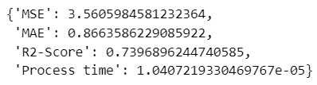

```python
eval_quant_float32 = evaluate_quantization(model_q_name + '_quant_float32.tflite', X_test, y_test, 'float32')
eval_quant_float32
```

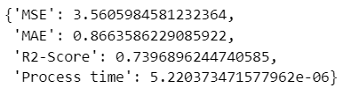


```cpp
double score(double * input) {
    return 0.055454859886876616 + input[0] * 0.00900332318983459 + input[1] * 0.18410431672672556 + input[2] * 0.04558472576852831;
}
```

### 3.13 - Deploy Model


#### 3.13.1 - Install EloquentTinyML Libarie

Go to library folder and install the EloquentTinyML-main


#### 3.13.2 - Complete Arduino Sketch

Open the model_quant_float32.h or model_quant_int8.h and copy all hex value from:


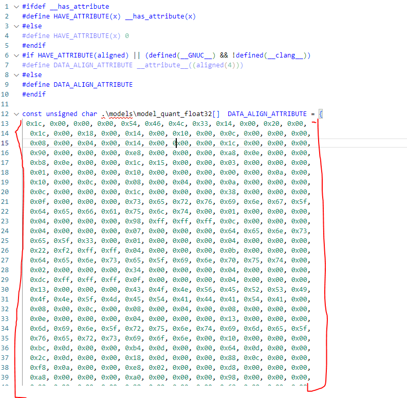

and model len


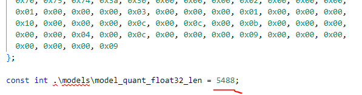

and cut in model.h:

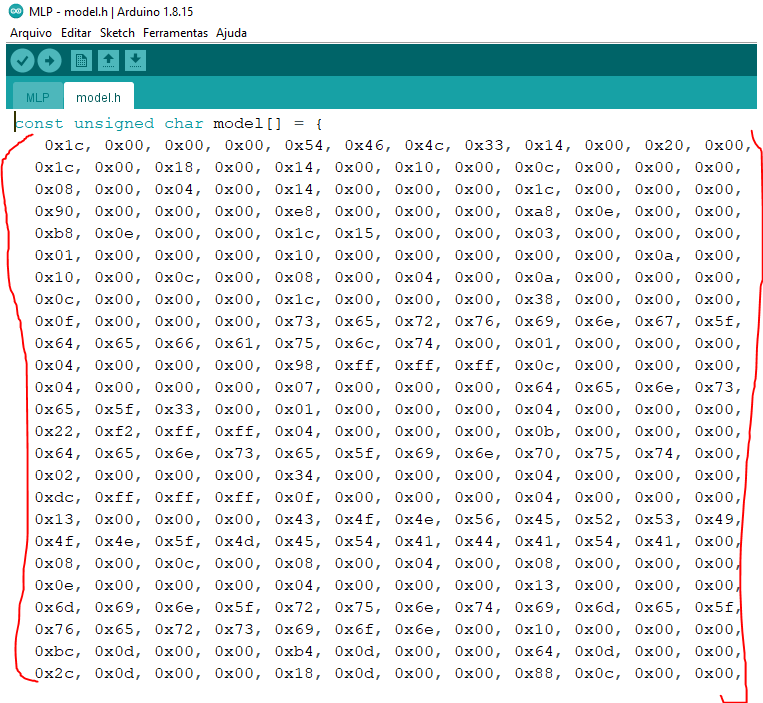

and

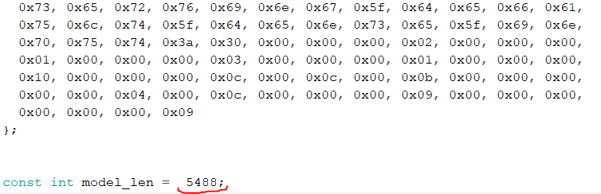


```cpp
#include <EloquentTinyML.h>
#include <eloquent_tinyml/tensorflow.h>

// sine_model.h contains the array you exported from Python with xxd or tinymlgen
#include "model.h"

double start_time = -1;
double end_time = -1;
double width_time = -1;

#define N_INPUTS 3 
#define N_OUTPUTS 1
// in future projects you may need to tweak this value: it's a trial and error process
#define TENSOR_ARENA_SIZE 5*1024

Eloquent::TinyML::TensorFlow::TensorFlow<N_INPUTS, N_OUTPUTS, TENSOR_ARENA_SIZE> tf;

float input[3] = {0.47142857, 0.33333333, 0.48535565};

void setup() {
    Serial.begin(9600);
    delay(4000);
    tf.begin(model);

    // check if model loaded fine
    if (!tf.isOk()) {
      Serial.print("ERROR: ");
      Serial.println(tf.getErrorMessage());

      while (true) delay(1000);
    }
}

void loop() {
      start_time = micros();
      float y_pred = tf.predict(input);
      end_time = micros();
  
      width_time = end_time - start_time;

      Serial.print("Predict: ");
      Serial.println(y_pred);
      Serial.print("Real: ");
      Serial.println(16.2);
      Serial.print("Processing time: ");
      Serial.println(width_time);
      Serial.println(" ");
      delay(500);

}
```


### 3.14 - Result

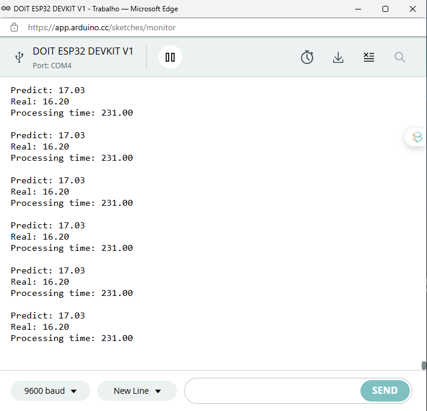


References
[2103.13630] A Survey of Quantization Methods for Efficient Neural Network Inference (arxiv.org)
