# TinyML - Post-Training Pruning

*From mathematical foundations to edge implementation*

**Social media:**


👨🏽‍💻 Github: [thommaskevin/TinyML](https://github.com/thommaskevin/TinyML)

👷🏾 Linkedin: [Thommas Kevin](https://www.linkedin.com/in/thommas-kevin-ab9810166/)

📽 Youtube: [Thommas Kevin](https://www.youtube.com/channel/UC7uazGXaMIE6MNkHg4ll9oA)

:pencil2:CV Lattes CNPq: [Thommas Kevin Sales Flores](http://lattes.cnpq.br/0630479458408181)

👨🏻‍🏫 Research group: [Conecta.ai](https://conect2ai.dca.ufrn.br/)


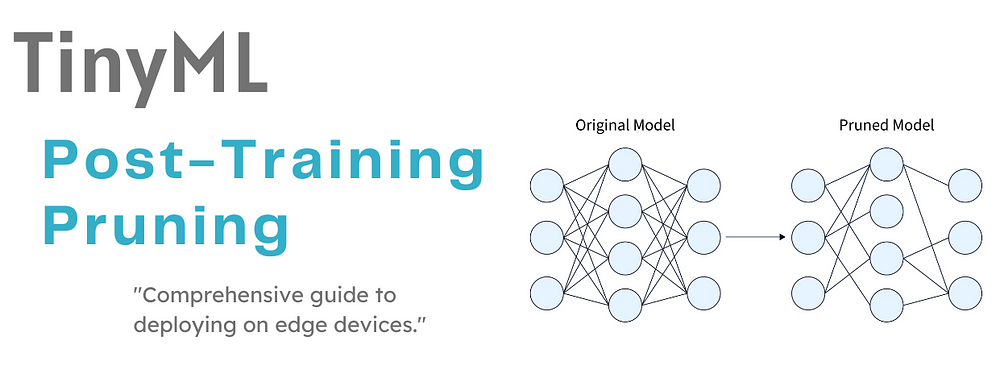


## SUMMARY

1 - Introduction

 1.1 - Aspects of Model Pruning

 1.2 - Pruning Techniques

2 - Post-Training Pruning

 2.1 - Why Post-Pruning Retraining is Needed?

 2.2 - Post-Pruning Retraining Process

 2.3 - Mathematical Formulation

3 - TinyML Implementation


---

## 1 - Introduction

Model pruning is a technique used in machine learning to reduce the size and complexity of a model by removing redundant or non-essential parameters, typically weights or neurons, without significantly affecting the model's performance. The primary goal of pruning is to create a more efficient model, which can lead to faster inference times, lower memory usage, and reduced power consumption, making it especially useful in resource-constrained environments like edge devices and mobile applications.

### 1.1 - Aspects of Model Pruning


#### 1.1.1 Weight Pruning

In weight pruning, the focus is on reducing the number of non-zero weights in the model by removing those that contribute the least to model predictions. Typically, this is done based on the magnitude of the weights, where smaller weights are often considered less important.


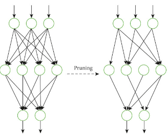


For a fully connected layer, the output can be expressed as:


$z_j^{(l)} = f\left(\sum_{i=1}^{n} W_{ij}^{(l)} \cdot a_i^{(l-1)} + b_j^{(l)}\right)$

Where:
- $z_j^{(l)}$ is the output of the $j$-th neuron in layer $l$,
- $W_{ij}^{(l)}$ is the weight connecting neuron $i$ in layer $l-1$ to neuron $j$ in layer $l$,
- $a_i^{(l-1)}$ is the activation from the previous layer,
- $f$ is the activation function,
- $b_j^{(l)}$ is the bias term for neuron $j$.


Weight pruning involves setting weights $W_{ij}$ to zero if their magnitude is below a threshold $\epsilon$, as they contribute minimally to the model's output:

$$ W_{ij}^{(l)} = \begin{cases} W_{ij}^{(l)}, & \text{if} \ |W_{ij}^{(l)}| \geq \epsilon \\0, & \text{if} \ |W_{ij}^{(l)}| < \epsilon\end{cases} $$

This results in a sparse weight matrix. After pruning, the model is typically retrained (fine-tuned) to recover lost accuracy.


Weight pruning is often combined with **L1 regularization** during training to encourage the model to produce smaller, less important weights that can later be pruned. The L1 regularization term is added to the loss function as:

$L = L_{\text{original}} + \lambda \sum_{i,j} |W_{ij}|$

Where $\lambda$ controls the degree of regularization.

#### 1.1.2 - Neuron Pruning

Neuron pruning eliminates entire neurons in a fully connected layer or filters in a convolutional neural network (CNN) that have a minimal contribution to the final output.

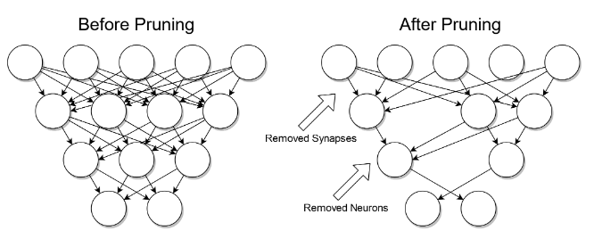


The output of a neuron is:

$z_j^{(l)} = f\left(\sum_{i=1}^{n} W_{ij}^{(l)} \cdot a_i^{(l-1)} + b_j^{(l)}\right)$


The importance of neuron $j$ in layer $l$ is evaluated by its activation or contribution to the final output. Neurons with consistently low activations or small gradients may be pruned. If neuron $j$ is pruned, the corresponding weight vector $W_{ij}^{(l)}$ is removed, and the output becomes:

$z_j^{(l)} = 0 \quad \text{(if pruned)}$


In CNNs, each filter in a convolutional layer produces a feature map. Pruning a filter means removing its corresponding feature map and the convolution operations:

$W^{(l)} = \left[ W_1^{(l)}, W_2^{(l)}, \dots, W_k^{(l)} \right]$


After pruning, the weight tensor reduces in size:

$W^{(l)} = \left[ W_1^{(l)}, W_3^{(l)}, \dots \right]$


This reduces the number of computations and the model's size.


#### 1.1.3 - Unstructured Pruning

In unstructured pruning, individual weights are removed from the weight matrices, creating sparse connections between neurons. This form of pruning removes weights without a specific pattern, leading to sparsity but retaining the original network architecture.


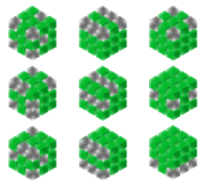


Consider a dense weight matrix W before pruning:

$$ W =\begin{pmatrix}
w_{11} & w_{12} & w_{13} \\
w_{21} & w_{22} & w_{23} \\
w_{31} & w_{32} & w_{33}
\end{pmatrix}$$


After unstructured pruning, the sparse matrix looks like:


$$W_{\text{pruned}} = 
\begin{pmatrix}
w_{11} & 0 & w_{13} \\
0 & w_{22} & 0 \\
w_{31} & 0 & w_{33}
\end{pmatrix}$$

This reduces the number of non-zero weights but may not lead to significant hardware speedups.


#### 1.1.4 - Structured Pruning

In structured pruning, entire structures, such as neurons, filters, or even layers, are removed. This results in a smaller and simpler architecture that is easier to deploy and can be more effectively optimized for hardware accelerators.


For example, consider a layer with 3 neurons:

$$z^{(l)} = \begin{pmatrix}
z_1^{(l)} \\
z_2^{(l)} \\
z_3^{(l)}
\end{pmatrix}$$


After pruning, neuron $z_2^{(l)}$ is removed:


$$z_{\text{pruned}}^{(l)} = \begin{pmatrix}
z_1^{(l)} \\
z_3^{(l)}
\end{pmatrix}$$

Structured pruning simplifies the architecture and leads to easier optimization for hardware.

**Differences in Efficiency**

- **Unstructured Pruning**: Creates sparsity in the network but may not significantly improve performance without specialized sparse matrix operations.

- **Structured Pruning**: Prunes entire neurons, filters, or layers, leading to easier hardware optimization and real-time performance gains.


### 1.2 - Pruning Techniques


#### 1.2.1 - Magnitude-based Pruning


Magnitude-based pruning focuses on removing weights whose absolute values are below a certain threshold. The assumption is that weights with small magnitudes contribute minimally to the model’s predictions, and hence, can be pruned without significantly affecting the overall accuracy.


Given a neural network with a weight matrix $W$, the goal is to remove weights that are smaller in magnitude. The weight matrix for a single layer is:

$W = \{w_{ij}\}, \quad \text{where} \ w_{ij} \in \mathbb{R}$

For each weight $w_{ij}$, if the absolute value $|w_{ij}|$ is less than a predefined threshold $\epsilon$, the weight is set to zero (pruned):

$$w_{ij} =
\begin{cases} 
w_{ij}, & \text{if} \ |w_{ij}| \geq \epsilon \\
0, & \text{if} \ |w_{ij}| < \epsilon
\end{cases}$$

**Pruning Process**

1. **Set a threshold $\epsilon$**: Define a threshold below which weights are considered unimportant.

2. **Apply the threshold**: Weights are pruned by setting them to zero if their absolute magnitude is less than $\epsilon$.

3. **Re-train the model**: After pruning, the model is typically retrained to recover any lost performance and allow the remaining weights to adapt.

**Example**

For a weight vector $W = [0.1, 0.01, 0.8, 0.001]$ and $\epsilon = 0.05$, the pruned weight vector becomes:


$W_{\text{pruned}} = [0.1, 0, 0.8, 0]$


This creates a sparse representation of the weight matrix, making it more efficient for computation.


#### 1.2.2 - Gradient-based Pruning


Gradient-based pruning uses the gradients of the loss function with respect to the weights to determine the importance of each weight. Weights with small gradients (i.e., weights that don't significantly affect the loss) are considered less important and are pruned.


During backpropagation, the gradient of the loss function $L$ with respect to a weight $w_{ij}$ is computed as:


$\frac{\partial L}{\partial w_{ij}}$

Weights with smaller gradients contribute less to reducing the loss function. Therefore, the magnitude of the gradient can be used to prune unimportant weights.

**Pruning Process**

1. **Compute the gradient**: For each weight $w_{ij}$, compute the gradient $\frac{\partial L}{\partial w_{ij}}$.

2. **Set a gradient threshold $\epsilon$**: Define a threshold $\epsilon$ for the gradient values.

3. **Prune based on gradients**: Weights are pruned if their corresponding gradients are below the threshold:

$$w_{ij} = 
\begin{cases} 
w_{ij}, & \text{if} \ |\frac{\partial L}{\partial w_{ij}}| \geq \epsilon \\
0, & \text{if} \ |\frac{\partial L}{\partial w_{ij}}| < \epsilon
\end{cases}$$

**Example**

Consider the gradients of weights $W = [0.01, 0.1, 0.0005, 0.3]$ with a gradient threshold $\epsilon = 0.02$. The pruned weight vector will be:

$W_{\text{pruned}} = [0, 0.1, 0, 0.3]$

Weights with gradients smaller than $\epsilon$ are pruned, resulting in a smaller and more efficient network.


#### 1.2.3 - Pruning During Training


Pruning during training is a dynamic method where weights are pruned progressively as the training process unfolds, instead of pruning after training is complete. This allows the model to adapt and redistribute the importance of the remaining weights.


In this technique, pruning is integrated into the optimization process. Initially, all weights are trained, and then, at certain intervals, unimportant weights are pruned. The model continues training with the remaining weights.

**Pruning Process**

1. **Train with full network**: Start with the full network and train for a set number of epochs.

2. **Prune periodically**: At certain intervals (e.g., every few epochs), apply pruning based on a criterion (such as magnitude or gradients).

3. **Continue training**: After each pruning step, continue training to fine-tune the remaining parameters.

4. **Repeat pruning**: Continue the cycle of pruning and training until a desired sparsity is achieved.

Let $W(t)$ represent the weight matrix at training step $t$. For every pruning interval $\tau$, weights are pruned based on a pruning criterion $P$:

$W(t + \tau) = P(W(t), \epsilon)$

Where $P$ applies the pruning rule (e.g., magnitude-based or gradient-based) and $\epsilon$ is the pruning threshold. The training process then continues with the updated weight matrix.

**Example**

For a neural network trained for 100 epochs, pruning may be applied every 10 epochs. Initially, all weights are trained, and after every 10 epochs, weights below a threshold are pruned:

1. **Epochs 1-10**: Train with full weights.
2. **Prune**: After epoch 10, prune weights based on their magnitude or gradient.
3. **Epochs 11-20**: Train the pruned network.
4. **Prune**: After epoch 20, prune again, and so on.

This allows the network to gradually adapt, and the pruned model is often more efficient while retaining accuracy.


## 2 - Post-Training Pruning

Pruning often results in a loss of model accuracy, especially if too many weights or neurons are removed. **Post-pruning retraining** is a process where the model is fine-tuned or retrained after pruning to recover some or all of the lost accuracy. This step is essential to help the remaining weights adjust and compensate for the pruned parameters.

### 2.1 - Why Post-Pruning Retraining is Needed

After pruning, the network's structure changes, which can disrupt the learned representations in the model. Since the pruned weights or neurons previously contributed to the prediction, their removal may degrade the model's performance. Retraining helps:

1. **Refine the remaining weights**: The remaining parameters are allowed to fine-tune and adapt to the pruned network structure.

2. **Redistribute the importance**: Some neurons or connections may take on more significant roles to compensate for the removed weights.

3. **Recover lost performance**: Retraining can help recover the accuracy lost during the pruning process by allowing the model to re-learn with the reduced number of parameters.

### 2.2 - Post-Pruning Retraining Process

1. **Prune the model**: Apply pruning to remove weights, neurons, or filters.

2. **Fine-tune the pruned model**: Continue training the pruned model on the original training dataset, allowing the remaining weights to adapt.

3. **Adjust learning rate**: Often, the learning rate is reduced during retraining to prevent the remaining weights from being updated too aggressively.

4. **Train until convergence**: Retrain the model until the loss stabilizes, indicating that the network has adapted to the new, pruned structure.

### 2.3 - Mathematical Formulation

Let $W_{\text{pruned}}$ be the weight matrix after pruning. Retraining involves minimizing the loss function $L$ again, but with the pruned weight matrix $W_{\text{pruned}}$:

$L(W_{\text{pruned}}) = \frac{1}{N} \sum_{i=1}^{N} \mathcal{L}(y_i, \hat{y_i}(W_{\text{pruned}}))$

Where:

- $N$ is the number of training samples.
- $\mathcal{L}$ is the original loss function (e.g., cross-entropy for classification).
- $y_i$ is the true label for the $i$-th training example.
- $\hat{y_i}(W_{\text{pruned}})$ is the model’s prediction using the pruned weight matrix $W_{\text{pruned}}$.

The goal is to adjust the remaining weights to minimize $L(W_{\text{pruned}})$ through gradient-based optimization techniques like stochastic gradient descent (SGD).

**Example of Post-Pruning Retraining**

Assume we have a neural network trained for a classification task, and we prune 30% of the weights using a magnitude-based pruning strategy. After pruning, the model experiences a drop in accuracy from 92% to 85%. To regain some accuracy:
- Retrain the model using the pruned weight matrix.
- Lower the learning rate (e.g., reduce by a factor of 10).
- Continue retraining until accuracy stabilizes.

After retraining, the accuracy might increase back to 90%, thus recovering most of the lost performance.


## 3 - TinyML Implementation

With this example you can implement the machine learning algorithm in ESP32, Arduino, Arduino Portenta H7 with Vision Shield, Raspberry and other different microcontrollers or IoT devices.


### 3.0 - Install the libraries listed in the requirements.txt file


```python
!pip install -r requirements.txt
```

### 3.1 - Importing libraries

```python
import os
import time
import numpy as np
import tensorflow as tf
from matplotlib import pyplot as plt
from sklearn.datasets import load_digits
import tensorflow_model_optimization as tfmot
from sklearn.metrics import accuracy_score
from tensorflow.keras.utils import plot_model
# Apply ggplot style
plt.style.use('ggplot')
```


### 3.2 - Load Dataset


MNIST, short for Modified National Institute of Standards and Technology database, is a widely used dataset in the field of machine learning and computer vision. It consists of a collection of handwritten digits ranging from 0 to 9, each digit being represented as a grayscale image of size 28x28 pixels. The dataset contains a total of 70,000 images, with 60,000 images used for training and 10,000 images used for testing.


link: https://www.nist.gov/itl/products-and-services/emnist-dataset


```python
def get_data():
    np.random.seed(1337)
    x_values, y_values = load_digits(return_X_y=True)
    x_values /= x_values.max()
    # reshape to (8 x 8 x 1)
    x_values = x_values.reshape((len(x_values), 8, 8, 1))
    # split into train, validation, test
    TRAIN_SPLIT = int(0.6 * len(x_values))
    TEST_SPLIT = int(0.2 * len(x_values) + TRAIN_SPLIT)
    x_train, x_test, x_validate = np.split(x_values, [TRAIN_SPLIT, TEST_SPLIT])
    y_train, y_test, y_validate = np.split(y_values, [TRAIN_SPLIT, TEST_SPLIT])

    return x_train, x_test, x_validate, y_train, y_test, y_validate
```


### 3.3 - Splitting the data


```python
X_train, X_test, X_validate, y_train, y_test, y_validate = get_data()
```

### 3.4 - Exploratory Data Analysis


```python
X_train__ = X_train.reshape(X_train.shape[0], 8, 8)

fig, axis = plt.subplots(1, 4, figsize=(20, 10))
for i, ax in enumerate(axis.flat):
    ax.imshow(X_train__[i], cmap='binary')
    digit = y_train[i]
    ax.set(title = f"Real Number is {digit}")
```


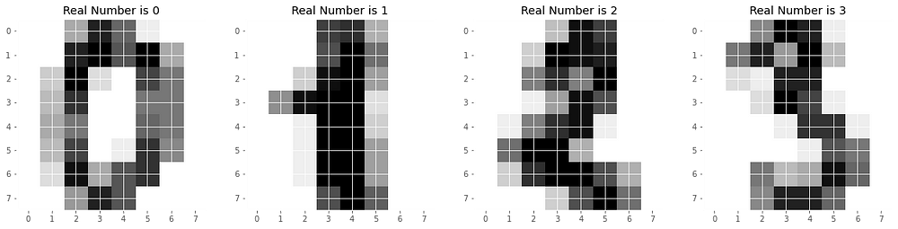


### 3.5 - Define the model


```python
def build_model():
    model = tf.keras.Sequential([
        tf.keras.layers.Conv2D(8, (3, 3), activation='relu', input_shape=(8, 8, 1)),
        tf.keras.layers.MaxPooling2D(),
        tf.keras.layers.Flatten(),
        tf.keras.layers.Dense(100, activation='relu'),
        tf.keras.layers.Dense(len(np.unique(y_train)), activation='softmax')
    ])
    return model
```

```python
model = build_model()
```

```python
model.summary()
```


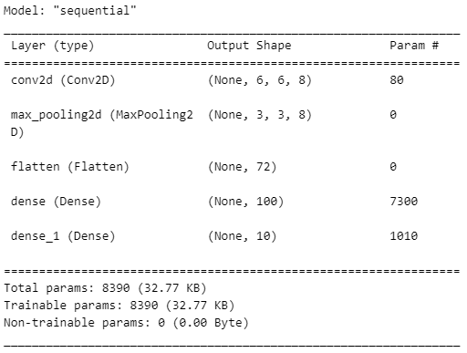


```python
plot_model(model, to_file='./figures/model.png')
```

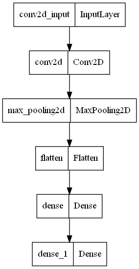


### 3.6 - Compile the model


```python
model.compile(optimizer='adam', 
              loss='sparse_categorical_crossentropy', 
              metrics=['accuracy'])
```


### 3.7 - Training model


```python
history = model.fit(X_train, y_train, epochs=100, validation_data=(X_test, y_test))
```

```python
model.save('.\models\original_model.keras')
```


```python
loss = history.history['loss']
val_loss = history.history['val_loss']
epochs = range(1, len(loss) + 1)
plt.plot(epochs, loss, 'r.', label='Training loss')
plt.plot(epochs, val_loss, 'y', label='Validation loss')
plt.title('Training and validation loss')
plt.xlabel('Epochs')
plt.ylabel('Loss')
plt.grid()
plt.legend()
plt.savefig('.\\figures\\history_traing.png', dpi=300, bbox_inches='tight')
plt.show()
```


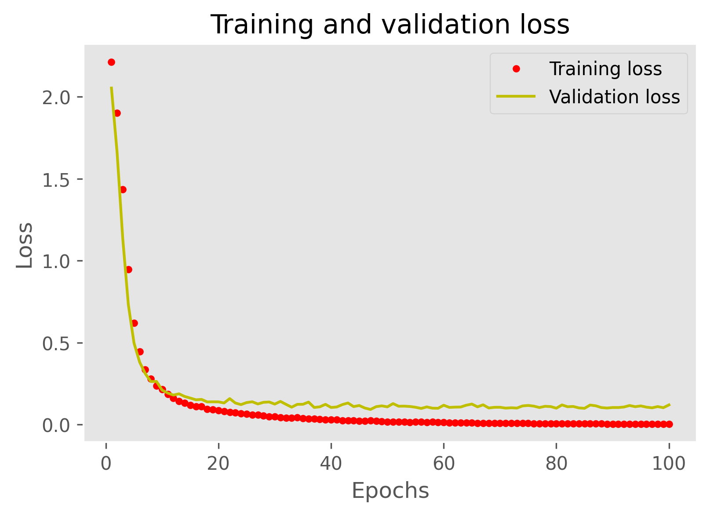


### 3.8 - Model Evaluation

```python
# Evaluate the original model
_, original_accuracy = model.evaluate(X_test, y_test)
```


```python
# Measure the inference time of the original model
def measure_inference_time(model, x_test):
    times = []
    for _ in range(10):  
        start_time = time.time()
        model.predict(x_test[:1]) 
        times.append(time.time() - start_time)
    return np.mean(times)
```


```python
original_inference_time = measure_inference_time(model, X_test)
print(f"Average inference time of the original model: {original_inference_time} seconds per sample")
```

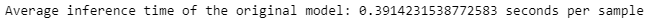


### 3.9 - Apply Pruning


```python
def apply_pruning(model, pruning_type='magnitude', **kwargs):
    """
    Applies pruning to the given model based on the specified pruning type.

    Parameters:
    - model: A Keras model to which pruning will be applied.
    - pruning_type: Type of pruning to apply. Supported types:
        'magnitude', 'random', 'l1', 'l2', 'iterative'
    - kwargs: Additional arguments depending on the pruning type.
        - For 'magnitude' and 'iterative':
            - 'initial_sparsity' (default: 0.0)
            - 'final_sparsity' (default: 0.5)
            - 'begin_step' (default: 0)
            - 'end_step' (default: 1000)
            - 'frequency' (default: 100)
        - For 'random':
            - 'sparsity' (default: 0.5)
        - For 'l1' and 'l2':
            - 'regularization_factor' (default: 1e-4)

    Returns:
    - A pruned Keras model ready for training.
    """

    # Default values for the kwargs
    initial_sparsity = kwargs.get('initial_sparsity', 0.0)
    final_sparsity = kwargs.get('final_sparsity', 0.5)
    begin_step = kwargs.get('begin_step', 0)
    end_step = kwargs.get('end_step', 1000)
    frequency = kwargs.get('frequency', 100)
    sparsity = kwargs.get('sparsity', 0.5)
    regularization_factor = kwargs.get('regularization_factor', 1e-4)
    
    if pruning_type == 'magnitude':
        # Magnitude-based pruning
        pruning_params = {
            'pruning_schedule': tfmot.sparsity.keras.PolynomialDecay(
                initial_sparsity=initial_sparsity,
                final_sparsity=final_sparsity,
                begin_step=begin_step,
                end_step=end_step,
                frequency=frequency
            )
        }
        pruned_model = tfmot.sparsity.keras.prune_low_magnitude(model, **pruning_params)
    
    elif pruning_type == 'random':
        # Random pruning
        def random_pruning_weights(weights, sparsity=0.5):
            mask = np.random.rand(*weights.shape) > sparsity
            return weights * mask

        # Apply random pruning to all dense layers
        for layer in model.layers:
            if isinstance(layer, tf.keras.layers.Dense):
                weights, biases = layer.get_weights()
                weights = random_pruning_weights(weights, sparsity=sparsity)
                layer.set_weights([weights, biases])
        pruned_model = model
    
    elif pruning_type in ['l1', 'l2']:
        # L1 or L2 regularization pruning
        for layer in model.layers:
            if isinstance(layer, tf.keras.layers.Dense):
                if pruning_type == 'l1':
                    layer.kernel_regularizer = tf.keras.regularizers.l1(regularization_factor)
                elif pruning_type == 'l2':
                    layer.kernel_regularizer = tf.keras.regularizers.l2(regularization_factor)
        pruned_model = model

    elif pruning_type == 'iterative':
        # Iterative pruning
        pruning_params = {
            'pruning_schedule': tfmot.sparsity.keras.PolynomialDecay(
                initial_sparsity=initial_sparsity,
                final_sparsity=final_sparsity,
                begin_step=begin_step,
                end_step=end_step,
                frequency=frequency
            )
        }
        pruned_model = tfmot.sparsity.keras.prune_low_magnitude(model, **pruning_params)

    else:
        raise ValueError(f"Unsupported pruning type: {pruning_type}")

    return pruned_model
```


```python
# Apply magnitude pruning
pruned_model_magnitude = apply_pruning(model, pruning_type='magnitude', initial_sparsity=0.1, final_sparsity=0.8)

# Apply random pruning
pruned_model_random = apply_pruning(model, pruning_type='random', sparsity=0.5)

# Apply L1 regularization-based pruning
pruned_model_L1 = apply_pruning(model, pruning_type='l1', regularization_factor=1e-5)

# Apply iterative pruning
pruned_model_interative = apply_pruning(model, pruning_type='iterative', initial_sparsity=0.2, final_sparsity=0.7)
```


```python
callbacks = [tfmot.sparsity.keras.UpdatePruningStep()]
```


### 3.10 - Compile the Pruning model


```python
pruned_model_magnitude.compile(optimizer='adam', 
                     loss='sparse_categorical_crossentropy', 
                     metrics=['accuracy'])

pruned_model_random.compile(optimizer='adam', 
                     loss='sparse_categorical_crossentropy', 
                     metrics=['accuracy'])

pruned_model_L1.compile(optimizer='adam', 
                     loss='sparse_categorical_crossentropy', 
                     metrics=['accuracy'])

pruned_model_interative.compile(optimizer='adam', 
                     loss='sparse_categorical_crossentropy', 
                     metrics=['accuracy'])
```


### 3.11 - Training the Pruning model

```python
hist_pruned_model_magnitude = pruned_model_magnitude.fit(X_train, y_train, epochs=100, validation_data=(X_test, y_test), callbacks=callbacks)

hist_pruned_model_random = pruned_model_random.fit(X_train, y_train, epochs=100, validation_data=(X_test, y_test), callbacks=callbacks)

hist_pruned_model_L1 = pruned_model_L1.fit(X_train, y_train, epochs=100, validation_data=(X_test, y_test), callbacks=callbacks)

hist_pruned_model_interative = pruned_model_interative.fit(X_train, y_train, epochs=100, validation_data=(X_test, y_test), callbacks=callbacks)
```


#### 3.11.1 - Strip model pruned


A "strip model" refers to a simplified or streamlined version of a model, often used in machine learning to reduce computational complexity and memory usage. When a strip model is pruned, it means that unnecessary parts of the model, such as less important neurons or connections, are removed. This process is aimed at improving the model's efficiency while maintaining its predictive performance. Pruning eliminates redundant or non-critical parameters to make the model smaller and faster, which is particularly useful for deploying models in resource-constrained environments like embedded systems or edge devices.


```python
models_list = [pruned_model_magnitude, pruned_model_random, pruned_model_L1, pruned_model_interative, model]
models_list_name = ['pruned_model_magnitude', 'pruned_model_random', 'pruned_model_L1', 'pruned_model_interative', 'model_original']
```


```python
def strip_and_save_pruned_model(pruned_model, model_name):
    # Remover pesos zerados usando strip pruning
    model_stripped = tfmot.sparsity.keras.strip_pruning(pruned_model)
    
    # Salvar o modelo como .keras após strip pruning
    model_stripped.save(f'.\models\{model_name}.keras')
    
    return model_stripped
```


```python
for i in range(len(models_list)):
    models_list[i] = strip_and_save_pruned_model(models_list[i], models_list_name[i])
```


### 3.12 - Evaluation Pruned Model


```python
pruned_model_magnitude_size = os.path.getsize('.\models\pruned_model_magnitude.keras') / 1024  # In KB
pruned_model_random_size = os.path.getsize('.\models\pruned_model_random.keras') / 1024  # In KB
pruned_model_L1_size = os.path.getsize('.\models\pruned_model_L1.keras') / 1024  # In KB
pruned_model_interative_size = os.path.getsize('.\models\pruned_model_interative.keras') / 1024  # In KB
original_size = os.path.getsize('.\models\original_model.keras') / 1024  # In KB
```


```python
model_sizes = {
    'Magnitude Pruned': pruned_model_magnitude_size,
    'Random Pruned': pruned_model_random_size,
    'L1 Pruned': pruned_model_L1_size,
    'Iterative Pruned': pruned_model_interative_size,
    'Original': original_size
}

# Create a bar chart to compare model sizes
plt.figure(figsize=(10, 6))
plt.bar(model_sizes.keys(), model_sizes.values(), color=['blue', 'orange', 'green', 'red', 'purple'])
plt.xlabel('Model Type')
plt.ylabel('Size (KB)')
plt.title('Model Size Comparison')
plt.xticks(rotation=15)
plt.tight_layout()

# Show the plot
plt.grid()
plt.savefig('.\\figures\\model_size_pruned_comparison.png', dpi=300, bbox_inches='tight')
plt.show()
```

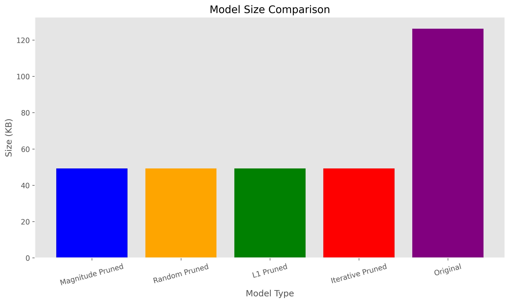


```python
history_objects = {
    "Magnitude Pruning": hist_pruned_model_magnitude,
    "Random Pruning": hist_pruned_model_random,
    "L1 Regularization": hist_pruned_model_L1,
    "Iterative Pruning": hist_pruned_model_interative
}

# Create subplots
fig, (ax1, ax2) = plt.subplots(1, 2, figsize=(14, 5))

# Plot accuracy
for label, hist in history_objects.items():
    ax1.plot(hist.history['accuracy'], label=f'{label} Train')
    ax1.plot(hist.history['val_accuracy'], linestyle='--', label=f'{label} Val')

ax1.set_title('Model Accuracy Comparison')
ax1.set_xlabel('Epochs')
ax1.set_ylabel('Accuracy')
ax1.legend(loc='lower right')

# Plot loss
for label, hist in history_objects.items():
    ax2.plot(hist.history['loss'], label=f'{label} Train')
    ax2.plot(hist.history['val_loss'], linestyle='--', label=f'{label} Val')

ax2.set_title('Model Loss Comparison')
ax2.set_xlabel('Epochs')
ax2.set_ylabel('Loss')
ax2.legend(loc='upper right')

# Show the plot
plt.tight_layout()
plt.savefig('.\\figures\\history_pruning_traing.png', dpi=300, bbox_inches='tight')
plt.show()
```


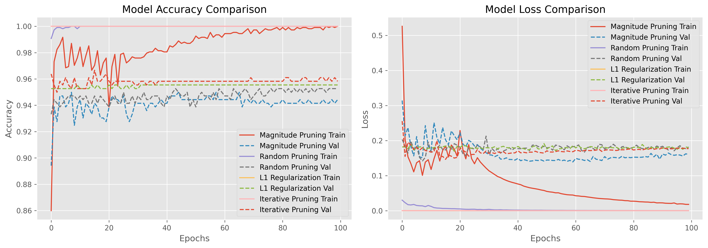


```python
# Evaluate magnitude-pruned model
_, pruned_accuracy_magnitude = pruned_model_magnitude.evaluate(X_test, y_test)
pruned_inference_time_magnitude = measure_inference_time(pruned_model_magnitude, X_test)

# Evaluate random-pruned model
_, pruned_accuracy_random = pruned_model_random.evaluate(X_test, y_test)
pruned_inference_time_random = measure_inference_time(pruned_model_random, X_test)

# Evaluate L1 regularization-pruned model
_, pruned_accuracy_L1 = pruned_model_L1.evaluate(X_test, y_test)
pruned_inference_time_L1 = measure_inference_time(pruned_model_L1, X_test)

# Evaluate iterative-pruned model
_, pruned_accuracy_iterative = pruned_model_interative.evaluate(X_test, y_test)
pruned_inference_time_iterative = measure_inference_time(pruned_model_interative, X_test)
```

```python
# Define the accuracy and inference time for each pruning method
pruning_methods = ['Magnitude', 'Random', 'L1', 'Iterative', 'Original']
accuracy_values = [pruned_accuracy_magnitude, pruned_accuracy_random, pruned_accuracy_L1, pruned_accuracy_iterative, original_accuracy]
inference_times = [pruned_inference_time_magnitude, pruned_inference_time_random, pruned_inference_time_L1, pruned_inference_time_iterative, original_inference_time]

# Create a figure with two subplots
fig, ax1 = plt.subplots(figsize=(10, 6))

# Create a bar chart for accuracy
ax1.bar(np.arange(len(pruning_methods)), accuracy_values, width=0.4, label='Accuracy', color='b', align='center')

# Set axis labels and title
ax1.set_xlabel('Pruning Methods')
ax1.set_ylabel('Accuracy', color='b')
ax1.set_title('Accuracy and Inference Time Comparison for Pruned Models')

# Set x-ticks to pruning methods
ax1.set_xticks(np.arange(len(pruning_methods)))
ax1.set_xticklabels(pruning_methods)

# Create another y-axis for inference time on the same plot
ax2 = ax1.twinx()
ax2.plot(np.arange(len(pruning_methods)), inference_times, label='Inference Time', color='r', marker='o', linestyle='--')
ax2.set_ylabel('Inference Time (seconds)', color='r')

# Add legends
ax1.legend(loc='upper left')
ax2.legend(loc='upper right')

# Show the plot
plt.tight_layout()
plt.savefig('.\\figures\\time_acc_pruning_comparative.png', dpi=300, bbox_inches='tight')
plt.show()
```

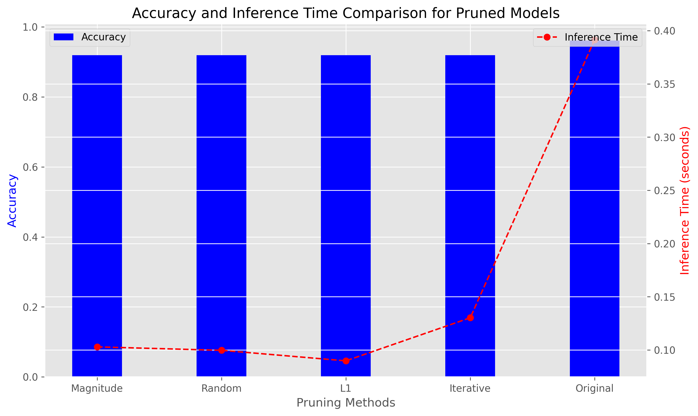


### 3.13 - Obtaining the model to be implemented in the microcontroller


#### 3.13.1 - Convert some hex value into an array for C programming

```python
# Function: Convert some hex value into an array for C programming
def hex_to_c_array(hex_data, var_name):

  c_str = ''

  # Create header guard
  c_str += '#ifdef __has_attribute\n'
  c_str += '#define HAVE_ATTRIBUTE(x) __has_attribute(x)\n'
  c_str += '#else\n'
  c_str += '#define HAVE_ATTRIBUTE(x) 0\n'
  c_str += '#endif\n'
  c_str += '#if HAVE_ATTRIBUTE(aligned) || (defined(__GNUC__) && !defined(__clang__))\n'
  c_str += '#define DATA_ALIGN_ATTRIBUTE __attribute__((aligned(4)))\n'
  c_str += '#else\n'
  c_str += '#define DATA_ALIGN_ATTRIBUTE\n'
  c_str += '#endif\n\n'

  # Declare C variable
  c_str += 'const unsigned char ' + var_name + '[]  DATA_ALIGN_ATTRIBUTE = {'
  hex_array = []
  for i, val in enumerate(hex_data) :

    # Construct string from hex
    hex_str = format(val, '#04x')

    # Add formatting so each line stays within 80 characters
    if (i + 1) < len(hex_data):
      hex_str += ','
    if (i + 1) % 12 == 0:
      hex_str += '\n '
    hex_array.append(hex_str)

  # Add closing brace
  c_str += '\n ' + format(' '.join(hex_array)) + '\n};\n\n'

  # Close out header guard
  c_str += 'const int ' + var_name + '_len = ' + str(len(hex_data)) + ';\n'

  return c_str
```


#### 3.13.2 - Convert o pruned model to Float32


```python
def representative_dataset():
    # Yield data in the shape expected by the model
    for i in range(len(X_train)):
        input_data = np.array([X_train[i]], dtype=np.float32)
        yield [input_data]

def converter_quantization_model(model, model_name):

    # Convert the model to float32
    converter_float32 = tf.lite.TFLiteConverter.from_keras_model(model)
    converter_float32.optimizations = [tf.lite.Optimize.DEFAULT]
    converter_float32.target_spec.supported_types = [tf.float32]
    converter_float32.representative_dataset = representative_dataset

    # Convert and save float32 model
    tflite_model_float32 = converter_float32.convert()
    with open(f".\models\{model_name}" + '_quant_float32' + '.h', 'w') as file:
        file.write(hex_to_c_array(tflite_model_float32, f".\models\{model_name}" + '_quant_float32'))
    with open(f".\models\{model_name}" + '_quant_float32.tflite', 'wb') as f:
        f.write(tflite_model_float32)

    # Get sizes
    size_model_tflite_float32 = os.path.getsize(f".\models\{model_name}" + '_quant_float32.tflite')
    size_model_h_float32 = os.path.getsize(f".\models\{model_name}" + '_quant_float32.h')
    print(f".\models\{model_name}" + f'_quant_float32.tflite: {size_model_tflite_float32} Bytes')
    print(f".\models\{model_name}" + f'_quant_float32.h: {size_model_h_float32} Bytes')

    
    return size_model_tflite_float32, size_model_h_float32
```


```python
# Lists to hold sizes
sizes_float32 = []

# Loop through each model to get the sizes
for i in range(len(models_list)):
    size_model_tflite_float32, size_model_h_float32 = converter_quantization_model(models_list[i], models_list_name[i])
    sizes_float32.append(size_model_tflite_float32)  # Append float32 size
```


```python
# Define x-axis labels for the models
x_labels = models_list_name

# Set the width of the bars
bar_width = 0.35
x = range(len(x_labels))

# Create a bar chart for the sizes
plt.figure(figsize=(12, 6))
plt.bar(x, sizes_float32, width=bar_width,  color='blue', align='center')

# Add labels and title
plt.xlabel('Models')
plt.ylabel('Size (KB)')
plt.title('Model Size Comparison for Different Quantization Formats')
plt.xticks([p + bar_width / 2 for p in x], x_labels)

# Show the plot
plt.tight_layout()
plt.savefig('.\\figures\\size_PTQ_comparative.png', dpi=300, bbox_inches='tight')
plt.show()
```

### 3.14 - Quantized Pruned Model Evaluation

```python
def evaluate_quantization(model_path, X_test, y_test, quantization_type):
    interpreter = tf.lite.Interpreter(model_path=model_path)
    interpreter.allocate_tensors()

    # Avaliar o modelo quantizado
    input_index = interpreter.get_input_details()[0]['index']
    output_index = interpreter.get_output_details()[0]['index']
    predictions = []
    processing_times = []

    X_test = np.array(X_test, dtype=np.float32)
    
    for X in X_test:
        interpreter.set_tensor(input_index, [X])       
        start_time = time.time()
        interpreter.invoke()
        end_time = time.time()
        processing_time = end_time - start_time
        processing_times.append(processing_time)
        output = interpreter.get_tensor(output_index).argmax(axis=1)
        predictions.append(output[0])

    acc = accuracy_score(y_test, predictions)

    return acc, processing_time
```


```python
acc_float32 = []
time_float32 = []

# Loop through each model to get the sizes
for i in range(len(models_list_name )):
    acc, processing_time = evaluate_quantization(f".\models\{models_list_name[i]}" + '_quant_float32.tflite', X_test, y_test, 'float32')
    acc_float32.append(acc)  # Append float32 size
    time_float32.append(processing_time)  # Append int8 size
```


```python
# Plot the accuracy vs. inference time for float32 models
fig, ax1 = plt.subplots(figsize=(14, 6))

# Plot accuracy
ax1.set_xlabel('Model Name')
ax1.set_ylabel('Accuracy', color='tab:blue')
ax1.bar(models_list_name, acc_float32, color='tab:blue', width=0.4, label='Accuracy')
ax1.tick_params(axis='y', labelcolor='tab:blue')

# Create a secondary y-axis for inference time
ax2 = ax1.twinx()
ax2.set_ylabel('Inference Time (ms)', color='tab:red')
ax2.plot(models_list_name, time_float32, color='tab:red', marker='o', label='Inference Time')
ax2.tick_params(axis='y', labelcolor='tab:red')

# Set title
plt.title('Accuracy and Inference Time for Float32 Quantized Models')

# Show plot
plt.tight_layout()
plt.savefig('.\\figures\\acc_quantized_model.png', dpi=300, bbox_inches='tight')
plt.show()
```


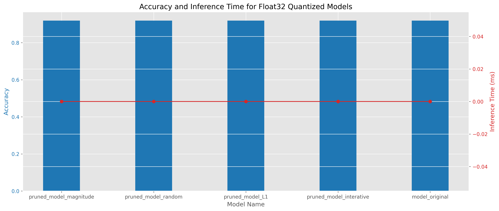


### 3.15 - Deploy Model


#### 3.15.1 - Install EloquentTinyML Libarie

Go to library folder and install the EloquentTinyML-main

#### 3.15.2 - Complete Arduino Sketch


```cpp
#include <EloquentTinyML.h>
#include <eloquent_tinyml/tensorflow.h>

//#include "model_pruned_L1.h"
//#include "model_pruned_interative.h"
//#include "model_original.h"
#include "model_random.h"


#define N_INPUTS 64 
#define N_OUTPUTS 10
// in future projects you may need to tweak this value: it's a trial and error process
#define TENSOR_ARENA_SIZE 36*1024

Eloquent::TinyML::TensorFlow::TensorFlow<N_INPUTS, N_OUTPUTS, TENSOR_ARENA_SIZE> tf;


float start_time = -1;
float end_time = -1;
float width_time = -1;

float input[64] = {0.00000000000f, 0.12500000000f, 0.00000000000f, 0.50000000000f, 0.56250000000f, 0.00000000000f, 0.00000000000f, 0.00000000000f, 0.00000000000f, 0.81250000000f, 0.31250000000f, 0.87500000000f, 0.50000000000f, 0.43750000000f, 0.00000000000f, 0.00000000000f, 0.00000000000f, 0.75000000000f, 0.31250000000f, 0.12500000000f, 0.00000000000f, 0.56250000000f, 0.00000000000f, 0.00000000000f, 0.00000000000f, 0.43750000000f, 0.31250000000f, 0.00000000000f, 0.00000000000f, 0.18750000000f, 0.31250000000f, 0.00000000000f, 0.00000000000f, 0.18750000000f, 0.62500000000f, 0.00000000000f, 0.00000000000f, 0.12500000000f, 0.62500000000f, 0.00000000000f, 0.00000000000f, 0.06250000000f, 0.81250000000f, 0.00000000000f, 0.00000000000f, 0.06250000000f, 0.75000000000f, 0.00000000000f, 0.00000000000f, 0.00000000000f, 0.31250000000f, 0.81250000000f, 0.31250000000f, 0.56250000000f, 0.81250000000f, 0.00000000000f, 0.00000000000f, 0.00000000000f, 0.00000000000f, 0.56250000000f, 1.00000000000f, 1.00000000000f, 0.43750000000f, 0.00000000000f};

float y_pred[10] = {0};

void setup() {
    Serial.begin(9600);
    delay(4000);
    tf.begin(model);

    // check if model loaded fine
    if (!tf.isOk()) {
      Serial.print("ERROR: ");
      Serial.println(tf.getErrorMessage());

      while (true) delay(1000);
    }
}

void loop() {

      
      
        start_time = millis() ;
        //start_time = micros();
        tf.predict(input, y_pred);
        end_time = millis();
        //end_time = micros();
        for (int i = 0; i < 10; i++) {
            Serial.print(y_pred[i]);
            Serial.print(i == 9 ? '\n' : ',');
        }
      Serial.print("Predicted class is: ");
      Serial.println(tf.probaToClass(y_pred));
      // or you can skip the predict() method and call directly predictClass()
      Serial.print("Sanity check: ");
      Serial.println(tf.predictClass(input));
      Serial.print(" - Time (ms): ");
      width_time = end_time - start_time;
      Serial.println(width_time);
      delay(2000);

}
```


### 3.16 - Results

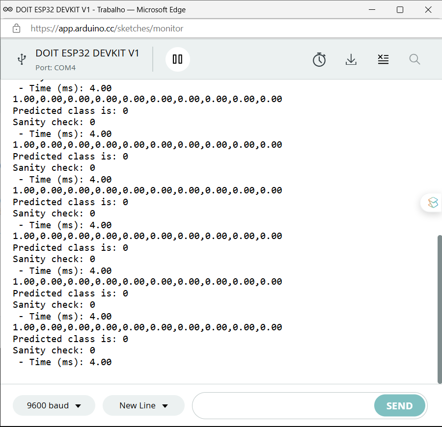
