# TinyML - MicroMobileNet

*From mathematical foundations to edge implementation*

**Social media:**


👨🏽‍💻 Github: [thommaskevin/TinyML](https://github.com/thommaskevin/TinyML)

👷🏾 Linkedin: [Thommas Kevin](https://www.linkedin.com/in/thommas-kevin-ab9810166/)

📽 Youtube: [Thommas Kevin](https://www.youtube.com/channel/UC7uazGXaMIE6MNkHg4ll9oA)

:pencil2:CV Lattes CNPq: [Thommas Kevin Sales Flores](http://lattes.cnpq.br/0630479458408181)

👨🏻‍🏫 Research group: [Conecta.ai](https://conect2ai.dca.ufrn.br/)


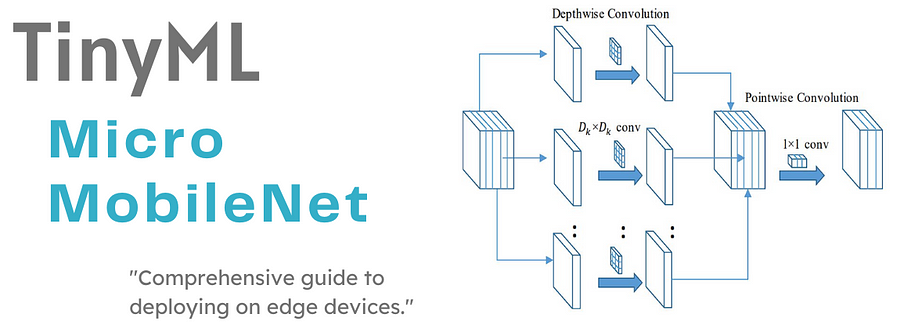


## SUMMARY

1 - Introduction

2 - Detailed Look at Internal Blocks

 2.1 - Standard Convolution Block

 2.2 - Depthwise Separable Convolution Block

 2.3 - Bottleneck Block with Expansion

 2.4 - Squeeze-and-Excitation Layer

 2.5 -Global Average Pooling and Fully Connected Layers

3 - TinyML Implementation


---

## 1 - Introduction

With the growing presence of connected devices, the Internet of Things (IoT) is pushing the boundaries and, with it, the need for efficient artificial intelligence (AI) technologies capable of operating in resource-limited environments. Embedded artificial intelligence, applied directly to these devices, depends on neural network models that are lightweight and energy-saving, which is essential to ensure their viability in low-power and memory-constrained scenarios. In this context, MicroMobileNet emerges as an evolution of MobileNet models, designed specifically to support image classification and pattern recognition tasks on devices with reduced capacity.


MicroMobileNet is an optimized convolutional neural network (CNN) whose compact structure was developed to significantly reduce the number of parameters and computational operations, while maintaining a level of accuracy suitable for a wide range of applications. This article addresses the mathematical formulation of MicroMobileNet and details its internal architecture, discussing the optimization techniques employed to achieve high efficiency and performance in low-cost, energy-consuming devices.


## 2 - Detailed Look at Internal Blocks


The final architecture of MicroMobileNet combines these blocks in a sequence that optimally balances feature extraction with minimal computational cost:

- **Standard Convolution Block:** Initial processing of the input image.

- **Depthwise Separable Convolution Block:** Repeated in various configurations to downsample and increase feature complexity.

- **Bottleneck Blocks:** Compress and expand channels with residual connections.

- **SE Layers:** Enhance channel-wise attention for feature maps in specific bottleneck blocks.

- **Global Average Pooling:** Reduces spatial dimensions.

- **Fully Connected Layer:** Outputs the final prediction.

By arranging these blocks in specific configurations, MicroMobileNet achieves a deep, efficient model with significant reductions in computational load and memory usage. This combination of blocks allows MicroMobileNet to handle edge AI tasks with impressive accuracy, making it an ideal choice for deploying deep learning models on embedded devices.


### 2.1 - Standard Convolution Block

This block is used at the beginning of the model to process the input image and establish initial feature extraction. A standard convolution involves sliding a filter across the input and performing element-wise multiplication and summation.

For an input tensor $X$ of dimensions $(H, W, C_{\text{in}})$ and a filter tensor $W$ of dimensions $(k, k, C_{\text{in}}, C_{\text{out}})$, the output feature map $Y$ can be described by:


$$Y(i, j, c) = \sum_{m=1}^{k} \sum_{n=1}^{k} \sum_{p=1}^{C_{\text{in}}} X(i + m, j + n, p) \cdot W(m, n, p, c)$$


where:
- $k$ is the kernel size,
- $C_{\text{in}}$ is the number of input channels,
- $C_{\text{out}}$ is the number of output channels.

The output shape depends on stride and padding but typically has a reduced spatial resolution due to downsampling.


### 2.2 - Depthwise Separable Convolution Block

Depthwise separable convolution, a hallmark of MicroMobileNet and MobileNet architectures, reduces computational load compared to standard convolutions. It consists of two steps: depthwise convolution and pointwise convolution.


####  2.2.1 - Depthwise Convolution

Each input channel is convolved independently with its own filter. Given an input with $C_{\text{in}}$ channels, this operation results in $C_{\text{in}}$ separate convolutions:

$$Y_{\text{depthwise}}(i, j, c) = \sum_{m=1}^{k} \sum_{n=1}^{k} X(i + m, j + n, c) \cdot W_{\text{depthwise}}(m, n, c)$$

This produces an intermediate tensor with the same depth as the input but reduced in spatial dimensions. The computational cost is:

\[
\text{Cost}_{\text{depthwise}} = H \cdot W \cdot C_{\text{in}} \cdot k^2
\]

#### 2.2.2 - Pointwise Convolution (1x1 Convolution)

A 1x1 convolution is applied across the channels, combining information into the desired number of output channels $C_{\text{out}}$:

$$Y_{\text{pointwise}}(i, j, c) = \sum_{p=1}^{C_{\text{in}}} Y_{\text{depthwise}}(i, j, p) \cdot W_{\text{pointwise}}(p, c)$$

This operation maintains spatial dimensions but changes the depth. The computational cost is:


$$\text{Cost}_{\text{pointwise}} = H \cdot W \cdot C_{\text{in}} \cdot C_{\text{out}}$$


Together, depthwise separable convolutions significantly reduce multiplications and additions, providing similar expressive power as standard convolutions but with fewer computations.


### 2.3 - Bottleneck Block with Expansion

The bottleneck block compresses and expands features, comprising three main components:


#### 2.3.1 - Expansion Layer (1x1 Convolution)

Expands the number of channels by a factor $t$, increasing model capacity without significant cost.

$$Y_{\text{exp}}(i, j, c) = \sum_{p=1}^{C_{\text{in}}} X(i, j, p) \cdot W_{\text{exp}}(p, c)$$


 Here, $Y_{\text{exp}}$ has $t \cdot C_{\text{in}}$ channels.


#### 2.3.2 - Depthwise Convolution

Applies a depthwise convolution on the expanded feature map, capturing spatial information without increasing parameters.

$$Y_{\text{depth}}(i, j, c) = \sum_{m=1}^{k} \sum_{n=1}^{k} Y_{\text{exp}}(i + m, j + n, c) \cdot W_{\text{depth}}(m, n, c)$$


#### 2.3.3 - Projection Layer (1x1 Convolution)


Reduces the feature map back to the desired output channels, acting as a bottleneck that prevents excess parameters.

$$Y_{\text{proj}}(i, j, c) = \sum_{p=1}^{t \cdot C_{\text{in}}} Y_{\text{depth}}(i, j, p) \cdot W_{\text{proj}}(p, c)$$

This block often includes a residual connection (skip connection) to enhance gradient flow and stabilize training.


### 2.4 - Squeeze-and-Excitation Layer

SE layers are lightweight attention mechanisms that adaptively recalibrate channel importance. The two steps are:

#### 2.4.1 - Squeeze Operation


Global average pooling is applied to each channel, producing a vector of size $C_{\text{out}}$.

$$s_c = \frac{1}{H \cdot W} \sum_{i=1}^{H} \sum_{j=1}^{W} Y_{\text{proj}}(i, j, c)$$


#### 2.4.2 - Excitation Operation

The squeezed vector is passed through two fully connected layers to learn channel-wise scaling factors.

$$e = \sigma(W_2 \cdot \text{ReLU}(W_1 \cdot s))$$

The output vector $e$ is then multiplied with the feature map $Y_{\text{proj}}$, scaling each channel by its learned weight:

$$Y_{\text{SE}}(i, j, c) = e_c \cdot Y_{\text{proj}}(i, j, c)$$

SE layers increase the network's representational capacity with minimal computational overhead, allowing MicroMobileNet to maintain accuracy after parameter compression.


### 2.5 - Global Average Pooling and Fully Connected Layers

At the model's end, a Global Average Pooling (GAP) layer is used instead of a dense layer, reducing spatial dimensions and producing a compact feature representation. This step avoids the parameter-heavy dense layer typically found at the end of neural networks.

$$y_c = \frac{1}{H \cdot W} \sum_{i=1}^{H} \sum_{j=1}^{W} Y_{\text{SE}}(i, j, c)$$

After GAP, the feature map is passed to a lightweight fully connected layer for the final prediction, outputting class scores. This setup minimizes parameter usage while retaining classification capabilities.


## 3 - TinyML Implementation

With this example you can implement the machine learning algorithm in ESP32, Arduino, Arduino Portenta H7 with Vision Shield, Raspberry and other different microcontrollers or IoT devices.


### 3.0 - Install the libraries listed in the requirements.txt file


```python
!pip install -r requirements.txt
```

### 3.1 - Importing libraries

```python
import tensorflow as tf
import numpy as np
from matplotlib import pyplot as plt
plt.style.use('ggplot')

from micromobilenet import PicoMobileNet
from micromobilenet import NanoMobileNet
from micromobilenet import MicroMobileNet
from micromobilenet import MilliMobileNet
from micromobilenet import MobileNet
```


### 3.2 - Load Dataset


The flower_photos dataset in TensorFlow is a collection of images classified into five categories: daisy, dandelion, roses, sunflowers, and tulips. It is widely used for image classification tasks, especially in transfer learning with models like MobileNetV2 and ResNet. Images are stored in folders by class, allowing for easy loading with TensorFlow's image_dataset_from_directory. This function can also split the dataset into training and validation sets and resize images as needed for model input.


```python
data_url = "https://storage.googleapis.com/download.tensorflow.org/example_images/flower_photos.tgz"
data_dir = tf.keras.utils.get_file('flower_photos', origin=data_url, untar=True)
```


### 3.3 - Splitting the data


```python
IMG_SIZE = (96, 96)
BATCH_SIZE = 1

# Pré-processamento: Convertemos as imagens para escala de cinza
train_datagen = tf.keras.preprocessing.image.ImageDataGenerator(
    rescale=1.0 / 255,
    validation_split=0.2,
)

train_data = train_datagen.flow_from_directory(
    data_dir,
    target_size=IMG_SIZE,
    color_mode='grayscale',  # Carregar em escala de cinza
    batch_size=BATCH_SIZE,
    class_mode='sparse',
    subset='training'
)

val_data = train_datagen.flow_from_directory(
    data_dir,
    target_size=IMG_SIZE,
    color_mode='grayscale',  # Carregar em escala de cinza
    batch_size=BATCH_SIZE,
    class_mode='sparse',
    subset='validation'
)
```

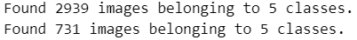


```python
# Processing X_train and y_train
X_train, y_train = [], []
for _ in range(len(train_data)):
    images, labels = train_data.next()
    X_train.append(images[0])
    y_train.append(labels[0])

# Convert lists to numpy arrays
X_train = np.array(X_train).astype(np.uint16)
y_train = np.array(y_train)

# One-hot encode y_train and convert to uint16
y_train = tf.keras.utils.to_categorical(y_train, num_classes=5).astype(np.uint16)

# Processing X_val and y_val
X_val, y_val = [], []
for _ in range(len(val_data)):
    images, labels = val_data.next()
    X_val.append(images[0])
    y_val.append(labels[0])

# Convert lists to numpy arrays
X_val = np.array(X_val).astype(np.uint16)
y_val = np.array(y_val)

# One-hot encode y_val and convert to uint16
y_val = tf.keras.utils.to_categorical(y_val, num_classes=5).astype(np.uint16)
```

### 3.4 - Exploratory Data Analysis


```python
fig, axis = plt.subplots(1, 4, figsize=(20, 10))
for i, ax in enumerate(axis.flat):
    ax.imshow(X_train[i], cmap='binary')
    digit = y_train[i]
    ax.set(title = f"Real Number is {digit}")
```


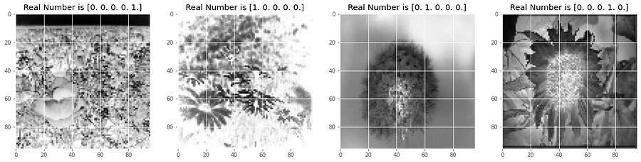


### 3.5 - Define the model

```python
num_classes = y_train.shape[1]
print('Numbers of classes: ', num_classes)
```

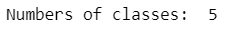


#### 3.5.1 - PicoMobileNet


```python
 model_pico = PicoMobileNet(num_classes=num_classes)
model_pico.config.learning_rate = 0.001
model_pico.config.batch_size = 32
model_pico.config.verbosity = 1
model_pico.config.checkpoint_min_accuracy = 0.65
model_pico.config.loss = "categorical_crossentropy"
model_pico.config.metrics = ["categorical_accuracy"]
model_pico.config.checkpoint_path = "checkpoints/pico"

model_pico.build()
model_pico.compile()
```

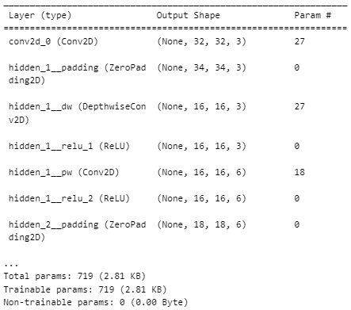


#### 3.5.2 - NanoMobileNet


```python
model_nano = NanoMobileNet(num_classes=num_classes)
model_nano.config.learning_rate = 0.001
model_nano.config.batch_size = 32
model_nano.config.verbosity = 1
model_nano.config.checkpoint_min_accuracy = 0.65
model_nano.config.loss = "categorical_crossentropy"
model_nano.config.metrics = ["categorical_accuracy"]
model_nano.config.checkpoint_path = "checkpoints/nano"

model_nano.build()
model_nano.compile()
```

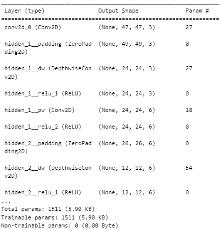


#### 3.5.3 - MicroMobileNet


```python
model_micro = MicroMobileNet(num_classes=num_classes)
model_micro.config.learning_rate = 0.001
model_micro.config.batch_size = 32
model_micro.config.verbosity = 1
model_micro.config.checkpoint_min_accuracy = 0.65
model_micro.config.loss = "categorical_crossentropy"
model_micro.config.metrics = ["categorical_accuracy"]
model_micro.config.checkpoint_path = "checkpoints/micro"

model_micro.build()
model_micro.compile() 
```

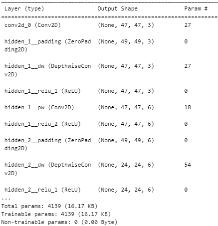


#### 3.5.4 - MilliMobileNet


```python
model_milli = MilliMobileNet(num_classes=num_classes)
model_milli.config.learning_rate = 0.001
model_milli.config.batch_size = 32
model_milli.config.verbosity = 1
model_milli.config.checkpoint_min_accuracy = 0.65
model_milli.config.loss = "categorical_crossentropy"
model_milli.config.metrics = ["categorical_accuracy"]
model_milli.config.checkpoint_path = "checkpoints/milli"

model_milli.build()
model_milli.compile()
```

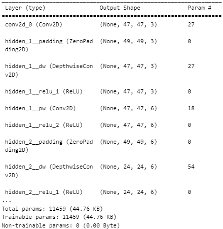


#### 3.5.5 - MobileNet


```python
model = MobileNet(num_classes=num_classes)
model.config.learning_rate = 0.001
model.config.batch_size = 32
model.config.verbosity = 1
model.config.checkpoint_min_accuracy = 0.65
model.config.loss = "categorical_crossentropy"
model.config.metrics = ["categorical_accuracy"]
model.config.checkpoint_path = "checkpoints"

model.build()
model.compile()
```

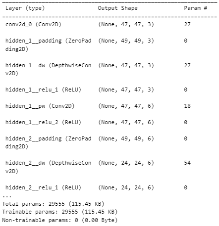


### 3.6 - Training the models


```python
num_epochs = 100
```

```python
history_pico = model_pico.fit(X_train, y_train, X_val, y_val, epochs=num_epochs)
history_nano = model_nano.fit(X_train, y_train, X_val, y_val, epochs=num_epochs)
history_micro = model_micro.fit(X_train, y_train, X_val, y_val, epochs=num_epochs)
history_milli = model_milli.fit(X_train, y_train, X_val, y_val, epochs=num_epochs)
history_model = model.fit(X_train, y_train, X_val, y_val, epochs=num_epochs)
```


### 3.7 - Model Evaluation


```python
def plot_separate_history(histories):
    # Perda de treino
    plt.figure(figsize=(10, 5))
    for name, history in histories.items():
        plt.plot(history.history.history['loss'], label=f'{name} Train Loss')
    plt.title('Training Loss')
    plt.xlabel('Epochs')
    plt.ylabel('Loss')
    plt.legend()
    plt.grid()
    plt.show()

    plt.figure(figsize=(10, 5))
    for name, history in histories.items():
        plt.plot(history.history.history['val_loss'], label=f'{name} Val Loss')
    plt.title('Validation Loss')
    plt.xlabel('Epochs')
    plt.ylabel('Loss')
    plt.legend()
    plt.grid()
    plt.show()

    plt.figure(figsize=(10, 5))
    for name, history in histories.items():
        plt.plot(history.history.history['categorical_accuracy'], label=f'{name} Train Accuracy')
    plt.title('Training Accuracy')
    plt.xlabel('Epochs')
    plt.ylabel('Accuracy')
    plt.legend()
    plt.grid()
    plt.show()

    plt.figure(figsize=(10, 5))
    for name, history in histories.items():
        plt.plot(history.history.history['val_categorical_accuracy'], label=f'{name} Val Accuracy')
    plt.title('Validation Accuracy')
    plt.xlabel('Epochs')
    plt.ylabel('Accuracy')
    plt.legend()
    plt.grid()
    plt.show()

histories = {
    'Pico': history_pico,
    'Nano': history_nano,
    'Micro': history_micro,
    'Milli': history_milli,
    'Base': history_model
}

plot_separate_history(histories)
```


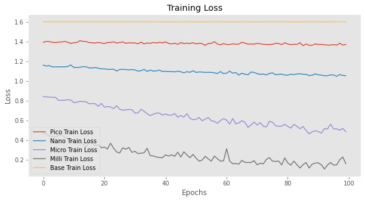

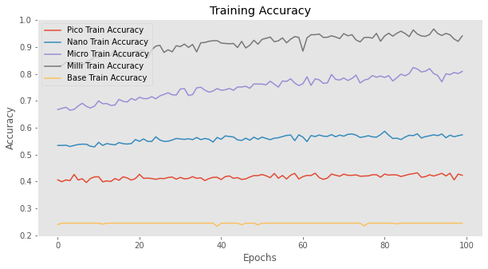

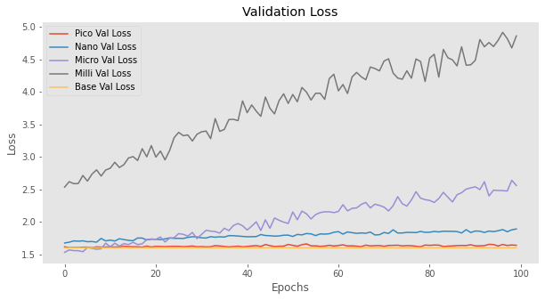

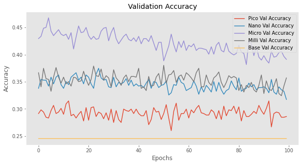


### 3.8 - Obtaining the model to be implemented in the microcontroller

```python
cpp_pico = model_pico.convert.to_cpp()
cpp_nano = model_nano.convert.to_cpp()
cpp_micro = model_micro.convert.to_cpp()
cpp_milli = model_milli.convert.to_cpp()
cpp_model = model.convert.to_cpp()
```


### 3.9 - Saves the template in a .h file


```python
with open('./ArduinoCode/model_pico.h', 'w') as file:
    file.write(model_pico.convert.to_cpp())
```

```python
with open('./ArduinoCode/model_nano.h', 'w') as file:
    file.write(model_nano.convert.to_cpp())
```

```python
with open('./ArduinoCode/model_micro.h', 'w') as file:
    file.write(model_micro.convert.to_cpp())
```


```python
with open('./ArduinoCode/model_milli.h', 'w') as file:
    file.write(model_milli.convert.to_cpp())
```

 
```python
with open('./ArduinoCode/model.h', 'w') as file:
    file.write(model.convert.to_cpp())
```


### 3.10 - Deploy Model


#### 3.10.1 - Complete Arduino Sketch


```cpp
#include <EloquentTinyML.h>
#include <eloquent_tinyml/tensorflow.h>

#include "teacher_model_quant_float32.h"
// #include "student_model_quant_float32.h"

#define N_INPUTS 784
#define N_OUTPUTS 10
// in future projects you may need to tweak this value: it's a trial and error process
#define TENSOR_ARENA_SIZE 90 * 1024

Eloquent::TinyML::TensorFlow::TensorFlow<N_INPUTS, N_OUTPUTS, TENSOR_ARENA_SIZE> tf;

float start_time = -1;
float end_time = -1;
float width_time = -1;

float input[784] = {...};

float y_pred[10] = {5};

void setup()
{
  Serial.begin(9600);
  delay(4000);
  tf.begin(model);

  // check if model loaded fine
  if (!tf.isOk())
  {
    Serial.print("ERROR: ");
    Serial.println(tf.getErrorMessage());

    while (true)
      delay(1000);
  }
}

void loop()
{

  start_time = millis();
  // start_time = micros();
  tf.predict(input, y_pred);
  end_time = millis();
  // end_time = micros();
  for (int i = 0; i < 10; i++)
  {
    Serial.print(y_pred[i]);
    Serial.print(i == 9 ? '\n' : ',');
  }
  Serial.print("Predicted class is: ");
  Serial.println(tf.probaToClass(y_pred));
  // or you can skip the predict() method and call directly predictClass()
  Serial.print("Sanity check: ");
  Serial.println(tf.predictClass(input));
  Serial.print(" - Time (ms): ");
  width_time = end_time - start_time;
  Serial.println(width_time);
  delay(2000);
}
```


### 3.11 - Results

#### 3.11.1 - PicoMobileNet

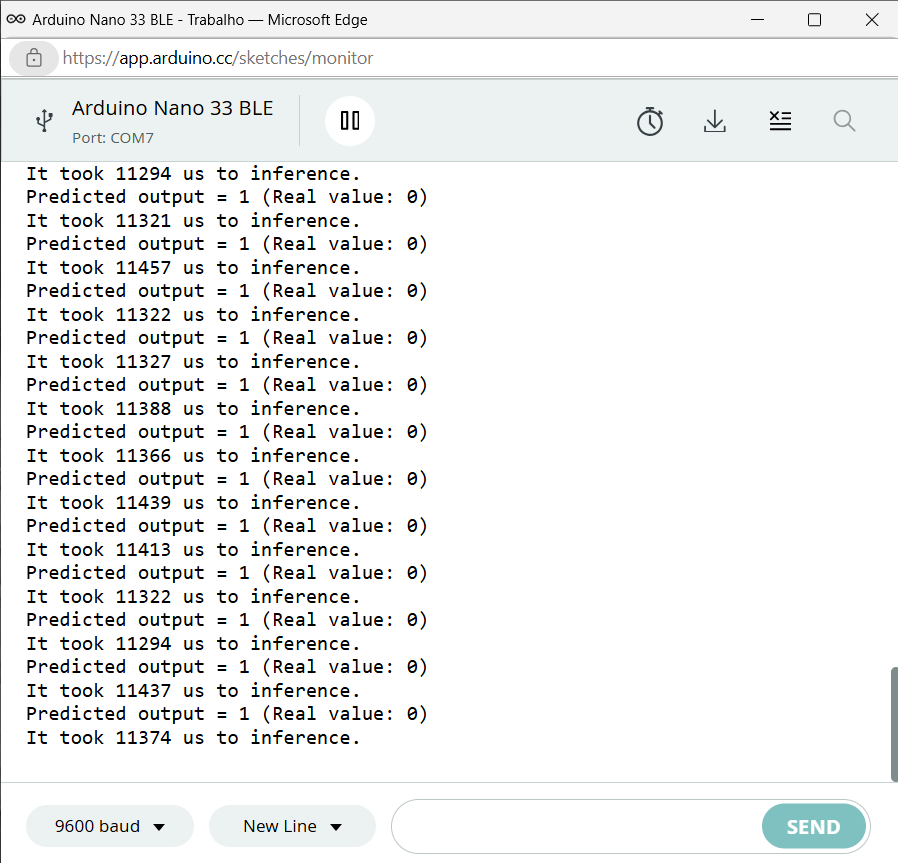


#### 3.11.2 - NanoMobileNet

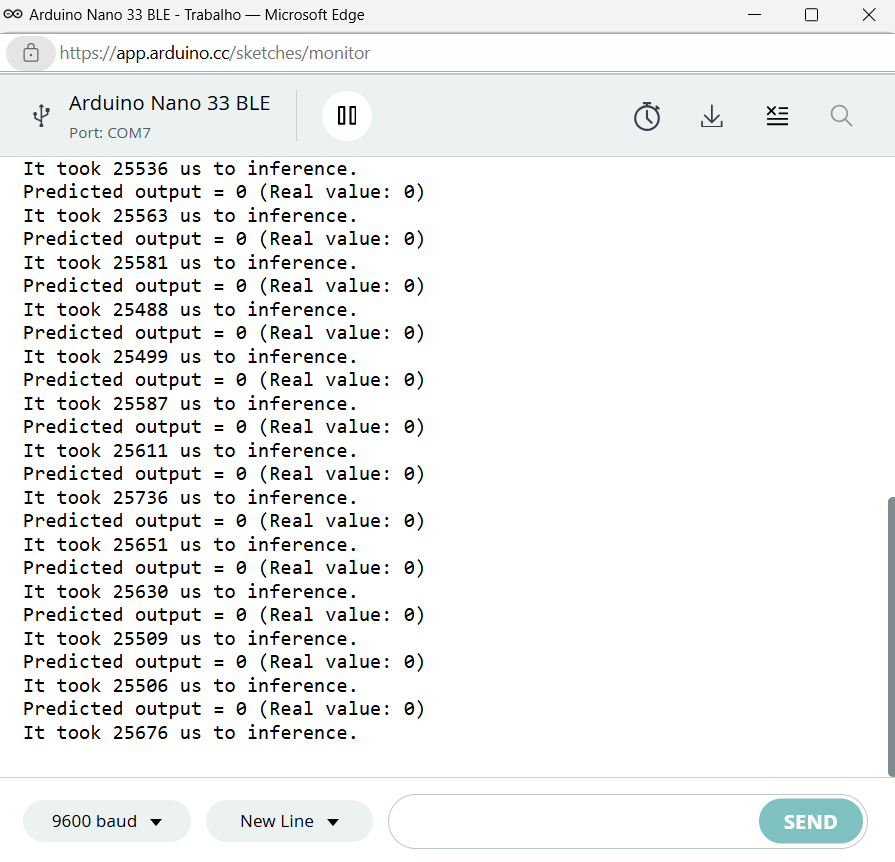

#### 3.11.3 - MicroMobileNet

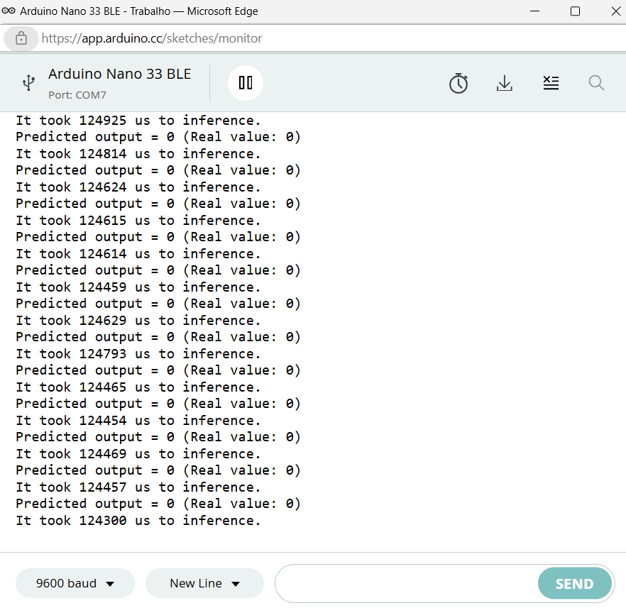


#### 3.11.4 - MilliMobileNet

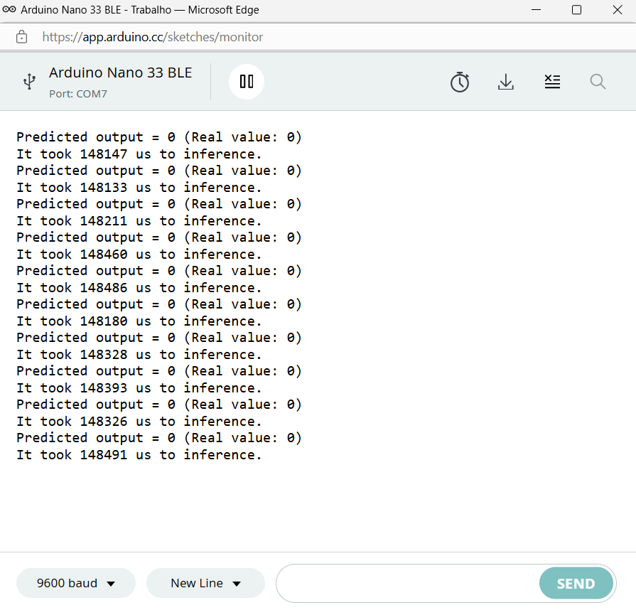

