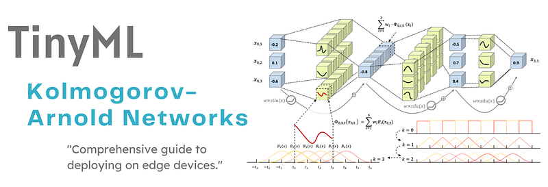
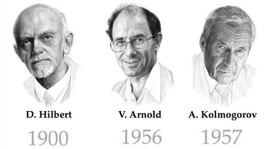
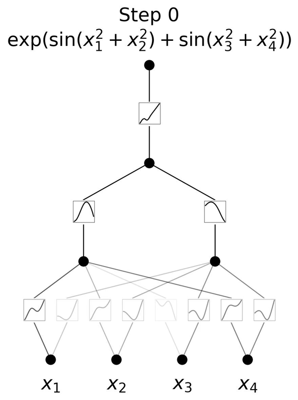
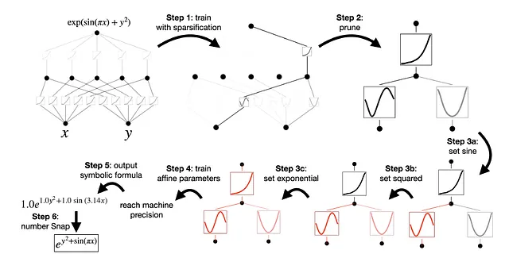
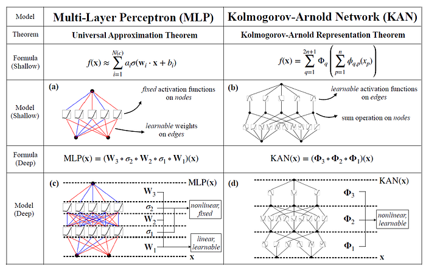

# TinyML - Kolmogorov-Arnold Networks

_From mathematical foundations to edge implementation_

**Social media:**

👨🏽‍💻 Github: [thommaskevin/TinyML](https://github.com/thommaskevin/TinyML)

👷🏾 Linkedin: [Thommas Kevin](https://www.linkedin.com/in/thommas-kevin-ab9810166/)

📽 Youtube: [Thommas Kevin](https://www.youtube.com/channel/UC7uazGXaMIE6MNkHg4ll9oA)

:pencil2:CV Lattes CNPq: [Thommas Kevin Sales Flores](http://lattes.cnpq.br/0630479458408181)

👨🏻‍🏫 Research group: [Conecta.ai](https://conect2ai.dca.ufrn.br/)

## SUMMARY

1 — Introduction

2 — Historical Context

3 — Mathematical Foundations

4 — TinyML Implementation

---

## 1 - Introduction

The rapid growth of deep learning has been largely driven by the success of multilayer perceptrons (MLPs), convolutional neural networks (CNNs), and more recently, Transformers. These architectures have demonstrated remarkable performance across diverse domains, including computer vision, natural language processing, and scientific computing. Their effectiveness relies on a combination of linear transformations (matrix multiplications) and fixed nonlinear activation functions such as the Rectified Linear Unit (ReLU), sigmoid, or hyperbolic tangent.

However, despite their empirical success, these architectures face several conceptual and practical limitations:

- Overparameterization and inefficiency. In order to approximate complex high-dimensional functions, classical architectures often require a large number of parameters and layers. This leads to high training costs, increased memory consumption, and energy inefficiency.

- Opaque representations. The functions learned by MLPs or Transformers are distributed across numerous weights and activation layers, making interpretability a persistent challenge. Researchers and practitioners frequently refer to these models as "black boxes."

- Fixed nonlinearities. The reliance on predefined activation functions constrains the representational flexibility of these networks. While universal approximation theorems guarantee expressivity in principle, the fixed nature of activations may require significantly more parameters than necessary to achieve comparable accuracy.

- Scaling limitations. Modern architectures, especially Transformers, achieve state-of-the-art results at the expense of computational complexity. For example, the self-attention mechanism exhibits quadratic complexity with respect to sequence length, making scalability an ongoing concern.

These challenges motivate the exploration of alternative neural architectures grounded in mathematical principles of function approximation. One particularly promising direction builds upon the Kolmogorov–Arnold representation theorem, which provides a constructive framework for decomposing multivariate functions into superpositions of univariate functions and addition operators.  

The theorem implies that the complexity of approximating high-dimensional mappings does not necessarily require deep or wide networks with rigid activation choices. Instead, any continuous multivariate function can be expressed as a composition of trainable univariate transformations, followed by additive aggregation. This theoretical insight inspires the design of Kolmogorov–Arnold Networks (KANs).

KANs differ fundamentally from traditional architectures by placing learnable functions on edges rather than nodes. In practice, each edge of the network corresponds to a univariate function parameterized by basis expansions (such as splines), allowing the network to learn task-specific nonlinearities directly from data. This architectural shift provides several advantages:

- Expressive efficiency. KANs can represent functions with fewer parameters and shallower architectures compared to MLPs.

- Interpretability. Since univariate functions are explicitly parameterized and learnable, they can be visualized and analyzed, offering insight into the model's decision process.

- Mathematical grounding. Unlike heuristic-driven architectures, KANs are derived directly from a constructive universal representation theorem, bridging the gap between approximation theory and practical neural networks.

By combining the rigor of mathematical representation with the flexibility of modern training methods, Kolmogorov–Arnold Networks open a pathway toward interpretable, efficient, and principled neural computation.

## 2 - Historical Context

The foundations of Kolmogorov–Arnold Networks (KANs) lie in a profound mathematical result from the mid-20th century that addressed one of the famous Hilbert problems. To understand why this theorem matters for modern neural architectures, it is essential to revisit the history and significance of the Kolmogorov–Arnold representation theorem.

In 1900, the German mathematician David Hilbert presented a list of 23 open problems at the International Congress of Mathematicians in Paris. These problems shaped the mathematical agenda of the 20th century.

Hilbert’s **13th problem** asked:

> *“Is it possible to represent every continuous function of three variables as a  
> superposition of continuous functions of two variables?”*

More broadly, the question concerned whether functions of several variables could be represented as compositions of functions of fewer variables. At the time, many mathematicians believed that multivariate functions had an intrinsic complexity that could not be reduced in such a way.

In 1957, Andrey Kolmogorov, one of the leading figures in probability theory and functional analysis, provided a remarkable answer. He demonstrated that every continuous multivariate function can indeed be represented as a superposition of continuous univariate functions and addition. This result went beyond Hilbert's original formulation, generalizing it from the case of three variables to arbitrary dimensions.

Formally, Kolmogorov proved that for any continuous function  

$$
f : [0,1]^n \to \mathbb{R},
$$  

there exist continuous functions  

$$
\varphi_q : [0,1] \to \mathbb{R}, \quad q = 1, \ldots, 2n+1,
$$  

and  

$$
\psi_{pq} : [0,1] \to \mathbb{R}, \quad p = 1, \ldots, n, \; q = 1, \ldots, 2n+1,
$$  

such that  

$$
f(x_1, \ldots, x_n) \;=\; \sum_{q=1}^{2n+1} \varphi_q \!\left(\sum_{p=1}^n \psi_{pq}(x_p)\right).
$$  

This representation showed that the *“curse of dimensionality”* could be bypassed in a structural sense:  
**multivariate complexity can always be decomposed into univariate transformations and addition.**

Following Kolmogorov's result, his student Vladimir Arnold further clarified and refined the proof, extending its scope and providing geometric intuition. Arnold's insights reinforced the idea that multivariate functions could be systematically reduced to univariate components.

Thus, the result is often referred to as the Kolmogorov–Arnold representation theorem, acknowledging both mathematicians' contributions.

## 3 - Mathematical Foundations

Below is a step-by-step development from the Kolmogorov–Arnold representation theorem to the concrete KAN layer, its training equations.

###  3.1 - Functional edges

Consider layer $\ell$ with input activations $a^{(\ell-1)}\in\mathbb{R}^{d_{\ell-1}}$ and output activations $a^{(\ell)}\in\mathbb{R}^{d_\ell}$.

For each edge $i\!\to\!j$ (from input index $i$ to output index $j$), define a learnable univariate function

$$
\varphi^{(\ell)}_{j i}:\mathbb{R}\to\mathbb{R}.
$$

A practical and interpretable parameterization is a **spline expansion** (optionally with an identity skip):

$$
\varphi^{(\ell)}_{j i}(t)
=\alpha^{(\ell)}_{j i}\,t
+\sum_{k=1}^{K} c^{(\ell)}_{j i k}\,B_k(t)
$$

where $\{B_k\}$ are **B-spline basis functions**, $\alpha^{(\ell)}_{j i}\in\mathbb{R}$ and $c^{(\ell)}_{j i k}\in\mathbb{R}$ are trainable coefficients.  

###  3.2 - B-splines in detail

A **B-spline basis function** of degree $p$ is defined recursively with respect to a non-decreasing sequence of knots $\{t_m\}$:

- For degree zero (piecewise constant functions):

$$
B_{i,0}(x)=
\begin{cases}
1 & \text{if } t_i \leq x < t_{i+1}, \\
0 & \text{otherwise.}
\end{cases}
$$

- Degree $p\geq 1$:

$$
B_{i,p}(x)
=\frac{x-t_i}{t_{i+p}-t_i}B_{i,p-1}(x)
+\frac{t_{i+p+1}-x}{t_{i+p+1}-t_{i+1}}B_{i+1,p-1}(x),
$$

with the convention that terms with zero denominator are taken as zero.

**Properties of B-splines:**
1. **Local support:** $B_{i,p}(x)$ is nonzero only on $[t_i,t_{i+p+1})$. Each basis affects only a local region.  
2. **Partition of unity:** For any $x$, $\sum_i B_{i,p}(x)=1$.  
3. **Smoothness:** A degree-$p$ B-spline is $C^{p-1}$ continuous at interior knots (unless knots are repeated).  
4. **Stability:** Basis functions are nonnegative, leading to numerically stable expansions.  

**Expansion in KANs.** Each edge-function is expressed as:

$$
\varphi^{(\ell)}_{j i}(x)
=\alpha^{(\ell)}_{j i}x+\sum_{k=1}^K c^{(\ell)}_{j i k}B_{k,p}(x),
$$

so the edge behavior is controlled by coefficients $c_{jik}$ weighting smooth, local basis functions. Increasing $p$ or refining knots gives finer flexibility.

###  3.3 - Node summation (and optional activation)

Each output node $j$ sums its incoming transformed signals and adds a bias:

$$
h^{(\ell)}_{j}=\sum_{i=1}^{d_{\ell-1}}
\varphi^{(\ell)}_{j i}\!\bigl(a^{(\ell-1)}_{i}\bigr)+b^{(\ell)}_{j}.
$$

Optionally apply a simple node activation $g^{(\ell)}$ (often the identity in baseline KANs):

$$
a^{(\ell)}_{j}=g^{(\ell)}\!\bigl(h^{(\ell)}_{j}\bigr).
$$

Stacking $L$ such layers yields the network $f_\theta = a^{(L)}\circ\cdots\circ a^{(1)}$.

###  3.4 - Gradients through a KAN layer

Because $\varphi_{ji}$ is univariate, its derivative is straightforward:

$$
\bigl(\varphi^{(\ell)}_{j i}\bigr)'(t)=\alpha^{(\ell)}_{j i}
+\sum_{k=1}^{K} c^{(\ell)}_{j i k}\,B'_k(t).
$$

Backpropagation therefore uses the same chain rule structure as MLPs, replacing constant weights by $(\varphi_{ji})'$ evaluated at the current preimage.

###  3.5 - Training objective and optimization

Let $\mathcal{D}=\{(x^{(n)},y^{(n)})\}_{n=1}^N$ be a supervised dataset and $f_\theta$ the KAN with parameters $\theta=\{\alpha,c,b\}$.

For regression (MSE):

$$
\mathcal{L}_{\text{data}}(\theta)
=\frac{1}{N}\sum_{n=1}^N
\bigl\|f_\theta(x^{(n)})-y^{(n)}\bigr\|_2^2.
$$

For classification (cross-entropy) with logits $z_\theta(x)$:

$$
\mathcal{L}_{\text{data}}(\theta)
=-\frac{1}{N}\sum_{n=1}^N\sum_{c=1}^{C}
\mathbb{1}\{y^{(n)}=c\}\,\log\!\Bigl(
\frac{e^{z_{\theta,c}(x^{(n)})}}
{\sum_{c'}e^{z_{\theta,c'}(x^{(n)})}}
\Bigr).
$$

To favor smooth, interpretable univariate functions, one often penalizes curvature. For B-splines this leads to a quadratic form in coefficients:

$$
\mathcal{R}_{\text{smooth}}(\theta)
=\sum_{\ell,j,i}\int \Bigl(\varphi^{(\ell)}_{j i}{}''(t)\Bigr)^{\!2}\,dt
\;\approx\;
\sum_{\ell,j,i}\bigl(c^{(\ell)}_{j i}\bigr)^{\!\top}\!\Omega\,c^{(\ell)}_{j i},
$$

where $\Omega$ is a precomputable spline penalty matrix (e.g., an integral of basis second-derivative products).

Optionally include sparsity:

$$
\mathcal{R}_{\text{sparse}}(\theta)=\sum_{\ell,j,i,k}\bigl|c^{(\ell)}_{j i k}\bigr|.
$$

Full objective and gradient steps:

$$
\mathcal{L}(\theta)
=\mathcal{L}_{\text{data}}(\theta)
+\lambda\,\mathcal{R}_{\text{smooth}}(\theta)
+\mu\,\mathcal{R}_{\text{sparse}}(\theta)
$$

Using backpropagation, for any coefficient $c^{(\ell)}_{j i k}$,

$$
\frac{\partial \mathcal{L}}{\partial c^{(\ell)}_{j i k}}
=\frac{1}{N}\sum_{n=1}^N
\delta^{(\ell)}_{j}(n)\,
B_k\!\bigl(a^{(\ell-1)}_{i}(n)\bigr)
+2\lambda\,[\Omega\,c^{(\ell)}_{j i}]_{k}
+\mu\,\operatorname{sign}\!\bigl(c^{(\ell)}_{j i k}\bigr),
$$

where $\delta^{(\ell)}_{j}(n)=\partial \mathcal{L}/\partial h^{(\ell)}_{j}(n)$ is the usual backpropagated error at node $j$ for sample $n$. For the identity node activation, the backward recursion is

$$
\delta^{(\ell-1)}_{i}(n)
=\sum_{j=1}^{d_\ell}\delta^{(\ell)}_{j}(n)\,
\bigl(\varphi^{(\ell)}_{j i}\bigr)'\!\bigl(a^{(\ell-1)}_{i}(n)\bigr).
$$

A vanilla gradient step with learning rate $\eta$ is

$$
c^{(\ell)}_{j i k}\leftarrow
c^{(\ell)}_{j i k}
-\eta\,\frac{\partial \mathcal{L}}{\partial c^{(\ell)}_{j i k}},
\quad
\alpha^{(\ell)}_{j i}\leftarrow
\alpha^{(\ell)}_{j i}
-\eta\,\frac{\partial \mathcal{L}}{\partial \alpha^{(\ell)}_{j i}},
\quad
b^{(\ell)}_{j}\leftarrow
b^{(\ell)}_{j}
-\eta\,\frac{\partial \mathcal{L}}{\partial b^{(\ell)}_{j}}.
$$

In practice, modern KAN variants still follow this principle while introducing efficient bases/approximations; the core "learnable edge-functions + node sums" remains.

###  3.6 - Network Simplification

The process begins with training under sparsification (Step 1), followed by pruning redundant nodes and connections (Step 2). At this stage, the network is already more compact and interpretable. The remaining functional edges are then matched to simple, human-readable operations such as sine, exponential, or quadratic functions (Steps 3a–3c). Once these symbolic candidates are set, the parameters are fine-tuned (Step 4) until the approximation reaches machine precision (Step 5). Finally, the network outputs a concise symbolic expression (Step 6), such as \(e^{x^2} + \sin(\pi x)\).*

Two key aspects of this simplification process are:

1. **Symbolification** — KAN approximates complex target functions through compositions of simpler, often interpretable functions. This allows the network to produce **explicit mathematical formulas**, making its inner workings transparent, as illustrated above.  

2. **Pruning** — To further optimize, the network architecture is simplified by **removing less important nodes or connections** after training. This reduces both the size and complexity of the model while preserving predictive accuracy. By eliminating components that contribute minimally to the output, pruning yields a lighter and more interpretable network.

###  3.6 - How KANs differ mathematically from MLPs

The primary distinction between Kolmogorov–Arnold Networks (KANs) and traditional Multi-Layer Perceptrons (MLPs) lies in the manner in which learning occurs.

In MLPs, neurons are activated through fixed functions such as ReLU or sigmoid, and these activations are propagated via linear weight matrices. In contrast, KANs place learnable activation functions along the edges (connections) between neurons rather than within the neurons themselves. In their original implementation, these functions are parameterized as B-splines, although the authors note that other function families, such as Chebyshev polynomials, may also be employed depending on the problem at hand.

Both shallow and deep KANs decompose complex functions into a series of simpler univariate functions. The figure below illustrates this architectural distinction: while MLPs rely on fixed activations within neurons, KANs implement learnable functions along edges and aggregate them at the nodes. This architectural shift enables KANs to adapt dynamically to the data, often achieving higher accuracy with fewer parameters than MLPs. Moreover, after training, the model can be pruned, since not all edges are necessarily required for function approximation.

## 4 - TinyML Implementation

With this example you can implement the machine learning algorithm in ESP32, Arduino, Arduino Portenta H7 with Vision Shield, Raspberry and other different microcontrollers or IoT devices.

### 4.1  -  Jupyter Notebooks

-   Training a Kolmogorov-Arnold Network (KAN)

### 4.2  -  Arduino Code

-   Arduino KAN code