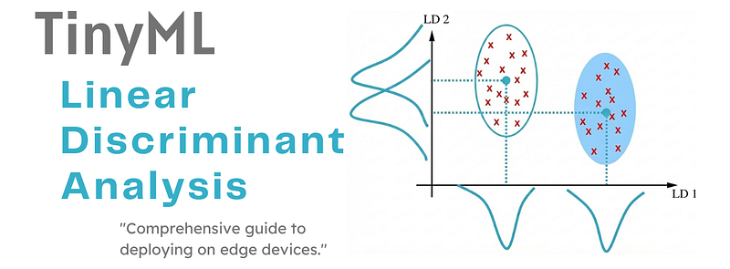
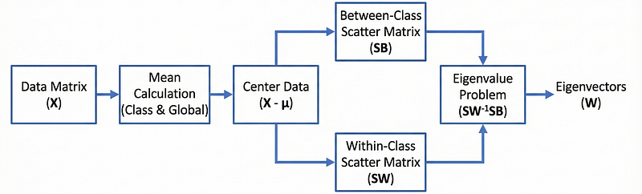
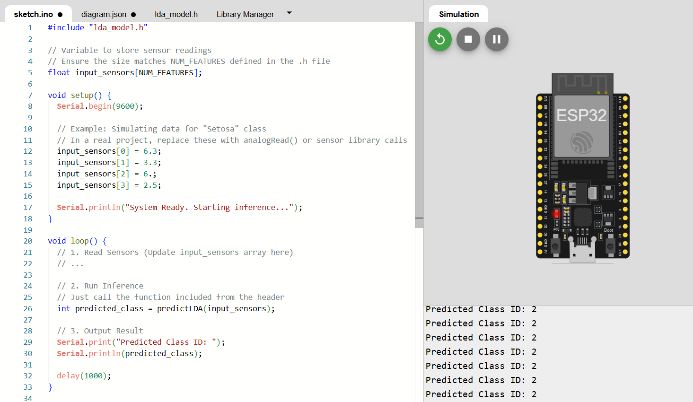

# TinyML - Linear Discriminant Analysis

_From mathematical foundations to edge implementation_

**Social media:**

👨🏽‍💻 Github: [thommaskevin/TinyML](https://github.com/thommaskevin/TinyML)

👷🏾 Linkedin: [Thommas Kevin](https://www.linkedin.com/in/thommas-kevin-ab9810166/)

📽 Youtube: [Thommas Kevin](https://www.youtube.com/channel/UC7uazGXaMIE6MNkHg4ll9oA)

:pencil2:CV Lattes CNPq: [Thommas Kevin Sales Flores](http://lattes.cnpq.br/0630479458408181)

👨🏻‍🏫 Research group: [Conecta.ai](https://conect2ai.dca.ufrn.br/)

## SUMMARY

1 — Introduction

2 — Mathematical Foundations

3 — TinyML Implementation

---

## 1 - Introduction

The exponential growth of data across various scientific and industrial domains has rendered the challenge of dimensionality reduction a cornerstone of modern machine learning and data mining. High-dimensional datasets, while rich in information, often suffer from the "curse of dimensionality," leading to increased computational complexity, memory consumption, and, critically, a degradation in the performance and interpretability of predictive models. Consequently, techniques designed to transform data from a higher-dimensional space to a more manageable, lower-dimensional subspace are indispensable tools in the data scientist's arsenal.

Dimensionality reduction methodologies are broadly categorized into two main approaches: unsupervised and supervised. Unsupervised techniques, such as Principal Component Analysis (PCA), Independent Component Analysis (ICA), and Non-negative Matrix Factorization (NMF), operate without utilizing the class labels of the data. Their primary goal is to capture the maximum variance within the data, making them highly effective for tasks like data visualization and noise removal.

In contrast, supervised dimensionality reduction methods, most notably the Linear Discriminant Analysis (LDA), leverage the class-specific information (labels) to guide the transformation process. LDA is not merely a data compression technique; it is fundamentally a method for enhancing class separability. Developed initially by Sir Ronald A. Fisher, the core objective of LDA is to find a projection that maximizes the ratio of the between-class variance to the within-class variance. By achieving this, LDA ensures that data points belonging to different classes are maximally separated, while data points within the same class remain tightly clustered. This makes LDA a powerful preprocessing step for classification and pattern recognition applications, particularly in fields such as biometrics and bioinformatics.

The overall process of LDA, from input data to the final eigenvectors that define the new subspace, can be visualized in the flow diagram below.

*Figure 1 - Visual comparison between two projection vectors.*

## 2 - Mathematical Foundations

To establish the mathematical framework, we define the input data matrix $X$ containing $N$ samples, where each sample $x_i$ is represented by $M$ features ($x_i \in \mathbb{R}^M$) 

The data is partitioned into $c$ distinct classes, denoted as $\omega_1 , \omega_2, ..., \omega_c$. The statistical characterization of the data relies on the calculation of mean vectors:

- Class Mean ($\mu_i$): The mean vector of the $i^{th}$ class is calculated as:$$\mu_i = \frac{1}{n_i} \sum_{x \in \omega_i} x$$where $n_i$ represents the number of samples in the $i^{th}$ class.

-  Total Mean ($\mu$): The global mean of all samples is defined as:$$\mu = \frac{1}{N} \sum_{i=1}^{N} x_i = \sum_{i=1}^{c} \frac{n_i}{N} \mu_i$$where $N$ is the total number of samples.

### 2.1 - Scatter Matrices

The core mechanism of LDA relies on two scatter matrices: the Between-Class Scatter Matrix ($S_B$) and the Within-Class Scatter Matrix ($S_W$). These matrices quantify the separability and compactness of the classes, respectively.

#### 2.1.1 - Between-Class Variance ($S_B$)

The between-class variance measures the separation between different classes. It is mathematically formulated as the scatter of individual class means ($\mu_i$) around the total mean ($\mu$). The matrix $S_B$ is calculated as:

$$S_B = \sum_{i=1}^{c} n_i (\mu_i - \mu)(\mu_i - \mu)^T$$

This calculation aggregates the separation distance for all classes.

#### 2.1.2 - Within-Class Variance ($S_W$)

The within-class variance measures the compactness of the data by calculating the scatter of samples around their respective class. For a specific class $j$, the scatter matrix $S_{W_j}$ is defined as:

$$S_{W_j} = \sum_{x \in \omega_j} (x - \mu_j)(x - \mu_j)^T$$

The total within-class scatter matrix $S_W$ is the summation of the scatter matrices of all classes:

$$S_W = \sum_{j=1}^{c} S_{W_j}$$

Minimizing this value ensures that samples within the same class are tightly clustered in the projected space.

The intuition behind maximizing between-class variance while minimizing within-class variance is best illustrated by comparing an optimal projection vector with a non-optimal one.

*Figure 2 - A visual comparison between an optimal projection vector (v1) and a non-optimal one (v2). Note how v1 maximizes the separation between the two classes, whereas v2 leads to significant overlap.*

### 2.2 - Fisher's Criterion and Optimization

The optimal projection in LDA is determined using Fisher's criterion. The goal is to find a transformation matrix $W$ that maximizes the ratio of the between-class variance to the within-class variance in the projected.

The objective function $J(W)$, often referred to as the Rayleigh quotient, is defined as:

$$J(W) = \frac{W^T S_B W}{W^T S_W W}$$

To maximize $J(W)$, one must differentiate the function with respect to $W$ and equate it to zero. This leads to the generalized eigenvalue problem:$$S_W^{-1} S_B W = \lambda W$$where $\lambda$ represents the eigenvalues and $W$ represents the eigenvectors.

#### 2.2.1 - Selecting Eigenvectors

The eigenvectors determine the directions of the new feature space, while the eigenvalues indicate the magnitude or robustness of these directions in discriminating between classes. To construct the optimal lower-dimensional space $V_k$, the eigenvectors are sorted in descending order based on their eigenvalues. The top $k$ eigenvectors are selected to form the transformation matrix, while the remaining vectors are discarded.

### 2.3 - Projection and Dimensionality Reduction

Once the transformation matrix $V_k$ containing the selected eigenvectors is established, the dimensionality of the original data matrix $X$ is reduced. The projection of the data onto the new subspace is performed via the linear transformation:

$$Y = X V_k$$

Here, $Y \in \mathbb{R}^{N \times k}$ represents the data in the lower-dimensional space.

### 2.4 - Algorithmic Variations

While the standard approach usually implies a class-independent calculation, LDA can be categorized into two primary methods based on how the subspaces are computed.

#### 2.4.1 - Class-Independent LDA

In this standard method, a single lower-dimensional space is calculated for all classes collectively. The transformation matrix uses the global $S_B$ and $S_W$ to project all samples onto the same set of eigenvectors.

#### 2.4.2 - Class-Dependent LDA

In the class-dependent approach, a separate lower-dimensional space is calculated for each class. A specific transformation matrix $W_i$ is derived for the $i^{th}$ class:

$$W_i = S_{W_i}^{-1} S_B$$

Samples of each class are then projected onto their corresponding unique eigenvectors. While this may offer specific advantages, it is computationally more expensive than the class-independent method.

## 4 - TinyML Implementation

With this example you can implement the machine learning algorithm in ESP32, Arduino, Arduino Portenta H7 with Vision Shield, Raspberry and other different microcontrollers or IoT devices.

### 4.1  -  Jupyter Notebooks

-   Linear Discriminant Analysis (LDA)

### 4.2  -  Arduino Code

-   Arduino LDA code

### 4.3  -  Results

