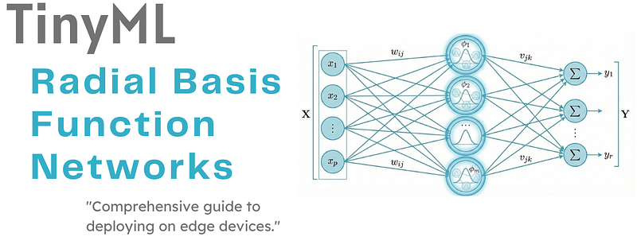
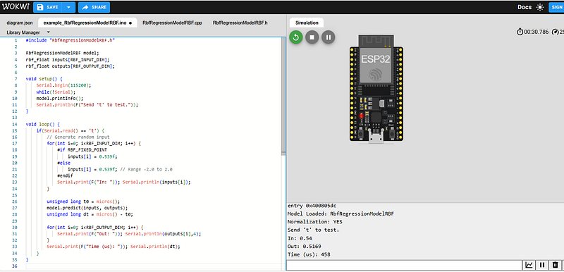
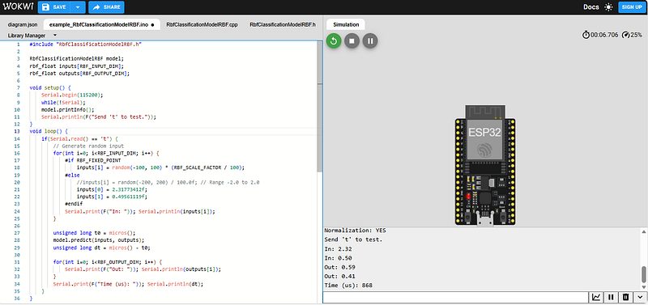

# TinyML - Radial Basis Function Networks

_From mathematical foundations to edge implementation_

**Social media:**

👨🏽‍💻 Github: [thommaskevin/TinyML](https://github.com/thommaskevin/TinyML)

👷🏾 Linkedin: [Thommas Kevin](https://www.linkedin.com/in/thommas-kevin-ab9810166/)

📽 Youtube: [Thommas Kevin](https://www.youtube.com/channel/UC7uazGXaMIE6MNkHg4ll9oA)

🧑‍🎓Scholar: [Thommas K. S. Flores](https://scholar.google.com/citations?user=MqWV8JIAAAAJ&hl=pt-PT&authuser=2)

:pencil2:CV Lattes CNPq: [Thommas Kevin Sales Flores](http://lattes.cnpq.br/0630479458408181)

👨🏻‍🏫 Research group: [Conecta.ai](https://conect2ai.dca.ufrn.br/)

## SUMMARY

1 — Introduction

2 — Learning Strategies

3 — Application I: Nonparametric Regression

4 — Application II: Pattern Classification

5 — TinyML Implementation

---

## 1  -  Introduction

This tutorial presents radial basis function (RBF) networks as a powerful alternative to multilayer perceptron architectures for function approximation and pattern classification. Unlike global approximation schemes employed by sigmoid-based networks, RBF networks exploit the principle of local approximation through the use of localized, nonlinear basis functions. We examine the three-layer architecture of RBF networks, where hidden units implement radial basis functions—typically Gaussian kernels—that respond maximally to inputs near their centers and decay rapidly with distance. The tutorial develops a comprehensive treatment of learning strategies, emphasizing the hybrid approach that decouples the determination of basis function parameters from output weight optimization. We explore two major application domains: nonparametric regression, where model selection techniques such as generalized cross-validation play a crucial role, and pattern classification, where RBF networks construct complex decision boundaries through the aggregation of local receptive fields. Throughout, we contrast the RBF approach with global approximation methods, highlighting the trade-offs between training efficiency, approximation capacity, and susceptibility to the curse of dimensionality.

### 1.1 - Architecture

The radial basis function network represents a distinct paradigm in neural network design, characterized by a three-layer feedforward topology that differs fundamentally from the multilayer perceptron in both structure and computational philosophy. The architecture consists of an input layer that merely distributes the input vector to the hidden layer, a hidden layer of nonlinear processing units, and an output layer that performs linear combination.

*Figure 1 - Architecture of a Radial Basis Function Network (RBFN), consisting of an input layer, a hidden layer with radial basis functions centered at 𝑐𝑗, and a linear output layer that performs a weighted combination of the activations.*

The input layer contains $m$ source nodes, one for each component of the $m$-dimensional input vector $\mathbf{x} = [x_1, x_2, \ldots, x_m]^T$. These nodes perform no computation but serve to broadcast the input signal to all units in the hidden layer.

The hidden layer, comprising $n_h$ computational units, implements the core transformation of the RBF network. Each hidden unit $j$ computes a radial basis function $\phi_j(\mathbf{x})$, which depends on the Euclidean distance between the input vector $\mathbf{x}$ and a center vector $\mathbf{c}_j \in \mathbb{R}^m$ associated with that unit. This transformation maps the input space into a higher-dimensional feature space, often with $n_h > m$, where linear separability or approximability may be more readily achieved. The critical characteristic of this mapping is its **locality**: each basis function responds most strongly to inputs in the neighborhood of its center and exhibits rapidly decreasing response as the input moves away from that center.

The output layer consists of $n_o$ linear units, each computing a weighted sum of the hidden layer outputs:

$$y_k(\mathbf{x}) = \sum_{j=1}^{n_h} w_{kj} \phi_j(\mathbf{x}) + b_k, \quad k = 1, 2, \ldots, n_o$$

where $w_{kj}$ represents the synaptic weight connecting hidden unit $j$ to output unit $k$, and $b_k$ is the bias term for output $k$. This linear combination constitutes the network's final output.

The architectural separation of nonlinear transformation (hidden layer) and linear combination (output layer) provides significant computational and theoretical advantages. Most notably, once the parameters of the basis functions are determined, the computation of optimal output weights reduces to solving a linear least-squares problem—a well-understood optimization task with guaranteed global optimum.

### 1.2 - The Neuron Model

The fundamental computational unit in the hidden layer implements a radial basis function, so named because its output depends solely on the radial distance from the input to the unit's center. Among various possible choices for the basis function, the **Gaussian function** has emerged as the most widely adopted due to its mathematical tractability, smoothness properties, and biological plausibility.

*Figure 2 - Gaussian radial basis function behavior. Panel (a) illustrates the activation of a Gaussian RBF as a function of the normalized distance from its center. Panel (b) shows the geometric interpretation in the input space, highlighting the localized receptive field controlled by the spread parameter σj​.*

For hidden unit $j$, the Gaussian radial basis function is defined as:

$$\phi_j(\mathbf{x}) = \exp\left(-\frac{\|\mathbf{x} - \mathbf{c}_j\|^2}{2\sigma_j^2}\right)$$

where the norm $\|\mathbf{x} - \mathbf{c}_j\|$ denotes the Euclidean distance:

$$\|\mathbf{x} - \mathbf{c}_j\| = \left[\sum_{i=1}^{m} (x_i - c_{ji})^2\right]^{1/2}$$

This formulation can be rewritten in terms of the normalized distance $n_j$:

$$n_j = \frac{\|\mathbf{x} - \mathbf{c}_j\|}{\sigma_j}$$

yielding the compact form:

$$\phi_j(\mathbf{x}) = \phi(n_j) = \exp(-n_j^2)$$

or equivalently, using the half-squared distance:

$$\phi(n) = \exp\left(-\frac{n^2}{2}\right)$$

where we have absorbed the factor of 2 into the definition of $\sigma_j$ for notational convenience.

The Gaussian RBF is parameterized by three quantities, each playing a distinct role in determining the unit's response characteristics:

**Center ($\mathbf{c}_j$)**: The $m$-dimensional vector $\mathbf{c}_j = [c_{j1}, c_{j2}, \ldots, c_{jm}]^T$ specifies the location in input space where the basis function achieves its maximum response. The function $\phi_j(\mathbf{x})$ attains its peak value of 1 when $\mathbf{x} = \mathbf{c}_j$ and decreases monotonically as the input moves away from this point. The placement of centers determines which regions of input space are "covered" by each hidden unit and fundamentally affects the network's approximation and generalization capabilities.

**Spread or Width ($\sigma_j$)**: The positive scalar $\sigma_j$ controls the rate of decay of the basis function away from its center. A small width produces a highly localized function that responds only to inputs very close to $\mathbf{c}_j$, while a large width yields a more gradual decay and broader receptive field. Mathematically, $\sigma_j$ represents the standard deviation of the Gaussian; the function decreases to $e^{-1/2} \approx 0.606$ of its peak value at distance $\sigma_j$ from the center. The choice of width directly impacts the smoothness of the overall approximation and the degree of overlap between neighboring basis functions.

**Bias ($b$)**: While the Gaussian basis functions themselves are centered and normalized, the output layer includes bias terms $b_k$ that shift the final linear combination. These biases are particularly important in classification tasks where decision thresholds must be adjusted, and in regression where the target function may have a non-zero offset. The biases can be absorbed into the weight vector by augmenting the basis function output vector with a constant unit term.

The response characteristics of the Gaussian RBF give rise to the concept of **receptive fields**. Each hidden unit possesses a localized receptive field centered at $\mathbf{c}_j$ with effective radius determined by $\sigma_j$. Inputs falling within this receptive field produce significant activation of the unit, while inputs far from the center contribute negligibly to the unit's output. This localized response stands in sharp contrast to the global influence exhibited by sigmoid activation functions in multilayer perceptrons.

### 1.3 - Local vs. Global Approximation

The distinction between local and global approximation constitutes one of the most fundamental differences between RBF networks and multilayer perceptrons (MLPs), with profound implications for network behavior, training dynamics, and applicability to various problem domains.

**Activation Function Characteristics**: Consider the activation functions employed by each architecture. The Gaussian radial basis function exhibits a pronounced peak at its center and decays rapidly—indeed, exponentially—to near zero as the input distance increases. For an input $\mathbf{x}$ far from center $\mathbf{c}_j$, the contribution of unit $j$ to the network output becomes negligible, regardless of the magnitude of the associated weight $w_{kj}$. This behavior exemplifies **local approximation**: each basis function influences the network output only for inputs within a bounded region of input space.

In contrast, the sigmoid activation function used in MLPs:

$$\sigma(v) = \frac{1}{1 + e^{-v}}$$

where $v = \mathbf{w}^T\mathbf{x} + b$, exhibits global response characteristics. For any finite input $\mathbf{x}$, the sigmoid produces a non-zero output. Moreover, the sigmoid's dependence on the inner product $\mathbf{w}^T\mathbf{x}$ means that adjusting the weight vector can cause the unit to respond to inputs anywhere in the space—a single hidden unit in an MLP influences the network output across the entire input domain.

**Approximation Mechanisms**: These differing activation characteristics lead to fundamentally different approximation strategies. An RBF network approximates a target function through **local interpolation**: the approximation in any region of input space depends primarily on the basis functions with centers near that region. Changing the weights associated with distant centers has minimal impact on the approximation quality locally. This locality property enables intuitive interpretation: one can understand the network's behavior by examining which basis functions are active in a given input region.

MLPs, by contrast, employ **distributed representation** and global approximation. The hidden units compute hyperplane projections (via the inner product), and the network constructs the approximation by combining sigmoidally "squashed" versions of these projections. The approximation at any point typically depends on all hidden units, and the network distributes the representation of the target function across all weights. This global nature makes MLPs more efficient in terms of parameters for smooth, globally structured functions but renders them less interpretable.

**Training Speed Implications**: The locality of RBF networks confers significant advantages for training efficiency. As detailed in Section 2, the typical hybrid learning approach decouples the problem into two stages: determining basis function parameters (centers and widths) and computing output weights. The second stage involves solving a linear system, which can be accomplished in one step using direct methods such as the pseudoinverse or normal equations. No iterative gradient descent is required for this phase.

Furthermore, the locality means that gradient-based methods, when used for the first stage, often converge more rapidly than in MLPs. Since each basis function affects only a local region, errors can be corrected locally without extensive propagation through the network. The error surface tends to be smoother and less prone to the plateau regions and poor local minima that plague MLP training.

MLPs, being global approximators, require careful adjustment of all weights to achieve the desired function. The backpropagation algorithm must propagate errors through multiple layers, and convergence can be slow, particularly for deep networks. The highly nonlinear error surface may contain numerous local minima, requiring careful initialization and learning rate selection.

**The Curse of Dimensionality**: Despite their advantages, RBF networks face a critical limitation that becomes severe in high-dimensional spaces: the **curse of dimensionality**. This phenomenon arises from the exponential growth in volume as dimensionality increases, coupled with the local nature of radial basis functions.

To maintain adequate coverage of an $m$-dimensional input space, the number of basis functions required grows exponentially with $m$. Consider a simple uniform grid placement strategy: if we place $k$ centers along each dimension to achieve a certain resolution, we require $k^m$ centers total. For $m = 2$ and $k = 10$, this yields 100 centers—manageable. For $m = 10$, we require $10^{10}$ centers—completely impractical.

Even with intelligent, data-driven placement strategies (such as clustering), the number of centers needed to achieve good approximation quality typically grows exponentially with dimension. This occurs because the volume of a hypersphere (the effective receptive field of a basis function) becomes an increasingly small fraction of the volume of a hypercube as dimension increases. In high dimensions, most of the volume resides in the corners of the hypercube, far from any sphere center. Consequently, enormous numbers of basis functions are needed to cover the space adequately.

MLPs, with their global approximation strategy, scale much more gracefully with dimension. A hidden unit in an MLP defines a hyperplane in input space, and hyperplanes extend across all dimensions. The number of hidden units required for a given approximation quality typically grows more slowly—often polynomially rather than exponentially—with input dimension.

**Practical Implications**: These considerations suggest natural domains of application for each architecture:

- **RBF networks** excel in low-to-moderate dimensional spaces (typically $m \leq 10$) where training speed is crucial, where interpretability is valued, or where the target function is known to have significant local structure. Applications include interpolation, time-series prediction with modest input dimensionality, and control problems with few state variables.

- **MLPs** are preferred for high-dimensional problems, where global structure dominates, or where the efficiency of representation (in terms of number of parameters) is paramount. Applications include image recognition, natural language processing, and other domains with hundreds or thousands of input features.

*Figure 3 - Comparison between local and global function approximation. Panel (a) illustrates the localized response of a Radial Basis Function (RBF) network, where only nearby centers contribute significantly to the output. Panel (b) shows the global approximation behavior of a Multilayer Perceptron (MLP), in which each hidden unit influences the entire input space.*

In practice, many modern architectures attempt to combine the advantages of both approaches, using multiple layers with different activation characteristics or employing localized connections in high-dimensional spaces.

## 2 - Learning Strategies

The training of RBF networks differs markedly from the end-to-end supervised learning typically employed for multilayer perceptrons. While it is possible to adjust all parameters—centers, widths, and output weights—simultaneously using gradient descent, the predominant approach exploits the network's unique structure to decompose learning into two distinct stages. This **hybrid learning strategy** combines unsupervised or self-organized methods for determining basis function parameters with supervised linear optimization for computing output weights.

*Figure 4 - Hybrid learning strategies for Radial Basis Function (RBF) networks. The figure presents (a) an overview of the hybrid learning paradigm combining nonlinear feature mapping and linear weight optimization, (b) Stage 1 methods for determining RBF centers and widths using fixed, unsupervised, or supervised strategies, (c) Stage 2 closed-form optimization of linear output weights, and (d) the effect of regularization on the bias–variance trade-off.*

The rationale for this decomposition is both computational and conceptual. Since the output layer is linear in the unknown weights, solving for these weights given fixed basis functions reduces to a standard linear regression problem with a closed-form solution. This eliminates the need for iterative optimization of a large portion of the parameters and guarantees a global optimum for the output weights. The challenge, then, is to select appropriate centers and widths that provide a suitable basis for approximating the target function.

### 2.1 Stage 1: Determining Centers and Widths

The first stage of RBF network training addresses the question: where should we place the centers of our basis functions, and how wide should they be? Several strategies have been developed, ranging from simple heuristics to sophisticated optimization algorithms.

#### Fixed and Random Selection

The simplest approach to center selection involves choosing centers without reference to the training data. Two basic methods fall into this category:

**Grid-based placement**: In low-dimensional spaces, centers can be arranged on a regular grid spanning the input domain. For an $m$-dimensional input space with domain $[a_i, b_i]$ along dimension $i$, we partition each dimension into $k$ intervals and place centers at the grid points. This yields $k^m$ centers uniformly distributed throughout the space. The width $\sigma_j$ is typically set to a constant value for all centers, often chosen as:

$$\sigma = \frac{d_{\max}}{\sqrt{2n_h}}$$

where $d_{\max}$ is the maximum distance between any two centers, and $n_h$ is the total number of centers. This choice ensures overlap between neighboring basis functions.

Grid-based placement guarantees uniform coverage but suffers from the curse of dimensionality—the required number of centers grows exponentially with input dimension. Moreover, it ignores the actual distribution of training data, potentially placing many centers in regions devoid of samples while inadequately covering regions of high data density.

**Random selection from training data**: A more data-aware approach selects a subset of the training inputs as centers. Given $N$ training samples $\{\mathbf{x}_1, \mathbf{x}_2, \ldots, \mathbf{x}_N\}$, we randomly choose $n_h < N$ of these to serve as centers: $\mathbf{c}_j = \mathbf{x}_{i_j}$ for randomly selected indices $i_j$. The widths can be set using the heuristic:

$$\sigma_j = \frac{1}{n_h} \sum_{k=1}^{n_h} \|\mathbf{c}_j - \mathbf{c}_k\|$$

which sets each width to the average distance to all other centers, or alternatively:

$$\sigma_j = \alpha \cdot \min_{k \neq j} \|\mathbf{c}_j - \mathbf{c}_k\|$$

where $\alpha > 0$ (typically $\alpha = 1$) scales the width based on the nearest-neighbor distance.

Random selection ensures that centers lie in regions where training data exists but provides no guarantee of optimal placement. Centers may cluster in some regions while leaving others sparsely covered, and outliers in the training data may be selected as centers, degrading performance.

#### Unsupervised Clustering

A more principled approach employs unsupervised learning algorithms to discover clusters in the training data, then positions centers at the cluster centroids. This strategy respects the data distribution, placing more centers in regions of high data density and fewer in sparse regions.

**K-Means Clustering**: The K-means algorithm partitions the $N$ training inputs into $K$ clusters by iteratively minimizing the within-cluster sum of squared distances. The algorithm proceeds as follows:

1. **Initialize** $K$ cluster centers $\{\mathbf{c}_1, \mathbf{c}_2, \ldots, \mathbf{c}_K\}$, typically by randomly selecting $K$ training samples.

2. **Assignment Step**: For each training sample $\mathbf{x}_i$, assign it to the nearest cluster:
   $$j^*(i) = \arg\min_{j=1,\ldots,K} \|\mathbf{x}_i - \mathbf{c}_j\|^2$$

3. **Update Step**: Recompute each cluster center as the mean of all samples assigned to that cluster:
   $$\mathbf{c}_j = \frac{1}{|C_j|} \sum_{\mathbf{x}_i \in C_j} \mathbf{x}_i$$
   where $C_j = \{i : j^*(i) = j\}$ is the set of indices assigned to cluster $j$, and $|C_j|$ denotes its cardinality.

4. **Iterate** steps 2 and 3 until convergence (cluster assignments no longer change) or a maximum number of iterations is reached.

The final cluster centers serve as the RBF centers. The width $\sigma_j$ for each center can be determined by the spread of data within its cluster:

$$\sigma_j = \sqrt{\frac{1}{|C_j|} \sum_{\mathbf{x}_i \in C_j} \|\mathbf{x}_i - \mathbf{c}_j\|^2}$$

This sets the width to the root-mean-square distance of cluster members from the center.

K-means clustering is computationally efficient, converging in relatively few iterations for most datasets. However, it has limitations: the number of clusters $K$ must be specified in advance, the algorithm can converge to local minima depending on initialization, and it assumes roughly spherical clusters of similar size.

**Self-Organizing Maps (Kohonen Learning)**: An alternative clustering approach employs the self-organizing map (SOM) or Kohonen network. Unlike K-means, which performs hard assignment of samples to clusters, the SOM maintains a topological structure among centers and uses a softer, neighborhood-based update rule.

In the context of RBF networks, we can use a simplified version of Kohonen learning:

1. **Initialize** centers $\{\mathbf{c}_1, \mathbf{c}_2, \ldots, \mathbf{c}_{n_h}\}$ randomly or using samples from the training data.

2. For each training sample $\mathbf{x}_i$ presented in random order:
   
   a. **Find the winner**: Identify the center closest to the input:
      $$j^* = \arg\min_{j=1,\ldots,n_h} \|\mathbf{x}_i - \mathbf{c}_j\|$$
   
   b. **Update the winner and neighbors**: Adjust the winning center and its neighbors toward the input:
      $$\mathbf{c}_j \leftarrow \mathbf{c}_j + \eta(t) h_{j^*j}(t) (\mathbf{x}_i - \mathbf{c}_j)$$
      where $\eta(t)$ is a learning rate that decreases over time, and $h_{j^*j}(t)$ is a neighborhood function (e.g., Gaussian) that decreases with the distance between centers $j$ and $j^*$ in the topological structure.

3. **Iterate** over the training data multiple times (epochs) while gradually decreasing $\eta(t)$ and the neighborhood radius.

The Kohonen approach can preserve topological relationships in the data and often produces more stable and well-distributed centers than K-means. However, it requires more careful tuning of the learning schedule and neighborhood parameters.

#### Orthogonal Least Squares (OLS)

While clustering methods position centers to reflect the input distribution, they do not explicitly account for the supervised learning objective—minimizing the approximation error on the training outputs. The **orthogonal least squares (OLS)** algorithm addresses this limitation by selecting centers from the training data in a greedy, supervised manner that maximizes the reduction in output error.

The OLS method is based on the observation that if the basis function outputs form an orthogonal set, the contribution of each basis function to reducing the squared error can be computed independently, facilitating optimal incremental selection of centers. The algorithm employs **Gram-Schmidt orthogonalization** to construct an orthogonal basis from the original (non-orthogonal) basis functions.

**Theoretical Foundation**: Consider the linear system for the output weights. With $N$ training samples and $n_h$ basis functions, we construct the **design matrix** (or **interpolation matrix**) $\mathbf{H} \in \mathbb{R}^{N \times n_h}$ whose $(i,j)$-th element is:

$$H_{ij} = \phi_j(\mathbf{x}_i) = \exp\left(-\frac{\|\mathbf{x}_i - \mathbf{c}_j\|^2}{2\sigma_j^2}\right)$$

The network output for sample $i$ is:

$$\hat{y}_i = \sum_{j=1}^{n_h} w_j \phi_j(\mathbf{x}_i) = \sum_{j=1}^{n_h} w_j H_{ij}$$

or in matrix form:

$$\hat{\mathbf{y}} = \mathbf{H}\mathbf{w}$$

The least-squares objective seeks weights minimizing:

$$E(\mathbf{w}) = \|\mathbf{y} - \mathbf{H}\mathbf{w}\|^2$$

where $\mathbf{y} = [y_1, y_2, \ldots, y_N]^T$ contains the target outputs.

Now suppose we construct an orthogonal matrix $\mathbf{Q} \in \mathbb{R}^{N \times n_h}$ such that $\mathbf{H} = \mathbf{Q}\mathbf{A}$, where $\mathbf{A} \in \mathbb{R}^{n_h \times n_h}$ is upper triangular and $\mathbf{Q}^T\mathbf{Q} = \mathbf{I}_{n_h}$ (i.e., the columns of $\mathbf{Q}$ are orthonormal). This is precisely the QR decomposition of $\mathbf{H}$.

The output can be written as:

$$\hat{\mathbf{y}} = \mathbf{Q}\mathbf{A}\mathbf{w} = \mathbf{Q}\mathbf{g}$$

where $\mathbf{g} = \mathbf{A}\mathbf{w}$ represents weights in the orthogonalized basis. Since $\mathbf{Q}^T\mathbf{Q} = \mathbf{I}$, the optimal $\mathbf{g}$ is:

$$\mathbf{g} = \mathbf{Q}^T\mathbf{y}$$

The error reduction due to including the $j$-th orthogonal basis function is:

$$\Delta E_j = g_j^2 \|\mathbf{q}_j\|^2 = g_j^2$$

where $\mathbf{q}_j$ is the $j$-th column of $\mathbf{Q}$ (already normalized). This quantity measures the contribution of the $j$-th orthogonalized basis function to reducing the total squared error.

**The OLS Algorithm**: The algorithm proceeds incrementally, selecting one center at a time:

1. **Initialize**: Set the candidate pool $\mathcal{P}$ to contain all $N$ training inputs as potential centers. Set the residual error $\mathbf{r} = \mathbf{y}$ and the set of selected centers $\mathcal{S} = \emptyset$.

2. **Iteration** $k = 1, 2, \ldots, n_h$:
   
   a. For each candidate center $\mathbf{c} \in \mathcal{P}$, compute the basis function outputs:
      $$\mathbf{h} = [\phi(\|\mathbf{x}_1 - \mathbf{c}\|), \phi(\|\mathbf{x}_2 - \mathbf{c}\|), \ldots, \phi(\|\mathbf{x}_N - \mathbf{c}\|)]^T$$
   
   b. Orthogonalize $\mathbf{h}$ with respect to the previously selected orthogonal basis vectors $\{\mathbf{q}_1, \ldots, \mathbf{q}_{k-1}\}$:
      $$\mathbf{q}_k' = \mathbf{h} - \sum_{j=1}^{k-1} \frac{\mathbf{q}_j^T \mathbf{h}}{\mathbf{q}_j^T \mathbf{q}_j} \mathbf{q}_j$$
      Normalize: 
      $$\mathbf{q}_k = \frac{\mathbf{q}_k'}{\|\mathbf{q}_k'\|}$$
   
   c. Compute the error reduction ratio:
      $$\text{ERR}_k = \frac{(\mathbf{q}_k^T \mathbf{y})^2}{\mathbf{y}^T \mathbf{y}}$$
   
   d. **Select the center** from $\mathcal{P}$ that maximizes $\text{ERR}_k$. Add this center to $\mathcal{S}$ and remove it from $\mathcal{P}$.

3. **Termination**: Stop when $n_h$ centers have been selected, or when the cumulative error reduction $\sum_{j=1}^{k} \text{ERR}_j$ exceeds a threshold (e.g., 0.99), or when $\text{ERR}_k$ falls below a tolerance.

4. **Compute weights**: Once centers are selected, solve the triangular system $\mathbf{A}\mathbf{w} = \mathbf{g}$ by back-substitution to obtain the original basis weights.

**Complexity and Practical Considerations**: The OLS algorithm has computational complexity $O(N^2 n_h^2 m)$ in the worst case, where the orthogonalization must be performed for all $N$ candidate centers at each of $n_h$ iterations. This can be expensive for large datasets. However, the algorithm typically requires far fewer centers than the number of training samples to achieve good approximation, and the greedy selection often identifies a highly effective subset rapidly.

The widths $\sigma_j$ can be set using the same heuristics as in random selection (e.g., based on nearest-neighbor distances among selected centers), or they can be optimized via cross-validation after center selection.

The OLS method represents a supervised alternative to unsupervised clustering, explicitly accounting for the target outputs in center selection. It often produces more compact networks with fewer centers while maintaining high approximation accuracy.

### 2.2 - Stage 2: Linear Weights Optimization

Once the centers $\{\mathbf{c}_1, \mathbf{c}_2, \ldots, \mathbf{c}_{n_h}\}$ and widths $\{\sigma_1, \sigma_2, \ldots, \sigma_{n_h}\}$ have been determined through one of the methods described above, the second stage of training computes the optimal output layer weights. This is a **linear regression problem** with a well-known closed-form solution.

#### The Normal Equation

Given $N$ training samples $\{(\mathbf{x}_i, y_i)\}_{i=1}^N$, we construct the design matrix $\mathbf{H} \in \mathbb{R}^{N \times (n_h+1)}$:

$$\mathbf{H} = \begin{bmatrix}
\phi_1(\mathbf{x}_1) & \phi_2(\mathbf{x}_1) & \cdots & \phi_{n_h}(\mathbf{x}_1) & 1 \\
\phi_1(\mathbf{x}_2) & \phi_2(\mathbf{x}_2) & \cdots & \phi_{n_h}(\mathbf{x}_2) & 1 \\
\vdots & \vdots & \ddots & \vdots & \vdots \\
\phi_1(\mathbf{x}_N) & \phi_2(\mathbf{x}_N) & \cdots & \phi_{n_h}(\mathbf{x}_N) & 1
\end{bmatrix}$$

The final column of ones accounts for the output bias term. The weight vector $\mathbf{w} = [w_1, w_2, \ldots, w_{n_h}, b]^T \in \mathbb{R}^{n_h+1}$ includes both the basis function weights and the bias.

The network outputs are:

$$\hat{\mathbf{y}} = \mathbf{H}\mathbf{w}$$

We seek the weight vector minimizing the sum of squared errors:

$$E(\mathbf{w}) = \|\mathbf{y} - \mathbf{H}\mathbf{w}\|^2 = (\mathbf{y} - \mathbf{H}\mathbf{w})^T(\mathbf{y} - \mathbf{H}\mathbf{w})$$

Expanding:

$$E(\mathbf{w}) = \mathbf{y}^T\mathbf{y} - 2\mathbf{y}^T\mathbf{H}\mathbf{w} + \mathbf{w}^T\mathbf{H}^T\mathbf{H}\mathbf{w}$$

Taking the gradient with respect to $\mathbf{w}$:

$$\frac{\partial E}{\partial \mathbf{w}} = -2\mathbf{H}^T\mathbf{y} + 2\mathbf{H}^T\mathbf{H}\mathbf{w}$$

Setting the gradient to zero yields the **normal equation**:

$$\mathbf{H}^T\mathbf{H}\mathbf{w} = \mathbf{H}^T\mathbf{y}$$

Provided that $\mathbf{H}^T\mathbf{H}$ is invertible, the unique solution is:

$$\boxed{\mathbf{w} = (\mathbf{H}^T\mathbf{H})^{-1}\mathbf{H}^T\mathbf{y}}$$

The matrix $\mathbf{H}^{\dagger} = (\mathbf{H}^T\mathbf{H})^{-1}\mathbf{H}^T$ is the **Moore-Penrose pseudoinverse** of $\mathbf{H}$, and the solution can be written compactly as:

$$\mathbf{w} = \mathbf{H}^{\dagger}\mathbf{y}$$

This solution minimizes the squared error and is unique when $\mathbf{H}$ has full column rank (i.e., $\text{rank}(\mathbf{H}) = n_h + 1$). The computation requires forming the Gram matrix $\mathbf{H}^T\mathbf{H}$ (an $(n_h+1) \times (n_h+1)$ matrix), inverting it, and multiplying by $\mathbf{H}^T\mathbf{y}$. Standard numerical linear algebra routines (e.g., Cholesky decomposition or QR decomposition) efficiently solve this system even for moderately large $n_h$.

#### Regularization (Ridge Regression)

In practice, the matrix $\mathbf{H}^T\mathbf{H}$ may be singular or ill-conditioned, leading to numerical instability or poor generalization. This situation arises when:

- The number of basis functions $n_h$ is large relative to the number of training samples $N$.
-  Centers are placed too closely, causing basis functions to be nearly identical (high correlation).
- The training data contains noise, causing small perturbations in $\mathbf{H}$ to produce large changes in $\mathbf{w}$.

In such cases, **regularization** improves both numerical stability and generalization performance. The most common form is **ridge regression** (also known as Tikhonov regularization or weight decay), which adds a penalty term proportional to the squared magnitude of the weights.

The regularized objective function is:

$$E_{\text{reg}}(\mathbf{w}) = \|\mathbf{y} - \mathbf{H}\mathbf{w}\|^2 + \lambda \|\mathbf{w}\|^2$$

where $\lambda > 0$ is the **regularization parameter** controlling the trade-off between fitting the training data and keeping weights small. The penalty term $\|\mathbf{w}\|^2 = \mathbf{w}^T\mathbf{w}$ discourages large weights, which typically correspond to overfitting.

Expanding the regularized objective:

$$E_{\text{reg}}(\mathbf{w}) = \mathbf{y}^T\mathbf{y} - 2\mathbf{y}^T\mathbf{H}\mathbf{w} + \mathbf{w}^T\mathbf{H}^T\mathbf{H}\mathbf{w} + \lambda \mathbf{w}^T\mathbf{w}$$

Taking the gradient:

$$\frac{\partial E_{\text{reg}}}{\partial \mathbf{w}} = -2\mathbf{H}^T\mathbf{y} + 2\mathbf{H}^T\mathbf{H}\mathbf{w} + 2\lambda\mathbf{w} = -2\mathbf{H}^T\mathbf{y} + 2(\mathbf{H}^T\mathbf{H} + \lambda\mathbf{I})\mathbf{w}$$

Setting the gradient to zero:

$$(\mathbf{H}^T\mathbf{H} + \lambda\mathbf{I})\mathbf{w} = \mathbf{H}^T\mathbf{y}$$

The **regularized solution** is:

$$\boxed{\mathbf{w} = (\mathbf{H}^T\mathbf{H} + \lambda\mathbf{I})^{-1}\mathbf{H}^T\mathbf{y}}$$

The regularization term $\lambda\mathbf{I}$ ensures that $\mathbf{H}^T\mathbf{H} + \lambda\mathbf{I}$ is positive definite and thus invertible, even when $\mathbf{H}^T\mathbf{H}$ is singular. Moreover, the condition number of the matrix improves, leading to more stable numerical computation.

**Effect of $\lambda$**: The regularization parameter controls model complexity:

- **$\lambda \to 0$**: The solution approaches the unregularized least-squares solution. The model fits the training data closely but may overfit, especially in the presence of noise or when $n_h$ is large.
  
- **$\lambda$ moderate**: Balances fitting accuracy and model smoothness. Weights are shrunk toward zero, reducing variance at the cost of some bias. Generalization typically improves.

- **$\lambda \to \infty$**: Weights are driven to zero, yielding a trivial solution $\mathbf{w} \approx \mathbf{0}$. The model underfits, producing a constant output close to the mean target value.

Selecting an appropriate $\lambda$ is crucial and is typically accomplished through cross-validation techniques, as discussed in Section 3.3.

**Interpretation in Function Space**: From a Bayesian perspective, ridge regression corresponds to placing a Gaussian prior on the weights with mean zero and variance $1/\lambda$. The regularized solution represents the maximum a posteriori (MAP) estimate. Alternatively, from a function space viewpoint, regularization penalizes functions with large curvature or high-frequency components, favoring smoother approximations—a desirable property for noisy data.

The two-stage hybrid learning approach, combining unsupervised or supervised center selection with regularized linear optimization of weights, provides a computationally efficient and theoretically sound framework for training RBF networks. The separation of concerns—determining the nonlinear feature mapping and then solving a linear problem—leverages the strengths of both classical clustering/optimization methods and modern regularization techniques.

## 3 - Application I: Nonparametric Regression

One of the primary applications of RBF networks is **nonparametric regression**, where the objective is to approximate an unknown function $f: \mathbb{R}^m \to \mathbb{R}$ from a finite set of noisy observations. Unlike parametric regression, which assumes a specific functional form (e.g., polynomial, exponential), nonparametric regression makes minimal assumptions about the underlying function, relying instead on the data to determine the approximation.

*Figure 5 - Schematic overview of Nonparametric Regression using Radial Basis Function (RBF) Networks. > The figure illustrates the complete modeling pipeline: (a) definition of the data-driven regression problem; (b) the RBF network architecture utilizing local Gaussian basis functions; (c) the bias-variance trade-off relative to model complexity; (d) the sensitivity of the fit to hyperparameters including the number of centers ($n_h$), width ($\sigma$), and regularization ($\lambda$); (e) the model selection process using Generalized Cross-Validation (GCV) and effective degrees of freedom; and (f) a case study comparing underfitted, overfitted, and optimal models on a sine wave dataset.*

### 3.1 - Problem Definition

Consider the regression problem where we observe $N$ training samples:

$$\{(\mathbf{x}_i, y_i)\}_{i=1}^N, \quad \mathbf{x}_i \in \mathbb{R}^m, \quad y_i \in \mathbb{R}$$

The observations are assumed to follow the model:

$$y_i = f(\mathbf{x}_i) + \epsilon_i$$

where $f(\mathbf{x})$ is the unknown deterministic function we wish to approximate, and $\epsilon_i$ represents random noise, typically assumed to be independent and identically distributed (i.i.d.) with zero mean and variance $\sigma^2$: $\epsilon_i \sim \mathcal{N}(0, \sigma^2)$.

The goal is to construct an **estimator** $\hat{f}(\mathbf{x})$ that approximates $f(\mathbf{x})$ well both on the training data and, more importantly, on unseen test data. The RBF network provides such an estimator in the form:

$$\hat{f}(\mathbf{x}) = \sum_{j=1}^{n_h} w_j \phi_j(\mathbf{x}) + b = \sum_{j=1}^{n_h} w_j \exp\left(-\frac{\|\mathbf{x} - \mathbf{c}_j\|^2}{2\sigma_j^2}\right) + b$$

The quality of this estimator depends critically on the choice of **model parameters**: the number of basis functions $n_h$, the locations and widths of the centers $\{\mathbf{c}_j, \sigma_j\}$, and the regularization parameter $\lambda$.

### 3.2 - Bias-Variance Trade-off

A fundamental concept in regression and machine learning is the **bias-variance decomposition** of the expected prediction error. For a given input $\mathbf{x}$, the expected squared error of the estimator $\hat{f}(\mathbf{x})$ (averaged over different training sets) can be decomposed as:

$$\mathbb{E}[(\hat{f}(\mathbf{x}) - f(\mathbf{x}))^2] = \text{Bias}^2[\hat{f}(\mathbf{x})] + \text{Var}[\hat{f}(\mathbf{x})] + \sigma^2$$

where:

- **Bias**: $\text{Bias}[\hat{f}(\mathbf{x})] = \mathbb{E}[\hat{f}(\mathbf{x})] - f(\mathbf{x})$ measures the systematic error of the estimator—how far the average prediction deviates from the true function.

- **Variance**: $\text{Var}[\hat{f}(\mathbf{x})] = \mathbb{E}[(\hat{f}(\mathbf{x}) - \mathbb{E}[\hat{f}(\mathbf{x})])^2]$ measures the variability of the estimator—how much predictions fluctuate across different training sets.

- **Irreducible Error**: $\sigma^2$ is the variance of the noise, representing the minimum achievable error.

For RBF networks, the bias-variance trade-off manifests through the model complexity:

**Number of Centers ($n_h$)**:

- **Small $n_h$** (simple model): The network has limited flexibility to fit complex functions. This leads to **high bias** (underfitting)—the model cannot capture the true function's structure. However, with few parameters to estimate, the **variance is low**—predictions are stable across different training sets.

- **Large $n_h$** (complex model): The network can fit highly intricate functions, reducing **bias** but increasing **variance**. With many parameters, the model becomes sensitive to the specific training samples, potentially fitting noise rather than the underlying function (**overfitting**).

**Regularization Parameter ($\lambda$)**:

- **Small $\lambda$**: Minimal regularization allows weights to grow large to fit training data closely. This reduces bias but increases variance.

- **Large $\lambda$**: Strong regularization shrinks weights toward zero, smoothing the approximation. This increases bias (the model is constrained) but decreases variance (predictions are more stable).

**Center Widths ($\sigma_j$)**:

- **Narrow widths**: Each basis function has a small receptive field, allowing the model to capture fine-grained local structure (low bias) but increasing sensitivity to data placement (high variance).

- **Wide widths**: Broad receptive fields produce smoother approximations with more overlap between basis functions, increasing bias but reducing variance.

The optimal model strikes a balance between bias and variance to minimize the total expected error. This balance depends on the true function's complexity, the noise level, and the amount of training data available.

### 3.3 - Model Selection

Selecting appropriate values for $n_h$, $\lambda$, and other hyperparameters is crucial for achieving good generalization. Two principal approaches for model selection in RBF regression are **cross-validation** and **model selection criteria** such as the Generalized Cross-Validation (GCV) score.

#### Leave-One-Out Cross-Validation (LOO-CV)

The leave-one-out method estimates the generalization error by training the model on $N-1$ samples and testing on the held-out sample, repeating this process for each of the $N$ samples. The LOO-CV error is:

$$\text{LOO} = \frac{1}{N} \sum_{i=1}^{N} (y_i - \hat{f}^{(-i)}(\mathbf{x}_i))^2$$

where $\hat{f}^{(-i)}(\mathbf{x}_i)$ denotes the prediction for $\mathbf{x}_i$ using a model trained on all samples except the $i$-th one.

While LOO-CV provides an almost unbiased estimate of the prediction error, it appears to require training $N$ separate models, which is computationally prohibitive for large datasets. However, for linear models (including RBF networks with fixed basis functions), there exists a remarkable shortcut.

Define the **hat matrix** (or influence matrix):

$$\mathbf{P} = \mathbf{H}(\mathbf{H}^T\mathbf{H} + \lambda\mathbf{I})^{-1}\mathbf{H}^T \in \mathbb{R}^{N \times N}$$

This matrix relates the predictions to the targets: $\hat{\mathbf{y}} = \mathbf{P}\mathbf{y}$. The LOO prediction error can be computed from a single model fit using:

$$\hat{f}^{(-i)}(\mathbf{x}_i) = \hat{f}(\mathbf{x}_i) - \frac{P_{ii}}{1 - P_{ii}}(y_i - \hat{f}(\mathbf{x}_i))$$

Thus:

$$y_i - \hat{f}^{(-i)}(\mathbf{x}_i) = \frac{y_i - \hat{f}(\mathbf{x}_i)}{1 - P_{ii}}$$

The LOO-CV error becomes:

$$\boxed{\text{LOO} = \frac{1}{N} \sum_{i=1}^{N} \left(\frac{y_i - \hat{f}(\mathbf{x}_i)}{1 - P_{ii}}\right)^2}$$

This formula allows efficient computation of the LOO error without retraining.

#### Generalized Cross-Validation (GCV)

The GCV criterion provides an approximation to LOO-CV that avoids computing the individual diagonal elements $P_{ii}$, replacing them with their average. The GCV score is defined as:

$$\boxed{\text{GCV}(\lambda) = \frac{N \sum_{i=1}^{N} (y_i - \hat{f}(\mathbf{x}_i))^2}{[N - \text{tr}(\mathbf{P})]^2} = \frac{N \cdot \text{RSS}(\lambda)}{[N - \nu(\lambda)]^2}}$$

where:

- $\text{RSS}(\lambda) = \|\mathbf{y} - \mathbf{H}\mathbf{w}\|^2$ is the residual sum of squares.
- $\nu(\lambda) = \text{tr}(\mathbf{P})$ is the **effective number of parameters**, representing the model's effective degrees of freedom.

The trace can be computed as:

$$\text{tr}(\mathbf{P}) = \text{tr}[\mathbf{H}(\mathbf{H}^T\mathbf{H} + \lambda\mathbf{I})^{-1}\mathbf{H}^T]$$

For the unregularized case ($\lambda = 0$), $\nu = n_h + 1$ (the number of weights). Regularization reduces the effective degrees of freedom, with $\nu \to 0$ as $\lambda \to \infty$.

The GCV criterion balances the training error (numerator) against model complexity (denominator). A model that fits the training data too closely (small RSS) but uses many effective parameters (large $\nu$) will have a large GCV score due to the squared denominator penalty. The optimal $\lambda$ minimizes $\text{GCV}(\lambda)$:

$$\lambda^* = \arg\min_{\lambda} \text{GCV}(\lambda)$$

The GCV approach is computationally efficient and has been shown to provide good estimates of the optimal regularization parameter in practice.

**Procedure for Model Selection**:

1. Choose a range of candidate values for the hyperparameters (e.g., $n_h \in \{5, 10, 20, 50\}$ and $\lambda \in \{10^{-5}, 10^{-4}, \ldots, 10^{-1}\}$).

2. For each combination $(n_h, \lambda)$:
   - Determine centers and widths using one of the methods from Section 2.1.
   - Compute the regularized weights via the normal equation.
   - Evaluate the GCV score or LOO-CV error.

3. Select the combination yielding the minimum GCV or LOO-CV error.

4. Optionally, perform a finer grid search around the selected values to refine the choice.

### 3.4 - Case Study: Sine Wave Approximation

To illustrate the principles of RBF regression, consider the problem of approximating the function:

$$f(x) = \sin(2\pi x), \quad x \in [0, 1]$$

from noisy observations. We generate $N = 50$ training samples by evaluating $f(x)$ at uniformly spaced points and adding Gaussian noise with standard deviation $\sigma = 0.1$:

$$y_i = \sin(2\pi x_i) + \epsilon_i, \quad \epsilon_i \sim \mathcal{N}(0, 0.1^2), \quad x_i = \frac{i}{N}, \quad i = 1, \ldots, N$$

**Experiment 1: Effect of Number of Centers**

We train RBF networks with $n_h \in \{3, 5, 10, 20\}$ centers placed uniformly across $[0, 1]$ with equal widths $\sigma = 0.1$. No regularization is applied ($\lambda = 0$).

- **$n_h = 3$**: The network produces a smooth but overly simplified approximation. The sinusoidal oscillation is captured only roughly, with significant underfitting. The bias is high, but the variance is low—the approximation is stable across different noise realizations.

- **$n_h = 5$**: The fit improves, capturing the general shape of the sine wave more accurately. Some local details are missing, indicating moderate bias.

- **$n_h = 10$**: The approximation closely follows the true function. The network captures both the overall trend and local variations. The balance between bias and variance is nearly optimal for this noise level.

- **$n_h = 20$**: The network fits the training data very closely, including the noise. Between data points, the approximation may exhibit spurious oscillations (Gibbs phenomenon). Overfitting is evident—low bias but high variance.

This experiment demonstrates the bias-variance trade-off: too few centers lead to underfitting, while too many lead to overfitting.

**Experiment 2: Effect of Center Widths**

Fixing $n_h = 10$ centers at uniform spacing, we vary the width parameter: $\sigma \in \{0.05, 0.1, 0.2, 0.4\}$.

- **$\sigma = 0.05$** (narrow): Each basis function has a very localized receptive field. The network produces a piecewise approximation with sharp transitions between the centers. The function value at a test point depends almost entirely on the nearest center. Overfitting is likely, as the model is highly sensitive to the specific placement of data.

- **$\sigma = 0.1$** (moderate): Neighboring basis functions overlap moderately. The approximation is smooth and captures the sinusoidal structure well. This width is near-optimal for the given center spacing.

- **$\sigma = 0.2$** (wide): Basis functions overlap significantly. The approximation becomes smoother but loses some ability to capture rapid variations in the function. Bias increases.

- **$\sigma = 0.4$** (very wide): The basis functions are so broad that they provide nearly global coverage. The network behaves almost like a low-order polynomial approximation, severely underfitting the sine wave.

A useful heuristic for choosing $\sigma$ is to set it proportional to the average spacing between centers. For uniformly spaced centers in one dimension with spacing $d$, a reasonable choice is $\sigma \approx d$ to $2d$, ensuring moderate overlap.

**Experiment 3: Effect of Regularization**

Using $n_h = 20$ centers (which previously caused overfitting), we apply ridge regression with varying $\lambda \in \{0, 10^{-4}, 10^{-3}, 10^{-2}, 0.1\}$.

- **$\lambda = 0$**: Overfitting observed, as in Experiment 1.

- **$\lambda = 10^{-4}$**: Slight regularization reduces the magnitude of weights associated with less important basis functions. Overfitting is mitigated without significant loss of approximation quality.

- **$\lambda = 10^{-3}$**: The approximation smooths further. The fit to the training data is less exact, but generalization improves—test error decreases.

- **$\lambda = 10^{-2}$**: Strong regularization severely constrains the weights. The approximation becomes overly smooth, losing the ability to follow the sine wave's curvature. Underfitting occurs.

- **$\lambda = 0.1$**: Extreme regularization drives weights nearly to zero. The network output is almost constant.

The optimal $\lambda$ balances fitting accuracy and smoothness. Using GCV, we find $\lambda^* \approx 10^{-3}$ minimizes the generalization error for this configuration.

**Conclusion from Case Study**: The sine wave approximation problem illustrates the interplay between the number of centers, their placement and widths, and the regularization parameter. Successful RBF regression requires careful tuning of these hyperparameters using model selection techniques such as GCV or LOO-CV. When properly configured, RBF networks provide accurate, smooth approximations even in the presence of noise, making them valuable tools for nonparametric regression.

## 4 - Application II: Pattern Classification

Beyond regression, RBF networks excel at **pattern classification**, where the objective is to assign input vectors to discrete classes. Classification can be viewed as learning a mapping from a continuous input space $\mathcal{X} \subseteq \mathbb{R}^m$ to a discrete output space $\mathcal{Y} = \{1, 2, \ldots, C\}$, where $C$ is the number of classes.

### 4.1 - Discrete Mapping

In classification, the network output represents class membership. Several encoding schemes are possible:

**Binary Classification ($C = 2$)**: A single output unit suffices. The network output $\hat{y}(\mathbf{x}) \in \mathbb{R}$ is thresholded to produce a class label:

$$\text{class}(\mathbf{x}) = \begin{cases}
1 & \text{if } \hat{y}(\mathbf{x}) \geq \theta \\
2 & \text{if } \hat{y}(\mathbf{x}) < \theta
\end{cases}$$

where $\theta$ is a decision threshold (often $\theta = 0$ or $0.5$). The targets for training are typically $y_i = +1$ for class 1 and $y_i = -1$ (or $0$) for class 2.

**Multi-class Classification ($C > 2$)**: The **one-hot encoding** (or 1-of-$C$ encoding) is standard. The network has $C$ output units, and the target for a sample from class $k$ is:

$$\mathbf{y}_i = [0, 0, \ldots, 1, \ldots, 0]^T$$

where the $k$-th component is 1 and all others are 0. The predicted class is:

$$\text{class}(\mathbf{x}) = \arg\max_{k=1,\ldots,C} \hat{y}_k(\mathbf{x})$$

Each output unit $k$ effectively learns a discriminant function for class $k$ versus all others.

**Probabilistic Interpretation**: If desired, the raw network outputs can be transformed into class probabilities using the **softmax function**:

$$p(k|\mathbf{x}) = \frac{e^{\hat{y}_k(\mathbf{x})}}{\sum_{j=1}^{C} e^{\hat{y}_j(\mathbf{x})}}$$

This ensures $\sum_{k=1}^{C} p(k|\mathbf{x}) = 1$ and $p(k|\mathbf{x}) \in [0,1]$. However, for many applications, the raw outputs and argmax classification suffice.

The training procedure follows the same two-stage approach as regression: determine centers and widths, then solve for output weights using the normal equation (or regularized version) with the multi-output formulation:

$$\mathbf{W} = (\mathbf{H}^T\mathbf{H} + \lambda\mathbf{I})^{-1}\mathbf{H}^T\mathbf{Y}$$

where $\mathbf{W} \in \mathbb{R}^{(n_h+1) \times C}$ contains the weights for all output units, and $\mathbf{Y} \in \mathbb{R}^{N \times C}$ is the target matrix with one-hot encoded rows.

### 4.2 - The XOR Problem

The **XOR (exclusive OR) problem** is a classic benchmark for demonstrating the limitations of linear classifiers and the power of nonlinear methods. The problem involves four two-dimensional input patterns and two classes:

$$\begin{aligned}
\text{Class 1:} \quad & \mathbf{x}_1 = [0, 0]^T, \quad \mathbf{x}_2 = [1, 1]^T \\
\text{Class 2:} \quad & \mathbf{x}_3 = [0, 1]^T, \quad \mathbf{x}_4 = [1, 0]^T
\end{aligned}$$

The classes are **not linearly separable**: no straight line in the $(x_1, x_2)$ plane can separate the two classes. A single-layer perceptron cannot solve this problem.

**RBF Network Solution**: We design an RBF network with two input units, two hidden units (one per class cluster), and one output unit. The centers are placed at:

$$\mathbf{c}_1 = [0, 0]^T, \quad \mathbf{c}_2 = [1, 1]^T$$

corresponding to the Class 1 exemplars. The widths are set to $\sigma_1 = \sigma_2 = 1$ to provide moderate coverage.

The hidden layer outputs for each input pattern are:

For $\mathbf{x}_1 = [0, 0]^T$:
$$\phi_1(\mathbf{x}_1) = \exp\left(-\frac{\|[0,0] - [0,0]\|^2}{2 \cdot 1^2}\right) = e^{0} = 1$$
$$\phi_2(\mathbf{x}_1) = \exp\left(-\frac{\|[0,0] - [1,1]\|^2}{2}\right) = e^{-1} \approx 0.368$$

For $\mathbf{x}_2 = [1, 1]^T$:
$$\phi_1(\mathbf{x}_2) = e^{-1} \approx 0.368, \quad \phi_2(\mathbf{x}_2) = 1$$

For $\mathbf{x}_3 = [0, 1]^T$:
$$\phi_1(\mathbf{x}_3) = \exp\left(-\frac{1^2}{2}\right) = e^{-0.5} \approx 0.606$$
$$\phi_2(\mathbf{x}_3) = \exp\left(-\frac{1^2}{2}\right) = e^{-0.5} \approx 0.606$$

For $\mathbf{x}_4 = [1, 0]^T$:
$$\phi_1(\mathbf{x}_4) \approx 0.606, \quad \phi_2(\mathbf{x}_4) \approx 0.606$$

The design matrix (including bias) is:

$$\mathbf{H} = \begin{bmatrix}
1 & 0.368 & 1 \\
0.368 & 1 & 1 \\
0.606 & 0.606 & 1 \\
0.606 & 0.606 & 1
\end{bmatrix}$$

The target vector (using $+1$ for Class 1, $-1$ for Class 2) is:

$$\mathbf{y} = [+1, +1, -1, -1]^T$$

Solving the normal equation $\mathbf{w} = (\mathbf{H}^T\mathbf{H})^{-1}\mathbf{H}^T\mathbf{y}$ yields (approximately):

$$\mathbf{w} \approx [1.26, 1.26, -2.52]^T$$

The network output is:

$$\hat{y}(\mathbf{x}) = 1.26 \phi_1(\mathbf{x}) + 1.26 \phi_2(\mathbf{x}) - 2.52$$

Evaluating at the training points:

$$\hat{y}(\mathbf{x}_1) = 1.26 \cdot 1 + 1.26 \cdot 0.368 - 2.52 \approx 0.20 > 0 \quad (\text{Class 1})$$
$$\hat{y}(\mathbf{x}_2) = 1.26 \cdot 0.368 + 1.26 \cdot 1 - 2.52 \approx 0.20 > 0 \quad (\text{Class 1})$$
$$\hat{y}(\mathbf{x}_3) = 1.26 \cdot 0.606 + 1.26 \cdot 0.606 - 2.52 \approx -1.00 < 0 \quad (\text{Class 2})$$
$$\hat{y}(\mathbf{x}_4) \approx -1.00 < 0 \quad (\text{Class 2})$$

All patterns are classified correctly using the threshold $\theta = 0$.

**Analysis**: The RBF network solves XOR by mapping the input space into a higher-dimensional feature space (the space of basis function activations) where the classes become linearly separable. The hidden layer performs a nonlinear transformation:

$$\mathbf{x} \in \mathbb{R}^2 \quad \xrightarrow{\text{RBF layer}} \quad [\phi_1(\mathbf{x}), \phi_2(\mathbf{x})] \in \mathbb{R}^2$$

In this transformed space, the Class 1 patterns map near $[1, 0.368]$ and $[0.368, 1]$, while Class 2 patterns map near $[0.606, 0.606]$. A linear separator (the output layer) can now distinguish the classes.

This example illustrates the **universal approximation** capability of RBF networks: by choosing appropriate centers and widths, an RBF network with a sufficient number of hidden units can approximate any continuous function or decision boundary to arbitrary accuracy.

### 4.3 - Decision Boundaries

The geometry of decision boundaries reveals the fundamental difference between RBF networks and linear classifiers such as perceptrons.

**Perceptron Decision Boundaries**: A single-layer perceptron with weights $\mathbf{w}$ and bias $b$ computes:

$$\hat{y}(\mathbf{x}) = \sigma(\mathbf{w}^T\mathbf{x} + b)$$

The decision boundary is the hyperplane defined by $\mathbf{w}^T\mathbf{x} + b = 0$. This hyperplane divides the input space into two half-spaces, one for each class. Linear classifiers can only produce decision boundaries that are hyperplanes—they cannot solve problems like XOR where classes are non-linearly separable.

**RBF Network Decision Boundaries**: In contrast, an RBF network's decision boundary is defined by:

$$\sum_{j=1}^{n_h} w_j \phi_j(\mathbf{x}) + b = \theta$$

This equation describes a **nonlinear surface** in the input space. The shape of the boundary depends on the locations and widths of the basis functions, as well as the weights.

For binary classification with Gaussian basis functions, the decision regions have characteristic properties:

1. **Local influence**: Each basis function creates a "bump" or "well" in the discriminant function centered at $\mathbf{c}_j$. Inputs near a center with positive weight $w_j > 0$ receive a boost toward one class, while inputs near a center with negative weight $w_j < 0$ are pushed toward the other class.

2. **Circular/Elliptical regions**: A single Gaussian basis function with isotropic width produces circular decision regions in two dimensions (or hyperspherical in higher dimensions). If different widths are used along different dimensions (anisotropic Gaussians), the regions become elliptical.

3. **Complex boundaries through aggregation**: By combining multiple basis functions with varying weights, the network can create highly complex, non-convex decision boundaries. For instance, a "donut-shaped" region can be formed by placing a negative-weight center inside a positive-weight center with a larger width.

**Comparison with MLPs**: While both RBF networks and MLPs can create complex nonlinear boundaries, their mechanisms differ:

- **MLPs**: Each hidden unit defines a hyperplane (via the sigmoid's transition region). The decision boundary emerges from the intersection and union of multiple half-spaces, producing piecewise-linear or smoothly curved regions depending on the activation function.

- **RBF Networks**: Each hidden unit defines a localized "influence zone." The decision boundary emerges from the weighted sum of these local contributions, producing boundaries that naturally respect the clustering structure of the data

*Figure 6 - Framework for Pattern Classification using Radial Basis Function (RBF) Networks. This schematic details the classification capabilities of RBF networks: (a) formulation of the classification problem for binary and multi-class (one-hot encoded) outputs; (b) the network architecture featuring localized feature extraction and a softmax-normalized output layer; (c–d) illustration of the classic XOR problem, demonstrating how RBFs map non-linearly separable data into a higher-dimensional feature space where linear separation is possible; (f) comparison of decision boundaries, highlighting the RBF network's ability to form complex, non-convex regions compared to the limited hyperplane of a linear perceptron; and (g) geometric interpretation of decision regions formed by aggregating local Gaussian fields.*

## 5 - TinyML Implementation

With this example you can implement the machine learning algorithm in ESP32, Arduino, Arduino Portenta H7 with Vision Shield, Raspberry and other different microcontrollers or IoT devices.

### 5.1  -  Python Codes

-   Radial Basis Function Networks (RBFN)

-   Microcontroller Code Generator

### 5.2  -  Jupyter Notebooks

-   Radial Basis Function Networks Training

### 5.3  -  Arduino Code

-   Regression

-   Classification

### 5.4  -  Result Regression

### 5.5  -  Result Classification

