# TinyML - Graph Convolutional Networks

_From mathematical foundations to edge implementation_

**Social media:**

👨🏽‍💻 Github: [thommaskevin/TinyML](https://github.com/thommaskevin/TinyML)

👷🏾 Linkedin: [Thommas Kevin](https://www.linkedin.com/in/thommas-kevin-ab9810166/)

📽 Youtube: [Thommas Kevin](https://www.youtube.com/channel/UC7uazGXaMIE6MNkHg4ll9oA)

🧑‍🎓Scholar: [Thommas K. S. Flores](https://scholar.google.com/citations?user=MqWV8JIAAAAJ&hl=pt-PT&authuser=2)

:pencil2:CV Lattes CNPq: [Thommas Kevin Sales Flores](http://lattes.cnpq.br/0630479458408181)

👨🏻‍🏫 Research group: [Conecta.ai](https://conect2ai.dca.ufrn.br/)

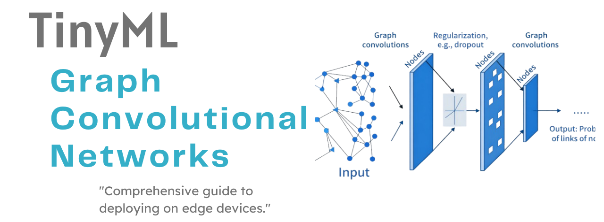

## SUMMARY

1 — Introduction

2 — Learning Strategies

3 — Application I: Nonparametric Regression

4 — Application II: Pattern Classification

5 — TinyML Implementation

---

## 1  -  Introduction

Graphs are ubiquitous mathematical structures used to model relationships between entities. They appear in a wide range of domains, from social networks and recommendation systems to biology and chemistry. Despite their expressive power, graphs pose a significant challenge for traditional machine learning methods, which typically assume that inputs can be represented as fixed-size tensors.

The difficulty lies in the fact that graphs do not have a natural ordering of nodes or edges. Any permutation of their elements represents the same underlying structure, yet many standard learning algorithms are sensitive to the order of their inputs. As a result, models operating on graphs must be designed to handle this permutation invariance while still capturing meaningful structural information.

In this post, we explore Graph Convolutional Networks (GCNs). GCNs are a class of neural networks specifically designed to operate directly on graph-structured data, leveraging both node features and graph connectivity.

As their name suggests, Graph Convolutional Networks can be viewed as a generalization of traditional convolutional neural networks to graphs. While CNNs apply convolution-like operations (more precisely, cross-correlations) to exploit local spatial patterns in images, GCNs perform analogous operations by aggregating information from a node's neighborhood. This process allows the model to learn representations that are informed by both local structure and node attributes.

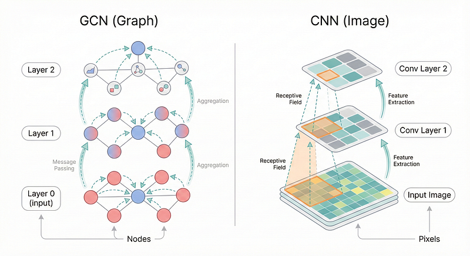
*Figure 1 - Analogy between CNNs and GCNs: convolutions in images operate over pixels and receptive fields, whereas graph convolutions propagate and aggregate messages across connected nodes.*

To move from this high-level intuition to a concrete understanding of how GCNs work, we now turn to their mathematical formulation. In the next section, we introduce the formal graph notation and derive the graph convolution operation step by step, highlighting how local neighborhood aggregation naturally 
emerges from the underlying algebra.

## 2  -  Mathematical Foundations

This section presents the mathematical foundations of Graph Convolutional Networks. We introduce the core concepts and notation required to describe how data is represented on graphs and how information propagates through graph convolutional layers. The discussion begins with the formal definition of node features and graph structure, followed by a step by step derivation of the GCN layer.

Special attention is given to the normalization of the adjacency matrix, as it is essential for stable training and for balancing the influence of nodes with different degrees. The section concludes with a comparison between Graph Convolutional Networks and Convolutional Neural Networks, highlighting how the notion of convolution extends from regular grid structured data to irregular graph domains.

### 2.1  -  Data Flow in Graph Convolutional Networks

A Graph Convolutional Network (GCN) processes data that is naturally represented as a graph
$$
G = (V, E),
$$
where $V$ is the set of nodes and $E$ describes how these nodes are connected. Each node $v_i \in V$ is initially associated with a feature vector
$$
\mathbf{x}_i \in \mathbb{R}^{F},
$$
which encodes node-specific information such as attributes, measurements, or embeddings. Collecting all node features yields the input matrix
$$
\mathbf{X} \in \mathbb{R}^{N \times F},
$$
with $N = |V|$. The graph structure itself is captured by the adjacency matrix
$$
\mathbf{A} \in \mathbb{R}^{N \times N},
$$
which determines how information can propagate between nodes.

This input setup, consisting of node features together with graph connectivity, is illustrated in **Figure 2**, where each node carries an initial representation and edges define possible information flow.

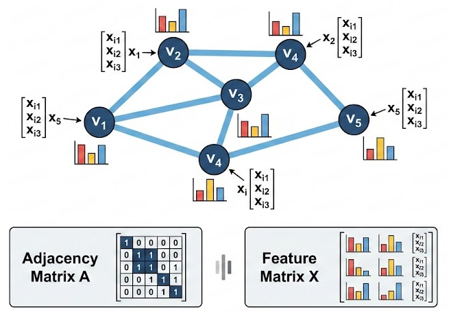
*Figure 2 -  Input structure for Graph Neural Networks. The diagram illustrates a graph $G=(V,E)$ where each node $v_i$ acts as a container for information, carrying a feature vector $\mathbf{x}_i$ (represented by the bar charts). The GCN architecture processes both the connection topology and this unstructured node data simultaneously.*

#### 2.1.1 - Feature propagation through graph layers

A GCN is composed of a sequence of graph convolution layers. At each layer, node representations are updated by exchanging information with neighboring nodes. Let:
$$
\mathbf{H}^{(l)} \in \mathbb{R}^{N \times F_l}
$$
denote the matrix of node representations at layer $l$, with the initial condition
$$
\mathbf{H}^{(0)} = \mathbf{X}.
$$

A single layer update can be written as
$$
\mathbf{H}^{(l+1)} = \phi\left( \mathbf{S}\,\mathbf{H}^{(l)}\mathbf{W}^{(l)} \right),
$$
where $\mathbf{S}$ is a structure-dependent propagation operator, $\mathbf{W}^{(l)}$ is a learnable weight matrix, and $\phi(\cdot)$ is a nonlinear activation function.

Conceptually, this operation allows each node to refine its representation by mixing its own features with those of nearby nodes. As shown in **Figure 3**, stacking multiple layers increases the range over which information is shared, enabling nodes to capture broader graph context.

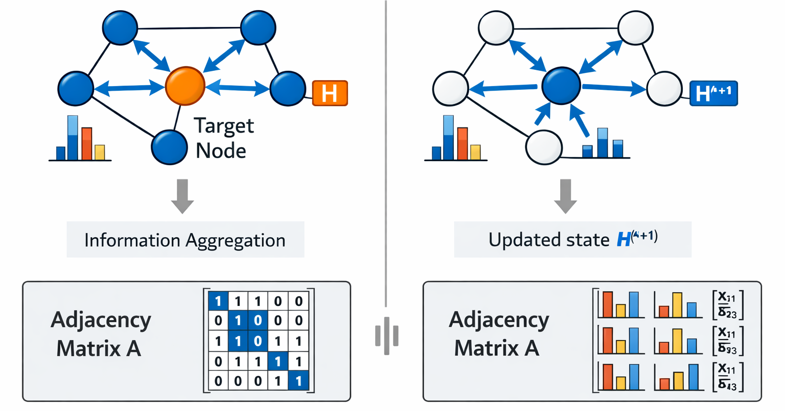
*Figure 3 -  Illustration of the Graph Convolution process (Message Passing). To update the representation of a target node (center), the network aggregates features from its immediate neighbors. The result is a new state vector $\mathbf{H}^{(l+1)}$ that fuses the node's local information with the structure of its neighborhood.*

#### 2.1.2 - Node-level outputs

After the final layer, each node is associated with a learned representation
$$
\mathbf{h}_i^{(L)} \in \mathbb{R}^{F_L}.
$$

For **node-level tasks**, these representations are used directly to produce predictions. A common formulation applies a linear transformation followed by a softmax:
$$
\mathbf{Z} = \text{softmax}\left( \mathbf{H}^{(L)} \mathbf{W}_{\text{out}} \right).
$$

Each row of $\mathbf{Z}$ corresponds to the output for a single node, such as a class probability vector. This setup is visually depicted in **Figure 4**, where each node produces its own output after information has propagated through the graph.

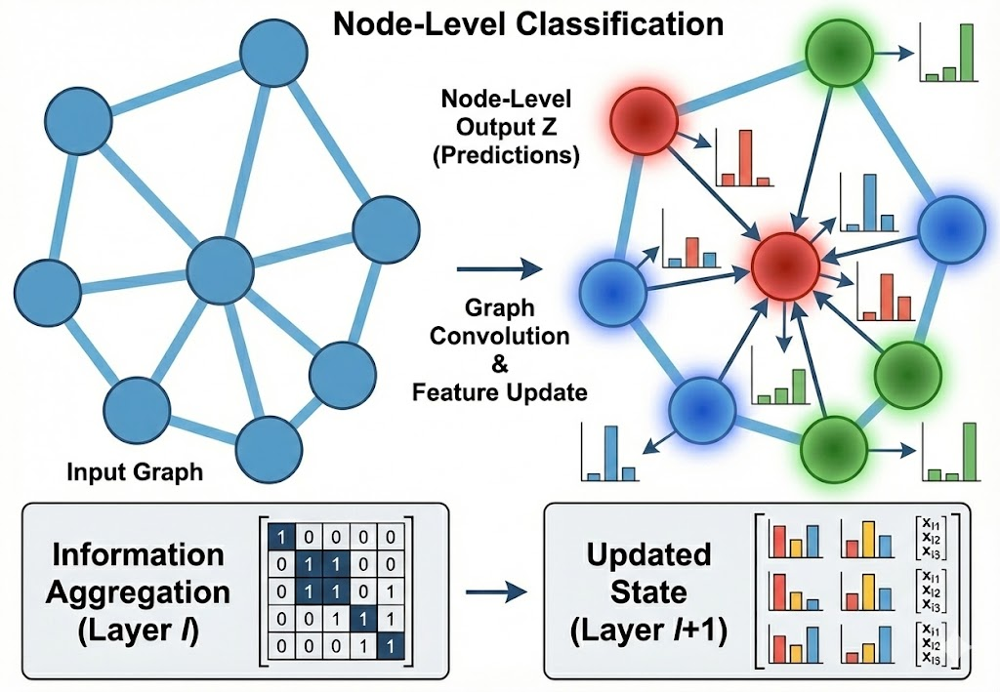
*Figure 4 - Node-Level Classification. In this scenario, the architecture maintains the graph structure throughout the layers. At the output stage, each node emits its own class prediction (indicated by distinct colors and probability bars), which is essential for tasks such as community detection or semantic segmentation.*

#### 2.1.3 - Graph-level outputs

In some applications, the goal is to predict a property of the entire graph rather than individual nodes. In this case, the node-level representations are first combined into a single vector:
$$
\mathbf{h}_G = \text{AGG}\left( \mathbf{h}_1^{(L)}, \dots, \mathbf{h}_N^{(L)} \right),
$$
where AGG denotes an aggregation operation such as summation, averaging, or maximization. The resulting graph representation $\mathbf{h}_G$ is then passed to a downstream model:
$$
\mathbf{y} = g(\mathbf{h}_G),
$$
producing one output per graph. This workflow is illustrated in **Figure 5**, where node representations are pooled to form a global summary.

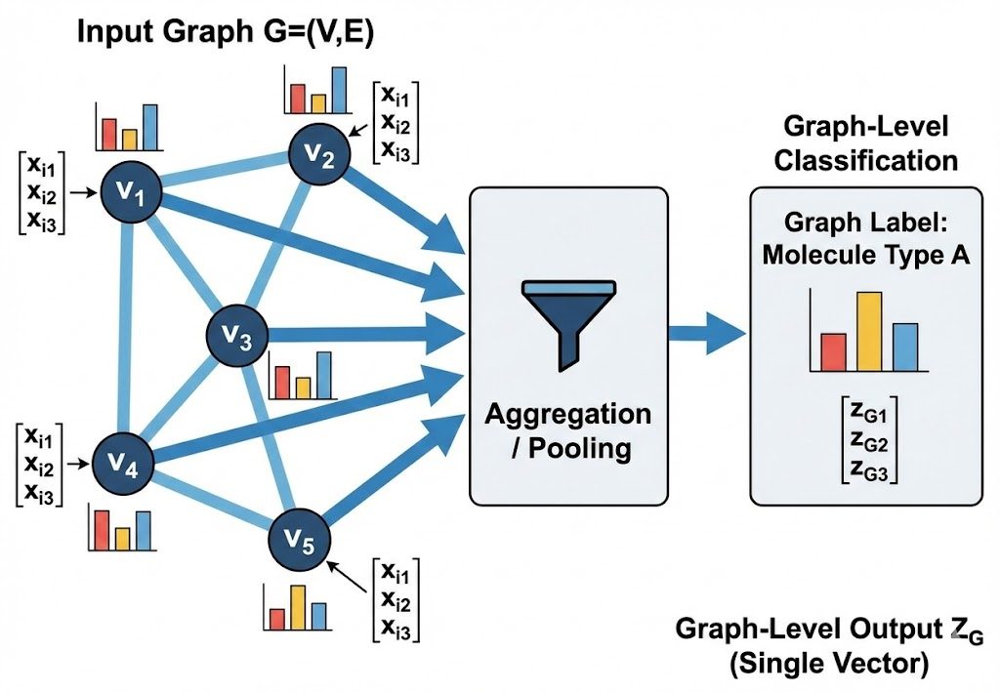
*Figure 5 - Graph-Level Classification. Unlike node classification, the representations of all vertices here converge through a global aggregation function (Pooling). This forms a single output vector that characterizes the entire graph, used for tasks such as molecular property prediction or social network classification.*

### 2.2  -  The Graph Convolutional Layer

GCNs are composed of stacked **graph convolutional layers**, much like traditional CNNs are built from convolutional layers. Each graph convolutional layer takes as input the feature vectors of all nodes from the previous layer (for the first layer, these are the raw input features) and produces updated feature vectors for each node. To do this, the layer aggregates information from each node’s neighbors – a process called **message passing**.

#### 2.2.1 - Message Passing in a Single Layer

Consider a node **A** with its feature vector $\mathbf{x}_A$. In a graph convolutional layer, node A’s new representation $\mathbf{h}_A$ is computed by:

1. **Aggregating** (pooling) the vectors of its neighbors (including itself) – in the example, $\mathbf{x}_B$ and $\mathbf{x}_C$.
2. **Transforming** the aggregated result through a learnable weight matrix and an activation function.

This procedure is repeated for every node. The figure below illustrates the idea for node A:

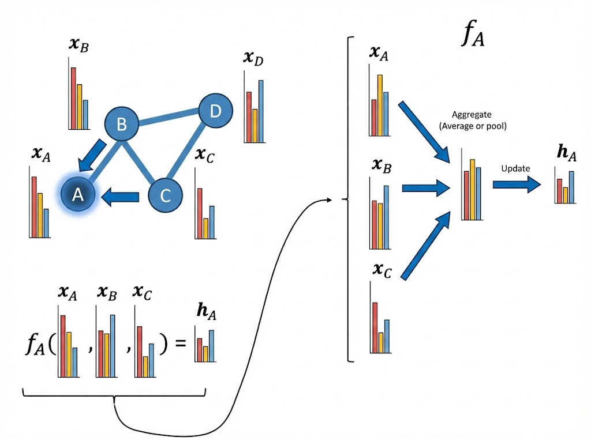
*Figure 6 - Message passing at node A. The vectors of its neighbors $\mathbf{x}_B$ and $\mathbf{x}_C$ are aggregated with $\mathbf{x}_A$ to produce $\mathbf{h}_A$.*

Exactly the same operation is applied to node D, which aggregates its own vector $\mathbf{x}_D$ with that of its sole neighbor $\mathbf{x}_B$:

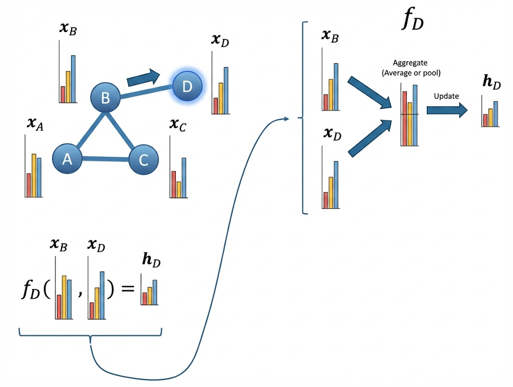
*Figure 7 - Message passing at node D.* 

Because each node “passes” its vector to its neighbours, this mechanism is known as **message passing**.

#### 2.2.2 - The Mathematics Behind the Layer

Let’s formalise the graph convolutional layer. We have:

- $\mathbf{X} \in \mathbb{R}^{n \times d}$: a matrix where row $i$ is the feature vector of node $i$ ($n$ = number of nodes, $d$ = number of features).
- $\mathbf{A} \in \mathbb{R}^{n \times n}$: the adjacency matrix of the graph.

A graph convolutional layer is a function that takes $\mathbf{X}$ and $\mathbf{A}$ and outputs updated node vectors:

$$
f(\mathbf{X},\mathbf{A}) = \sigma\left( \mathbf{D}^{-1/2}(\mathbf{A} + \mathbf{I})\mathbf{D}^{-1/2} \;\mathbf{X}\;\mathbf{W} \right)
$$

where  

$$
\begin{aligned}
\mathbf{I} &\in \mathbb{R}^{n\times n} \text{ is the identity matrix}, \\
\mathbf{D} &\in \mathbb{R}^{n\times n} \text{ is the degree matrix of } \mathbf{A} + \mathbf{I},\\
\mathbf{W} &\in \mathbb{R}^{d\times w} \text{ is the layer's learnable weight matrix},\\
\sigma(\cdot) &\text{ is an activation function (e.g., ReLU)}.
\end{aligned}
$$

At first glance this equation looks intimidating. Let’s break it down piece by piece.

#### 2.2.3 - Adding self‑loops: $\mathbf{A} + \mathbf{I}$

Adding the identity matrix to $\mathbf{A}$ places a `1` on every diagonal entry. This is equivalent to adding a **self‑loop** to each node – an edge that points from the node to itself. Why? Because when we aggregate neighbours, each node should also include its own feature vector in the sum. The self‑loop guarantees that.

#### 2.2.4 - The degree matrix $\mathbf{D}$

$\mathbf{D}$ is a diagonal matrix where $\mathbf{D}_{ii}$ equals the number of neighbours of node $i$ **including itself** (i.e., the degree of node $i$ in the graph with self‑loops). So if node $i$ is connected to nodes $j_1, j_2, \dots$, then $\mathbf{D}_{ii} = \deg(i)+1$.

#### 2.2.5 - Normalising the adjacency matrix

We multiply the self‑looped adjacency matrix on the left and right by $\mathbf{D}^{-1/2}$, where $\mathbf{D}^{-1/2}$ is a diagonal matrix with entries $1/\sqrt{\mathbf{D}_{ii}}$. This operation **normalises** the adjacency matrix. Let’s denote the result as $\tilde{\mathbf{A}}$:

$$
\tilde{\mathbf{A}} = \mathbf{D}^{-1/2}(\mathbf{A} + \mathbf{I})\mathbf{D}^{-1/2}.
$$

Then each entry becomes

$$
\tilde{\mathbf{A}}_{ij} = 
\begin{cases}
\frac{1}{\sqrt{\mathbf{D}_{ii}\,\mathbf{D}_{jj}}}, & \text{if there is an edge between } i \text{ and } j \text{ (including } i=j\text{)},\\[6pt]
0, & \text{otherwise}.
\end{cases}
$$

We will discuss *why* this normalisation is helpful in the next section. For now, note that $\tilde{\mathbf{A}}$ is still a matrix that is nonzero only where nodes are connected (including self‑connections).

#### 2.2.6 - Aggregation

The product $\tilde{\mathbf{A}}\mathbf{X}$ performs the **aggregation** step. For each node $i$, the result is a weighted sum of the feature vectors of its neighbours, with weights given by $\tilde{\mathbf{A}}_{ij}$:

$$
\bar{\mathbf{x}}_i = \sum_{j=1}^n \tilde{\mathbf{A}}_{ij}\,\mathbf{x}_j
= \sum_{j \in \mathcal{N}(i)} \frac{1}{\sqrt{\mathbf{D}_{ii}\mathbf{D}_{jj}}}\,\mathbf{x}_j,
$$

where $\mathcal{N}(i)$ denotes the neighbours of node $i$ (including itself).  
This is **not** a learned operation – the weights are fixed once the graph is known.

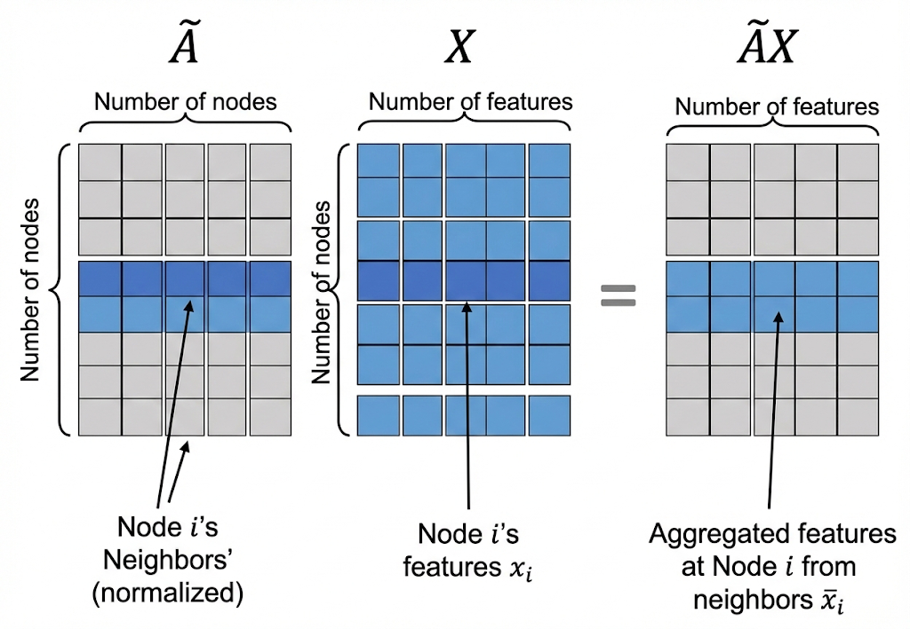
*Figure 8 - The aggregation step combines neighbour features using the normalised adjacency matrix.* 

#### 2.2.7 - Update

After aggregation, we multiply by the **learnable weight matrix** $\mathbf{W}$. This transforms the aggregated features into a new representation:

$$
\mathbf{h}_i = \bar{\mathbf{x}}_i \,\mathbf{W}.
$$

The weights in $\mathbf{W}$ are shared across all nodes, exactly like the filters in a CNN are shared across all spatial locations.
 
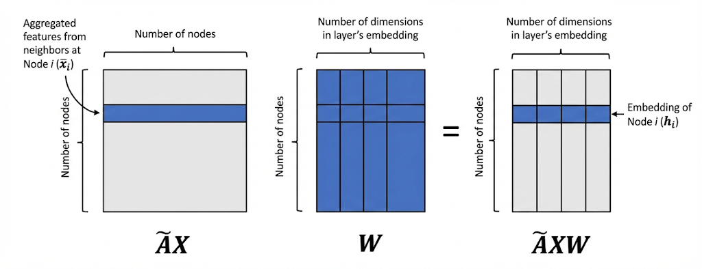
*Figure 9 - The update step applies a linear transformation (the weight matrix) to the aggregated features.*

#### 2.2.8 - Nonlinear Activation

Finally, we apply an activation function $\sigma$ (e.g., ReLU) elementwise to introduce non‑linearity:

$$
\mathbf{h}_i = \sigma(\bar{\mathbf{x}}_i \mathbf{W}).
$$

The output of the layer is a new matrix $\mathbf{H} \in \mathbb{R}^{n \times w}$ where each row is the updated feature vector of a node.

Notice that the dimensions of $\mathbf{W}$ ($d \times w$) do **not** depend on the number of nodes $n$. Therefore a GCN layer can handle graphs of any size, as long as all nodes have input feature vectors of the same length.

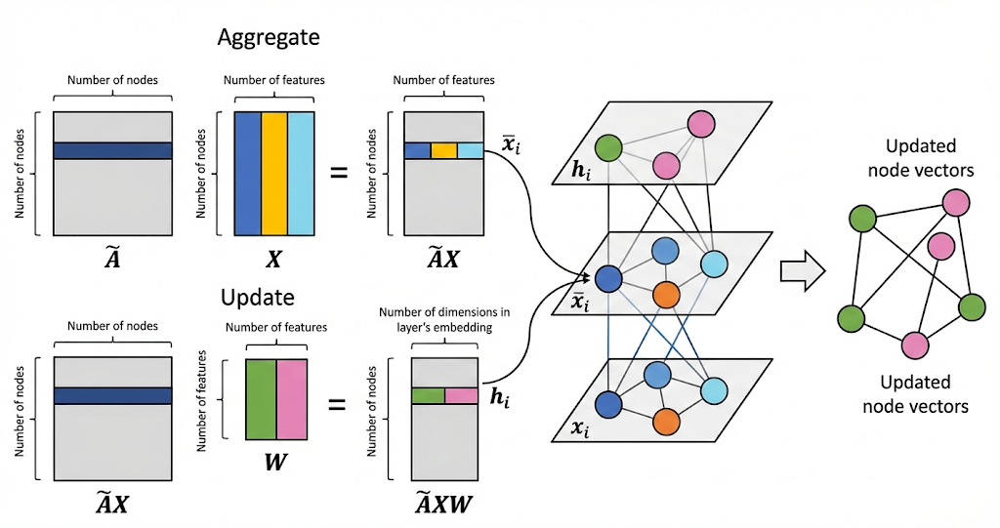
*Figure 10 - A network diagram illustrating the operations inside a graph convolutional layer for a single node.* 

#### 2.2.9 - Stacking Multiple Layers

A deep GCN is built by stacking several such layers. The output $\mathbf{H}^{(1)}$ of the first layer becomes the input to the second layer, and so on. Mathematically:

$$
\begin{aligned}
\mathbf{H}^{(1)} &= f_{\mathbf{W}_1}(\mathbf{X},\mathbf{A}),\\
\mathbf{H}^{(2)} &= f_{\mathbf{W}_2}(\mathbf{H}^{(1)},\mathbf{A}),\\
\mathbf{H}^{(3)} &= f_{\mathbf{W}_3}(\mathbf{H}^{(2)},\mathbf{A}),
\end{aligned}
$$

where each $f_{\mathbf{W}_k}$ is a graph convolutional layer with its own weight matrix $\mathbf{W}_k$.

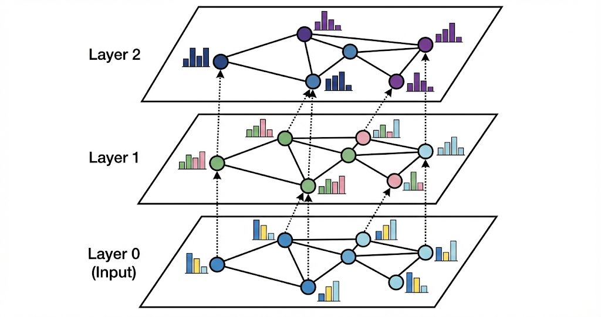
*Figure 11 - Stacked graph convolutional layers. The output of one layer is passed as input to the next.* 

By stacking layers, each node’s final representation can incorporate information from nodes that are multiple hops away – similar to how a CNN’s receptive field grows with depth.

### 2.3  - Normalizing the Adjacency Matrix

Let's take a closer look at the **normalized adjacency matrix**:

$$
\tilde{\mathbf{A}} = \mathbf{D}^{-1/2}(\mathbf{A} + \mathbf{I})\mathbf{D}^{-1/2}
$$.  
What is the intuition behind this matrix, and what do we really mean by "normalizing" the adjacency matrix?

To understand why normalization is necessary, we first consider what happens **without** any normalization – that is, if we naively use the raw adjacency matrix with self‑loops, $\hat{\mathbf{A}} = \mathbf{A} + \mathbf{I}$.

#### 2.3.1 - The Problem: No Normalization

If we skip normalization, the graph convolutional layer would look like this:

$$
f_{\text{unnormalized}}(\mathbf{X},\mathbf{A}) = \sigma(\hat{\mathbf{A}} \mathbf{X} \mathbf{W}).
$$

The aggregation step for node $i$ would then be:

$$
\bar{\mathbf{x}}_i = \sum_{j=1}^n \hat{\mathbf{A}}_{ij}\,\mathbf{x}_j
= \sum_{j \in \mathcal{N}(i)} \mathbf{x}_j,
$$

where $\mathcal{N}(i)$ includes node $i$ itself (because we added self‑loops).  
So node $i$ simply **sums** the feature vectors of all its neighbours (including itself).

Now imagine two nodes:
- A node with many neighbours (high degree) will produce a sum with **large magnitude**.
- A node with few neighbours (low degree) will produce a sum with **small magnitude**.

This is problematic for two reasons:
1. **Optimisation difficulty:** The scale of the aggregated vector becomes highly dependent on the node’s degree. The model must learn weights that work for both very large and very small inputs, which is harder than if all inputs were on a similar scale.
2. **Numerical stability:** When we stack multiple layers, these magnitudes can grow (or shrink) exponentially, leading to vanishing or exploding values – a well‑known issue in deep networks.

We need a way to aggregate neighbour information so that the resulting vectors have a **consistent scale**, independent of each node’s degree.

#### 2.3.2 - A First Attempt: Mean Aggregation

A natural fix is to take the **average** of the neighbour vectors instead of the sum. That is:

$$
\bar{\mathbf{x}}_i = \frac{1}{|\mathcal{N}(i)|} \sum_{j \in \mathcal{N}(i)} \mathbf{x}_j.
$$

We can implement this for all nodes at once by using a different normalisation:

$$
f_{\text{mean}}(\mathbf{X},\mathbf{A}) = \sigma\big(\mathbf{D}^{-1}\hat{\mathbf{A}} \,\mathbf{X}\,\mathbf{W}\big),
$$

where $\mathbf{D}^{-1}$ is a diagonal matrix with entries $1/\mathbf{D}_{ii}$. Now the aggregation for node $i$ becomes:

$$
\bar{\mathbf{x}}_i = \sum_{j=1}^n (\mathbf{D}^{-1}\hat{\mathbf{A}})_{ij}\,\mathbf{x}_j
= \frac{1}{\mathbf{D}_{ii}} \sum_{j \in \mathcal{N}(i)} \mathbf{x}_j
= \frac{1}{|\mathcal{N}(i)|} \sum_{j \in \mathcal{N}(i)} \mathbf{x}_j.
$$

This is indeed a **mean** over neighbours, and it solves the scale problem: every node’s aggregated vector now lies in roughly the same range (assuming the input features themselves are bounded).

So why didn’t Kipf and Welling simply use this mean aggregation?  
Because they proposed a **different** normalization – the one with $\mathbf{D}^{-1/2}$ on both sides – which does something more subtle and powerful.

#### 2.3.3 - Kipf & Welling’s Symmetric Normalization

The normalization used in the original GCN paper is:

$$
\tilde{\mathbf{A}} = \mathbf{D}^{-1/2} \hat{\mathbf{A}} \mathbf{D}^{-1/2},
$$

and its entries are:

$$
\tilde{\mathbf{A}}_{ij} = \frac{1}{\sqrt{\mathbf{D}_{ii}\,\mathbf{D}_{jj}}} \quad \text{if there is an edge between } i \text{ and } j.
$$

Like the mean aggregation, this also reduces the influence of high‑degree nodes: if node $i$ has many neighbours, $\mathbf{D}_{ii}$ is large, so the weight $1/\sqrt{\mathbf{D}_{ii}\mathbf{D}_{jj}}$ becomes smaller.   But notice the key difference: **the weight now also depends on the degree of the neighbour $j$** (through $\mathbf{D}_{jj}$).

#### 2.3.4 - The Intuition: Balancing Influence

Consider a simple situation.Node $i$ has two neighbours:

- **Neighbour 1** is connected **only** to node $i$ (degree = 1, ignoring self‑loops).
- **Neighbour 2** is connected to **many** nodes in the graph (high degree).

Intuitively, Neighbour 2 has many opportunities to spread its message to other parts of the graph through its many connections. Neighbour 1, on the other hand, can only pass its message through node $i$. So Neighbour 1 is somewhat **disempowered** – its influence on the rest of the graph depends entirely on how node $i$ passes it along.

Should we treat these two neighbours equally when we aggregate at node $i$?  
Maybe not. Perhaps we want to **boost** the signal coming from low‑degree neighbours (like Neighbour 1) and **attenuate** the signal from high‑degree neighbours (like Neighbour 2), to give every node a more balanced influence on the graph.

This is exactly what the symmetric normalization does: the weight $1/\sqrt{\mathbf{D}_{ii}\mathbf{D}_{jj}}$ is smaller if **either** $i$ **or** $j$ has high degree. So when node $i$ aggregates, it pays less attention to neighbours that are already “popular” (high degree), and relatively more attention to neighbours that are “isolated” (low degree). This helps to counteract the natural advantage that high‑degree nodes have in spreading information.

#### 2.3.5 - A Visual Comparison

The figure below compares the two normalisation methods for a concrete graph. It shows the weights assigned to neighbours of **Node 4** according to:

- **Mean normalisation:** $\mathbf{D}^{-1}\hat{\mathbf{A}}$ (all neighbours get equal weight, including Node 4 itself).
- **Symmetric normalisation:** $\mathbf{D}^{-1/2}\hat{\mathbf{A}}\mathbf{D}^{-1/2}$ (the weights vary depending on both nodes’ degrees).

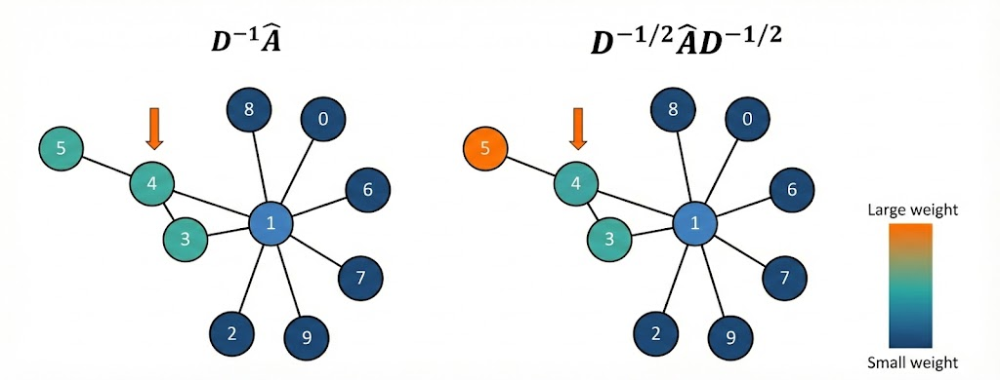
*Figure 12 - Comparison of neighbour weights for Node 4 under mean normalisation (left) and symmetric normalisation (right). The colour intensity represents the weight magnitude – darker means higher weight.* 

In the symmetric version, you can see that:
- **Node 5**, which has few neighbours, receives a **higher** weight.
- **Node 1**, which has many neighbours, receives a **lower** weight.

This illustrates how the symmetric normalization re‑balances the contribution of each neighbour, taking into account not only how many neighbours the central node has, but also how many neighbours **each neighbour itself** has.

#### 2.3.6 -  Why This Matters

By using $\mathbf{D}^{-1/2}\hat{\mathbf{A}}\mathbf{D}^{-1/2}$, the GCN layer performs an aggregation that is both:
- **Scale‑correcting** (like mean aggregation, it prevents degree‑based magnitude explosions), and
- **Influence‑balancing** (it compensates for the varying “reach” of different nodes).

This subtlety contributes to the strong empirical performance of GCNs on many graph tasks, and it’s a beautiful example of how incorporating graph structure directly into the neural architecture can lead to more effective learning.

### 2.4 - Comparing GCNs and CNNs

In the previous sections, we described the graph convolutional layer as performing **message passing** – nodes aggregating information from their neighbours. However, there is another, equally important perspective: we can view the GCN layer as performing a **convolution operation** that is analogous to the convolution-like operation (technically cross‑correlation) performed by **CNNs on images**. This analogy is what gives Graph Convolutional Networks their name.

#### 2.4.1 - The CNN Convolution: Sliding a Filter Over an Image

In a traditional CNN applied to images, we have a small **filter** (also called a kernel), for example a 3×3 grid of weights. This filter slides (convolves) over the entire image. At each position, the filter is centered on a **pixel**, and we compute a weighted sum of the values of that pixel and its surrounding neighbours (the 3×3 patch). The weights in the filter are **learned** and are **shared** across all positions in the image.

The figure below illustrates this process:

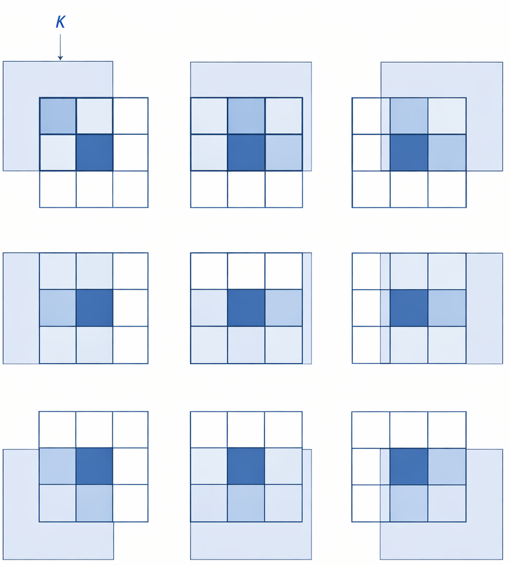
*Figure 13 -  A 3×3 filter sliding over an image. At each step, the pixel values in the local neighbourhood are multiplied by the filter weights and summed to produce the output at the corresponding position in the next layer.* 

Key characteristics of this CNN convolution:
- **Local receptive field:** each output pixel depends only on a small neighbourhood of input pixels.
- **Weight sharing:** the same filter weights are used at every spatial location.
- **Translation equivariance:** if the object in the image shifts, its feature map shifts correspondingly. The network learns patterns regardless of where they appear.

#### 2.4.2 - The GCN Convolution: Sliding a Filter Over a Graph

At first glance, graphs seem very different from images:
- Images have a **regular grid structure**; each pixel has a fixed, ordered set of neighbours (up, down, left, right, and diagonals).
- Graphs have an **irregular, arbitrary structure**; nodes can have different numbers of neighbours, and there is no natural ordering of those neighbours.

Despite these differences, the core idea of a convolution can be adapted. We want to define an operation where each node collects information from its **local neighbourhood**, applies a **shared transformation**, and produces a new representation.

Think of it this way:
- In a CNN, the filter centers on a pixel and looks at its neighbours.
- In a GCN, the filter centers on a node and looks at its neighbours (including itself via the self‑loop).

The filter weights in a GCN are not spatial (like the 3×3 grid) because graph neighbours are not ordered. Instead, the filter is implemented by:
1. **Aggregating** neighbour features (weighted by the normalised adjacency matrix).
2. **Transforming** the aggregated result with a shared weight matrix $\mathbf{W}$.

The weight matrix $\mathbf{W}$ is **shared across all nodes**, just as the CNN filter weights are shared across all pixel locations. This is the essence of the convolution analogy.

The figure below, which we saw earlier, can now be reinterpreted as a graph convolution:

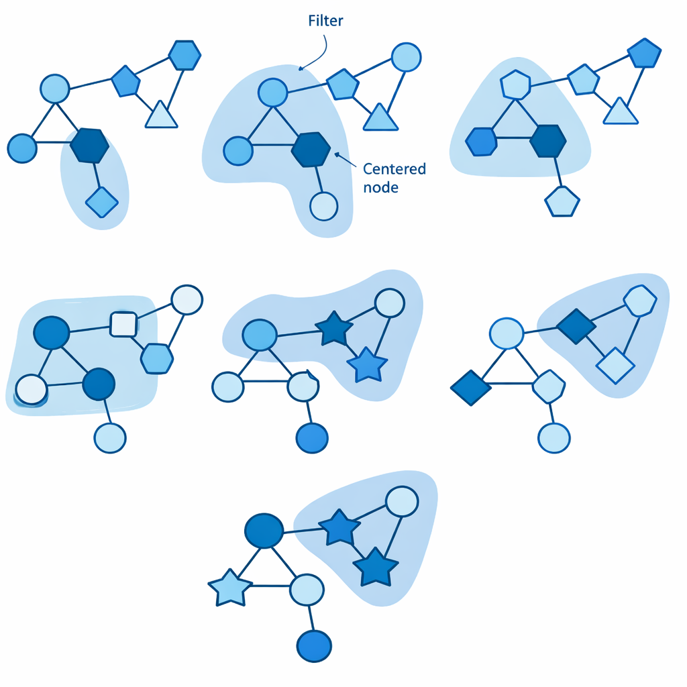
*Figure 14 -  A graph convolutional layer acting on node A. The filter (implicitly defined by $\tilde{\mathbf{A}}$ and $\mathbf{W}$) pools information from neighbours $\mathbf{x}_B$ and $\mathbf{x}_C$ together with $\mathbf{x}_A$ to produce the new feature $\mathbf{h}_A$.*

#### 2.4.3 -  What About the Filter Weights?

In a CNN, the filter contains **learnable weights** that determine how much each neighbour contributes. For a 3×3 filter, we have nine learnable parameters (per channel).

In a GCN, the neighbour contributions are **fixed by the graph structure**; the weights $\tilde{\mathbf{A}}_{ij}$ are not learned. They are derived purely from the degrees of the nodes. So where are the learnable parameters?

The learnable part is in the **transformation after aggregation**: the matrix $\mathbf{W}$. This matrix transforms the aggregated feature vector (which already combines neighbour information) into a new representation. In a sense, $\mathbf{W}$ is like the set of filter weights, but applied after the neighbour‑dependent aggregation rather than as a direct multiplier on each neighbour individually.

Some more advanced graph convolution variants *do* learn separate weights for different types of neighbours (for example based on edge features or distances), which makes the analogy even closer. However, in the basic GCN, the convolution is a **two‑step process**: a fixed, structure‑dependent aggregation followed by a learned transformation.

#### 2.4.4 - Translational Equivariance Versus Node Reordering

CNNs are **translation equivariant**: if you shift an image, the feature maps shift correspondingly. This property comes from the regular grid and weight sharing.

Graphs do not have a notion of translation, but they do have a property we need: the GCN should be **permutation equivariant** (or invariant, depending on the task). That is, if you reorder the nodes (relabel them), the output should reorder in the same way, and the overall computation should be unaffected. This is achieved because:
- The adjacency matrix captures structure independently of node ordering.
- The aggregation (sum over neighbours) is order‑agnostic.
- The weight matrix $\mathbf{W}$ is applied identically to each node's aggregated features.

Thus, GCNs respect the **symmetries of graphs**, just as CNNs respect the translational symmetry of images.

Both architectures build **hierarchical representations** by stacking layers. In a CNN, deeper layers see larger spatial regions (the receptive field grows). In a GCN, deeper layers allow nodes to receive information from nodes farther away in the graph (the receptive field expands through multiple hops).

| **Aspect**               | **CNN (on images)**                                      | **GCN (on graphs)**                                           |
|--------------------------|----------------------------------------------------------|---------------------------------------------------------------|
| Input domain             | Regular grid of pixels                                   | Irregular graph structure                                     |
| Neighbourhood            | Fixed spatial patch (e.g., 3×3)                          | Set of adjacent nodes (variable size)                         |
| Neighbour ordering       | Implicit (top‑left to bottom‑right)                      | No natural ordering; handled by sum/aggregation               |
| Filter weights           | Learned weights per spatial position                     | Fixed aggregation weights ($\tilde{\mathbf{A}}$) plus learned $\mathbf{W}$ |
| Weight sharing           | Same filter applied everywhere                           | Same $\mathbf{W}$ applied to every node                      |
| Output                   | Feature map (same spatial size)                          | New node feature matrix (same graph structure)                 |
| Key property             | Translation equivariance                                 | Permutation equivariance                                       |

## 3 - TinyML Implementation

With this example you can implement the machine learning algorithm in ESP32, Arduino, Arduino Portenta H7 with Vision Shield, Raspberry and other different microcontrollers or IoT devices.

### 3.1  -  Jupyter Notebooks

-   Radial Basis Function Networks Training

### 3.3  -  Arduino Code

-   Graph Convolutional Networks

### 3.4  -  Result 

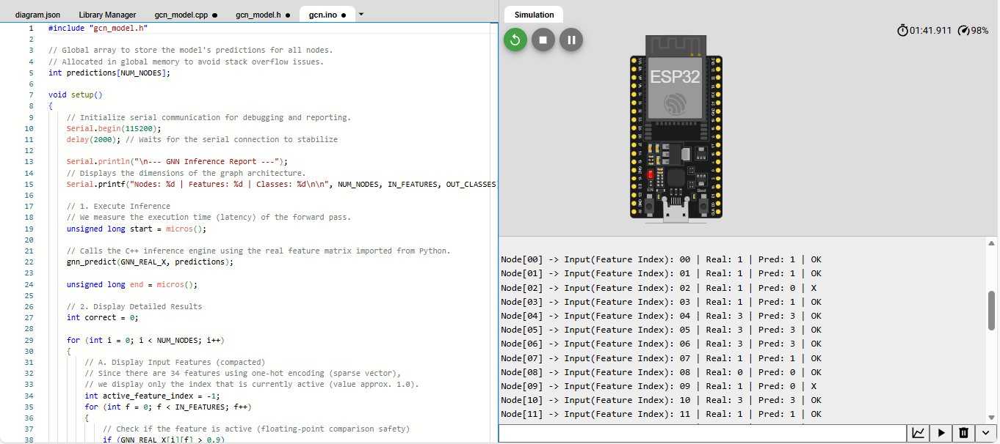