# TinyML - Neural Additive Models

_From interpretable machine learning to edge deployment_

**Social media:**

👨🏽‍💻 Github: [thommaskevin/TinyML](https://github.com/thommaskevin/TinyML)

👷🏾 Linkedin: [Thommas Kevin](https://www.linkedin.com/in/thommas-kevin-ab9810166/)

📽 Youtube: [Thommas Kevin](https://www.youtube.com/channel/UC7uazGXaMIE6MNkHg4ll9oA)

🧑‍🎓 Scholar: [Thommas K. S. Flores](https://scholar.google.com/citations?user=MqWV8JIAAAAJ&hl=pt-PT&authuser=2)

:pencil2: CV Lattes CNPq: [Thommas Kevin Sales Flores](http://lattes.cnpq.br/0630479458408181)

👨🏻‍🏫 Research group: [Conecta.ai](https://conect2ai.dca.ufrn.br/)

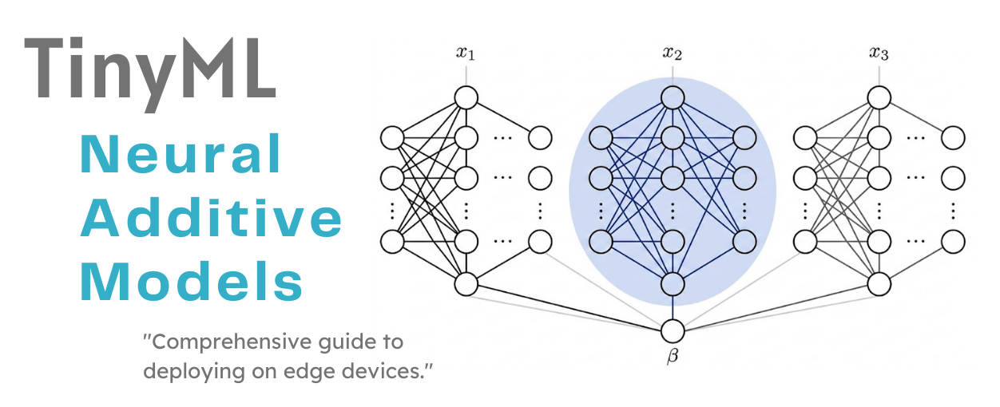

## SUMMARY

1 — Introduction

&nbsp;&nbsp;1.1 — Why Interpretability Matters

&nbsp;&nbsp;1.2 — The Black-Box Problem

&nbsp;&nbsp;1.3 — From Linear Models to Neural Additive Models

2 — Mathematical Foundations

&nbsp;&nbsp;2.1 — From Generalized Additive Models to Neural Additive Models
Networks

&nbsp;&nbsp;2.2 — Architecture: Feature-wise Neural Subnetworks

&nbsp;&nbsp;2.3 — Input Standardization

&nbsp;&nbsp;2.4 — The Training Process

&nbsp;&nbsp;2.5 — Interpretability Mechanism

&nbsp;&nbsp;2.6 — Numerical Walkthrough

3 — TinyML Implementation

&nbsp;&nbsp;3.1 — Exemplo 1: NAM Regression

&nbsp;&nbsp;3.2 — Exemplo 2: NAM Binary Classification

&nbsp;&nbsp;3.3 — Exemplo 3: NAM Multiclass Classification

## 1 — Introduction

Neural Additive Models (NAMs) are a family of neural network architectures specifically designed to be **both powerful and interpretable**. Unlike traditional deep networks, which mix all input features in every layer, a NAM dedicates a separate neural subnetwork to each input feature and combines their outputs by simple addition. This structural constraint means that the contribution of every feature to any prediction can be read off exactly — no approximations, no post-hoc explanations. The result is a model that sits at the intersection of modern deep learning and classical statistical modeling, capable of learning complex nonlinear relationships while remaining fully transparent.

This document develops the complete mathematical foundations of NAMs, from the problem of black-box models to the derivation of the training objective, the gradient flow, and the interpretability guarantee. The final section discusses how the additive structure translates directly into efficient embedded C code suitable for TinyML deployment.

### 1.1 — Why Interpretability Matters

Imagine a machine learning model that predicts whether a patient should receive a high-risk surgery. The model achieves 95% accuracy. But when the doctor asks *"why did the model recommend surgery for this patient?"*, the system cannot provide a clear answer. This is the **interpretability problem**.

Interpretability means the ability of a human expert to understand, in clear and mechanistic terms, why a model produces a given prediction from a given set of inputs. This is not merely a technical desideratum — it is an ethical and regulatory requirement. Models deployed in medicine, law, credit scoring, and safety-critical engineering must be auditable, understandable, and correctable by domain experts who may not be machine learning specialists.

The key distinction is between two types of interpretability. **Intrinsic interpretability** is built into the model's architecture: the model is transparent by design, and no additional analysis is needed to understand its decisions. **Post-hoc interpretability** means fitting a separate explainability tool (such as SHAP or LIME) to an already-trained opaque model. Post-hoc explanations are always approximate and may not faithfully represent the model's actual behavior. NAMs achieve intrinsic interpretability: the explanation is the model itself.

### 1.2 — The Black-Box Problem

A standard fully connected feedforward neural network with $L$ hidden layers computes:

$$
\mathbf{h}^{(0)} = \mathbf{x}
$$

$$
\mathbf{h}^{(l)} = \sigma\!\left(W^{(l)}\mathbf{h}^{(l-1)} + \mathbf{b}^{(l)}\right), \quad l = 1, \ldots, L
$$

$$
\hat{y} = W^{(L+1)}\mathbf{h}^{(L)} + b^{(L+1)}
$$

Each weight matrix $W^{(l)}$ couples **all neurons from the previous layer to all neurons in the current layer**. This complete mixing is exactly what makes deep networks powerful — they can represent extraordinarily complex functions — but it also makes them opaque. No single weight or activation can be attributed to a single input feature. The model's internal representations are entangled mixtures of all inputs simultaneously. Perturbing one feature causes ripple effects through every layer, so isolating the "contribution" of any one feature requires auxiliary computations that are inherently approximate.

### 1.3 — From Linear Models to Neural Additive Models

There is a well-known trade-off between **flexibility** — the ability to learn complex patterns — and **interpretability** — the ability to explain predictions. Figure 1 illustrates where the main model families fall on this spectrum.

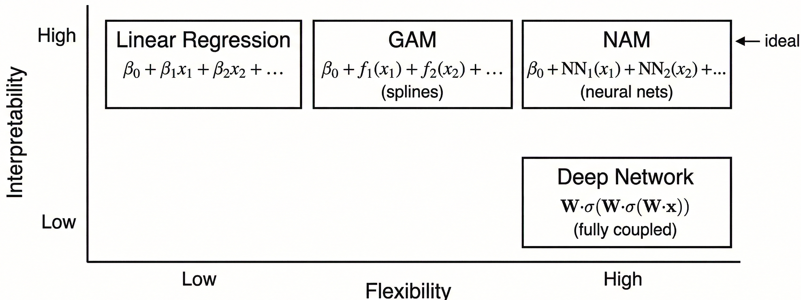
*Figure 1 — The four main model families ordered by interpretability and flexibility. Linear models are highly interpretable but rigid. Deep networks are flexible but opaque. Generalized Additive Models (GAMs) occupy a middle ground with smooth nonlinear shape functions. NAMs achieve high flexibility AND high interpretability by parameterizing the shape functions of a GAM with neural networks.*

Neural Additive Models occupy the **upper-right quadrant** of this space — combining the expressive power of neural networks with the exact, per-feature interpretability of additive statistical models. The remainder of this document develops the mathematics that makes this possible.

## 2 — Mathematical Foundations

This section develops the complete mathematical foundations of Neural Additive Models. We begin with the classical statistical framework of Generalized Additive Models, which provides the interpretability template that NAMs inherit. We then describe how replacing spline shape functions with neural networks yields an architecture that is both expressive and transparent, derive the training objectives for regression and classification tasks, analyze how gradients flow during backpropagation, and show how the trained model produces exact, visualizable explanations. The section closes with a step-by-step numerical walkthrough that makes every equation concrete.

### 2.1 — From Generalized Additive Models to Neural Additive Models

Before introducing NAMs, we must understand their direct ancestor: **Generalized Additive Models** (GAMs), introduced by Hastie and Tibshirani (1986). GAMs represent one of the most important families of interpretable statistical models, and the core idea of NAMs is a direct generalization of the GAM framework.

A GAM relates the expected value of a response variable $Y$ to predictors $\mathbf{X} = (x_1, \ldots, x_p)^\top$ through a **link function** $g$ and a sum of univariate functions:

$$
g\!\left(\mathbb{E}[Y \mid \mathbf{X}]\right) = \beta_0 + \sum_{j=1}^{p} f_j(x_j)
$$

where:
- $\beta_0 \in \mathbb{R}$ is the global intercept — the baseline prediction when all features are at their reference values,
- $f_j : \mathbb{R} \to \mathbb{R}$ are smooth **shape functions**, one per feature,
- $g$ is a monotone differentiable link function appropriate to the response type.

#### 2.1.1 — The Additive Structure

The central word in the GAM equation is **additive**. Each feature $x_j$ contributes to the prediction through its own private function $f_j$, and these contributions are simply summed. No feature "talks to" another feature inside the model — their effects are completely independent by construction.

This has a profound practical consequence: **each shape function $f_j$ can be plotted and inspected individually**. A practitioner can draw a graph of $f_j(x_j)$ versus $x_j$ and read off, in plain terms, "when $x_j$ takes this value, it adds or subtracts this much from the prediction." This visualization is the primary interpretability mechanism of GAMs, and it is directly inherited by NAMs.

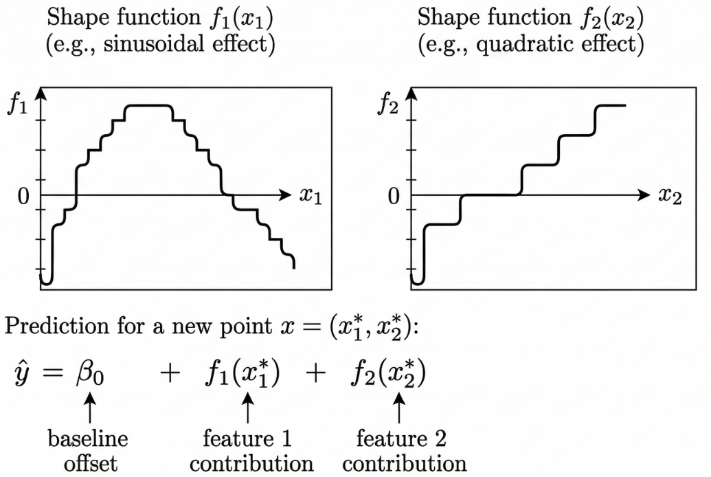
*Figure 2 — Shape functions in a GAM. Each function $f_j$ captures the nonlinear relationship between feature $j$ and the response. The final prediction is the sum of the individual contributions plus the baseline $\beta_0$. Each function can be visualized independently — this is the interpretability advantage of additive models.*

#### 2.1.2 — The Link Function

The link function $g$ adapts the additive predictor to different types of response variables:

- **Regression** (continuous $y$): $g$ is the identity function, giving

 $$
 \hat{y} = \beta_0 + \sum_j f_j(x_j)
 $$
- **Binary classification** ($y \in \{0,1\}$): $g$ is the logit function 
 $$
 g(p) = \log\frac{p}{1-p}
 $$
 so the model predicts the log-odds of the positive class, and the probability is recovered by the sigmoid:

$$
\hat{p} = \frac{1}{1 + e^{-\left(\beta_0 + \sum_j f_j(x_j)\right)}}
$$

This logistic-additive structure is exactly what NAMs inherit in classification tasks. Crucially, it means that each $f_j(x_j)$ contributes **additively to the log-odds** — an independently interpretable quantity.

#### 2.1.3 — Classical Shape Functions: Splines

In classical GAMs, each $f_j$ is estimated using a **spline** — a piecewise polynomial function defined by a set of knot points. Splines are flexible enough to capture many types of nonlinear relationships (monotone, periodic, U-shaped) while remaining smooth and visually interpretable. The shape functions are learned from data through the **backfitting algorithm**: iteratively update each $f_j$ by fitting it to the residuals left by all other features, repeating until convergence.

#### 2.1.4 — Limitations of Classical GAMs

Despite their elegance, classical GAMs have three important limitations that motivate the neural extension:

First, splines use **hand-crafted basis functions** (polynomials, radial basis functions) that may fail to capture highly complex or irregular nonlinear patterns, particularly in high-dimensional or noisy data.

Second, the backfitting algorithm **does not scale well to very large datasets**, since each step requires fitting a nonparametric smoother over the entire training set.

Third, classical GAMs **cannot leverage the modern deep learning infrastructure** — automatic differentiation, GPU acceleration, mini-batch stochastic gradient descent, dropout, batch normalization, and the extensive ecosystem of optimization techniques that have been refined over the past decade.

Neural Additive Models solve all three of these problems simultaneously.

#### 2.1.5 — The Key Idea: Replacing Splines with Neural Networks

**Neural Additive Models** (Agarwal et al., 2021) retain the exact same additive structure as a GAM but replace each spline shape function $f_j$ with a **small feedforward neural network** $f_{\theta_j}$:

$$
\hat{y} = \beta_0 + \sum_{j=1}^{p} f_{\theta_j}(x_j)
$$

This is the central equation of the entire NAM framework. Let us read it carefully:

- $\beta_0$: a single trainable scalar capturing the global baseline.
- $f_{\theta_j}$: a small neural network dedicated exclusively to feature $j$, with its own private set of weights $\theta_j$.
- $x_j$: a **single scalar** — only one feature enters each subnetwork.
- The outputs are **summed linearly** — there is no nonlinear coupling at the aggregation stage.

The analogy to classical GAMs is immediate: where a GAM uses a spline to model $f_j$, a NAM uses a neural network. Everything else is structurally identical. This substitution is what makes NAMs both interpretable (by inheritance from the GAM framework) and powerful (by the universal approximation property of neural networks).

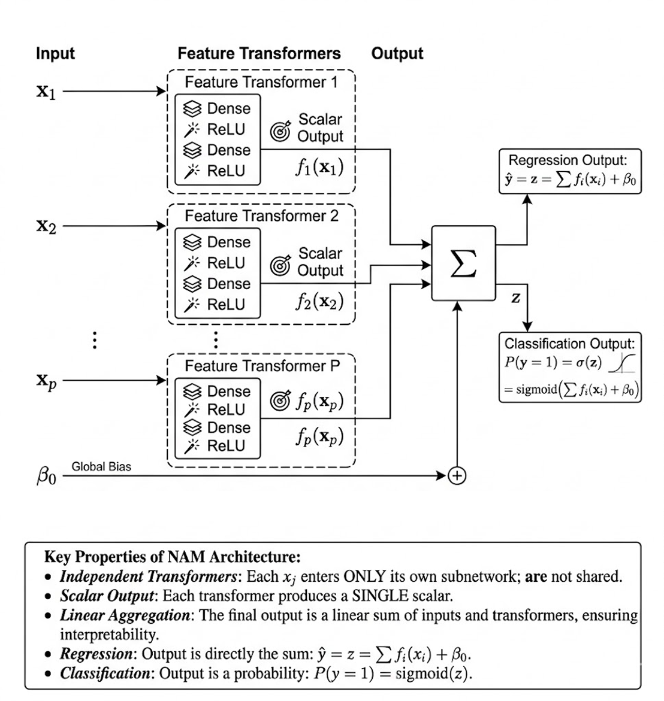

*Figure 3 — The NAM architecture. Each feature $x_j$ feeds into its own independent neural subnetwork. All subnetwork outputs are scalars, summed together with a global bias $\beta_0$ to produce the final prediction. This architectural constraint enforces the additive structure exactly.*

### 2.2 — Architecture: Feature-wise Neural Subnetworks

The architectural heart of NAM is the dedication of a separate neural network to each feature. This section describes exactly what happens inside each subnetwork, why the architecture is designed this way, and what mathematical guarantees it provides.

#### 2.2.1 — Why One Subnetwork Per Feature?

The most important design decision in NAM is dedicating a separate neural network to each feature. This is not merely a stylistic choice — it is a **mathematical necessity** for the interpretability guarantee.

If two features $x_j$ and $x_k$ shared any hidden layer, their representations would be entangled: the activation of a hidden unit would depend simultaneously on both features. In that case, it would be impossible to isolate the contribution of $x_j$ alone to the prediction, and the additive decomposition would break down.

By keeping the subnetworks completely independent — no shared weights anywhere — we guarantee that $f_{\theta_j}(x_j)$ depends **only** on $x_j$. The decomposition 
$$
\hat{y} = \beta_0 + \sum_j f_{\theta_j}(x_j)
$$
therefore holds exactly for every possible input, not merely approximately.

#### 2.2.2 — Inside a Single Subnetwork

Consider the subnetwork for feature $j$ with two hidden layers of widths $d_1$ and $d_2$. Because the input $x_j$ is always a single scalar, the first weight matrix degenerates to a weight vector. The computation proceeds in three steps.

**Step 1 — First hidden layer:**

$$
\mathbf{h}^{(1)}_j = \sigma\!\left(W^{(1)}_j\, x_j + \mathbf{b}^{(1)}_j\right)
$$

where $W^{(1)}_j \in \mathbb{R}^{d_1}$ is a weight vector (since $x_j$ is a scalar), $\mathbf{b}^{(1)}_j \in \mathbb{R}^{d_1}$ is the bias vector, and $\sigma$ is the activation function. The output $\mathbf{h}^{(1)}_j$ is a vector of size $d_1$: the scalar input has been **expanded** into a $d_1$-dimensional hidden representation.

**Step 2 — Second hidden layer:**

$$
\mathbf{h}^{(2)}_j = \sigma\!\left(W^{(2)}_j\, \mathbf{h}^{(1)}_j + \mathbf{b}^{(2)}_j\right)
$$

where $W^{(2)}_j \in \mathbb{R}^{d_2 \times d_1}$ is a full weight matrix. The output is a vector of size $d_2$.

**Step 3 — Output layer (scalar collapse):**

$$
f_{\theta_j}(x_j) = \mathbf{w}^{(3)\top}_j\, \mathbf{h}^{(2)}_j + b^{(3)}_j
$$

where $\mathbf{w}^{(3)}_j \in \mathbb{R}^{d_2}$ and $b^{(3)}_j \in \mathbb{R}$. The output is a **single scalar** — the learned shape function value at $x_j$. There is no activation function at the output layer: we want the subnetwork to freely output any real number, positive or negative.

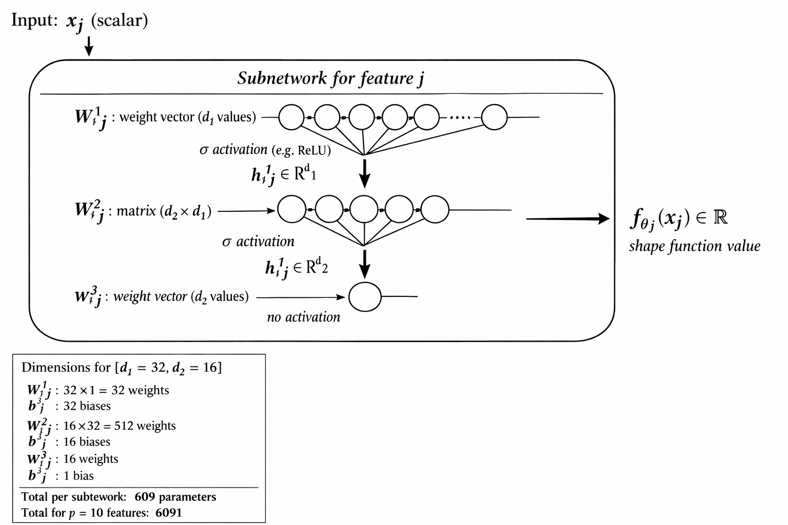

*Figure 4 — Internal structure of a single NAM subnetwork. The scalar input $x_j$ is first expanded into a $d_1$-dimensional hidden representation, then further transformed, and finally collapsed back to a single scalar output $f_{\theta_j}(x_j)$.*

#### 2.2.3 — The ReLU Activation Function

The activation function used in the hidden layers is the **Rectified Linear Unit (ReLU)**:

$$
\sigma(t) = \max(0,\, t)
$$

ReLU is the most widely used activation in modern deep learning. Its key properties for NAMs are:

**Simple, well-behaved gradient.** The derivative of ReLU is 1 for positive inputs and 0 otherwise. This prevents vanishing gradients in the backward pass, enabling reliable training of deep subnetworks.

**Universal approximation.** A sufficiently wide network of ReLU units can approximate any continuous function on a bounded domain to arbitrary precision (Cybenko, 1989; Hornik, 1991). This means NAM subnetworks are not restricted in what shape functions they can represent — the architecture imposes no prior on the shape of $f_{\theta_j}$.

**Piecewise-linear output.** Because each hidden unit implements a piecewise-linear function of its input, the composition of ReLU layers produces a **piecewise-linear shape function**. Each "bend" in the learned curve corresponds to one ReLU unit switching from zero to positive. More neurons produce more bends and finer approximations of smooth curves.

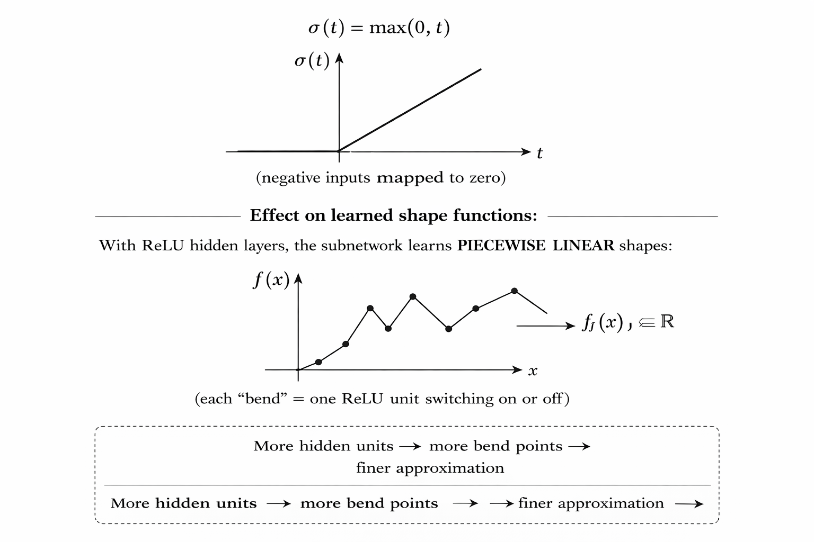
*Figure 5 — The ReLU activation function (top) and the piecewise-linear shape functions it produces (bottom). With more neurons, the subnetwork can represent increasingly complex nonlinear relationships.*

#### 2.2.4 — The Global Bias Term

In addition to the $p$ subnetworks, the NAM includes a single trainable scalar $\beta_0$, the **global bias**:

$$
\hat{y} = \beta_0 + \sum_{j=1}^{p} f_{\theta_j}(x_j)
$$

The role of $\beta_0$ is identical to the intercept in linear regression: it captures the baseline level of the response when all features are at their reference values. Without $\beta_0$, the model would be forced to encode the empirical mean of the response into one of the shape functions, breaking the clean interpretation of each $f_{\theta_j}$ as a **deviation from baseline** attributable to a single feature.

The complete set of parameters learned during training is therefore:

$$
\Theta = \left\{\, \theta_1,\, \theta_2,\, \ldots,\, \theta_p,\, \beta_0 \,\right\}
$$

### 2.3 — Input Standardization

Before features are fed into the subnetworks, each one is standardized. This preprocessing step is not optional — it is essential for efficient, stable training.

#### 2.3.1 — What Is Standardization?

Standardization transforms each feature $x_j$ using the mean $\mu_j$ and standard deviation $\sigma_j$ computed from the training set:

$$
x_j^{\mathrm{sc}} = \frac{x_j - \mu_j}{\sigma_j}
$$

After this transformation, every feature has **mean 0 and standard deviation 1** over the training set. The suffix "sc" stands for "scaled."

> **Important:** $\mu_j$ and $\sigma_j$ must be computed **only on the training set** and then applied without modification to the validation and test sets. Computing them on the full dataset would cause **data leakage** — the model would have seen information from the test set during preprocessing, invalidating the evaluation.

#### 2.3.2 — Why Standardization Helps

Consider a dataset with two features: $x_1$ (age, ranging 18–80) and $x_2$ (blood glucose, ranging 60–200 mg/dL). These features are on completely different scales. The gradient descent update rule is:

$$
\theta \leftarrow \theta - \eta \cdot \frac{\partial \mathcal{L}}{\partial \theta}
$$

If feature $x_1$ has values in $[0, 1000]$ and $x_2$ has values in $[0, 1]$, the gradient with respect to the subnetwork for $x_1$ will typically be much larger in magnitude than the gradient for $x_2$. A single learning rate $\eta$ cannot simultaneously be "small enough" for $x_1$ (to avoid oscillation) and "large enough" for $x_2$ (to make progress). The result is slow, oscillating convergence on an elongated loss surface.

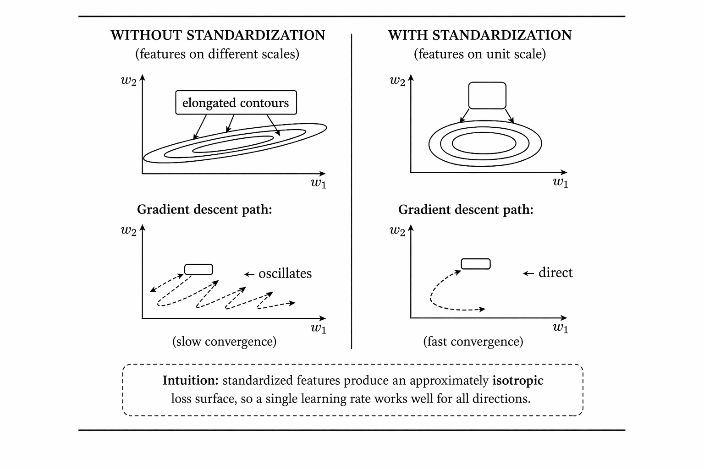
*Figure 6 — Effect of feature scaling on gradient descent convergence. Without standardization (left), the loss surface is elongated along the direction of large-scale features, causing gradient descent to oscillate. With standardization (right), the loss surface is approximately isotropic and gradient descent converges efficiently.*

#### 2.3.3 — Effect on Shape Function Plots

After standardization, the shape functions are learned as functions of $x_j^{\mathrm{sc}}$, not of the original $x_j$. When displaying shape functions to end users, the x-axis is back-transformed to original units using:

$$
x_j = \mu_j + \sigma_j \cdot x_j^{\mathrm{sc}}
$$

This is a linear rescaling that **preserves the shape** of $f_{\theta_j}$ exactly. The output values (y-axis of shape function plots) are entirely unaffected by input standardization, since they represent contributions to the response variable in its original units.

### 2.4 — The Training Process

All subnetwork parameters $\Theta$ are learned jointly by minimizing a **loss function** over the training dataset $\mathcal{D} = \{(\mathbf{x}^{(i)}, y^{(i)})\}_{i=1}^n$. This section derives the loss functions for regression and classification, and — crucially — explains how gradients propagate through the additive architecture during backpropagation.

#### 2.4.1 — Overview: Learning by Minimizing a Loss

Training a NAM follows the standard deep learning pipeline:

1. **Forward pass:** compute the prediction $\hat{y}^{(i)}$ for each sample in a mini-batch using the current parameters.
2. **Loss computation:** evaluate the scalar loss $\mathcal{L}(\Theta)$ measuring how far predictions are from the true targets.
3. **Backward pass:** compute the gradient $\partial \mathcal{L} / \partial \Theta$ using backpropagation through automatic differentiation.
4. **Parameter update:** apply gradient descent (or a variant like Adam) to update all parameters simultaneously.
5. **Repeat** over many mini-batches and epochs until convergence.

The key insight is that all $p$ subnetworks and the global bias are **jointly optimized** through a shared loss. The subnetworks are independent in their architecture (no shared weights), but they **coordinate through the gradient signal**: each subnetwork learns to reduce the residual error that the other subnetworks have not yet explained.

#### 2.4.2 — Regression: Mean Squared Error Loss

For a continuous response $y \in \mathbb{R}$, the standard loss is the **Mean Squared Error (MSE)**:

$$
\mathcal{L}_{\mathrm{MSE}}(\Theta) = \frac{1}{n}\sum_{i=1}^{n}\bigl(y^{(i)} - \hat{y}^{(i)}\bigr)^2
$$

where $\hat{y}^{(i)} = \beta_0 + \sum_j f_{\theta_j}(x_j^{(i)})$ is the NAM's prediction for sample $i$.

MSE penalizes large errors more than small ones (due to the squaring), and it is equivalent to maximum likelihood estimation under the assumption that the residuals follow a Gaussian distribution:

$$
y^{(i)} = \hat{y}^{(i)} + \varepsilon^{(i)}
$$
with $\varepsilon^{(i)} \sim \mathcal{N}(0, \sigma_\varepsilon^2)$

#### 2.4.3 — How Gradients Flow Through the Additive Structure

Understanding the gradient flow is essential to understanding why the jointly-trained subnetworks converge to meaningful, individually-interpretable functions.

The gradient of $\mathcal{L}_{\mathrm{MSE}}$ with respect to the parameters of subnetwork $j$ is:

$$
\frac{\partial \mathcal{L}_{\mathrm{MSE}}}{\partial \theta_j} = -\frac{2}{n}\sum_{i=1}^{n}\underbrace{\bigl(y^{(i)} - \hat{y}^{(i)}\bigr)}_{\text{global residual}}\cdot \frac{\partial f_{\theta_j}(x_j^{(i)})}{\partial \theta_j}
$$

This equation reveals the coordination mechanism. Each subnetwork receives a gradient signal proportional to the **global residual** — the total error of the full NAM prediction, which includes contributions from all other subnetworks. Subnetwork $j$ therefore learns to reduce its output's share of the global error. Since all subnetworks are simultaneously being trained to reduce the same residual, they implicitly partition the task: each learns the component of the response attributable to its own feature.

The additive structure also simplifies the gradient at the summation node. Because $\hat{y} = \beta_0 + \sum_j f_{\theta_j}(x_j)$, the partial derivative of $\hat{y}$ with respect to any $f_{\theta_j}$ is simply 1. The upstream gradient is therefore distributed **unchanged and equally** to all subnetworks — there is no chain-rule complexity introduced at the aggregation step.

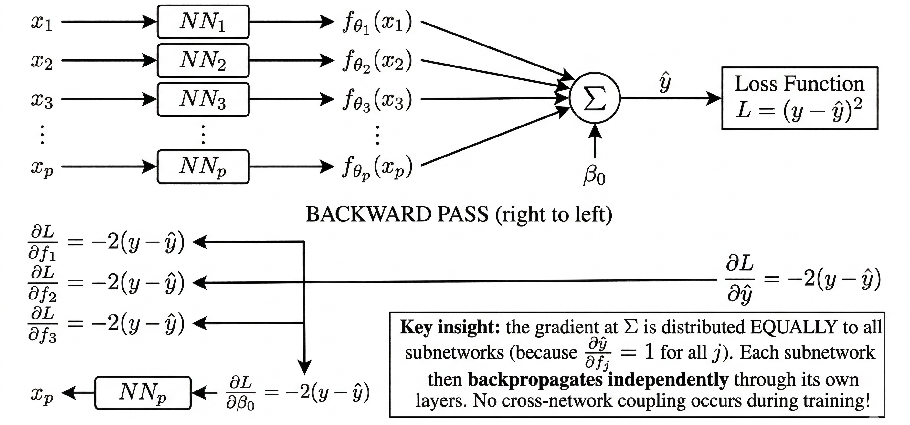
*Figure 7 — Gradient flow in a NAM during backpropagation. The global residual gradient is distributed equally to all subnetworks. Each subnetwork then runs its own independent backward pass. This clean separation is a direct consequence of the additive architecture and ensures that subnetwork parameters do not interfere with one another during training.*

#### 2.4.4 — Binary Classification: Binary Cross-Entropy Loss

For a binary response $y \in \{0, 1\}$, the NAM first computes a **logit** — the additive log-odds of the positive class — using the raw subnetwork outputs:

$$
z^{(i)} = \beta_0 + \sum_{j=1}^{p} f_{\theta_j}(x_j^{(i)})
$$

The predicted probability of belonging to class 1 is then obtained via the **sigmoid function**:

$$
\hat{p}^{(i)} = \sigma(z^{(i)}) = \frac{1}{1 + e^{-z^{(i)}}}
$$

The sigmoid maps any real number to the interval $(0, 1)$: very negative logits correspond to probabilities near 0 (confident class-0 prediction), zero logits correspond to maximal uncertainty ($\hat{p} = 0.5$, the decision boundary), and very positive logits correspond to probabilities near 1.

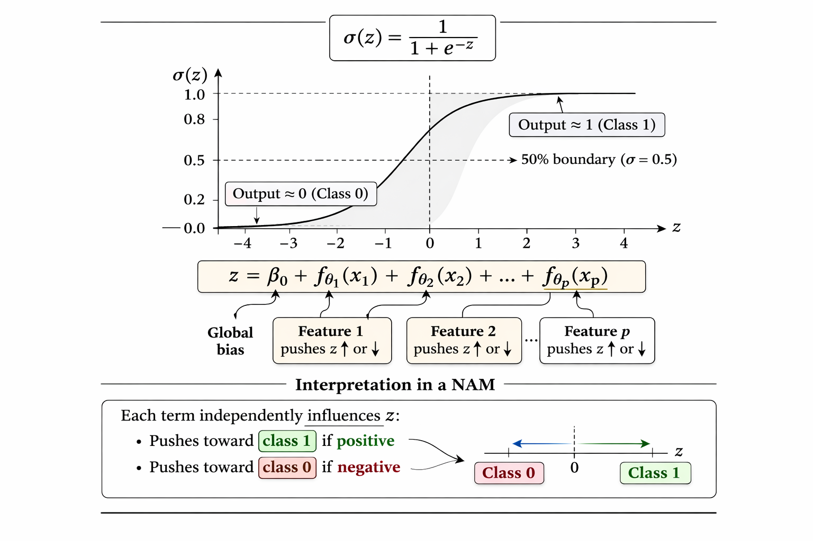
*Figure 8 — The sigmoid function maps the additive logit $z$ to a predicted probability. Because $z$ is itself an additive sum of per-feature contributions, each $f_{\theta_j}(x_j)$ can be directly interpreted as a push toward or away from the positive class, measured in log-odds units.*

The **Binary Cross-Entropy (BCE)** loss is:

$$
\mathcal{L}_{\mathrm{BCE}}(\Theta) = -\frac{1}{n}\sum_{i=1}^{n}\Bigl[y^{(i)}\log\hat{p}^{(i)} + (1-y^{(i)})\log(1-\hat{p}^{(i)})\Bigr]
$$

For a correct positive prediction ($y=1$, $\hat{p} \approx 1$), the first term $-\log\hat{p}^{(i)}$ approaches 0. For a correct negative prediction ($y=0$, $\hat{p} \approx 0$), the second term $-\log(1 - \hat{p}^{(i)})$ approaches 0. The loss is minimized when the model assigns high probability to the correct class for all training samples.

A numerically stable implementation substitutes the sigmoid expression directly, avoiding near-zero logarithm evaluations:

$$
\mathcal{L}_{\mathrm{BCE}}(\Theta) = \frac{1}{n}\sum_{i=1}^{n}\Bigl[\log\!\bigl(1 + e^{z^{(i)}}\bigr) - y^{(i)} z^{(i)}\Bigr]
$$

BCE loss is equivalent to maximizing the log-likelihood under the logistic model — a classical result from statistical learning theory.

#### 2.4.5 — Log-Odds Decomposition and the Decision Boundary

The logit in the classification setting decomposes additively:

$$
z = \beta_0 + f_{\theta_1}(x_1) + f_{\theta_2}(x_2) + \cdots + f_{\theta_p}(x_p)
$$

This means the contribution of feature $j$ to the **log-odds** of the positive class is exactly $f_{\theta_j}(x_j)$, independently of all other features:

- If $f_{\theta_j}(x_j) > 0$: feature $j$ **increases** the odds of $Y = 1$.
- If $f_{\theta_j}(x_j) < 0$: feature $j$ **decreases** the odds of $Y = 1$.
- The multiplicative change in odds due to feature $j$ alone is $\exp(f_{\theta_j}(x_j))$.

The **decision boundary** is the set of input points where the model is maximally uncertain — where it predicts equal probability for both classes. This occurs when $z = 0$:

$$
\mathcal{B} = \left\{\mathbf{x} \in \mathbb{R}^p : \beta_0 + \sum_{j=1}^{p} f_{\theta_j}(x_j) = 0\right\}
$$

This boundary can be highly nonlinear (since each $f_{\theta_j}$ is a neural network), but it is always the **level set of an additive function** — a structural constraint that limits unnecessary complexity and aids interpretability.

### 2.5 — Interpretability Mechanism

The most powerful property of a trained NAM is the ability to extract and visualize the **exact** contribution of each feature to any prediction. This section describes this mechanism in detail.

#### 2.5.1 — Feature Contribution Functions

Given trained parameters $\Theta^*$, the contribution of feature $j$ at any input value $x_j$ is defined simply as the output of the corresponding subnetwork:

$$
C_j(x_j) = f_{\theta_j^*}(x_j)
$$

The total prediction then decomposes **exactly** as:

$$
\hat{y} = \beta_0 + \sum_{j=1}^{p} C_j(x_j)
$$

This is not an approximation or an estimate. It is an **exact identity** that holds for every input and every trained parameter setting, requiring no additional computation beyond the standard forward pass. For classification, the same decomposition holds for the logit $z$, with $C_j(x_j)$ representing the additive contribution to the log-odds.

This distinguishes NAMs fundamentally from post-hoc explainability methods (SHAP, LIME, etc.), which estimate feature attributions by fitting approximating models or computing empirical averages over many forward passes. In a NAM, **the explanation is the model**.

#### 2.5.2 — Visualizing Shape Functions

To visualize the shape function for feature $j$, evaluate $f_{\theta_j^*}(x_j)$ on a fine grid of values spanning the observed training range. Each evaluation requires a single forward pass through subnetwork $j$, which is $O(d_1 + d_2)$ operations.

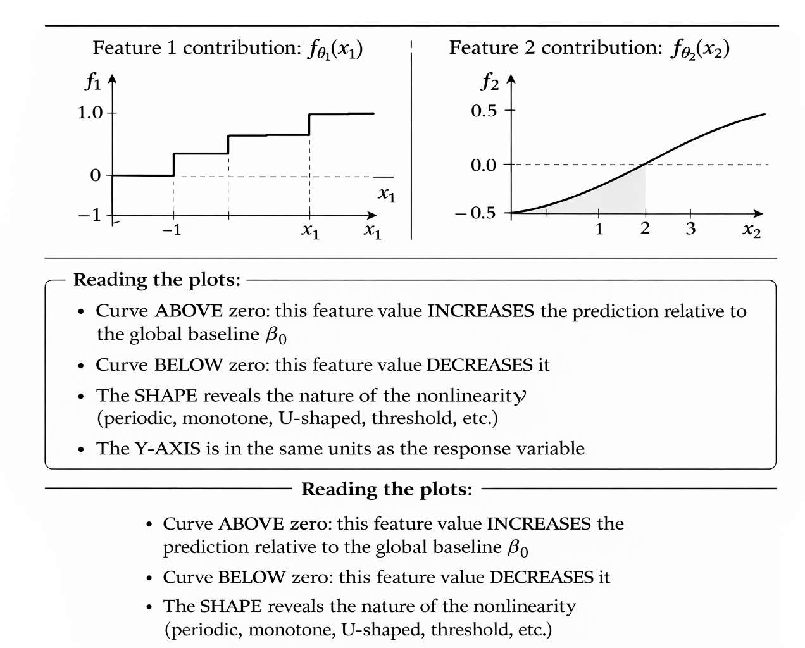
*Figure 9 — Shape function plots for two features in a regression NAM. The y-axis shows the additive contribution in the same units as the response, and the x-axis shows the feature value. Any domain expert can read these plots directly without machine learning expertise.*

#### 2.5.3 — Relationship to Partial Dependence Plots

Students familiar with post-hoc interpretability tools will recognize the connection to **Partial Dependence Plots (PDPs)**. For a general model $f(\mathbf{x})$, the PDP for feature $j$ is:

$$
\mathrm{PD}_j(x_j) = \mathbb{E}_{X_{-j}}\!\left[f(x_j, X_{-j})\right]
$$

Computing this requires averaging the model over all training samples for each grid point — an $O(n \cdot K)$ operation for $K$ grid points, which can be expensive. For a NAM, the expectation collapses analytically because of the additive structure:

$$
\mathrm{PD}_j(x_j) = f_{\theta_j}(x_j) + \underbrace{\beta_0 + \sum_{k \neq j}\mathbb{E}[f_{\theta_k}(x_k)]}_{\text{constant w.r.t. } x_j}
$$

**The NAM shape function is the partial dependence function** (up to a constant). It requires only $O(K)$ forward passes through subnetwork $j$ alone — no averaging over training data needed, and no approximation error.

#### 2.5.4 — Global Feature Importance

A simple and interpretable summary of each feature's overall influence on predictions is the **standard deviation of its contribution** across the training set:

$$
\mathrm{Imp}_j = \sqrt{\frac{1}{n}\sum_{i=1}^n\bigl(f_{\theta_j^*}(x_j^{(i)}) - \bar{C}_j\bigr)^2}, \quad \bar{C}_j = \frac{1}{n}\sum_{i=1}^n f_{\theta_j^*}(x_j^{(i)})
$$

This measures how much the contribution of feature $j$ varies across the dataset. A large $\mathrm{Imp}_j$ indicates that $x_j$ drives large variability in predictions and deserves careful inspection. A small $\mathrm{Imp}_j$ means feature $j$ has a near-constant (negligible) effect and may be a candidate for removal.

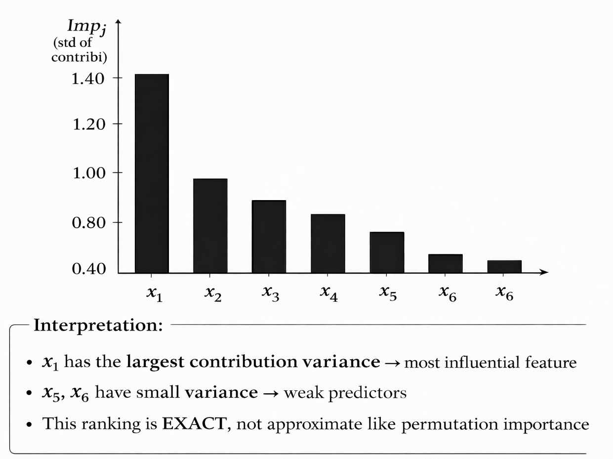
*Figure 10 — Global feature importance in a NAM, measured as the standard deviation of each feature's contribution across the training set. Because contributions are computed exactly rather than estimated, this ranking does not carry the estimation variance that affects permutation importance or SHAP scores for black-box models.*

### 2.6 — Numerical Walkthrough

This section traces the full computation of the NAM forward pass and loss step by step for small examples. The goal is to make every equation completely concrete before moving to implementation.

#### 2.6.1 — Regression Example

**Setup:** $p = 2$ features, $n = 4$ training samples.

**Raw data:**

| $i$ | $x_1$ (raw) | $x_2$ (raw) | $y$ (target) |
|:---:|:---:|:---:|:---:|
| 1 | 2.0 | 1.0 | 1.84 |
| 2 | 4.0 | 3.0 | 3.12 |
| 3 | 6.0 | 5.0 | 1.96 |
| 4 | 8.0 | 7.0 | −0.91 |

**Step 1 — Standardize features.** Compute means and standard deviations from the training set:

$$
\mu_1 = 5.0,\quad \sigma_1 = 2.582;\qquad \mu_2 = 4.0,\quad \sigma_2 = 2.582
$$

| $i$ | $x_1^{\mathrm{sc}} = (x_1 - 5)/2.582$ | $x_2^{\mathrm{sc}} = (x_2 - 4)/2.582$ |
|:---:|:---:|:---:|
| 1 | −1.162 | −1.162 |
| 2 | −0.387 | −0.387 |
| 3 | +0.387 | +0.387 |
| 4 | +1.162 | +1.162 |

**Step 2 — Subnetwork forward pass for sample $i=1$, feature $j=1$.**

Using toy weights for illustration: 

$W^{(1)}_1 = [1.5,\; -0.8]^\top$,

 $\mathbf{b}^{(1)}_1 = [0.1,\; 0.2]^\top$,
 
  $\mathbf{w}^{(2)}_1 = [0.6,\; -0.4]^\top$, 
  
  $b^{(2)}_1 = 0.05$.

*Hidden layer — apply linear transform and ReLU:*

$$
\mathbf{h}^{(1)}_1 = \mathrm{ReLU}\!\bigl([1.5,\;{-0.8}]^\top \cdot(-1.162) + [0.1,\;0.2]^\top\bigr) = \mathrm{ReLU}\!\bigl([-1.543,\;1.330]^\top\bigr) = [0,\;1.330]^\top
$$

Note that $-1.543$ is negative and is clipped to $0$ by ReLU; $1.330$ is positive and passes through unchanged.

*Output — collapse to scalar:*

$$
f_{\theta_1}(x_1^{\mathrm{sc}}) = [0.6,\;{-0.4}] \cdot [0,\;1.330]^\top + 0.05 = 0 - 0.532 + 0.05 = \mathbf{-0.482}
$$

Similarly, for feature $j=2$ with its own (toy) weights: $f_{\theta_2}(x_2^{\mathrm{sc}}) = 0.000$.

**Step 3 — Sum the contributions.** With global bias $\beta_0 = 2.10$:

$$
\hat{y}^{(1)} = 2.10 + (-0.482) + 0.000 = \mathbf{1.618}
$$

**Step 4 — Compute the loss.** The true target is $y^{(1)} = 1.84$, giving squared error $(1.84 - 1.618)^2 = 0.049$.

Full MSE over all four samples:

| $i$ | $y^{(i)}$ | $\hat{y}^{(i)}$ | $(y^{(i)} - \hat{y}^{(i)})^2$ |
|:---:|:---:|:---:|:---:|
| 1 | 1.84 | 1.618 | 0.049 |
| 2 | 3.12 | 3.094 | 0.001 |
| 3 | 1.96 | 2.015 | 0.003 |
| 4 | −0.91 | −0.887 | 0.001 |

$$
\mathcal{L}_{\mathrm{MSE}} = \frac{1}{4}(0.049 + 0.001 + 0.003 + 0.001) = \frac{0.054}{4} = \mathbf{0.0135}
$$

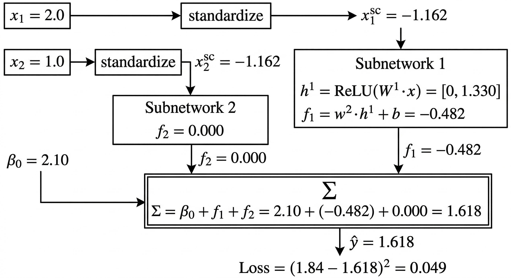
*Figure 11 — Complete forward pass for sample $i=1$ in the regression walkthrough. Each arrow traces the data flow from raw input through standardization, through independent subnetworks, to the summation node and the loss.*

#### 2.6.2 — Binary Classification Example

**Setup:** $p = 2$, $n = 3$. Subnetwork outputs after training:

| $i$ | $f_{\theta_1}(x_1^{\mathrm{sc}})$ | $f_{\theta_2}(x_2^{\mathrm{sc}})$ | $\beta_0$ | $z$ | $y$ |
|:---:|:---:|:---:|:---:|:---:|:---:|
| 1 | −1.20 | +0.80 | +0.30 | **−0.10** | 0 |
| 2 | +0.40 | +1.10 | +0.30 | **+1.80** | 1 |
| 3 | −0.05 | −0.90 | +0.30 | **−0.65** | 0 |

**Step 1 — Sigmoid transform** each logit to a probability:

$$
\hat{p}^{(1)} = \frac{1}{1+e^{0.10}} = 0.475, \quad \hat{p}^{(2)} = \frac{1}{1+e^{-1.80}} = 0.858, \quad \hat{p}^{(3)} = \frac{1}{1+e^{0.65}} = 0.341
$$

**Step 2 — Per-sample cross-entropy losses:**

$$
\ell^{(1)} = -\log(1 - 0.475) = 0.644 \quad (y=0,\; \hat{p}=0.475)
$$
$$
\ell^{(2)} = -\log(0.858) = 0.153 \quad (y=1,\; \hat{p}=0.858)
$$
$$
\ell^{(3)} = -\log(1 - 0.341) = 0.417 \quad (y=0,\; \hat{p}=0.341)
$$

**Step 3 — Total BCE Loss:**

$$
\mathcal{L}_{\mathrm{BCE}} = \frac{1}{3}(0.644 + 0.153 + 0.417) = \frac{1.214}{3} = \mathbf{0.405}
$$

All three samples are correctly classified. Note that sample 1 ($z = -0.10$, barely on the class-0 side) carries the highest individual loss, correctly reflecting the model's uncertainty about that prediction.

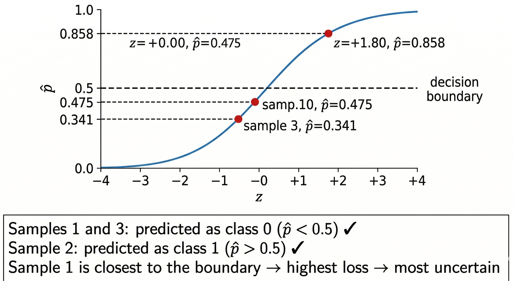
*Figure 12 — Sigmoid transformation for the three samples. Sample 2 is classified with high confidence; sample 1 is barely on the class-0 side of the boundary, which is correctly reflected in its disproportionately higher per-sample loss.*

## 3 — TinyML Implementation

With this example you can implement the machine learning algorithm in ESP32, Arduino, Arduino Portenta H7 with Vision Shield, Raspberry and other different microcontrollers or IoT devices.

### 3.1  -  Python Codes

-   Neural Additive Models (NAM)

### 3.2  -  Jupyter Notebooks

-   Neural Additive Models Training

### 3.3  -  Arduino Code

-   Exemplo 1: NAM Regression

-   Exemplo 2: NAM Binary Classification  

-   Exemplo 3: NAM Multiclass Classification

### 3.4  -  Result 

#### 3.4.1  -  Exemplo 1: NAM Regression

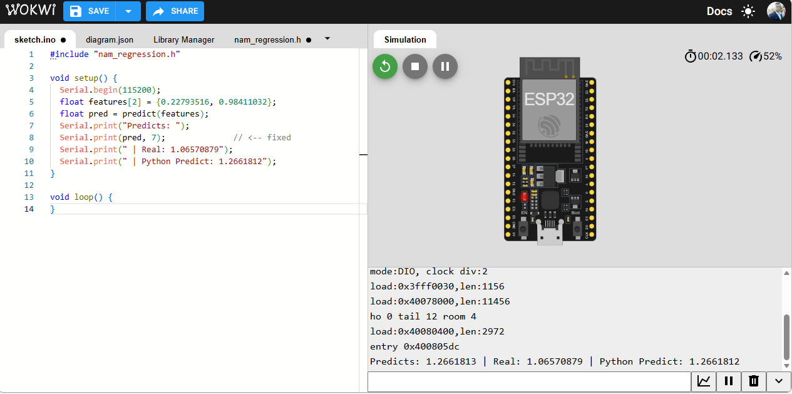

#### 3.4.2  - Exemplo 2: NAM Binary Classification

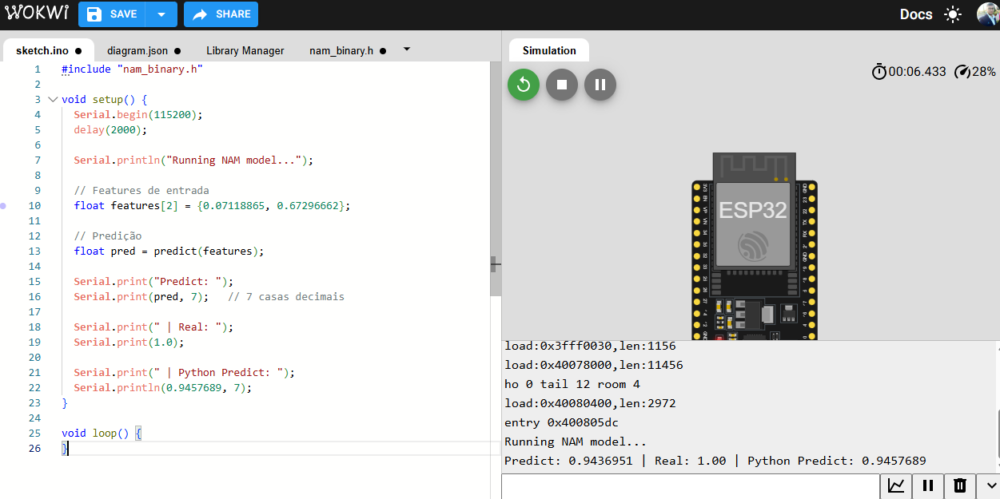

#### 3.4.3  -  Exemplo 3: NAM Multiclass Classification

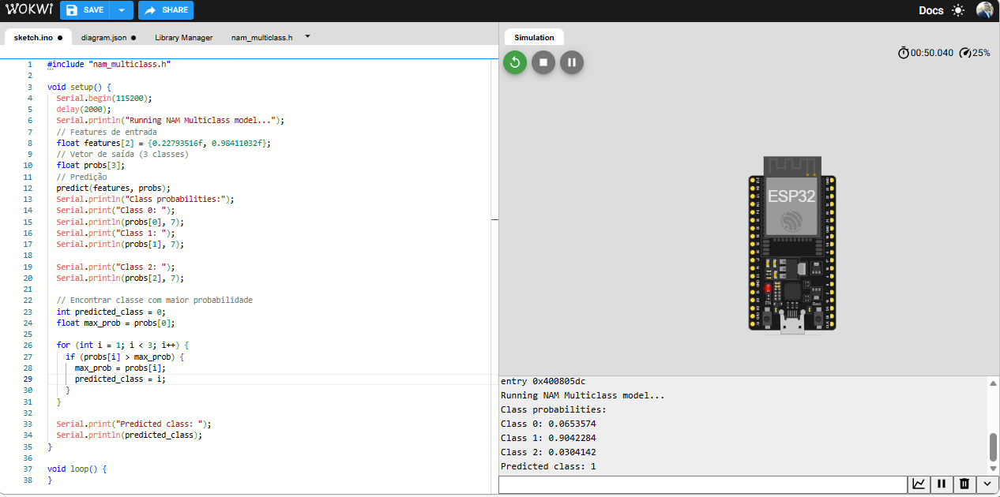

## References

[1] Agarwal, R., Melnick, L., Frosst, N., Zhang, X., Lengerich, B., Caruana, R., & Hinton, G. E. (2021). Neural Additive Models: Interpretable Machine Learning with Neural Nets. *Advances in Neural Information Processing Systems (NeurIPS)*, 34.

[2] Hastie, T., & Tibshirani, R. (1986). Generalized Additive Models. *Statistical Science*, 1(3), 297–310.

[3] Hastie, T., Tibshirani, R., & Friedman, J. (2009). *The Elements of Statistical Learning* (2nd ed.). Springer.

[4] Wood, S. N. (2017). *Generalized Additive Models: An Introduction with R* (2nd ed.). CRC Press.

[5] Cybenko, G. (1989). Approximation by superpositions of a sigmoidal function. *Mathematics of Control, Signals and Systems*, 2(4), 303–314.

[6] Hornik, K. (1991). Approximation capabilities of multilayer feedforward networks. *Neural Networks*, 4(2), 251–257.

[7] Goodfellow, I., Bengio, Y., & Courville, A. (2016). *Deep Learning*. MIT Press.

[8] Ribeiro, M. T., Singh, S., & Guestrin, C. (2016). "Why Should I Trust You?": Explaining the Predictions of Any Classifier. *KDD*, 1135–1144.

[9] Lundberg, S. M., & Lee, S.-I. (2017). A Unified Approach to Interpreting Model Predictions. *Advances in Neural Information Processing Systems*, 30.

[10] Nair, V., & Hinton, G. E. (2010). Rectified Linear Units Improve Restricted Boltzmann Machines. *ICML*, 27, 807–814.

[11] Lou, Y., Caruana, R., & Gehrke, J. (2012). Intelligible Models for Classification and Regression. *KDD*, 150–158.

[12] Caruana, R., Lou, Y., Gehrke, J., Koch, P., Sturm, M., & Elhadad, N. (2015). Intelligible Models for HealthCare: Predicting Pneumonia Risk and Hospital 30-day Readmission. *KDD*, 1721–1730.

