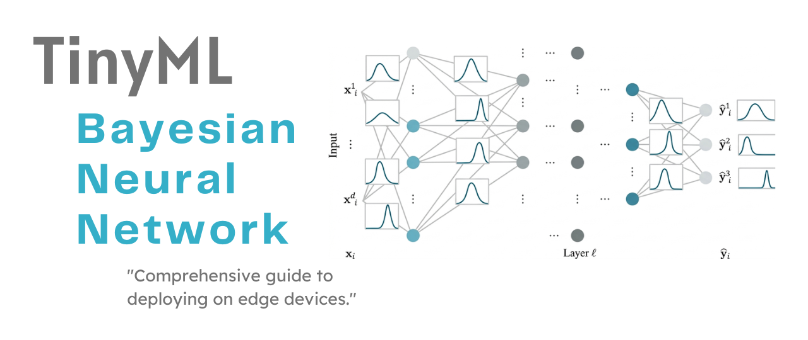
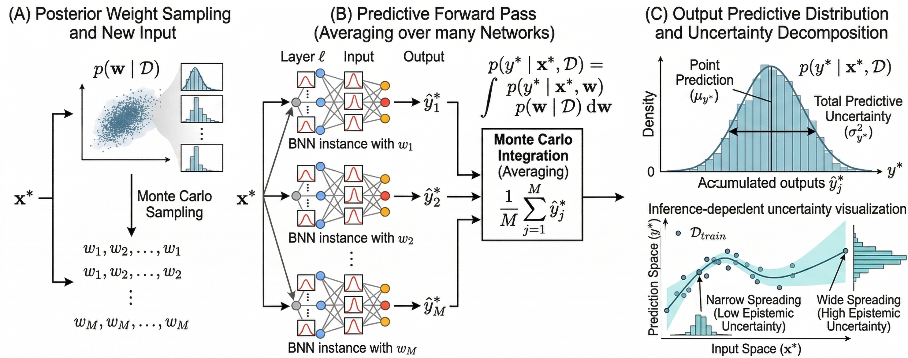
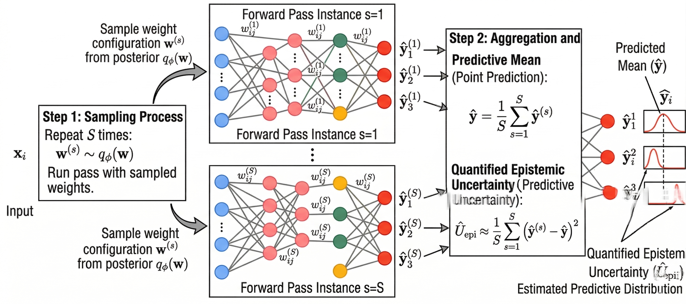
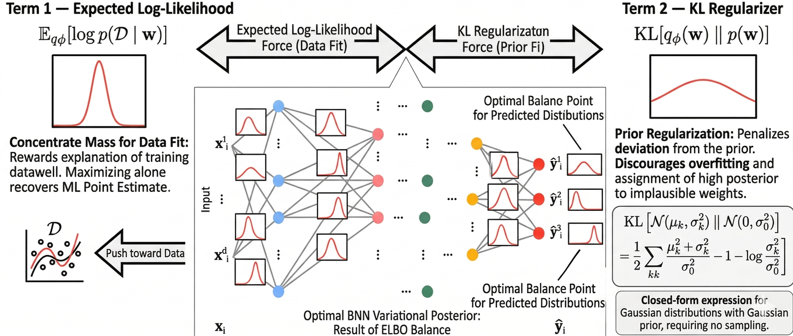
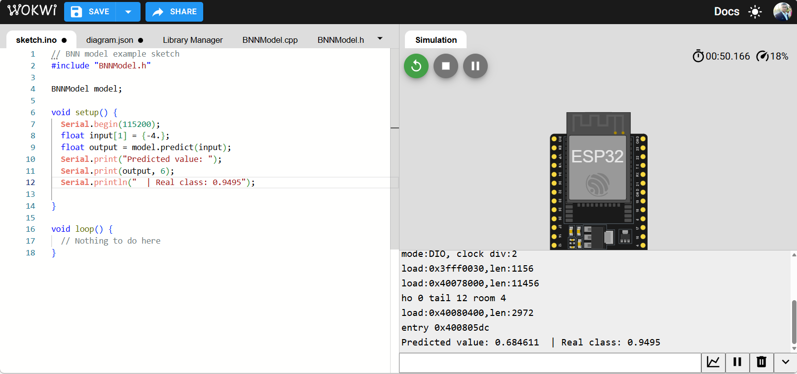
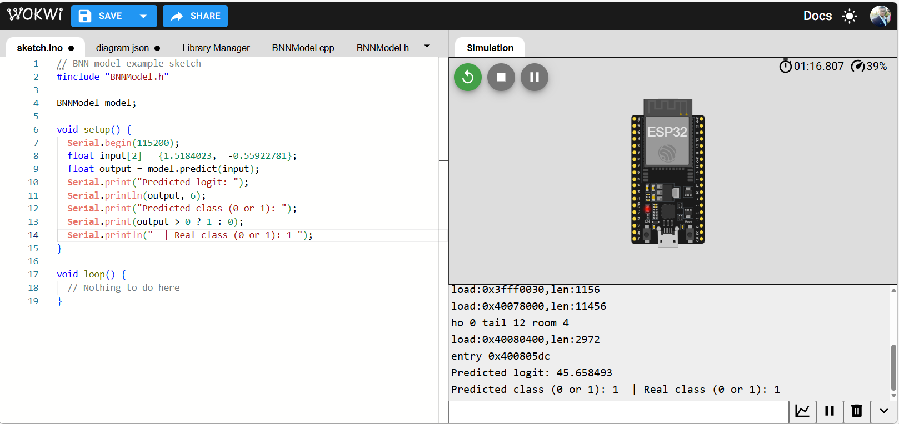

# TinyML - Bayesian Neural Networks

_From mathematical foundations to edge implementation_

**Social media:**

👨🏽‍💻 Github: [thommaskevin/TinyML](https://github.com/thommaskevin/TinyML)

👷🏾 Linkedin: [Thommas Kevin](https://www.linkedin.com/in/thommas-kevin-ab9810166/)

📽 Youtube: [Thommas Kevin](https://www.youtube.com/channel/UC7uazGXaMIE6MNkHg4ll9oA)

🧑‍🎓 Scholar: [Thommas K. S. Flores](https://scholar.google.com/citations?user=MqWV8JIAAAAJ&hl=pt-PT&authuser=2)

:pencil2: CV Lattes CNPq: [Thommas Kevin Sales Flores](http://lattes.cnpq.br/0630479458408181)

👨🏻‍🏫 Research group: [Conecta.ai](https://conect2ai.dca.ufrn.br/)

## SUMMARY

1 — Introduction

&nbsp;&nbsp;1.1 — Why Uncertainty Quantification Matters

&nbsp;&nbsp;1.2 — The Overconfidence Problem in Standard Neural Networks

&nbsp;&nbsp;1.3 — From Deterministic to Bayesian Neural Networks

2 — Mathematical Foundations

&nbsp;&nbsp;2.1 — Bayesian Inference and the Posterior Distribution

&nbsp;&nbsp;2.2 — Architecture: Probabilistic Weights

&nbsp;&nbsp;2.3 — Variational Inference and the ELBO

&nbsp;&nbsp;2.4 — The Reparameterization Trick

&nbsp;&nbsp;2.5 — The Training Process

&nbsp;&nbsp;2.6 — Predictive Uncertainty Decomposition

&nbsp;&nbsp;2.7 — Numerical Walkthrough

3 — TinyML Implementation

&nbsp;&nbsp;3.1 — Example 1: BNN Regression

&nbsp;&nbsp;3.2 — Example 2: BNN Binary Classification

&nbsp;&nbsp;3.3 — Example 3: BNN Multiclass Classification

## 1 — Introduction

Bayesian Neural Networks (BNNs) are a class of neural network architectures that combine predictive power with principled uncertainty quantification. Unlike standard deep networks, which assign a single fixed value to each weight after training, a BNN models each weight as a probability distribution. At inference time, the model therefore produces a distribution over predictions rather than a single output, enabling both a point estimate and a calibrated measure of uncertainty. This distinction allows a BNN to express how confident it is in each prediction, differentiating between regions of the input space where the training data are informative and regions where evidence is sparse.

This document develops the mathematical foundations of BNNs, beginning with the limitations of overconfident deterministic networks and progressing to the derivation of the variational training objective, the reparameterization trick, and the decomposition of predictive uncertainty. The final section explains how stochastic forward passes can be mapped to efficient embedded C implementations suitable for TinyML deployment.

### 1.1 — Why Uncertainty Quantification Matters

Consider a machine learning model that predicts whether a bridge will fail under a given load. The model achieves 97\% accuracy on historical data. However, when an engineer asks, ``How confident is the model for this specific load configuration?'', the system returns only a single value---for example, 0.94---without indicating whether that confidence is well founded or merely a spurious extrapolation into a region far from the training distribution. This is the uncertainty quantification problem.

Uncertainty quantification is the ability to associate each prediction with a reliable and calibrated measure of confidence. This is not a minor technical refinement; it is a fundamental requirement for any safety-critical deployment. A model that does not recognize the limits of its own knowledge will eventually produce overconfident errors, and such errors may be catastrophic in domains such as medicine, structural engineering, autonomous navigation, and financial risk management.

The central distinction is between two forms of uncertainty that BNNs can disentangle. Aleatoric uncertainty (data uncertainty) is irreducible: it arises from inherent noise in the data-generation or measurement process and cannot be reduced by collecting additional data. Epistemic uncertainty (model uncertainty) is reducible: it arises from limited training coverage or model misspecification, and it decreases as the model is exposed to more informative data. BNNs provide a principled probabilistic framework for representing, propagating, and decomposing both forms of uncertainty simultaneously.

### 1.2 — The Overconfidence Problem in Standard Neural Networks

A standard fully connected feedforward neural network with $L$ hidden layers learns a single deterministic mapping from inputs to outputs:

$$
\mathbf{h}^{(0)} = \mathbf{x}
$$

$$
\mathbf{h}^{(l)} = \sigma\!\left(W^{(l)}\mathbf{h}^{(l-1)} + \mathbf{b}^{(l)}\right), \quad l = 1, \ldots, L
$$

$$
\hat{y} = W^{(L+1)}\mathbf{h}^{(L)} + b^{(L+1)}
$$

After training, each weight matrix $W^{(l)}$ becomes a fixed numerical array---that is, a single point in weight space. This point estimate corresponds to the maximum-likelihood (or maximum-a-posteriori) solution obtained by gradient-based optimization. The key limitation is that such an estimate provides no explicit information about its own reliability. Even far from the training distribution, the network may still produce highly confident outputs, because it has no built-in mechanism to detect that it is extrapolating into unseen regions of the input space. This systematic overconfidence is a central failure mode that Bayesian Neural Networks are designed to address.

### 1.3 — From Deterministic to Bayesian Neural Networks

There is a fundamental distinction between frequentist and Bayesian approaches to learning. A frequentist method seeks a single best parameter setting, whereas a Bayesian method maintains a full distribution over plausible parameter values, weighting each by both its agreement with the observed data and its consistency with prior beliefs.

*Figure 1 — The transition from deterministic to Bayesian neural networks. A standard network collapses the posterior to a single point estimate (left). A BNN maintains a distribution over weights (center), producing a distribution over predictions at inference time (right). The width of the predictive distribution is the model's uncertainty.*

Bayesian Neural Networks occupy the principled probabilistic end of this spectrum. Rather than collapsing the posterior to a single point estimate, a BNN approximates the full posterior distribution over weights using variational inference. Predictions are then obtained by averaging over many plausible weight configurations---a procedure known as Monte Carlo integration. The dispersion of these predictions provides a direct and calibrated measure of the model's epistemic uncertainty for a given input.

The remainder of this document develops the mathematical framework that enables this approach.

## 2 — Mathematical Foundations

This section develops the mathematical foundations of Bayesian Neural Networks in full. We begin with the Bayesian inference framework, which provides the theoretical basis for modeling network weights as random variables. We then present the variational approximation that makes inference tractable, derive the Evidence Lower Bound (ELBO) objective, analyze the reparameterization trick that enables gradient-based optimization of stochastic objectives, and explain how the trained model yields calibrated uncertainty estimates. The section concludes with a step-by-step numerical walkthrough that makes each equation concrete.

### 2.1 — Bayesian Inference and the Posterior Distribution

The foundation of Bayesian learning is **Bayes' theorem**, applied to the model parameters $\mathbf{w}$ (the collection of all weights and biases in the network):

$$
p(\mathbf{w} \mid \mathcal{D}) = \frac{p(\mathcal{D} \mid \mathbf{w})\, p(\mathbf{w})}{p(\mathcal{D})}
$$

where:
- $p(\mathbf{w})$ is the **prior distribution** over weights — our beliefs about plausible weight values before observing any data,
- $p(\mathcal{D} \mid \mathbf{w})$ is the **likelihood** — how probable the observed dataset $\mathcal{D}$ is under a network with weights $\mathbf{w}$,
- $p(\mathcal{D}) = \int p(\mathcal{D} \mid \mathbf{w})\, p(\mathbf{w})\, d\mathbf{w}$ is the **marginal likelihood** (or model evidence) — a normalizing constant integrating over all possible weight configurations,
- $p(\mathbf{w} \mid \mathcal{D})$ is the **posterior distribution** — our updated beliefs about the weights after observing the data.

#### 2.1.1 — The Prior Distribution

The prior $p(\mathbf{w})$ encodes our beliefs about the weights before observing any training data. A standard and mathematically convenient choice is an independent Gaussian prior on each weight:

$$
p(\mathbf{w}) = \prod_{k} \mathcal{N}(w_k \mid 0, \sigma_0^2)
$$

This prior expresses the belief that weights are likely to be small (centered at zero) and that extreme weight values are unlikely. This acts as a regularizer: the influence of the prior prevents the posterior from collapsing to large-magnitude weights that perfectly fit the training data but generalize poorly — the Bayesian equivalent of $L_2$ weight decay.

#### 2.1.2 — The Likelihood Function

The likelihood $p(\mathcal{D} \mid \mathbf{w})$ measures how well a network with specific weights $\mathbf{w}$ explains the observed data. For a dataset $\mathcal{D} = \{(\mathbf{x}^{(i)}, y^{(i)})\}_{i=1}^n$, assuming independent and identically distributed observations:

$$
p(\mathcal{D} \mid \mathbf{w}) = \prod_{i=1}^n p(y^{(i)} \mid \mathbf{x}^{(i)}, \mathbf{w})
$$

The form of $p(y \mid \mathbf{x}, \mathbf{w})$ depends on the task:

- **Regression:** $p(y \mid \mathbf{x}, \mathbf{w}) = \mathcal{N}(y \mid f_\mathbf{w}(\mathbf{x}),\, \sigma_\varepsilon^2)$, where $f_\mathbf{w}(\mathbf{x})$ is the network output and $\sigma_\varepsilon^2$ is the observation noise variance.
- **Binary classification:** $p(y \mid \mathbf{x}, \mathbf{w}) = \mathrm{Bernoulli}(y \mid \sigma(f_\mathbf{w}(\mathbf{x})))$, the Bernoulli distribution parameterized by the sigmoid of the network logit.
- **Multiclass classification:** $p(y \mid \mathbf{x}, \mathbf{w}) = \mathrm{Cat}(y \mid \mathrm{softmax}(f_\mathbf{w}(\mathbf{x})))$, the categorical distribution parameterized by the softmax of the network logit vector.

#### 2.1.3 — The Intractability of the Exact Posterior

The exact posterior $p(\mathbf{w} \mid \mathcal{D})$ is generally **intractable**: the normalizing constant $p(\mathcal{D})$ requires integrating over all possible weight configurations — a multi-dimensional integral over a space whose dimensionality equals the number of network parameters. For modern architectures, this dimensionality is in the millions, and no closed-form solution exists. Exact numerical integration is computationally infeasible at this scale.

This intractability is the central challenge of Bayesian deep learning, and it motivates the variational inference approach developed in Section 2.3.

#### 2.1.4 — The Predictive Distribution

Given the posterior, predictions for a new input $\mathbf{x}^*$ are computed by **marginalizing out the weights**:

$$
p(y^* \mid \mathbf{x}^*, \mathcal{D}) = \int p(y^* \mid \mathbf{x}^*, \mathbf{w})\, p(\mathbf{w} \mid \mathcal{D})\, d\mathbf{w}
$$

This integral averages the prediction over all weight configurations, weighted by their posterior probability. The result is not a single prediction but a full **predictive distribution** — a distribution over possible outputs that encodes the model's uncertainty. The mean of this distribution is the point prediction; its variance is the total predictive uncertainty.

*Figure 2 — The predictive distribution in a BNN. For each new input $\mathbf{x}^*$, multiple weight samples are drawn from the posterior, each producing a different network output. Their empirical distribution approximates the true predictive distribution. The spread of predictions is narrow near the training data (low epistemic uncertainty) and wide far from it (high epistemic uncertainty).*

### 2.2 — Architecture: Probabilistic Weights

The architectural heart of a BNN is the replacement of each deterministic weight with a probability distribution. This section describes exactly what this means, how it is parameterized, and what mathematical guarantees it provides.

#### 2.2.1 — Weight Distributions Instead of Weight Values

In a standard neural network, each weight $w_k$ is a scalar — a single real number optimized during training. In a BNN, each weight $w_k$ is replaced by a **distribution** over real numbers. The most common and computationally tractable choice is an **independent Gaussian distribution** for each weight:

$$
q_\phi(w_k) = \mathcal{N}(w_k \mid \mu_k, \sigma_k^2)
$$

where:
- $\mu_k \in \mathbb{R}$ is the **mean** (or location) of the weight distribution — the most likely value of $w_k$,
- $\sigma_k > 0$ is the **standard deviation** (or scale) — the uncertainty about $w_k$.

The full variational distribution over all weights factorizes as:

$$
q_\phi(\mathbf{w}) = \prod_k \mathcal{N}(w_k \mid \mu_k, \sigma_k^2)
$$

This **mean-field approximation** — treating all weights as independent — is the standard simplification that makes variational inference tractable. The collection of all means and standard deviations $\phi = \{\mu_k, \sigma_k\}$ are the **variational parameters** learned during training.

#### 2.2.2 — Parameterization of Standard Deviations

Standard deviations must be strictly positive, but gradient descent operates over unconstrained real numbers. The standard solution is to parameterize $\sigma_k$ via the **softplus transformation** of an unconstrained parameter $\rho_k$:

$$
\sigma_k = \log(1 + e^{\rho_k}) = \mathrm{softplus}(\rho_k)
$$

This guarantees $\sigma_k > 0$ for all $\rho_k \in \mathbb{R}$ and allows fully unconstrained gradient-based optimization. The learned variational parameters are therefore $\phi = \{\mu_k, \rho_k\}$ for each weight, with $\sigma_k$ recovered by the softplus transformation when needed.

#### 2.2.3 — The Forward Pass at Inference Time

At inference time, a BNN does not have fixed weights. Instead, it **samples** a weight configuration $\mathbf{w}^{(s)}$ from the variational posterior and runs the standard deterministic forward pass with those sampled weights:

$$
\mathbf{w}^{(s)} \sim q_\phi(\mathbf{w}), \qquad \hat{y}^{(s)} = f_{\mathbf{w}^{(s)}}(\mathbf{x})
$$

Repeating this $S$ times produces $S$ predictions $\{\hat{y}^{(1)}, \ldots, \hat{y}^{(S)}\}$, which constitute a Monte Carlo approximation to the predictive distribution. The point prediction is the sample mean:

$$
\hat{y} = \frac{1}{S}\sum_{s=1}^{S} \hat{y}^{(s)}
$$

and the predictive epistemic uncertainty is quantified by the sample variance:

$$
\hat{U}_{\mathrm{epi}} \approx \frac{1}{S}\sum_{s=1}^{S} \left(\hat{y}^{(s)} - \hat{y}\right)^2
$$

*Figure 3 — The BNN architecture. Each weight in the network is replaced by a Gaussian distribution parameterized by a mean $\mu_k$ and standard deviation $\sigma_k$. At each forward pass, a weight sample is drawn from every distribution. Multiple forward passes produce a distribution over predictions, from which uncertainty is estimated.*

#### 2.2.4 — Number of Variational Parameters

A standard network with $P$ scalar weights has $P$ learnable parameters. A BNN with the same architecture has $2P$ variational parameters: one mean $\mu_k$ and one unconstrained scale $\rho_k$ per weight. This doubling of the parameter count is the primary computational overhead of BNNs relative to their deterministic counterparts — a modest price for principled uncertainty quantification.

### 2.3 — Variational Inference and the ELBO

Since the exact posterior $p(\mathbf{w} \mid \mathcal{D})$ is intractable, BNNs use **variational inference** to find a tractable approximation. This section derives the mathematical objective that training optimizes.

#### 2.3.1 — The Variational Approximation

Variational inference frames Bayesian inference as an **optimization problem**: instead of computing the exact posterior, we choose a family of tractable distributions $q_\phi(\mathbf{w})$ parameterized by $\phi$ and find the member of this family that is closest to the true posterior. Closeness is measured by the **Kullback-Leibler (KL) divergence**:

$$
\mathrm{KL}\!\left[q_\phi(\mathbf{w}) \,\|\, p(\mathbf{w} \mid \mathcal{D})\right] = \int q_\phi(\mathbf{w}) \log \frac{q_\phi(\mathbf{w})}{p(\mathbf{w} \mid \mathcal{D})} \, d\mathbf{w}
$$

The KL divergence is always non-negative and equals zero only when the two distributions are identical. Minimizing it with respect to $\phi$ drives $q_\phi(\mathbf{w})$ to resemble $p(\mathbf{w} \mid \mathcal{D})$ as closely as possible within the chosen distributional family.

#### 2.3.2 — Deriving the ELBO

Minimizing the KL divergence directly is impossible because it requires evaluating $p(\mathbf{w} \mid \mathcal{D})$, which is the very intractable quantity we are trying to approximate. The key insight is to instead maximize an equivalent but tractable objective.

Using the definition of the KL divergence and Bayes' theorem, and rearranging:

$$
\log p(\mathcal{D}) = \underbrace{\mathbb{E}_{q_\phi}\!\left[\log p(\mathcal{D} \mid \mathbf{w})\right] - \mathrm{KL}\!\left[q_\phi(\mathbf{w}) \,\|\, p(\mathbf{w})\right]}_{\mathrm{ELBO}(\phi)} + \mathrm{KL}\!\left[q_\phi(\mathbf{w}) \,\|\, p(\mathbf{w} \mid \mathcal{D})\right]
$$

Since $\log p(\mathcal{D})$ is a constant with respect to $\phi$ and the final KL term is non-negative, maximizing the **Evidence Lower BOund (ELBO)**:

$$
\mathrm{ELBO}(\phi) = \underbrace{\mathbb{E}_{q_\phi}\!\left[\log p(\mathcal{D} \mid \mathbf{w})\right]}_{\text{expected log-likelihood}} - \underbrace{\mathrm{KL}\!\left[q_\phi(\mathbf{w}) \,\|\, p(\mathbf{w})\right]}_{\text{KL regularizer}}
$$

is exactly equivalent to minimizing $\mathrm{KL}[q_\phi \| p(\mathbf{w} \mid \mathcal{D})]$. The ELBO is a lower bound on $\log p(\mathcal{D})$ (by the non-negativity of KL), and tightening this bound corresponds directly to improving the posterior approximation.

#### 2.3.3 — Interpretation of the ELBO

The ELBO has a clean two-term interpretation that mirrors the standard bias-variance trade-off in machine learning:

**Term 1 — Expected Log-Likelihood:** $\mathbb{E}_{q_\phi}[\log p(\mathcal{D} \mid \mathbf{w})]$. This term rewards the variational distribution for placing probability mass on weight configurations that explain the training data well. It is the Bayesian counterpart of the standard training loss (e.g., cross-entropy or MSE). Maximizing it alone would push the variational posterior to concentrate all mass on the single weight configuration that best fits the training data — recovering the maximum likelihood point estimate.

**Term 2 — KL Regularizer:** $\mathrm{KL}[q_\phi(\mathbf{w}) \| p(\mathbf{w})]$. This term penalizes the variational distribution for deviating from the prior. It acts as a regularizer that prevents overfitting by discouraging the model from assigning high posterior probability to weight configurations that are implausible under the prior. For Gaussian distributions with a Gaussian prior, this KL term has a **closed-form expression** requiring no sampling:

$$
\mathrm{KL}\!\left[\mathcal{N}(\mu_k, \sigma_k^2) \,\|\, \mathcal{N}(0, \sigma_0^2)\right] = \frac{1}{2}\left[\frac{\mu_k^2 + \sigma_k^2}{\sigma_0^2} - 1 - \log\frac{\sigma_k^2}{\sigma_0^2}\right]
$$

Summing this over all $k$ weights gives the total KL regularization term in closed form.

*Figure 4 — The ELBO as the balance between data fit and prior regularization. The expected log-likelihood pushes the variational posterior toward weight configurations that explain the data. The KL term pulls it back toward the prior. The optimal variational posterior balances these two competing forces, with the balance point determined by the size of the dataset.*

### 2.4 — The Reparameterization Trick

To maximize the ELBO using gradient descent, we need to differentiate through an **expectation over a random variable** — a step that is not immediately feasible because the randomness blocks direct backpropagation.

#### 2.4.1 — The Problem with Naive Monte Carlo Gradients

The expected log-likelihood can be approximated by Monte Carlo sampling:

$$
\mathbb{E}_{q_\phi}\!\left[\log p(\mathcal{D} \mid \mathbf{w})\right] \approx \frac{1}{S}\sum_{s=1}^S \log p(\mathcal{D} \mid \mathbf{w}^{(s)}), \qquad \mathbf{w}^{(s)} \sim q_\phi(\mathbf{w})
$$

The difficulty arises in computing $\partial / \partial \phi$ of this expression. The samples $\mathbf{w}^{(s)}$ depend on $\phi$ through the sampling distribution $q_\phi$, so the gradient cannot simply pass through the discrete sampling operation. The **score function estimator** (REINFORCE) yields an unbiased gradient but with extremely high variance, making training unstable in practice.

#### 2.4.2 — The Reparameterization Trick

The reparameterization trick solves this problem by **re-expressing the random variable** in terms of a deterministic function of the variational parameters and a separate noise variable $\varepsilon$ drawn from a fixed, parameter-free distribution:

$$
w_k = \mu_k + \sigma_k \cdot \varepsilon_k, \qquad \varepsilon_k \sim \mathcal{N}(0, 1)
$$

This expression is mathematically equivalent to sampling $w_k \sim \mathcal{N}(\mu_k, \sigma_k^2)$, but the randomness is now **isolated in $\varepsilon_k$**, which does not depend on $\phi$. The dependence on $\phi = \{\mu_k, \sigma_k\}$ is now explicit and differentiable:

$$
\frac{\partial w_k}{\partial \mu_k} = 1, \qquad \frac{\partial w_k}{\partial \sigma_k} = \varepsilon_k
$$

Gradients can now flow through the weight sampling step via standard backpropagation. The network processes inputs with sampled weights, the loss is computed, and gradients with respect to $\mu_k$ and $\rho_k$ are obtained by automatic differentiation exactly as in any deterministic network.

*Figure 5 — The reparameterization trick. Left: naive sampling creates a discontinuity in the gradient path, blocking backpropagation. Right: expressing $w_k = \mu_k + \sigma_k \cdot \varepsilon_k$ isolates the stochasticity in a fixed noise variable $\varepsilon_k \sim \mathcal{N}(0,1)$, making the dependence on $\mu_k$ and $\sigma_k$ explicit and differentiable throughout.*

#### 2.4.3 — The Full Reparameterized Training Loss

With the reparameterization trick, the training loss (negative ELBO) is:

$$
\mathcal{L}_{\mathrm{BNN}}(\phi) = -\mathbb{E}_{\varepsilon \sim \mathcal{N}(\mathbf{0},\mathbf{I})}\!\left[\log p(\mathcal{D} \mid \boldsymbol{\mu} + \boldsymbol{\sigma} \odot \boldsymbol{\varepsilon})\right] + \mathrm{KL}\!\left[q_\phi(\mathbf{w}) \,\|\, p(\mathbf{w})\right]
$$

where $\odot$ denotes element-wise multiplication. The expectation is approximated by a single forward pass per training step ($S=1$), which is unbiased and sufficient for large mini-batches. In practice, $S \in [1, 10]$ samples per step are commonly used, with larger $S$ reducing gradient variance at the cost of increased computation.

### 2.5 — The Training Process

All variational parameters $\phi = \{\mu_k, \rho_k\}$ are learned jointly by minimizing $\mathcal{L}_{\mathrm{BNN}}(\phi)$ over the training dataset.

#### 2.5.1 — Mini-Batch Training and KL Scaling

When using mini-batches of size $B \ll n$, the expected log-likelihood is estimated on a fraction of the data, but the KL term is a global property of the full variational posterior. To maintain the correct balance between the two ELBO terms, the per-sample loss used in each mini-batch update is:

$$
\mathcal{L}_{\mathrm{BNN}}^{\mathrm{batch}}(\phi) = -\frac{1}{B}\sum_{i \in \mathcal{B}} \log p(y^{(i)} \mid \mathbf{x}^{(i)}, \mathbf{w}^{(s)}) + \frac{1}{n}\,\mathrm{KL}\!\left[q_\phi(\mathbf{w}) \,\|\, p(\mathbf{w})\right]
$$

The factor $1/n$ ensures that the KL contribution is normalized to one data point, consistent with the per-sample log-likelihood term. Alternatively, a **KL annealing** schedule can gradually increase the weight of the KL term from 0 to 1 during early training, preventing the optimizer from being dominated by the prior at the beginning of training when predictions are still poor.

#### 2.5.2 — The Training Loop

The complete training procedure follows the standard stochastic gradient descent pipeline with the key modification of sampling weights at each forward pass:

1. **Sample noise:** draw $\boldsymbol{\varepsilon}^{(s)} \sim \mathcal{N}(\mathbf{0}, \mathbf{I})$.
2. **Compute weights:** $\mathbf{w}^{(s)} = \boldsymbol{\mu} + \boldsymbol{\sigma} \odot \boldsymbol{\varepsilon}^{(s)}$.
3. **Forward pass:** compute predictions $\hat{y}^{(s)}$ using the sampled weights $\mathbf{w}^{(s)}$.
4. **Loss computation:** evaluate $\mathcal{L}_{\mathrm{BNN}}^{\mathrm{batch}}(\phi)$ using the closed-form KL term.
5. **Backward pass:** compute $\partial \mathcal{L} / \partial \boldsymbol{\mu}$ and $\partial \mathcal{L} / \partial \boldsymbol{\rho}$ via automatic differentiation.
6. **Parameter update:** apply an optimizer (e.g., Adam) to update $\boldsymbol{\mu}$ and $\boldsymbol{\rho}$.
7. **Repeat** over many mini-batches and epochs until convergence.

*Figure 6 — The BNN training loop. At each iteration, a noise vector $\boldsymbol{\varepsilon}$ is drawn and used to produce a weight sample via the reparameterization. The standard forward and backward passes then proceed, simultaneously updating both the mean and standard deviation parameters of every weight distribution. The closed-form KL term is added to the gradient analytically.*

#### 2.5.3 — Regression Loss: Gaussian Negative Log-Likelihood

For a continuous response $y \in \mathbb{R}$, the network output is the predicted mean $\hat{y}^{(s)} = f_{\mathbf{w}^{(s)}}(\mathbf{x})$, and the per-sample likelihood is:

$$
p(y \mid \mathbf{x}, \mathbf{w}^{(s)}) = \mathcal{N}(y \mid \hat{y}^{(s)}, \sigma_\varepsilon^2)
$$

The negative log-likelihood (up to constants) reduces to the **Mean Squared Error**:

$$
-\log p(y \mid \mathbf{x}, \mathbf{w}^{(s)}) = \frac{(y - \hat{y}^{(s)})^2}{2\sigma_\varepsilon^2} + \frac{1}{2}\log(2\pi\sigma_\varepsilon^2)
$$

The observation noise variance $\sigma_\varepsilon^2$ can be fixed as a hyperparameter or predicted as an additional network output (**heteroscedastic regression**), in which case the network simultaneously learns to fit the data mean and to estimate its own aleatoric uncertainty per sample.

#### 2.5.4 — Binary Classification Loss: Binary Cross-Entropy

For a binary response $y \in \{0, 1\}$, the network output is a scalar logit $z^{(s)} = f_{\mathbf{w}^{(s)}}(\mathbf{x})$, and the predicted probability of class 1 is:

$$
\hat{p}^{(s)} = \sigma(z^{(s)}) = \frac{1}{1 + e^{-z^{(s)}}}
$$

The negative log-likelihood is the **Binary Cross-Entropy**:

$$
-\log p(y \mid \mathbf{x}, \mathbf{w}^{(s)}) = -y\log\hat{p}^{(s)} - (1-y)\log(1-\hat{p}^{(s)})
$$

#### 2.5.5 — Multiclass Classification Loss: Categorical Cross-Entropy

For a multiclass response with $C$ classes, the network outputs a $C$-dimensional logit vector $\mathbf{z}^{(s)} = f_{\mathbf{w}^{(s)}}(\mathbf{x})$, and the predicted class probabilities are given by the **softmax** transformation:

$$
\hat{p}_c^{(s)} = \frac{\exp(z_c^{(s)})}{\sum_{c'=1}^C \exp(z_{c'}^{(s)})}, \qquad c = 1, \ldots, C
$$

The negative log-likelihood is the **Categorical Cross-Entropy**:

$$
-\log p(y \mid \mathbf{x}, \mathbf{w}^{(s)}) = -\sum_{c=1}^C \mathbf{1}[y = c]\, \log \hat{p}_c^{(s)}
$$

This loss is equivalent to maximizing the log-likelihood under the categorical model — a classical result from statistical learning theory.

### 2.6 — Predictive Uncertainty Decomposition

The most powerful and distinctive feature of a trained BNN is its ability to produce **calibrated, decomposed uncertainty estimates** for any prediction. This section describes the mathematical structure of predictive uncertainty and how it is estimated in practice.

#### 2.6.1 — Total Predictive Uncertainty

For a new input $\mathbf{x}^*$, the total predictive variance can be decomposed by the **law of total variance**:

$$
\mathrm{Var}[y^* \mid \mathbf{x}^*, \mathcal{D}] = \underbrace{\mathbb{E}_{q_\phi}\!\left[\mathrm{Var}[y^* \mid \mathbf{x}^*, \mathbf{w}]\right]}_{\text{aleatoric uncertainty}} + \underbrace{\mathrm{Var}_{q_\phi}\!\left[\mathbb{E}[y^* \mid \mathbf{x}^*, \mathbf{w}]\right]}_{\text{epistemic uncertainty}}
$$

These two components have fundamentally different meanings and practical implications:

- **Aleatoric uncertainty** reflects noise inherent to the data-generating process. It represents the irreducible floor of uncertainty — even a model with infinite training data and perfect parameters would face this uncertainty. In regression, it corresponds to $\sigma_\varepsilon^2$; in classification, it reflects the inherent ambiguity between classes.
- **Epistemic uncertainty** reflects the model's ignorance about which parameter configuration best describes the data. It is high in regions far from the training data and decreases as more relevant observations become available. This is the component that can be reduced by collecting more data in the relevant region of the input space.

#### 2.6.2 — Monte Carlo Estimation

Both components are estimated from $S$ Monte Carlo forward passes:

$$
\mathbf{w}^{(s)} \sim q_\phi(\mathbf{w}), \qquad \hat{y}^{(s)} = f_{\mathbf{w}^{(s)}}(\mathbf{x}^*), \qquad s = 1, \ldots, S
$$

**Predictive mean:**

$$
\bar{y} = \frac{1}{S}\sum_{s=1}^S \hat{y}^{(s)}
$$

**Epistemic uncertainty** (variance of mean predictions across weight samples):

$$
\hat{U}_{\mathrm{epi}} = \frac{1}{S}\sum_{s=1}^S (\hat{y}^{(s)} - \bar{y})^2
$$

**Aleatoric uncertainty** (for heteroscedastic regression, where the network predicts per-sample noise variance $\hat{\sigma}_\varepsilon^{2(s)}$):

$$
\hat{U}_{\mathrm{alea}} = \frac{1}{S}\sum_{s=1}^S \hat{\sigma}_\varepsilon^{2(s)}
$$

**Total uncertainty:**

$$
\hat{U}_{\mathrm{total}} = \hat{U}_{\mathrm{epi}} + \hat{U}_{\mathrm{alea}}
$$

*Figure 7 — Uncertainty decomposition in a BNN regression model. The total predictive uncertainty (outer band) separates into aleatoric uncertainty (inner, irreducible floor) and epistemic uncertainty (outer increment, which grows far from the training data). A deterministic network would produce neither component.*

#### 2.6.3 — Uncertainty in Classification

For classification tasks, predictive uncertainty is quantified by the **entropy** of the predictive distribution averaged over Monte Carlo samples. For $C$ classes, the mean predicted probability of class $c$ is:

$$
\bar{p}_c = \frac{1}{S}\sum_{s=1}^S \hat{p}_c^{(s)}
$$

and the **total predictive entropy** is:

$$
H[y^* \mid \mathbf{x}^*, \mathcal{D}] = -\sum_{c=1}^C \bar{p}_c \log \bar{p}_c
$$

The **epistemic component** (mutual information between the prediction and the weights) is obtained by subtracting the mean per-sample entropy:

$$
I[y^*, \mathbf{w} \mid \mathbf{x}^*, \mathcal{D}] = H[y^* \mid \mathbf{x}^*, \mathcal{D}] - \frac{1}{S}\sum_{s=1}^S \left(-\sum_{c=1}^C \hat{p}_c^{(s)} \log \hat{p}_c^{(s)}\right)
$$

High mutual information indicates that different weight samples produce very different class distributions — a signature of epistemic uncertainty. Low mutual information indicates all weight samples agree — the model is epistemically confident, even if aleatoric noise makes the classification genuinely ambiguous.

#### 2.6.4 — Out-of-Distribution Detection

A key practical advantage of BNNs is the ability to flag **out-of-distribution (OOD) inputs** — inputs that lie far from the training distribution, where the model should not be trusted. For such inputs, the variational posterior provides little guidance, and the predictive variance (epistemic uncertainty) becomes large. A simple and effective OOD detector thresholds the epistemic uncertainty:

$$
\text{flag as OOD if } \hat{U}_{\mathrm{epi}}(\mathbf{x}^*) > \tau
$$

where $\tau$ is a calibration threshold set on a held-out validation set. This capability is absent from all deterministic models, which may assign high-confidence predictions to OOD inputs with no mechanism to indicate that such confidence is unwarranted.

*Figure 8 — Out-of-distribution detection using BNN epistemic uncertainty. In-distribution inputs (center) receive low epistemic uncertainty and accurate predictions. Inputs far from the training distribution receive high epistemic uncertainty, correctly flagging them as unreliable predictions regardless of the raw output value.*

### 2.7 — Numerical Walkthrough

This section traces the full computation of the BNN forward pass, loss, and uncertainty estimation step by step for small examples. The goal is to make every equation completely concrete before moving to implementation.

#### 2.7.1 — Regression Example

**Setup:** $p = 2$ features, $n = 4$ training samples, 1 hidden layer with $d = 2$ hidden units.

**Raw data:**

| $i$ | $x_1$ | $x_2$ | $y$ (target) |
|:---:|:---:|:---:|:---:|
| 1 | 1.0 | 2.0 | 3.10 |
| 2 | 2.0 | 4.0 | 5.85 |
| 3 | 3.0 | 6.0 | 8.72 |
| 4 | 4.0 | 8.0 | 11.50 |

**Step 1 — Variational parameters.** Consider a single weight $w_1$ connecting input $x_1$ to the first hidden unit, with learned parameters $\mu_1 = 0.80$ and $\rho_1 = -1.50$:

$$
\sigma_1 = \mathrm{softplus}(-1.50) = \log(1 + e^{-1.50}) \approx 0.201
$$

**Step 2 — Reparameterization.** Draw noise $\varepsilon_1 \sim \mathcal{N}(0,1)$; suppose $\varepsilon_1 = 0.75$. The sampled weight is:

$$
w_1^{(s)} = \mu_1 + \sigma_1 \cdot \varepsilon_1 = 0.80 + 0.201 \times 0.75 = \mathbf{0.951}
$$

**Step 3 — Forward pass with sampled weights.** Using toy sampled weights for sample $i=1$, with input $\mathbf{x}^{(1)} = [1.0,\; 2.0]^\top$ and a sampled weight matrix $W^{(1)s} = \begin{bmatrix}0.95 & 0.42\\ -0.31 & 0.87\end{bmatrix}$, bias $\mathbf{b}^{(1)s} = [0.1,\; -0.05]^\top$:

*Hidden layer — apply linear transform and ReLU:*

$$
\mathbf{h}^{(1)} = \mathrm{ReLU}\!\left(\begin{bmatrix}0.95(1.0) + 0.42(2.0) + 0.1\\ -0.31(1.0) + 0.87(2.0) - 0.05\end{bmatrix}\right) = \mathrm{ReLU}\!\left(\begin{bmatrix}1.89\\ 1.38\end{bmatrix}\right) = \begin{bmatrix}1.89\\ 1.38\end{bmatrix}
$$

*Output layer* with sampled weights $\mathbf{w}^{(2)s} = [1.52,\; 0.93]^\top$ and $b^{(2)s} = 0.20$:

$$
\hat{y}^{(s)} = [1.52,\; 0.93] \cdot [1.89,\; 1.38]^\top + 0.20 = 2.875 + 1.283 + 0.20 = \mathbf{4.358}
$$

**Step 4 — Loss computation.** The true target is $y^{(1)} = 3.10$. With $\sigma_\varepsilon^2 = 1.0$:

$$
-\log p(y^{(1)} \mid \mathbf{x}^{(1)}, \mathbf{w}^{(s)}) = \frac{(3.10 - 4.358)^2}{2} = 0.792
$$

The closed-form KL for $w_1$ alone (with $\sigma_0 = 1.0$):

$$
\mathrm{KL}\!\left[\mathcal{N}(0.80,\; 0.201^2)\,\|\,\mathcal{N}(0,1)\right] = \frac{1}{2}\!\left[0.80^2 + 0.201^2 - 1 - \log(0.201^2)\right] \approx 1.448
$$

Summing across all weights and applying the mini-batch scaling completes the total ELBO loss for this update step.

**Step 5 — Uncertainty estimation.** Repeating the forward pass $S = 5$ times with independent noise samples:

| $s$ | $\hat{y}^{(s)}$ |
|:---:|:---:|
| 1 | 4.358 |
| 2 | 3.891 |
| 3 | 4.612 |
| 4 | 3.712 |
| 5 | 4.097 |

$$
\bar{y} = \frac{1}{5}(4.358 + 3.891 + 4.612 + 3.712 + 4.097) = \mathbf{4.134}
$$

$$
\hat{U}_{\mathrm{epi}} = \frac{1}{5}\sum_{s=1}^5 (\hat{y}^{(s)} - 4.134)^2 = \mathbf{0.112}
$$

The epistemic uncertainty $\hat{U}_{\mathrm{epi}} = 0.112$ quantifies how much the prediction varies across plausible weight settings for this input.

*Figure 9 — Complete forward pass for sample $i=1$ in the regression walkthrough. Five weight samples (one per column, drawn via reparameterization) each produce a different prediction. Their mean is the point estimate; their variance is the epistemic uncertainty. The true target is shown for reference.*

#### 2.7.2 — Binary Classification Example

**Setup:** $p = 2$, $n = 3$. After $S = 3$ Monte Carlo weight samples, the sampled logits and predicted probabilities for sample $i=1$ (true label $y^{(1)} = 0$) are:

| $s$ | $z^{(s)}$ | $\hat{p}^{(s)} = \sigma(z^{(s)})$ |
|:---:|:---:|:---:|
| 1 | −0.45 | 0.389 |
| 2 | −0.12 | 0.470 |
| 3 | −0.78 | 0.315 |

**Predictive probability** (mean over samples):

$$
\bar{p} = \frac{1}{3}(0.389 + 0.470 + 0.315) = \mathbf{0.391}
$$

The prediction $\bar{p} = 0.391 < 0.5$ is correctly on the class-0 side. The spread of the three samples $\{0.389, 0.470, 0.315\}$ indicates moderate epistemic uncertainty about this borderline case.

**Predictive entropy:**

$$
H = -(0.391\log 0.391 + 0.609\log 0.609) \approx \mathbf{0.680} \text{ nats}
$$

**Binary cross-entropy loss** using the mean prediction:

$$
\mathcal{L}_{\mathrm{BCE}} = -\log(1 - 0.391) = -\log(0.609) = \mathbf{0.496}
$$

The relatively high entropy (maximum for binary is $\log 2 \approx 0.693$ nats) correctly reflects the model's genuine uncertainty about this sample, which lies near the decision boundary.

*Figure 10 — Predictive distribution for the binary classification walkthrough. Three Monte Carlo weight samples produce three probability estimates (dots). Their mean $\bar{p} = 0.391$ is the point prediction (correctly class 0); the spread around the mean quantifies epistemic uncertainty. The dashed line at 0.5 is the decision boundary.*

#### 2.7.3 — Multiclass Classification Example

**Setup:** $C = 3$ classes (e.g., three species), $S = 3$ Monte Carlo passes for a test sample.

| $s$ | $z_1^{(s)}$ | $z_2^{(s)}$ | $z_3^{(s)}$ | $\hat{\mathbf{p}}^{(s)} = \mathrm{softmax}(\mathbf{z}^{(s)})$ |
|:---:|:---:|:---:|:---:|:---:|
| 1 | 1.20 | 0.30 | −0.50 | [0.612, 0.274, 0.114] |
| 2 | 0.95 | 0.45 | −0.40 | [0.531, 0.323, 0.146] |
| 3 | 1.40 | 0.10 | −0.65 | [0.672, 0.241, 0.087] |

**Mean predictive probabilities:**

$$
\bar{\mathbf{p}} = \frac{1}{3}\!\left([0.612,0.274,0.114] + [0.531,0.323,0.146] + [0.672,0.241,0.087]\right) = [0.605,\; 0.279,\; 0.116]
$$

**Predicted class:** $\hat{c} = \arg\max_c \bar{p}_c = 1$ (class 1, with $\bar{p}_1 = 0.605$).

**Total predictive entropy:**

$$
H = -(0.605\log 0.605 + 0.279\log 0.279 + 0.116\log 0.116) \approx \mathbf{0.982} \text{ nats}
$$

The maximum possible entropy for three classes is $\log 3 \approx 1.099$ nats. An entropy of 0.982 nats — close to the maximum — indicates that the model is not highly confident in its prediction, correctly reflecting genuine uncertainty about this particular input.

**Mutual information (epistemic component):**

The mean per-sample entropy is:

$$
\frac{1}{3}\sum_{s=1}^3 H[\hat{\mathbf{p}}^{(s)}] \approx \frac{1}{3}(0.944 + 1.006 + 0.881) = 0.944 \text{ nats}
$$

$$
I[y^*, \mathbf{w} \mid \mathbf{x}^*] = H[\bar{\mathbf{p}}] - \frac{1}{3}\sum_{s=1}^3 H[\hat{\mathbf{p}}^{(s)}] = 0.982 - 0.944 = \mathbf{0.038} \text{ nats}
$$

The low mutual information indicates that while the total entropy is high (the model is uncertain), this uncertainty is primarily **aleatoric** — the different weight samples agree on similar class distributions, and the uncertainty reflects inherent ambiguity in the input rather than lack of data.

*Figure 11 — Predictive distribution for the multiclass classification walkthrough. Three Monte Carlo weight samples produce three softmax vectors (stacked bars). Their element-wise mean forms the predictive probability vector $\bar{\mathbf{p}}$. The entropy of $\bar{\mathbf{p}}$ measures total uncertainty; the mutual information separates the epistemic component.*

## 3 — TinyML Implementation

With this example you can implement the machine learning algorithm in ESP32, Arduino, Arduino Portenta H7 with Vision Shield, Raspberry and other different microcontrollers or IoT devices.

> **Implementation note on stochastic inference at the edge:** In a TinyML deployment, the BNN performs $S$ forward passes per prediction, each using independently sampled weights. For each pass, a Gaussian noise sample $\varepsilon_k \sim \mathcal{N}(0,1)$ is generated for every weight using a lightweight Box-Muller transform or a precomputed noise table, scaled by the learned $\sigma_k$, and added to $\mu_k$ before executing the standard deterministic forward pass. The learned variational parameters $\{\mu_k, \sigma_k\}$ for all weights are stored in flash memory as two separate arrays. The mean of the $S$ outputs is the point prediction; their variance is the real-time epistemic uncertainty estimate available directly on the microcontroller.

### 3.1 — Python Codes

-  Bayesian Neural Network (BNN)

### 3.2 — Jupyter Notebooks

-  Bayesian Neural Network Training

### 3.3 — Arduino Code

-  Example 1: BNN Regression

-  Example 2: BNN Binary Classification

-  Example 3: BNN Multiclass Classification

### 3.4 — Results

#### 3.4.1 — Example 1: BNN Regression

#### 3.4.2 — Example 2: BNN Binary Classification

#### 3.4.3 — Example 3: BNN Multiclass Classification

## References

[1] Blundell, C., Cornebise, J., Kavukcuoglu, K., & Wierstra, D. (2015). Weight Uncertainty in Neural Networks. *Proceedings of the 32nd International Conference on Machine Learning (ICML)*, 37, 1613–1622.

[2] Graves, A. (2011). Practical Variational Inference for Neural Networks. *Advances in Neural Information Processing Systems (NeurIPS)*, 24, 2348–2356.

[3] Kingma, D. P., & Welling, M. (2014). Auto-Encoding Variational Bayes. *Proceedings of the 2nd International Conference on Learning Representations (ICLR)*.

[4] Gal, Y., & Ghahramani, Z. (2016). Dropout as a Bayesian Approximation: Representing Model Uncertainty in Deep Learning. *Proceedings of the 33rd International Conference on Machine Learning (ICML)*, 48, 1050–1059.

[5] MacKay, D. J. C. (1992). A Practical Bayesian Framework for Backpropagation Networks. *Neural Computation*, 4(3), 448–472.

[6] Neal, R. M. (1996). *Bayesian Learning for Neural Networks*. Springer.

[7] Kendall, A., & Gal, Y. (2017). What Uncertainties Do We Need in Bayesian Deep Learning for Computer Vision? *Advances in Neural Information Processing Systems (NeurIPS)*, 30.

[8] Lakshminarayanan, B., Pritzel, A., & Blundell, C. (2017). Simple and Scalable Predictive Uncertainty Estimation using Deep Ensembles. *Advances in Neural Information Processing Systems (NeurIPS)*, 30.

[9] Jordan, M. I., Ghahramani, Z., Jaakkola, T. S., & Saul, L. K. (1999). An Introduction to Variational Methods for Graphical Models. *Machine Learning*, 37(2), 183–233.

[10] Hinton, G. E., & van Camp, D. (1993). Keeping the Neural Networks Simple by Minimizing the Description Length of the Weights. *Proceedings of the 6th Annual Conference on Computational Learning Theory (COLT)*, 5–13.

[11] Goodfellow, I., Bengio, Y., & Courville, A. (2016). *Deep Learning*. MIT Press.

[12] Bishop, C. M. (2006). *Pattern Recognition and Machine Learning*. Springer.

[13] Wainwright, M. J., & Jordan, M. I. (2008). Graphical Models, Exponential Families, and Variational Inference. *Foundations and Trends in Machine Learning*, 1(1–2), 1–305.

[14] Jospin, L. V., Laga, H., Boussaid, F., Buntine, W., & Bennamoun, M. (2022). Hands-on Bayesian Neural Networks — A Tutorial for Deep Learning Users. *IEEE Computational Intelligence Magazine*, 17(2), 29–48.
