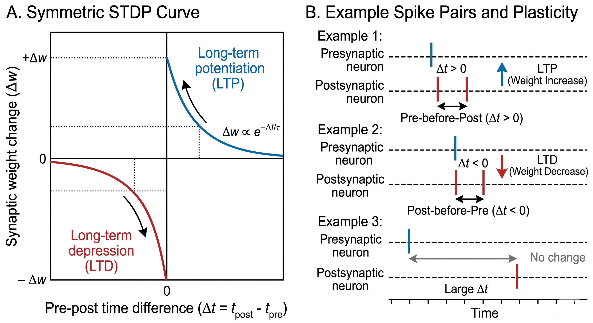
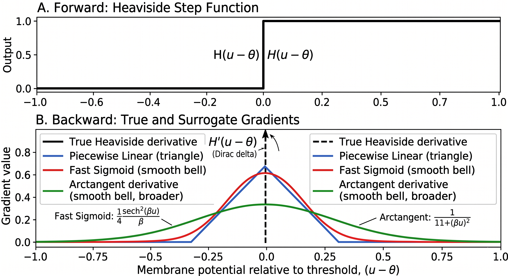
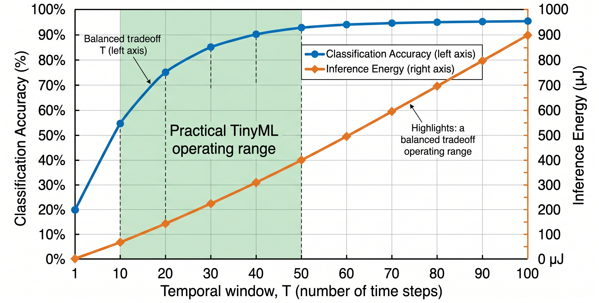
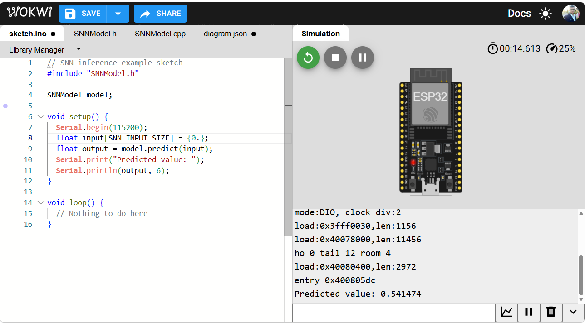
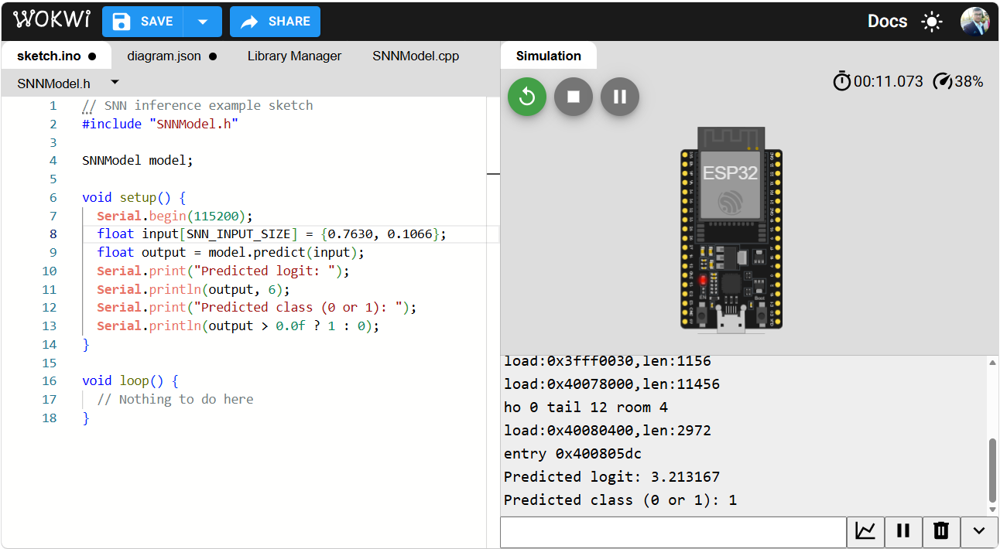
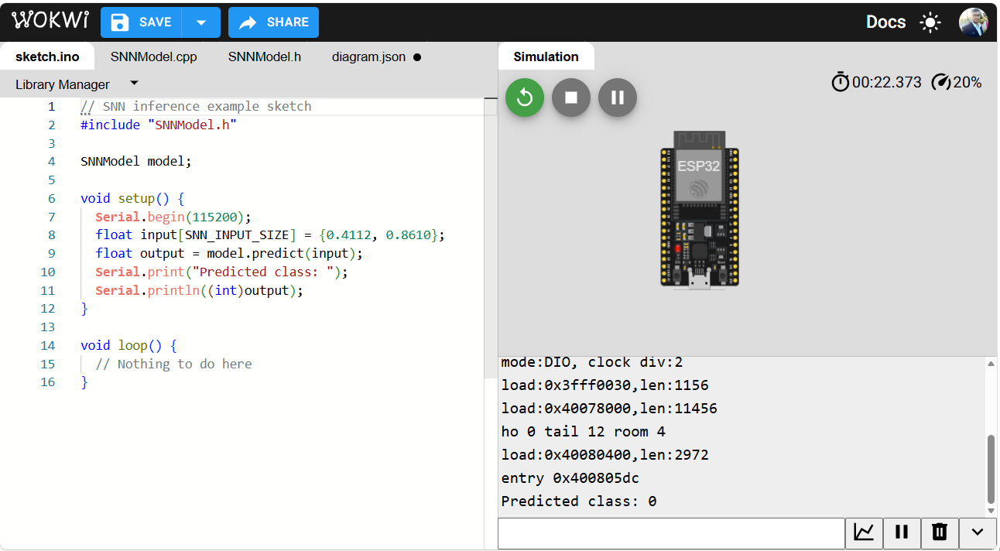

# TinyML - Spiking Neural Networks

_From biological foundations to edge implementation_

**Social media:**

👨🏽‍💻 Github: [thommaskevin/TinyML](https://github.com/thommaskevin/TinyML)

👷🏾 Linkedin: [Thommas Kevin](https://www.linkedin.com/in/thommas-kevin-ab9810166/)

📽 Youtube: [Thommas Kevin](https://www.youtube.com/channel/UC7uazGXaMIE6MNkHg4ll9oA)

🧑‍🎓 Scholar: [Thommas K. S. Flores](https://scholar.google.com/citations?user=MqWV8JIAAAAJ&hl=pt-PT&authuser=2)

:pencil2: CV Lattes CNPq: [Thommas Kevin Sales Flores](http://lattes.cnpq.br/0630479458408181)

👨🏻‍🏫 Research group: [Conecta.ai](https://conect2ai.dca.ufrn.br/)

> **Figure 0 — Image prompt:**
> "A conceptual scientific illustration of a spiking neural network. Stylized neurons connected by axons emit discrete voltage spikes shown as sharp vertical pulses on a time axis. The color palette uses deep blue for neuron bodies and bright cyan for spike events, against a dark background. The overall aesthetic is clean, technical, and suitable for an academic publication cover."

## SUMMARY

1 — Introduction

&nbsp;&nbsp;1.1 — Why Temporal Coding Matters

&nbsp;&nbsp;1.2 — The Energy Efficiency Problem in Standard Neural Networks

&nbsp;&nbsp;1.3 — From Rate-Coded to Spiking Neural Networks

2 — Mathematical Foundations

&nbsp;&nbsp;2.1 — Neuron Models and the Leaky Integrate-and-Fire Framework

&nbsp;&nbsp;2.2 — Architecture: Spike Encoding and Decoding

&nbsp;&nbsp;2.3 — Synaptic Dynamics and Spike-Timing-Dependent Plasticity

&nbsp;&nbsp;2.4 — Surrogate Gradient Methods

&nbsp;&nbsp;2.5 — The Training Process

&nbsp;&nbsp;2.6 — Temporal Information Representation

&nbsp;&nbsp;2.7 — Numerical Walkthrough

3 — TinyML Implementation

&nbsp;&nbsp;3.1 — Example 1: SNN Regression

&nbsp;&nbsp;3.2 — Example 2: SNN Binary Classification

&nbsp;&nbsp;3.3 — Example 3: SNN Multiclass Classification

## 1 — Introduction

Spiking Neural Networks (SNNs) are a class of neural network architectures that process information through discrete voltage events, called spikes, distributed over time. Unlike standard artificial neural networks, which propagate continuous-valued activations at every layer on every forward pass, an SNN neuron remains silent until its internal membrane potential crosses a threshold, at which point it emits a binary spike and resets. This event-driven computation model closely mirrors the operation of biological neurons and has two important practical consequences: neurons that do not spike consume no computational energy at that time step, and temporal patterns in the spike trains carry information that continuous activations cannot represent.

This document develops the mathematical foundations of SNNs, beginning with the limitations of rate-coded artificial networks and progressing to the leaky integrate-and-fire neuron model, synaptic dynamics, surrogate gradient training, and the decomposition of temporal information representations. The final section explains how event-driven spiking computation can be mapped to embedded C implementations suitable for TinyML deployment on microcontrollers.

### 1.1 — Why Temporal Coding Matters

Consider a sensor array mounted on a low-power embedded device that must classify vibration patterns in real time. A standard neural network processes the full sensor vector at every time step, performing dense matrix multiplications regardless of whether the input has changed. On a 32-bit microcontroller with no floating-point acceleration, this results in continuous arithmetic activity and correspondingly high power consumption.

Temporal coding offers a different computational contract. Information is represented not by the magnitude of a continuous activation but by the timing or rate of discrete binary spikes. A neuron that receives no informative input remains quiescent, performing no arithmetic. Only neurons whose inputs drive their membrane potentials above threshold emit spikes and propagate signals to downstream layers. This sparse, event-driven activity pattern is the primary mechanism through which SNNs achieve energy consumption reductions of one to two orders of magnitude relative to equivalent rate-coded networks on neuromorphic and embedded hardware.

The central distinction in temporal coding is between two principal schemes. Rate coding represents stimulus intensity as the number of spikes emitted within a fixed time window, trading temporal resolution for robustness to noise. Temporal coding represents information in the precise timing of individual spikes relative to a reference event, enabling higher information density per spike at the cost of greater sensitivity to timing jitter. SNNs can operate under either scheme, and their training objective determines which coding strategy the network learns to exploit.

### 1.2 — The Energy Efficiency Problem in Standard Neural Networks

A standard fully connected feedforward neural network with $L$ hidden layers computes a continuous-valued mapping from inputs to outputs at every inference step:

$$
\mathbf{h}^{(0)} = \mathbf{x}
$$

$$
\mathbf{h}^{(l)} = \sigma\!\left(W^{(l)}\mathbf{h}^{(l-1)} + \mathbf{b}^{(l)}\right), \quad l = 1, \ldots, L
$$

$$
\hat{y} = W^{(L+1)}\mathbf{h}^{(L)} + b^{(L+1)}
$$

At every inference call, every neuron in every layer performs a multiply-accumulate operation, regardless of the informational content of its input. This dense activation pattern is computationally and energetically wasteful when inputs are sparse or slowly varying, as is common in sensor data from physical environments. Furthermore, the activation functions $\sigma$ typically used (ReLU, sigmoid, tanh) produce continuous outputs that require full floating-point or fixed-point arithmetic at each neuron on each time step.

The key limitation is that such a model has no mechanism for selective computation: it cannot recognize that most inputs have not changed since the previous time step and therefore skip redundant multiplications. SNNs address this by construction, because a neuron that has not accumulated sufficient charge simply does not spike, and downstream neurons receive no input from it, requiring no arithmetic to propagate.

### 1.3 — From Rate-Coded to Spiking Neural Networks

There is a fundamental distinction between rate-coded artificial neural networks and biologically plausible spiking models. A rate-coded model collapses the temporal dimension into a single scalar activation per neuron, discarding all timing information. A spiking model maintains the full temporal structure of neural activity, representing each neuron's output as a binary spike train indexed over discrete time steps.

> **Figure 1 — Image prompt:**
> "A side-by-side scientific diagram comparing three computational paradigms. On the left, a standard artificial neural network with continuous-valued activations shown as colored bars of varying height. In the center, a spiking neural network with the same architecture but outputs represented as binary spike rasters on a time axis. On the right, a raster plot showing the temporal spike pattern of the SNN. Background is white, style is clean technical illustration suitable for an academic paper, with a blue and orange color scheme."

*Figure 1 — The transition from rate-coded to spiking neural networks. A standard network maps inputs to continuous activations (left). An SNN with the same topology maps inputs to spike trains over time (center), encoding information in temporal spike patterns (right). The sparsity of the spike raster is the primary source of energy efficiency.*

Spiking Neural Networks occupy the biologically plausible end of the neural computation spectrum. Rather than transmitting a continuous signal at every time step, each SNN neuron integrates incoming spikes over time, fires when its internal state exceeds a threshold, and resets, producing a sparse binary output sequence. The sparsity of this output, combined with event-driven hardware execution, is the mechanism that makes SNNs suitable for ultra-low-power inference at the edge.

The remainder of this document develops the mathematical framework that enables this approach.

## 2 — Mathematical Foundations

This section develops the mathematical foundations of Spiking Neural Networks in full. We begin with the Leaky Integrate-and-Fire neuron model, which provides the theoretical basis for computing with spike trains. We then present spike encoding schemes, synaptic dynamics, the surrogate gradient method that makes training tractable, and the temporal representation of information. The section concludes with a step-by-step numerical walkthrough that makes each equation concrete.

### 2.1 — Neuron Models and the Leaky Integrate-and-Fire Framework

The foundation of spiking computation is a model of how a single neuron accumulates input and decides when to fire. The most widely used model in TinyML-compatible SNNs is the **Leaky Integrate-and-Fire (LIF)** neuron, which balances biological plausibility with computational simplicity.

#### 2.1.1 — The Continuous-Time LIF Model

In continuous time, the membrane potential $u(t)$ of a LIF neuron obeys the differential equation:

$$
\tau_m \frac{du(t)}{dt} = -u(t) + R\, I(t)
$$

where:
- $\tau_m = R C$ is the **membrane time constant** (seconds), determined by the membrane resistance $R$ (ohms) and capacitance $C$ (farads),
- $u(t)$ is the **membrane potential** (volts), measured relative to the resting potential,
- $I(t)$ is the **input current** (amperes), which aggregates contributions from all presynaptic spikes.

The term $-u(t)$ is the **leak**: in the absence of input, the membrane potential decays exponentially back to rest at a rate governed by $\tau_m$. When $u(t)$ reaches the threshold $\vartheta$, the neuron emits a spike $S(t) = \delta(t - t_{\mathrm{fire}})$ and the membrane potential is reset:

$$
u(t^+) = u_r \quad \text{if } u(t) \geq \vartheta
$$

where $u_r \leq 0$ is the reset potential and $t^+$ denotes the instant immediately after firing.

#### 2.1.2 — The Discrete-Time LIF Model

For digital implementation on a microcontroller operating at discrete time steps $t \in \{1, 2, \ldots, T\}$, the continuous differential equation is converted to a **difference equation** using the Euler method with step size $\Delta t$:

$$
u[t] = \beta\, u[t-1] + W\, S_{\mathrm{in}}[t] - S_{\mathrm{out}}[t-1]\, \vartheta
$$

where:
- $\beta = e^{-\Delta t / \tau_m} \in (0, 1)$ is the **decay factor** (membrane leak per time step),
- $W$ is the **synaptic weight matrix**,
- $S_{\mathrm{in}}[t] \in \{0, 1\}^{n_{\mathrm{in}}}$ is the binary input spike vector at time $t$,
- $S_{\mathrm{out}}[t-1] \in \{0, 1\}$ is the output spike at the previous step (implementing the reset),
- $\vartheta$ is the **firing threshold**.

The output spike at time $t$ is generated by a Heaviside step function applied to the membrane potential:

$$
S_{\mathrm{out}}[t] = \Theta\!\left(u[t] - \vartheta\right) = \begin{cases} 1 & \text{if } u[t] \geq \vartheta \\ 0 & \text{otherwise} \end{cases}
$$

This discrete formulation is exact enough for most classification and regression tasks and is directly implementable as a sequence of integer or fixed-point operations on an embedded processor.

#### 2.1.3 — Other Neuron Models

The LIF model is the standard for TinyML deployment due to its three-parameter simplicity ($\beta$, $\vartheta$, $u_r$). Two extensions are noted for completeness. The **Adaptive LIF (ALIF)** model adds a threshold adaptation variable that increases after each spike and decays between spikes, allowing the neuron to encode longer temporal dependencies. The **Exponential IF (ExpIF)** model adds an exponential term near threshold that sharpens the spike initiation dynamics, more closely matching cortical neuron recordings but at higher computational cost.

For the remainder of this document, all derivations use the discrete-time LIF model unless otherwise stated.

*Figure 2 — The Leaky Integrate-and-Fire neuron model. Input spikes (top) drive the membrane potential (middle), which decays between events and resets upon crossing the threshold $\vartheta$ (dashed line), generating an output spike (bottom). The decay rate is controlled by the factor $\beta$.*

### 2.2 — Architecture: Spike Encoding and Decoding

The architectural entry point of an SNN is the mechanism by which static or time-varying input data are converted into spike trains, and the mechanism by which the output spike trains are converted back into task-relevant predictions.

#### 2.2.1 — Rate Encoding

In rate encoding, a real-valued input scalar $x \in [0, 1]$ is converted to a Bernoulli spike train over $T$ time steps, where each step independently generates a spike with probability $x$:

$$
S[t] \sim \mathrm{Bernoulli}(x), \quad t = 1, \ldots, T
$$

The expected number of spikes in $T$ steps is $T x$, so the spike rate approximates the input value. Rate encoding is robust to individual spike losses and is the most common encoding scheme for static inputs such as pixel intensities or sensor readings. Its primary limitation is that it requires a sufficient number of time steps $T$ to represent the input with adequate resolution: a network processing $T = 25$ steps can represent values at approximately 4-bit resolution.

#### 2.2.2 — Temporal Encoding

In temporal encoding, information is represented in the timing of the first spike emitted by each input neuron. The **Time-to-First-Spike (TTFS)** scheme maps an input $x \in [0, 1]$ to a spike time:

$$
t_{\mathrm{fire}} = \left\lfloor T(1 - x) \right\rfloor + 1
$$

so that a high-value input fires early in the time window and a low-value input fires late or not at all. TTFS encoding uses at most one spike per input neuron per inference window, providing the maximum possible energy efficiency. However, the network must learn to interpret spike timing rather than spike rate, which increases sensitivity to noise and places greater demands on the temporal precision of the hardware.

#### 2.2.3 — Decoding: From Spike Trains to Predictions

At the output layer, the SNN produces a spike train $\{S_c[t]\}_{t=1}^T$ for each output class $c \in \{1, \ldots, C\}$. The standard decoding scheme is spike rate readout: the predicted class is the one whose output neuron accumulated the most spikes over the inference window:

$$
\hat{c} = \arg\max_{c}\sum_{t=1}^T S_c[t]
$$

For regression tasks, the output spike count can be mapped to a continuous prediction through a learned linear readout applied to the cumulative spike train.

*Figure 3 — Comparison of rate encoding and temporal encoding for an input $x = 0.7$ over a window of $T$ time steps. Rate encoding (left) distributes spikes stochastically at a density proportional to $x$. Temporal encoding (right) represents $x$ as an early first-spike time, using a single binary event per neuron per inference window.*

#### 2.2.4 — Number of Learnable Parameters

An SNN with the same layer topology as a standard network with $P$ scalar weights has exactly $P$ learnable parameters: the synaptic weight matrix $W$. The decay factor $\beta$ and threshold $\vartheta$ may be fixed as hyperparameters or made learnable per neuron at negligible additional cost. This parameter count parity means that a TinyML SNN can be stored in the same flash memory footprint as its rate-coded counterpart, while consuming substantially less energy at inference time through sparse activation.

### 2.3 — Synaptic Dynamics and Spike-Timing-Dependent Plasticity

This section describes how presynaptic spikes are transformed into postsynaptic currents, and how the classical Hebbian learning rule manifests in the spiking domain as Spike-Timing-Dependent Plasticity (STDP).

#### 2.3.1 — Synaptic Current Models

When a presynaptic neuron fires a spike $S_j[t]$ at time step $t$, the spike is not transmitted instantaneously to the postsynaptic neuron. Instead, it is filtered by a **synaptic kernel** $\kappa(\tau)$ that models the dynamics of neurotransmitter release and receptor binding. The postsynaptic current at time step $t$ is:

$$
I_i[t] = \sum_j W_{ij} \sum_{\tau=0}^{t-1} \kappa(\tau)\, S_j[t - \tau]
$$

The most common choice is an **exponential synapse**:

$$
\kappa(\tau) = e^{-\tau / \tau_s}
$$

where $\tau_s$ is the synaptic time constant. In recurrent form, this yields the update equation:

$$
I_i[t] = \alpha\, I_i[t-1] + \sum_j W_{ij}\, S_j[t], \qquad \alpha = e^{-\Delta t / \tau_s}
$$

This first-order recursion is directly implementable as a single multiply-add per neuron per time step, making it suitable for embedded deployment.

#### 2.3.2 — Spike-Timing-Dependent Plasticity

STDP is a biologically observed learning rule in which the strength of a synapse changes depending on the relative timing of pre- and postsynaptic spikes. If the presynaptic neuron fires before the postsynaptic neuron (causal order), the synapse is potentiated (strengthened). If the postsynaptic neuron fires before the presynaptic neuron, the synapse is depressed (weakened). The weight update rule is:

$$
\Delta W_{ij} = A_+ \exp\!\left(-\frac{\Delta t}{\tau_+}\right) \quad \text{if } \Delta t > 0
$$

$$
\Delta W_{ij} = -A_- \exp\!\left(\frac{\Delta t}{\tau_-}\right) \quad \text{if } \Delta t < 0
$$

where $\Delta t = t_{\mathrm{post}} - t_{\mathrm{pre}}$ is the timing difference, $A_+$ and $A_-$ are potentiation and depression amplitudes, and $\tau_+$ and $\tau_-$ are the corresponding time constants.

STDP is an unsupervised local learning rule and does not require backpropagation. It is therefore well suited to online learning on resource-constrained hardware where gradient computation is unavailable. For supervised TinyML tasks, however, STDP-based methods typically underperform surrogate gradient approaches, which are developed in the following section.

*Figure 4 — Spike-Timing-Dependent Plasticity. The weight change $\Delta W$ depends on the sign and magnitude of the pre-post spike timing difference $\Delta t$. Causal pairings ($\Delta t > 0$) produce potentiation; anti-causal pairings ($\Delta t < 0$) produce depression, each decaying exponentially with the magnitude of $\Delta t$.*

### 2.4 — Surrogate Gradient Methods

Training SNNs with supervised objectives requires computing the gradient of a loss function with respect to the synaptic weights. The Heaviside step function used to generate spikes is non-differentiable: its derivative is zero everywhere except at the threshold, where it is undefined. This discontinuity is the central training challenge for SNNs, and surrogate gradient methods are the standard solution for TinyML-compatible implementations.

#### 2.4.1 — The Non-Differentiability Problem

In the forward pass, the output spike is computed as:

$$
S[t] = \Theta(u[t] - \vartheta)
$$

The gradient of $S[t]$ with respect to the membrane potential $u[t]$ is:

$$
\frac{\partial S[t]}{\partial u[t]} = \delta(u[t] - \vartheta)
$$

which is the Dirac delta: zero everywhere except at $u[t] = \vartheta$, where it is infinite. This renders standard backpropagation through time (BPTT) inapplicable without modification.

#### 2.4.2 — The Surrogate Gradient Approximation

The surrogate gradient method replaces the true gradient of the Heaviside function during the backward pass with a smooth, bounded surrogate function $\tilde{h}(u)$ that is non-zero in a neighborhood of the threshold. The most commonly used surrogate is the **piecewise linear** function:

$$
\tilde{h}(u) = \max\!\left(0,\; 1 - |u - \vartheta|\right)
$$

and the **fast sigmoid** surrogate:

$$
\tilde{h}(u) = \frac{1}{\left(1 + k\,|u - \vartheta|\right)^2}
$$

where $k > 0$ controls the sharpness of the approximation. A large $k$ produces a surrogate close to the true Dirac delta; a small $k$ produces a wider, smoother gradient signal that propagates more effectively over many time steps.

The forward pass uses the exact Heaviside function for spike generation. The backward pass uses the surrogate $\tilde{h}$ in place of $\delta$:

$$
\frac{\partial \mathcal{L}}{\partial u[t]} = \frac{\partial \mathcal{L}}{\partial S[t]} \cdot \tilde{h}(u[t] - \vartheta)
$$

This substitution is not mathematically exact but has been demonstrated empirically to produce well-trained SNNs across a wide range of classification and regression benchmarks.

*Figure 5 — Surrogate gradient functions. The forward pass uses the exact Heaviside step (top). The backward pass replaces the non-differentiable Dirac delta with a smooth surrogate (bottom), enabling gradient-based training via backpropagation through time. Three common surrogates are shown: piecewise linear, fast sigmoid, and arctangent derivative.*

#### 2.4.3 — Backpropagation Through Time for SNNs

With the surrogate gradient, the full BPTT algorithm proceeds as follows. Unrolling the SNN over $T$ time steps creates a computational graph with $T$ replicated copies of the network. The loss $\mathcal{L}$ is computed from the output spike trains. Gradients are propagated backward through the unrolled graph, using $\tilde{h}$ wherever the Heaviside derivative appears:

$$
\frac{\partial \mathcal{L}}{\partial W} = \sum_{t=1}^T \frac{\partial \mathcal{L}}{\partial u[t]} \cdot \frac{\partial u[t]}{\partial W}
$$

The gradient $\partial u[t] / \partial W$ follows from the LIF recurrence: $u[t] = \beta\, u[t-1] + W\, S_{\mathrm{in}}[t] - S_{\mathrm{out}}[t-1]\,\vartheta$, so $\partial u[t]/\partial W = S_{\mathrm{in}}[t]$. The temporal credit assignment problem — attributing the loss at time $T$ to spikes emitted at earlier time steps — is solved by the chain of $\beta$ factors in the recurrence, which act analogously to the forget gate in a long short-term memory network.

### 2.5 — The Training Process

The complete training procedure for a supervised SNN combines surrogate gradient BPTT with a task-appropriate loss function defined over the output spike trains.

#### 2.5.1 — Loss Functions for Spike Trains

For classification tasks, the standard loss is **cross-entropy over spike counts**. The output spike count for class $c$ over the inference window is:

$$
r_c = \sum_{t=1}^T S_c[t]
$$

A softmax distribution over spike counts produces class probabilities:

$$
p_c = \frac{e^{r_c / \tau_T}}{\sum_{c'} e^{r_{c'} / \tau_T}}
$$

where $\tau_T > 0$ is a temperature parameter that controls the sharpness of the distribution. The cross-entropy loss is then:

$$
\mathcal{L}_{\mathrm{CE}} = -\sum_{c=1}^C y_c \log p_c
$$

where $y_c$ is the one-hot ground-truth label.

For regression tasks, the mean squared error between the output spike count (normalized by $T$) and the target value is used:

$$
\mathcal{L}_{\mathrm{MSE}} = \left(\frac{r_{\mathrm{out}}}{T} - y\right)^2
$$

#### 2.5.2 — Regularization of Spike Rates

Unregularized SNN training frequently converges to solutions in which output neurons either fire on every time step (rate saturation) or never fire (silent neuron). Both extremes are undesirable: saturation eliminates the energy advantage of sparse activity, and silence prevents the network from encoding information. A **firing rate regularization** term penalizes deviation from a target firing rate $r^*$:

$$
\mathcal{L}_{\mathrm{reg}} = \lambda \sum_i \left(\frac{1}{T}\sum_{t=1}^T S_i[t] - r^*\right)^2
$$

The total training loss is:

$$
\mathcal{L} = \mathcal{L}_{\mathrm{task}} + \mathcal{L}_{\mathrm{reg}}
$$

where $\lambda$ controls the trade-off between task performance and activity sparsity. A typical target rate of $r^* \in [0.1, 0.3]$ promotes sparse but informative activity patterns.

*Figure 6 — SNN training process. The unrolled computational graph over $T$ time steps (left) enables surrogate BPTT. The total loss (right) combines a cross-entropy task term and a firing rate regularization term that controls activity sparsity throughout training.*

#### 2.5.3 — Comparison with Standard Network Training

Training an SNN requires $T$ times more memory than training the equivalent static network, because the full spike history $\{u[t], S[t]\}_{t=1}^T$ must be retained for backpropagation. However, this cost is borne only during training, which occurs offline on a workstation or server. At inference time on the target microcontroller, only the current membrane potential $u[t]$ and input spike vector $S_{\mathrm{in}}[t]$ need to be stored, reducing the memory footprint to that of the equivalent standard network.

### 2.6 — Temporal Information Representation

This section analyzes how information is encoded and processed across the time dimension of a spiking network, covering the capacity of spike trains and the relationship between temporal dynamics and classification performance.

#### 2.6.1 — Information Capacity of Spike Trains

A binary spike train of length $T$ over a single neuron can represent up to $2^T$ distinct patterns, compared to a real-valued activation that requires quantization to a finite resolution. In practice, the information capacity of a rate-coded SNN neuron over $T$ steps is approximately:

$$
\mathcal{I}_{\mathrm{rate}} \approx \log_2(T + 1) \text{ bits}
$$

since only the count $r \in \{0, 1, \ldots, T\}$ carries information under pure rate coding. For TTFS coding, the capacity is:

$$
\mathcal{I}_{\mathrm{TTFS}} \approx \log_2(T) \text{ bits}
$$

with a maximum of one spike per neuron per window. These expressions make explicit the trade-off: increasing $T$ increases representational capacity but also increases the latency and energy cost of each inference.

#### 2.6.2 — Temporal Dynamics and Classification Performance

The temporal window $T$ is a primary hyperparameter of an SNN. Increasing $T$ allows rate-encoded inputs to be represented with greater precision and provides more integration time for the membrane potential to accumulate evidence, generally improving classification accuracy. However, the marginal benefit of additional time steps decreases once the spike counts have converged: for a Bernoulli rate encoder with probability $x$, the spike count variance is $T x (1-x)$, so the signal-to-noise ratio scales as $\sqrt{T}$.

A practical operating point for TinyML classification is $T \in [10, 50]$ steps, which provides adequate resolution for 8-bit input quantization while keeping the inference latency and memory requirements manageable on a microcontroller running at tens of megahertz.

#### 2.6.3 — Uncertainty Representation in SNNs

Unlike Bayesian Neural Networks, standard SNNs do not provide explicit epistemic uncertainty estimates. However, two proxy measures are available without additional computational cost. The **output entropy** over normalized spike counts:

$$
H = -\sum_{c=1}^C p_c \log p_c
$$

serves as a measure of prediction confidence: a low-entropy output indicates that one class accumulated many more spikes than the others, while high entropy indicates that spike counts are nearly uniform across classes. The **temporal consistency** of the predicted class across sub-windows of $T$ can also serve as a confidence measure: a prediction that remains stable across multiple sub-windows is more reliable than one that changes with small perturbations to the input encoding.

*Figure 7 — Trade-off between temporal window $T$, classification accuracy, and inference energy for a representative SNN on a TinyML benchmark. Accuracy increases with $T$ and plateaus beyond approximately 50 steps. Energy increases linearly with $T$. The shaded region marks the practical TinyML operating range.*

#### 2.6.4 — Out-of-Distribution Detection via Spike Statistics

A practical advantage of SNNs for embedded deployment is that the total spike count over the inference window provides a low-cost indicator of out-of-distribution (OOD) inputs. Inputs that lie far from the training distribution tend to drive the membrane potentials of intermediate neurons to unusual regimes, resulting in atypically high or atypically low firing rates. A threshold on the total network activity:

$$
A = \sum_{i} \sum_{t=1}^T S_i[t]
$$

can flag inputs for which $A < A_{\mathrm{low}}$ (insufficient activation, possibly a null or corrupted input) or $A > A_{\mathrm{high}}$ (saturated activation, possibly an adversarial or highly atypical input). These thresholds require no additional parameters and add only a counter accumulation to the inference loop.

*Figure 8 — Out-of-distribution detection using total SNN spike activity. In-distribution inputs (center) produce activity levels within the band $[A_{\mathrm{low}}, A_{\mathrm{high}}]$ (dashed lines). Inputs far from the training distribution produce atypically low or high total activity, enabling a parameter-free OOD flag directly from spike count statistics.*

### 2.7 — Numerical Walkthrough

This section traces the full computation of the SNN forward pass, loss, and spike-based prediction step by step for small examples. The goal is to make every equation completely concrete before moving to implementation.

#### 2.7.1 — Regression Example

**Setup:** $p = 2$ input features, $T = 5$ time steps, 1 hidden layer with $d = 2$ LIF neurons, 1 output LIF neuron. Fixed hyperparameters: $\beta = 0.9$, $\vartheta = 1.0$, $u_r = 0$.

**Raw data:**

| $i$ | $x_1$ | $x_2$ | $y$ (target) |
|:---:|:---:|:---:|:---:|
| 1 | 0.8 | 0.4 | 0.62 |
| 2 | 0.3 | 0.9 | 0.41 |
| 3 | 0.6 | 0.2 | 0.51 |
| 4 | 0.1 | 0.7 | 0.28 |

**Step 1 — Rate encoding.** Sample $i=1$: $x_1 = 0.8$, $x_2 = 0.4$. Over $T=5$ steps, draw independent Bernoulli samples:

| $t$ | $S_{x_1}[t]$ ($p=0.8$) | $S_{x_2}[t]$ ($p=0.4$) |
|:---:|:---:|:---:|
| 1 | 1 | 0 |
| 2 | 1 | 1 |
| 3 | 0 | 0 |
| 4 | 1 | 1 |
| 5 | 1 | 0 |

**Step 2 — LIF hidden layer, $t=1$.** Synaptic weight matrix $W^{(1)} = \begin{bmatrix}0.6 & 0.4\\ -0.3 & 0.8\end{bmatrix}$. Input spike at $t=1$: $\mathbf{S}_{\mathrm{in}}[1] = [1, 0]^\top$. Initial membrane potential: $\mathbf{u}^{(1)}[0] = [0, 0]^\top$.

$$
\mathbf{u}^{(1)}[1] = 0.9 \times [0, 0]^\top + W^{(1)} [1, 0]^\top = [0.6,\; -0.3]^\top
$$

Apply threshold: $0.6 < 1.0$ and $-0.3 < 1.0$, so $\mathbf{S}^{(1)}[1] = [0, 0]^\top$.

**Step 3 — LIF hidden layer, $t=2$.** Input spike at $t=2$: $[1, 1]^\top$.

$$
\mathbf{u}^{(1)}[2] = 0.9 \times [0.6, -0.3]^\top + W^{(1)} [1, 1]^\top = [0.54, -0.27]^\top + [1.0, 0.5]^\top = [1.54,\; 0.23]^\top
$$

Neuron 1: $1.54 \geq 1.0 \Rightarrow S_1^{(1)}[2] = 1$, reset: $u_1^{(1)}[2] \leftarrow 0$. Neuron 2: $0.23 < 1.0 \Rightarrow S_2^{(1)}[2] = 0$.

**Step 4 — Output layer (summary over all steps).** Suppose the output neuron accumulates the following spike count over $T=5$ steps: $r_{\mathrm{out}} = 2$.

Normalized prediction: $\hat{y} = r_{\mathrm{out}} / T = 2/5 = 0.40$.

**Step 5 — Loss computation.** True target $y^{(1)} = 0.62$.

$$
\mathcal{L}_{\mathrm{MSE}} = (0.40 - 0.62)^2 = (-0.22)^2 = \mathbf{0.0484}
$$

Firing rate regularization with $r^* = 0.2$ and $\lambda = 0.01$: the hidden neuron mean rate $= 1/5 = 0.20$, so $\mathcal{L}_{\mathrm{reg}} = 0.01 \times (0.20 - 0.20)^2 = 0$. Total loss: $\mathcal{L} = 0.0484$.

*Figure 9 — Complete forward pass for sample $i=1$ in the regression walkthrough over $T=5$ time steps. Input spike trains (top rows) drive the hidden LIF neurons (middle), which in turn drive the output neuron (bottom). The normalized output spike count $r_{\mathrm{out}}/T = 0.40$ is the point prediction; the true target $y=0.62$ is indicated by the dashed line.*

#### 2.7.2 — Binary Classification Example

**Setup:** $p = 2$, $T = 10$, 1 hidden layer with $d = 4$ LIF neurons, 2 output neurons (one per class). True label: $y^{(1)} = 0$ (class 0).

After running the LIF forward pass over $T=10$ steps with rate-encoded inputs:

| Output neuron | Spike count $r_c$ | Normalized rate $r_c/T$ |
|:---:|:---:|:---:|
| Class 0 | 7 | 0.70 |
| Class 1 | 3 | 0.30 |

**Softmax over spike counts** (temperature $\tau_T = 1.0$):

$$
p_0 = \frac{e^{7}}{e^{7} + e^{3}} = \frac{1096.6}{1096.6 + 20.1} = \mathbf{0.982}
$$

$$
p_1 = 1 - p_0 = \mathbf{0.018}
$$

**Predicted class:** $\hat{c} = \arg\max(p_0, p_1) = 0$. Correct.

**Cross-entropy loss:**

$$
\mathcal{L}_{\mathrm{CE}} = -\log(0.982) = \mathbf{0.018} \text{ nats}
$$

The low loss value reflects the high spike count differential between the two output neurons, indicating high network confidence in the correct class.

**Output entropy:**

$$
H = -(0.982 \log 0.982 + 0.018 \log 0.018) \approx \mathbf{0.098} \text{ nats}
$$

The low entropy (maximum for binary is $\log 2 \approx 0.693$ nats) confirms that the SNN output is highly concentrated on class 0 for this sample.

*Figure 10 — Output spike counts and class probabilities for the binary classification walkthrough. Class 0 accumulates 7 spikes and class 1 accumulates 3 spikes over $T=10$ steps. After softmax, the network assigns probability 0.982 to class 0 (correctly), with output entropy 0.098 nats indicating high confidence.*

#### 2.7.3 — Multiclass Classification Example

**Setup:** $C = 3$ classes, $T = 15$ steps, 3 output LIF neurons.

| Output neuron | Spike count $r_c$ |
|:---:|:---:|
| Class 1 | 9 |
| Class 2 | 4 |
| Class 3 | 2 |

**Softmax over spike counts** (temperature $\tau_T = 2.0$ to smooth the distribution):

$$
p_1 = \frac{e^{9/2}}{e^{9/2} + e^{4/2} + e^{2/2}} = \frac{e^{4.5}}{e^{4.5} + e^{2.0} + e^{1.0}} = \frac{90.02}{90.02 + 7.39 + 2.72} = \mathbf{0.894}
$$

$$
p_2 = \frac{7.39}{100.13} = \mathbf{0.074}, \qquad p_3 = \frac{2.72}{100.13} = \mathbf{0.027}
$$

**Predicted class:** $\hat{c} = 1$ (with $p_1 = 0.894$). Assuming ground truth is class 1, the cross-entropy loss is:

$$
\mathcal{L}_{\mathrm{CE}} = -\log(0.894) = \mathbf{0.112} \text{ nats}
$$

**Total entropy:**

$$
H = -(0.894\log 0.894 + 0.074\log 0.074 + 0.027\log 0.027) \approx \mathbf{0.398} \text{ nats}
$$

The maximum entropy for three classes is $\log 3 \approx 1.099$ nats. An entropy of 0.398 nats indicates a moderately concentrated predictive distribution, reflecting class 1 dominance in the spike count with residual uncertainty attributable to the imprecision of rate encoding at $T=15$ steps.

*Figure 11 — Output spike counts and class probabilities for the multiclass classification walkthrough. Over $T=15$ steps, class 1 accumulates 9 spikes and dominates the softmax distribution ($p_1 = 0.894$). The entropy of the predictive distribution is 0.398 nats, reflecting moderate confidence consistent with rate encoding at a short time window.*

## 3 — TinyML Implementation

With this example you can implement the machine learning algorithm in ESP32, Arduino, Arduino Portenta H7 with Vision Shield, Raspberry Pi, and other microcontrollers or IoT devices.

> **Implementation note on event-driven inference at the edge:** In a TinyML deployment, the SNN processes inputs over $T$ time steps, performing the LIF membrane potential update equation at each step. The sparse activity of the hidden layers means that on most time steps the majority of neurons do not spike, and their downstream multiply-accumulate operations can be skipped entirely. For a typical SNN with 10 percent mean firing rate, this reduces the effective arithmetic operations per inference by approximately 90 percent relative to the equivalent standard network. The learned synaptic weights $W$ are stored in flash memory as a single fixed-point array. The membrane potential state $\mathbf{u}$ is maintained in SRAM across time steps and requires only as many bytes as the number of neurons in the hidden layer.

### 3.1 — Python Codes

-  Spiking Neural Network (SNN)

### 3.2 — Jupyter Notebooks

-  Spiking Neural Network Training

### 3.3 — Arduino Code

-  Example 1: SNN Regression

-  Example 2: SNN Binary Classification

-  Example 3: SNN Multiclass Classification

### 3.4 — Results

#### 3.4.1 — Example 1: SNN Regression

#### 3.4.2 — Example 2: SNN Binary Classification

#### 3.4.3 — Example 3: SNN Multiclass Classification

## References

[1] Maass, W. (1997). Networks of Spiking Neurons: The Third Generation of Neural Network Models. *Neural Networks*, 10(9), 1659–1671.

[2] Gerstner, W., Kistler, W. M., Naud, R., & Paninski, L. (2014). *Neuronal Dynamics: From Single Neurons to Networks and Models of Cognition*. Cambridge University Press.

[3] Neftci, E. O., Mostafa, H., & Zenke, F. (2019). Surrogate Gradient Learning in Spiking Neural Networks: Bringing the Power of Gradient-Based Optimization to Spiking Neural Networks. *IEEE Signal Processing Magazine*, 36(6), 51–63.

[4] Zenke, F., & Neftci, E. O. (2021). Brain-Inspired Learning on Neuromorphic Substrates. *Proceedings of the IEEE*, 109(5), 935–950.

[5] Pfeiffer, M., & Pfeil, T. (2018). Deep Learning With Spiking Neurons: Opportunities and Challenges. *Frontiers in Neuroscience*, 12, 774.

[6] Eshraghian, J. K., Ward, M., Neftci, E. O., Wang, X., Lenz, G., Dwivedi, G., Bennamoun, M., Jeong, D. S., & Lu, W. D. (2023). Training Spiking Neural Networks Using Lessons From Deep Learning. *Proceedings of the IEEE*, 111(9), 1016–1054.

[7] Davies, M., Srinivasa, N., Lin, T. H., Chinya, G., Cao, Y., Choday, S. H., Dimou, G., Joshi, P., Imam, N., Jain, S., Liao, Y., Lin, C. K., Lines, A., Liu, R., Mathaikutty, D., McCoy, S., Paul, A., Tse, J., Venkataramanan, G., ... Wang, H. (2018). Loihi: A Neuromorphic Manycore Processor with On-Chip Learning. *IEEE Micro*, 38(1), 82–99.

[8] Rueckauer, B., Lungu, I. A., Hu, Y., Pfeiffer, M., & Liu, S. C. (2017). Conversion of Continuous-Valued Deep Networks to Efficient Event-Driven Networks for Image Classification. *Frontiers in Neuroscience*, 11, 682.

[9] Bohte, S. M., Kok, J. N., & La Poutre, H. (2002). Error-Backpropagation in Temporally Encoded Networks of Spiking Neurons. *Neurocomputing*, 48(1–4), 17–37.

[10] Bi, G. Q., & Poo, M. M. (1998). Synaptic Modifications in Cultured Hippocampal Neurons: Dependence on Spike Timing, Synaptic Strength, and Postsynaptic Cell Type. *Journal of Neuroscience*, 18(24), 10464–10472.

[11] Diehl, P. U., Neil, D., Binas, J., Cook, M., Liu, S. C., & Pfeiffer, M. (2015). Fast-Classifying, High-Accuracy Spiking Deep Networks Through Weight and Threshold Balancing. *Proceedings of the International Joint Conference on Neural Networks (IJCNN)*, 1–8.

[12] Kim, J., Kim, H., Huh, S., Lee, J., & Choi, K. (2020). Deep Neural Networks With Weighted Spikes. *Neurocomputing*, 420, 66–77.

[13] Lapique, L. (1907). Recherches quantitatives sur l'excitation electrique des nerfs traitee comme une polarization. *Journal de Physiologie et de Pathologie Generale*, 9, 620–635.

[14] Werbos, P. J. (1990). Backpropagation Through Time: What It Does and How to Do It. *Proceedings of the IEEE*, 78(10), 1550–1560.
