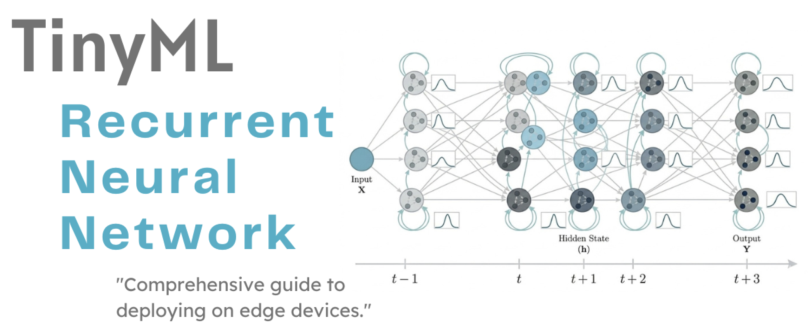
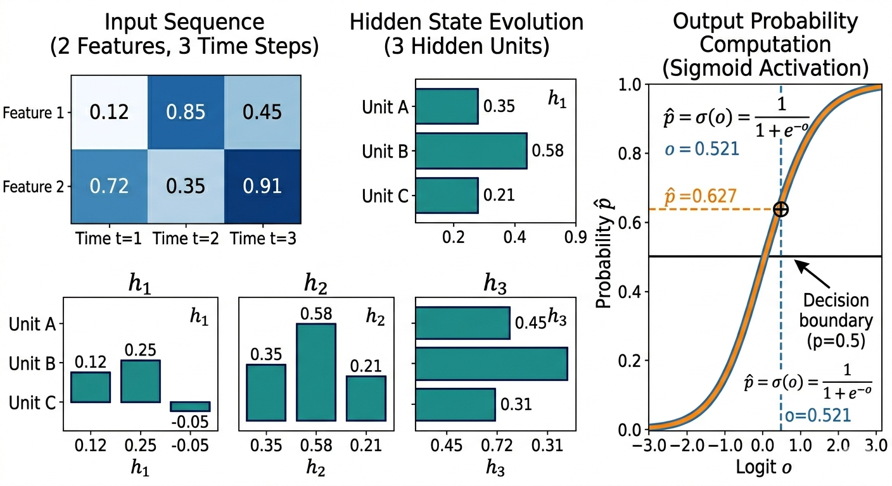
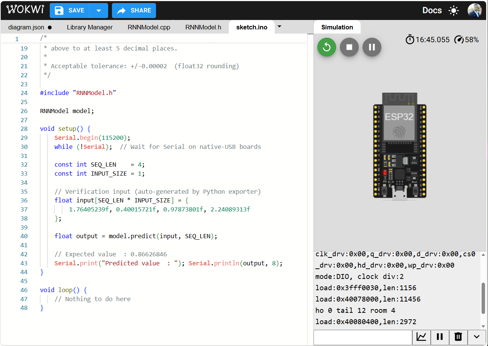
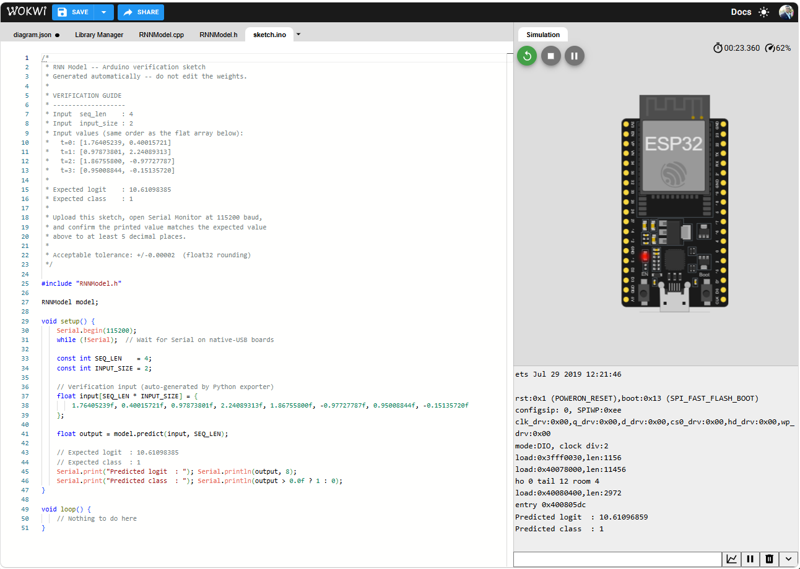
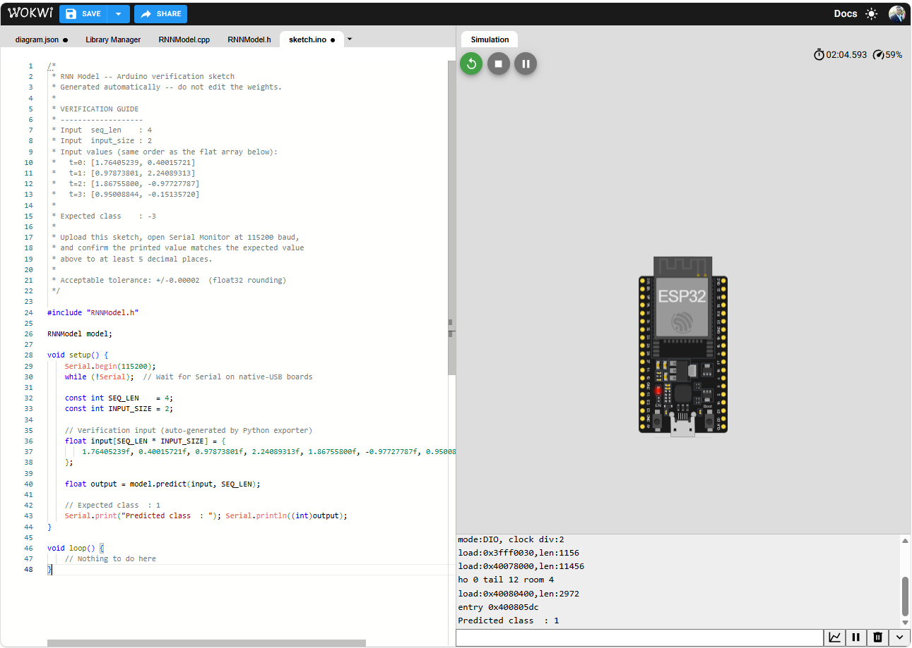
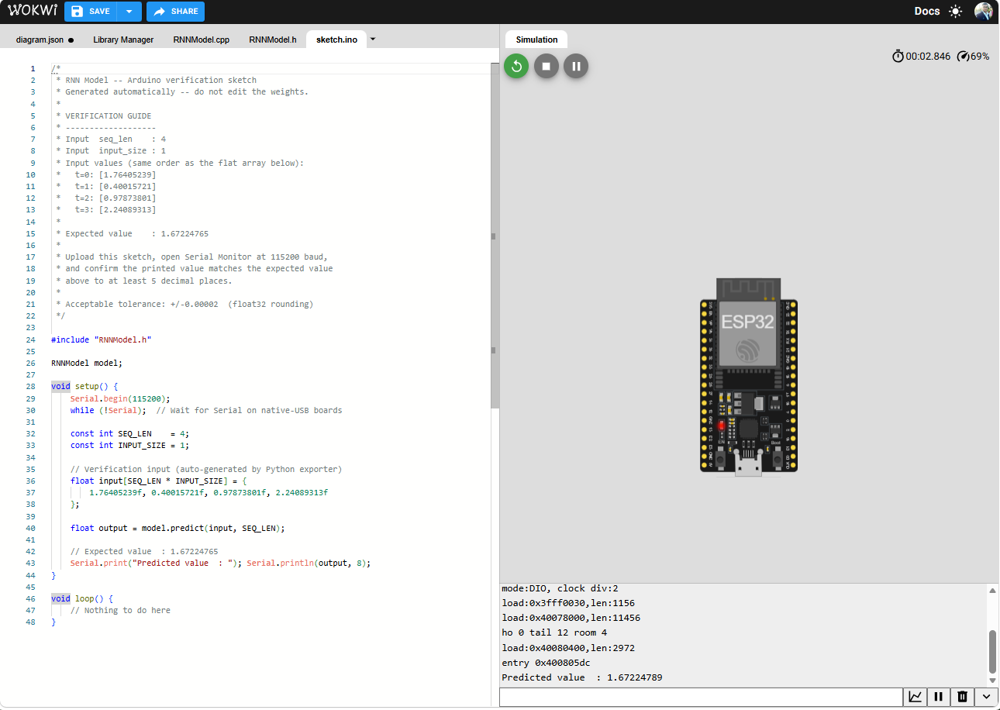

# TinyML - Recurrent Neural Networks

_From sequential foundations to edge implementation_

**Social media:**

👨🏽‍💻 Github: [thommaskevin/TinyML](https://github.com/thommaskevin/TinyML)

👷🏾 Linkedin: [Thommas Kevin](https://www.linkedin.com/in/thommas-kevin-ab9810166/)

📽 Youtube: [Thommas Kevin](https://www.youtube.com/channel/UC7uazGXaMIE6MNkHg4ll9oA)

🧑‍🎓 Scholar: [Thommas K. S. Flores](https://scholar.google.com/citations?user=MqWV8JIAAAAJ&hl=pt-PT&authuser=2)

:pencil2: CV Lattes CNPq: [Thommas Kevin Sales Flores](http://lattes.cnpq.br/0630479458408181)

👨🏻‍🏫 Research group: [Conecta.ai](https://conect2ai.dca.ufrn.br/)

## SUMMARY

1 — Introduction

&nbsp;&nbsp;1.1 — Why Sequential Memory Matters

&nbsp;&nbsp;1.2 — The Temporal Limitation of Feedforward Neural Networks

&nbsp;&nbsp;1.3 — From Feedforward to Recurrent Neural Networks

2 — Mathematical Foundations

&nbsp;&nbsp;2.1 — The Vanilla RNN: State Equations and Computational Graph

&nbsp;&nbsp;2.2 — Architecture: Input, Hidden State, and Output

&nbsp;&nbsp;2.3 — Long Short-Term Memory Networks

&nbsp;&nbsp;2.4 — Gated Recurrent Units

&nbsp;&nbsp;2.5 — The Training Process: Backpropagation Through Time

&nbsp;&nbsp;2.6 — Sequence Representation and Many-to-One, Many-to-Many Configurations

&nbsp;&nbsp;2.7 — Numerical Walkthrough

3 — TinyML Implementation

&nbsp;&nbsp;3.1 — Example 1: RNN Regression

&nbsp;&nbsp;3.2 — Example 2: RNN Binary Classification

&nbsp;&nbsp;3.3 — Example 3: RNN Multiclass Classification

## 1 — Introduction

Recurrent Neural Networks (RNNs) are a class of neural network architectures designed to process data that arrives in ordered sequences. Unlike feedforward networks, which map a fixed-size input vector to an output in a single forward pass, an RNN maintains an internal state, commonly called the hidden state, that is updated at each position in the input sequence. This hidden state acts as a compressed representation of all information the network has encountered up to the current time step, enabling the model to condition its output on the full history of the sequence rather than on a single observation in isolation.

This document develops the mathematical foundations of RNNs, beginning with the limitations of memoryless feedforward architectures and progressing to the derivation of the vanilla RNN state equations, the Long Short-Term Memory (LSTM) gate mechanism, the Gated Recurrent Unit (GRU), the backpropagation through time (BPTT) training algorithm, and the decomposition of sequence-to-vector and sequence-to-sequence computation patterns. The final section explains how recurrent inference can be mapped to efficient embedded C implementations suitable for TinyML deployment on microcontrollers.

### 1.1 — Why Sequential Memory Matters

Consider a microcontroller embedded in an industrial machine that monitors a vibration sensor sampled at 100 Hz. At any given moment, the raw sensor reading conveys limited information: a single amplitude value does not indicate whether the machine is accelerating, decelerating, exhibiting a fault signature, or operating normally. The information required to make that determination is distributed across a window of recent observations.

A feedforward neural network applied to a single sample at each time step has no access to that window. It must either receive a fixed-size block of past observations concatenated into its input, which requires buffering and limits adaptability to variable-length events, or it must discard temporal context entirely and accept reduced accuracy. A recurrent network resolves this tension by maintaining a hidden state that is updated at each time step, effectively implementing a learned and compact summary of the relevant past. This property is the core functional advantage of RNNs for time series classification, anomaly detection, speech processing, natural language understanding, and any task where the meaning of the current observation depends on its history.

Sequential memory in RNNs manifests in two forms that are practically distinct. Short-term dependencies span a small number of time steps and are captured reliably by even the vanilla RNN formulation. Long-term dependencies span tens to hundreds of time steps and are the primary motivation for gated architectures such as the LSTM and the GRU, which introduce explicit mechanisms to control what information is retained, updated, or discarded at each step of the sequence.

### 1.2 — The Temporal Limitation of Feedforward Neural Networks

A standard fully connected feedforward neural network with $L$ hidden layers computes a stateless mapping from a fixed-dimensional input $\mathbf{x} \in \mathbb{R}^{d_x}$ to an output $\hat{y}$:

$$
\mathbf{h}^{(0)} = \mathbf{x}
$$

$$
\mathbf{h}^{(l)} = \sigma\!\left(W^{(l)}\mathbf{h}^{(l-1)} + \mathbf{b}^{(l)}\right), \quad l = 1, \ldots, L
$$

$$
\hat{y} = W^{(L+1)}\mathbf{h}^{(L)} + b^{(L+1)}
$$

This architecture is memoryless: the output $\hat{y}$ depends only on the current input $\mathbf{x}$ and the fixed weight matrices $\{W^{(l)}\}$. There is no mechanism by which an observation at time $t-1$ can influence the computation at time $t$ unless it is explicitly included in the input vector at time $t$.

Two workarounds are commonly applied in practice, both of which carry significant limitations. The first is a sliding-window approach, in which the input at each time step is a concatenation of the $k$ most recent observations: $\mathbf{x}_t^{\mathrm{win}} = [\mathbf{x}_{t-k+1}^\top, \ldots, \mathbf{x}_t^\top]^\top$. This approach fixes the context length at $k$, requires $k$ times the input dimensionality, and cannot generalize to events whose duration is variable or unknown. The second is a handcrafted feature extraction step, in which domain-specific statistics such as mean, variance, spectral power, and zero-crossing rate are computed over a window and fed to the network. This approach depends on prior knowledge of which features are relevant, discards the raw temporal structure, and is not end-to-end differentiable.

Recurrent Neural Networks eliminate the need for both workarounds by parameterizing a learned state transition that integrates information from the full past sequence into a fixed-size hidden vector at each time step.

### 1.3 — From Feedforward to Recurrent Neural Networks

There is a fundamental distinction between stateless feedforward computation and stateful recurrent computation. A feedforward network processes each input independently, with no shared information across time steps. A recurrent network connects each time step to the next through a learned hidden state, creating a directed cycle in the computational graph that gives the architecture its name.

*Figure 1 — The transition from feedforward to recurrent computation. A feedforward network (left) processes each input independently with no temporal memory. An RNN (right), shown unrolled over three time steps, passes a hidden state $\mathbf{h}_t$ from each step to the next, enabling the output at time $t$ to depend on the full input history $\mathbf{x}_1, \ldots, \mathbf{x}_t$.*

Recurrent Neural Networks occupy the stateful end of the neural computation spectrum. The hidden state $\mathbf{h}_t$ serves as a learned, compressed representation of the input history, and the recurrent weight matrix governs how that representation is updated at each new time step. Training the recurrent weights to produce useful hidden state representations for a specific task is the central objective of RNN learning, accomplished by unrolling the recurrence over time and applying gradient-based optimization through the resulting computation graph.

The remainder of this document develops the mathematical framework that enables this approach.

## 2 — Mathematical Foundations

This section develops the mathematical foundations of Recurrent Neural Networks in full. We begin with the vanilla RNN state equations, which provide the theoretical basis for sequential computation. The section concludes with a step-by-step numerical walkthrough that makes each equation concrete.

### 2.1 — The Vanilla RNN: State Equations and Computational Graph

The vanilla RNN defines a parameterized state transition function that maps the current input and the previous hidden state to a new hidden state, and a separate output function that maps the hidden state to the network output.

#### 2.1.1 — The Hidden State Update

Given an input sequence $\mathbf{x}_1, \mathbf{x}_2, \ldots, \mathbf{x}_T$ with $\mathbf{x}_t \in \mathbb{R}^{d_x}$, the hidden state $\mathbf{h}_t \in \mathbb{R}^{d_h}$ at time step $t$ is computed as:

$$
\mathbf{h}_t = \tanh\!\left(W_{hh}\,\mathbf{h}_{t-1} + W_{xh}\,\mathbf{x}_t + \mathbf{b}_h\right)
$$

where:
- $W_{hh} \in \mathbb{R}^{d_h \times d_h}$ is the **recurrent weight matrix**, which governs the transition from the previous hidden state to the current one,
- $W_{xh} \in \mathbb{R}^{d_h \times d_x}$ is the **input weight matrix**, which projects the current input into the hidden state space,
- $\mathbf{b}_h \in \mathbb{R}^{d_h}$ is the **hidden bias vector**,
- $\tanh$ is the hyperbolic tangent activation function applied elementwise, which maps the pre-activation to the interval $(-1, 1)$.

The initial hidden state $\mathbf{h}_0$ is typically set to the zero vector. This initialization carries no trainable parameters and is the standard default unless the task requires a learned initial state.

#### 2.1.2 — The Output Equation

The output at time step $t$ is computed from the current hidden state through a linear projection followed by a task-appropriate transformation:

$$
\mathbf{o}_t = W_{hy}\,\mathbf{h}_t + \mathbf{b}_y
$$

$$
\hat{y}_t = g(\mathbf{o}_t)
$$

where:
- $W_{hy} \in \mathbb{R}^{d_y \times d_h}$ is the **output weight matrix**,
- $\mathbf{b}_y \in \mathbb{R}^{d_y}$ is the **output bias vector**,
- $g$ is the output activation: the identity for regression, sigmoid for binary classification, and softmax for multiclass classification.

#### 2.1.3 — The Unrolled Computational Graph

The recurrence in the hidden state update can be visualized by unrolling the network over $T$ time steps, creating a directed acyclic graph in which each time step $t$ is a separate node. The unrolled graph uses the same weight matrices $\{W_{hh}, W_{xh}, W_{hy}\}$ at every step, reflecting the parameter sharing that is the defining property of recurrent computation. This sharing allows the same network to process sequences of arbitrary length without increasing the number of parameters.

The total number of learnable parameters in a vanilla RNN is:

$$
P = d_h \cdot d_h + d_h \cdot d_x + d_h + d_y \cdot d_h + d_y = d_h(d_h + d_x + d_y + 1) + d_y
$$

which is independent of the sequence length $T$.

*Figure 2 — The vanilla RNN unrolled over four time steps. Input $\mathbf{x}_t$ is projected into the hidden state $\mathbf{h}_t$ via $W_{xh}$. The hidden state is carried forward via $W_{hh}$, and the output $\hat{y}_t$ is produced via $W_{hy}$. All three weight matrices are shared across all time steps, enabling the network to process sequences of any length.*

### 2.2 — Architecture: Input, Hidden State, and Output

This section describes the functional role of each architectural component of an RNN, the choice of hidden state dimensionality, and the principal input and output configurations used in practice.

#### 2.2.1 — The Role of the Hidden State

The hidden state $\mathbf{h}_t \in \mathbb{R}^{d_h}$ is the central quantity in an RNN. It serves simultaneously as the internal memory of the network and as the input to the output layer. At each time step, the hidden state integrates three sources of information: the previous hidden state $\mathbf{h}_{t-1}$ (historical context), the current input $\mathbf{x}_t$ (new observation), and the bias $\mathbf{b}_h$ (learned offset). The $\tanh$ nonlinearity bounds the hidden state in $(-1, 1)^{d_h}$, which stabilizes the recurrence and prevents the hidden state from growing without bound.

The dimensionality $d_h$ is the primary capacity hyperparameter of an RNN. A larger $d_h$ allows the hidden state to encode more complex sequential patterns but increases the parameter count quadratically through $W_{hh}$ and the per-step computation linearly in $d_h$. For TinyML deployment, $d_h$ is constrained by the available SRAM, which must store $\mathbf{h}_t$ at every inference step, and the available compute budget per time step.

#### 2.2.2 — Input Configuration

The input $\mathbf{x}_t \in \mathbb{R}^{d_x}$ at each time step can represent any fixed-size feature vector. Common TinyML input types include scalar sensor readings ($d_x = 1$), multi-axis inertial measurement unit data ($d_x = 3$ or $d_x = 6$), and short-time spectral frames from an audio front-end ($d_x = 40$ for mel-filterbank features). The same weight matrix $W_{xh}$ is applied at every time step, so the network can process sequences of any length $T$ with the same parameter set.

#### 2.2.3 — Output Configurations

RNNs support several input-output configurations depending on the task:

- **Many-to-one:** The output is produced only at the final time step $T$: $\hat{y} = g(W_{hy}\,\mathbf{h}_T + \mathbf{b}_y)$. This configuration is used for sequence classification and regression tasks where a single label or value is assigned to the entire input sequence.
- **Many-to-many (synchronized):** An output is produced at every time step: $\hat{y}_t = g(W_{hy}\,\mathbf{h}_t + \mathbf{b}_y)$ for $t = 1, \ldots, T$. This configuration is used for sequence labeling tasks such as activity recognition with per-frame labels.
- **Many-to-many (encoder-decoder):** An encoder RNN reads the full input sequence and compresses it into a context vector, which is passed to a decoder RNN that generates an output sequence of potentially different length. This configuration is used for machine translation and sequence transduction.

For TinyML applications, the many-to-one configuration is the most common, as it produces a single decision per inference window and minimizes output processing overhead.

*Figure 3 — The three principal RNN output configurations. Many-to-one (top) produces a single output from the final hidden state, used for sequence classification. Many-to-many synchronized (middle) produces one output per time step, used for sequence labeling. Encoder-decoder (bottom) uses a context vector to bridge two separate RNNs, used for sequence transduction.*

#### 2.2.4 — Stacked RNNs

Multiple RNN layers can be stacked to increase model capacity. In a two-layer stacked RNN, the hidden state sequence of the first layer serves as the input sequence to the second layer:

$$
\mathbf{h}_t^{(1)} = \tanh\!\left(W_{hh}^{(1)}\,\mathbf{h}_{t-1}^{(1)} + W_{xh}^{(1)}\,\mathbf{x}_t + \mathbf{b}_h^{(1)}\right)
$$

$$
\mathbf{h}_t^{(2)} = \tanh\!\left(W_{hh}^{(2)}\,\mathbf{h}_{t-1}^{(2)} + W_{xh}^{(2)}\,\mathbf{h}_t^{(1)} + \mathbf{b}_h^{(2)}\right)
$$

Stacking increases the depth of the representation at the cost of additional parameters and computation. For TinyML targets, a single-layer RNN with moderate $d_h$ is the standard configuration, and stacking is applied only when the task complexity and available compute budget justify it.

### 2.5 — The Training Process: Backpropagation Through Time

Training an RNN requires computing the gradient of a loss function with respect to all weight matrices $\{W_{hh}, W_{xh}, W_{hy}\}$ or their gated equivalents in LSTM and GRU. Because the same weights appear at every time step of the unrolled graph, the gradient must accumulate contributions from all time steps, a procedure known as Backpropagation Through Time (BPTT).

#### 2.5.1 — The Loss Function

For a many-to-one sequence classification task, the loss is computed from the output at the final time step:

$$
\mathcal{L} = \mathcal{L}_{\mathrm{task}}(\hat{y}_T, y)
$$

For a many-to-many task with one target per time step, the loss sums contributions across all steps:

$$
\mathcal{L} = \sum_{t=1}^T \mathcal{L}_{\mathrm{task}}(\hat{y}_t, y_t)
$$

Common task losses are mean squared error for regression, binary cross-entropy for binary classification, and categorical cross-entropy for multiclass classification.

#### 2.5.2 — Gradient Flow Through the Recurrence

The gradient of the loss with respect to the hidden state at time step $t$ receives contributions from the output at time $t$ and from the hidden state at time $t+1$:

$$
\frac{\partial \mathcal{L}}{\partial \mathbf{h}_t} = \frac{\partial \mathcal{L}_t}{\partial \mathbf{h}_t} + W_{hh}^\top \frac{\partial \mathcal{L}}{\partial \mathbf{h}_{t+1}} \odot \left(1 - \mathbf{h}_{t+1}^2\right)
$$

where the factor $(1 - \mathbf{h}_{t+1}^2)$ is the derivative of the $\tanh$ activation at time step $t+1$. The term $W_{hh}^\top \partial\mathcal{L}/\partial\mathbf{h}_{t+1}$ carries the gradient backward from step $t+1$ to step $t$ through the recurrent connection.

The gradient with respect to the recurrent weight matrix is the sum over all time steps:

$$
\frac{\partial \mathcal{L}}{\partial W_{hh}} = \sum_{t=1}^T \frac{\partial \mathcal{L}}{\partial \mathbf{h}_t} \odot (1 - \mathbf{h}_t^2) \cdot \mathbf{h}_{t-1}^\top
$$

#### 2.5.3 — The Vanishing and Exploding Gradient Problems

When the product of $W_{hh}$ and the $\tanh$ Jacobian $(1 - \mathbf{h}^2)$ has spectral radius less than one, the gradient magnitude decreases exponentially as it propagates from step $T$ back to step $1$. This is the **vanishing gradient problem**: the weights governing early time steps receive negligible gradient signal, preventing the network from learning long-range dependencies. When the spectral radius exceeds one, gradients grow exponentially: the **exploding gradient problem**. The standard mitigation for exploding gradients is **gradient clipping**, which rescales the gradient vector to a maximum norm:

$$
\mathbf{g} \leftarrow \mathbf{g} \cdot \min\!\left(1, \frac{c}{\|\mathbf{g}\|}\right)
$$

where $c$ is the clipping threshold (typically $c \in [1, 5]$). 

*Figure 4 — Backpropagation through time for a five-step vanilla RNN. The forward pass (teal arrows) computes hidden states left to right. The backward pass (red arrows) propagates gradients right to left through repeated multiplication by $W_{hh}^\top$ and the $\tanh$ Jacobian. The progressive attenuation of backward arrows illustrates the vanishing gradient problem that motivates gated architectures.*

#### 2.5.4 — Truncated BPTT

Full BPTT over sequences of length $T$ requires storing the complete hidden state history $\{\mathbf{h}_1, \ldots, \mathbf{h}_T\}$ in memory during the forward pass. For long sequences on resource-constrained hardware, this is prohibitive. **Truncated BPTT** divides the sequence into non-overlapping segments of length $k$, runs a full forward and backward pass within each segment, and carries the final hidden state forward between segments as a fixed initialization. This trades some gradient accuracy for a constant memory footprint of $\mathcal{O}(k \cdot d_h)$ regardless of the total sequence length $T$.

### 2.6 — Sequence Representation and Many-to-One, Many-to-Many Configurations

This section analyzes how information is accumulated across the time dimension of an RNN and describes the relationship between hidden state dynamics and downstream task performance.

#### 2.6.1 — Information Accumulation in the Hidden State

At each time step $t$, the hidden state $\mathbf{h}_t$ is a nonlinear function of the entire input prefix $\mathbf{x}_1, \ldots, \mathbf{x}_t$. The recurrent weight matrix $W_{hh}$ determines how much of the previous hidden state is retained versus overwritten at each step. For the vanilla RNN, the effective influence of an early input $\mathbf{x}_\tau$ on the final hidden state $\mathbf{h}_T$ is proportional to $(W_{hh})^{T-\tau}$ modulated by the $\tanh$ Jacobians at each intervening step. For large $T - \tau$, this influence decays with the spectral radius of $W_{hh}$, which is the dynamical origin of the vanishing gradient problem and its forward-pass counterpart: the vanishing influence of distant inputs on the current hidden state.

#### 2.6.2 — Sequence Length and Hidden State Dimensionality

The hidden state dimension $d_h$ controls the information capacity of the RNN memory. In practice, the choice of $d_h$ is guided by the following heuristics for TinyML:

- $d_h \in [8, 32]$: suitable for simple univariate time series classification with short sequences ($T \leq 50$),
- $d_h \in [32, 128]$: suitable for multivariate sensor fusion or moderate-length sequences ($T \leq 200$),
- $d_h > 128$: generally exceeds the SRAM budget of most microcontrollers without aggressive quantization.

#### 2.6.3 — Bidirectional RNNs

A bidirectional RNN processes the input sequence in both the forward direction ($t = 1, \ldots, T$) and the backward direction ($t = T, \ldots, 1$), producing two hidden state sequences $\overrightarrow{\mathbf{h}}_t$ and $\overleftarrow{\mathbf{h}}_t$ that are concatenated at each step:

$$
\mathbf{h}_t^{\mathrm{bi}} = [\overrightarrow{\mathbf{h}}_t;\, \overleftarrow{\mathbf{h}}_t] \in \mathbb{R}^{2 d_h}
$$

Bidirectional processing allows the network to use both past and future context at each position. However, it requires the full input sequence to be available before any output is produced, which is incompatible with real-time streaming inference on embedded devices. For TinyML applications, unidirectional RNNs that process the sequence causally are the standard choice.

*Figure 5 — Unidirectional versus bidirectional RNN. The unidirectional RNN (top) processes the sequence causally and can produce outputs in real time, making it suitable for embedded streaming inference. The bidirectional RNN (bottom) combines forward and backward hidden states, requiring the complete sequence before any output is produced, which is incompatible with real-time TinyML deployment.*

#### 2.6.4 — Out-of-Distribution Detection via Hidden State Statistics

RNNs do not provide explicit uncertainty estimates by default. However, the hidden state norm $\|\mathbf{h}_T\|$ and the maximum absolute output logit can serve as proxy confidence measures. Inputs that lie far from the training distribution tend to drive the hidden state to regions of activation space that were rarely visited during training, producing norms or logits that deviate from the distribution observed on the validation set. A threshold applied to these statistics provides a low-cost out-of-distribution detector that requires no additional parameters and adds only a norm computation to the inference loop:

$$
\text{flag as OOD if } \|\mathbf{h}_T\| < h_{\mathrm{low}} \text{ or } \|\mathbf{h}_T\| > h_{\mathrm{high}}
$$

where $h_{\mathrm{low}}$ and $h_{\mathrm{high}}$ are calibrated on a held-out validation set.

*Figure 6 — Out-of-distribution detection using hidden state norm statistics. In-distribution inputs (blue) produce hidden state norms within the calibrated band $[h_{\mathrm{low}}, h_{\mathrm{high}}]$ (dashed lines). Out-of-distribution inputs (orange) fall outside this band, enabling a parameter-free OOD flag directly from the final hidden state norm.*

### 2.7 — Numerical Walkthrough

This section traces the full computation of the RNN forward pass, loss, and prediction step by step for small examples using the vanilla RNN formulation. The goal is to make every equation concrete before moving to implementation.

#### 2.7.1 — Regression Example

**Setup:** $d_x = 1$ (univariate time series), $d_h = 2$ hidden units, $d_y = 1$ output, $T = 4$ time steps. Architecture: vanilla RNN, many-to-one.

**Input sequence and target:**

| $t$ | $x_t$ | $y$ (target) |
|:---:|:---:|:---:|
| 1 | 0.50 | — |
| 2 | 0.80 | — |
| 3 | 0.30 | — |
| 4 | 0.60 | 0.72 |

**Initialized weight matrices (toy values):**

$$
W_{xh} = \begin{bmatrix}0.4\\-0.2\end{bmatrix}, \quad
W_{hh} = \begin{bmatrix}0.5 & 0.1\\-0.3 & 0.6\end{bmatrix}, \quad
\mathbf{b}_h = \begin{bmatrix}0.0\\0.0\end{bmatrix}
$$

$$
W_{hy} = \begin{bmatrix}0.7 & -0.4\end{bmatrix}, \quad b_y = 0.1
$$

**Initial hidden state:** $\mathbf{h}_0 = [0,\; 0]^\top$.

**Step 1 — $t = 1$, $x_1 = 0.50$:**

$$
\mathbf{a}_1 = W_{hh}\,\mathbf{h}_0 + W_{xh}\,x_1 + \mathbf{b}_h
= \begin{bmatrix}0\\0\end{bmatrix} + \begin{bmatrix}0.4 \times 0.50\\-0.2 \times 0.50\end{bmatrix}
= \begin{bmatrix}0.200\\-0.100\end{bmatrix}
$$

$$
\mathbf{h}_1 = \tanh(\mathbf{a}_1) = \begin{bmatrix}\tanh(0.200)\\\tanh(-0.100)\end{bmatrix} = \begin{bmatrix}0.197\\-0.100\end{bmatrix}
$$

**Step 2 — $t = 2$, $x_2 = 0.80$:**

$$
\mathbf{a}_2 = W_{hh}\,\mathbf{h}_1 + W_{xh}\,x_2
= \begin{bmatrix}0.5(0.197) + 0.1(-0.100)\\-0.3(0.197) + 0.6(-0.100)\end{bmatrix} + \begin{bmatrix}0.320\\-0.160\end{bmatrix}
= \begin{bmatrix}0.409\\-0.279\end{bmatrix}
$$

$$
\mathbf{h}_2 = \tanh(\mathbf{a}_2) = \begin{bmatrix}0.389\\-0.272\end{bmatrix}
$$

**Step 3 — $t = 3$, $x_3 = 0.30$:**

$$
\mathbf{a}_3 = W_{hh}\,\mathbf{h}_2 + W_{xh}\,x_3
= \begin{bmatrix}0.5(0.389) + 0.1(-0.272)\\-0.3(0.389) + 0.6(-0.272)\end{bmatrix} + \begin{bmatrix}0.120\\-0.060\end{bmatrix}
= \begin{bmatrix}0.167\\-0.280\end{bmatrix}
$$

$$
\mathbf{h}_3 = \tanh(\mathbf{a}_3) = \begin{bmatrix}0.166\\-0.273\end{bmatrix}
$$

**Step 4 — $t = 4$, $x_4 = 0.60$:**

$$
\mathbf{a}_4 = W_{hh}\,\mathbf{h}_3 + W_{xh}\,x_4
= \begin{bmatrix}0.5(0.166) + 0.1(-0.273)\\-0.3(0.166) + 0.6(-0.273)\end{bmatrix} + \begin{bmatrix}0.240\\-0.120\end{bmatrix}
= \begin{bmatrix}0.296\\-0.334\end{bmatrix}
$$

$$
\mathbf{h}_4 = \tanh(\mathbf{a}_4) = \begin{bmatrix}0.289\\-0.320\end{bmatrix}
$$

**Output (many-to-one at $t = 4$):**

$$
\hat{y} = W_{hy}\,\mathbf{h}_4 + b_y = 0.7(0.289) + (-0.4)(-0.320) + 0.1 = 0.202 + 0.128 + 0.100 = \mathbf{0.430}
$$

**Loss computation.** True target $y = 0.72$:

$$
\mathcal{L}_{\mathrm{MSE}} = (0.430 - 0.720)^2 = (-0.290)^2 = \mathbf{0.0841}
$$

*Figure 7 — Complete forward pass for the regression walkthrough. The input time series (top) drives the hidden state dynamics across four steps (heatmap, two hidden units). The final hidden state $\mathbf{h}_4$ is projected to the prediction $\hat{y} = 0.430$. The true target $y = 0.720$ is shown for reference; the MSE loss is 0.0841.*

#### 2.7.2 — Binary Classification Example

**Setup:** $d_x = 2$, $d_h = 3$, $T = 3$. Architecture: vanilla RNN, many-to-one, sigmoid output. True label: $y^{(1)} = 1$.

After running the full RNN forward pass over $T = 3$ steps with the input sequence $[0.6,\; 0.4]^\top$, $[0.2,\; 0.9]^\top$, $[0.7,\; 0.3]^\top$, the final hidden state is:

$$
\mathbf{h}_3 = [0.412,\; 0.287,\; -0.153]^\top
$$

**Output logit** with $W_{hy} = [0.65,\; 0.43,\; -0.52]$ and $b_y = 0.05$:

$$
o = 0.65(0.412) + 0.43(0.287) + (-0.52)(-0.153) + 0.05 = 0.268 + 0.123 + 0.080 + 0.050 = 0.521
$$

**Predicted probability:**

$$
\hat{p} = \sigma(0.521) = \frac{1}{1 + e^{-0.521}} = \mathbf{0.627}
$$

**Predicted class:** $\hat{c} = \mathbb{1}[\hat{p} \geq 0.5] = 1$. Correct.

**Binary cross-entropy loss:**

$$
\mathcal{L}_{\mathrm{BCE}} = -\bigl[y \log \hat{p} + (1-y)\log(1-\hat{p})\bigr] = -\log(0.627) = \mathbf{0.467} \text{ nats}
$$

The moderately high loss reflects that the predicted probability $\hat{p} = 0.627$, while on the correct side of the decision boundary, is not highly concentrated. The hidden state norm $\|\mathbf{h}_3\| = \sqrt{0.412^2 + 0.287^2 + 0.153^2} \approx 0.519$ falls within a typical in-distribution range for a network trained on similar data.

*Figure 08 — Forward pass for the binary classification walkthrough. The input sequence (left) drives the hidden state evolution over three steps (center). The sigmoid function (right) maps the output logit $o = 0.521$ to $\hat{p} = 0.627$, placing the prediction on the correct class-1 side of the decision boundary. The binary cross-entropy loss is 0.467 nats.*

#### 2.7.3 — Multiclass Classification Example

**Setup:** $C = 3$ classes, $d_x = 3$, $d_h = 4$, $T = 5$. Architecture: vanilla RNN, many-to-one, softmax output. True label: class 2.

After running the full RNN forward pass over $T = 5$ steps, the output logit vector before softmax is:

$$
\mathbf{o} = W_{hy}\,\mathbf{h}_5 + \mathbf{b}_y = [1.20,\; 2.45,\; 0.35]^\top
$$

**Softmax probabilities:**

$$
e^{\mathbf{o}} = [e^{1.20},\; e^{2.45},\; e^{0.35}] = [3.320,\; 11.588,\; 1.419], \qquad \sum_c e^{o_c} = 16.327
$$

$$
\hat{p}_1 = \frac{3.320}{16.327} = \mathbf{0.203}, \quad
\hat{p}_2 = \frac{11.588}{16.327} = \mathbf{0.710}, \quad
\hat{p}_3 = \frac{1.419}{16.327} = \mathbf{0.087}
$$

**Predicted class:** $\hat{c} = \arg\max_c \hat{p}_c = 2$ (with $\hat{p}_2 = 0.710$). Correct.

**Cross-entropy loss:**

$$
\mathcal{L}_{\mathrm{CE}} = -\log(\hat{p}_2) = -\log(0.710) = \mathbf{0.343} \text{ nats}
$$

**Predictive entropy:**

$$
H = -(0.203 \log 0.203 + 0.710 \log 0.710 + 0.087 \log 0.087) \approx \mathbf{0.774} \text{ nats}
$$

The maximum entropy for three classes is $\log 3 \approx 1.099$ nats. An entropy of 0.774 nats indicates moderate concentration on class 2, with non-negligible probability on class 1, reflecting residual uncertainty consistent with a five-step observation window.

*Figure 09 — Output logits, softmax probabilities, and predictive entropy for the multiclass classification walkthrough. The logit for class 2 dominates after softmax, yielding $\hat{p}_2 = 0.710$ and a correct prediction. The entropy of 0.774 nats indicates moderate confidence, falling below the maximum of $\log 3 = 1.099$ nats.*

## 3 — TinyML Implementation

With this example you can implement the machine learning algorithm in ESP32, Arduino, Arduino Portenta H7 with Vision Shield, Raspberry Pi, and other microcontrollers or IoT devices.

### 3.1 — Jupyter Notebooks

-  Recurrent Neural Network Training

### 3.3 — Arduino Code

-  Example 1: RNN Regression

-  Example 2: RNN Binary Classification

-  Example 3: RNN Multiclass Classification

-  Example 4: RNN Seq2Seq

### 3.4 — Results

#### 3.4.1 — Example 1: RNN Regression

#### 3.4.2 — Example 2: RNN Binary Classification

#### 3.4.3 — Example 3: RNN Multiclass Classification

#### 3.4.4 — Example 4: RNN Seq2Seq

## References

[1] Rumelhart, D. E., Hinton, G. E., & Williams, R. J. (1986). Learning Representations by Back-Propagating Errors. *Nature*, 323(6088), 533–536.

[2] Werbos, P. J. (1990). Backpropagation Through Time: What It Does and How to Do It. *Proceedings of the IEEE*, 78(10), 1550–1560.

[3] Hochreiter, S., & Schmidhuber, J. (1997). Long Short-Term Memory. *Neural Computation*, 9(8), 1735–1780.

[4] Cho, K., van Merrienboer, B., Gulcehre, C., Bahdanau, D., Bougares, F., Schwenk, H., & Bengio, Y. (2014). Learning Phrase Representations Using RNN Encoder-Decoder for Statistical Machine Translation. *Proceedings of the 2014 Conference on Empirical Methods in Natural Language Processing (EMNLP)*, 1724–1734.

[5] Bengio, Y., Simard, P., & Frasconi, P. (1994). Learning Long-Term Dependencies with Gradient Descent is Difficult. *IEEE Transactions on Neural Networks*, 5(2), 157–166.

[6] Pascanu, R., Mikolov, T., & Bengio, Y. (2013). On the Difficulty of Training Recurrent Neural Networks. *Proceedings of the 30th International Conference on Machine Learning (ICML)*, 28, 1310–1318.

[7] Graves, A. (2012). *Supervised Sequence Labelling with Recurrent Neural Networks*. Springer.

[8] Gers, F. A., Schmidhuber, J., & Cummins, F. (2000). Learning to Forget: Continual Prediction with LSTM. *Neural Computation*, 12(10), 2451–2471.

[9] Chung, J., Gulcehre, C., Cho, K., & Bengio, Y. (2014). Empirical Evaluation of Gated Recurrent Neural Networks on Sequence Modeling. *NIPS 2014 Workshop on Deep Learning*.

[10] Schuster, M., & Paliwal, K. K. (1997). Bidirectional Recurrent Neural Networks. *IEEE Transactions on Signal Processing*, 45(11), 2673–2681.

[11] Greff, K., Srivastava, R. K., Koutnik, J., Steunebrink, B. R., & Schmidhuber, J. (2017). LSTM: A Search Space Odyssey. *IEEE Transactions on Neural Networks and Learning Systems*, 28(10), 2222–2232.

[12] Goodfellow, I., Bengio, Y., & Courville, A. (2016). *Deep Learning*. MIT Press.

[13] Karpathy, A., Johnson, J., & Fei-Fei, L. (2015). Visualizing and Understanding Recurrent Networks. *ICLR 2016 Workshop Track*.

[14] Lane, N. D., Bhattacharya, S., Georgiev, P., Forlivesi, C., & Kawsar, F. (2015). An Early Resource Characterization of Deep Learning on Wearables, Smartphones and Internet-of-Things Devices. *Proceedings of the 2015 International Workshop on Internet of Things towards Applications (IoT-App)*, 7–12.
