# TinyML - Liquid Neural Networks

_From continuous-time dynamics to edge implementation_

**Social media:**

👨🏽‍💻 Github: [thommaskevin/TinyML](https://github.com/thommaskevin/TinyML)

👷🏾 Linkedin: [Thommas Kevin](https://www.linkedin.com/in/thommas-kevin-ab9810166/)

📽 Youtube: [Thommas Kevin](https://www.youtube.com/channel/UC7uazGXaMIE6MNkHg4ll9oA)

🧑‍🎓 Scholar: [Thommas K. S. Flores](https://scholar.google.com/citations?user=MqWV8JIAAAAJ&hl=pt-PT&authuser=2)

:pencil2: CV Lattes CNPq: [Thommas Kevin Sales Flores](http://lattes.cnpq.br/0630479458408181)

👨🏻‍🏫 Research group: [Conecta.ai](https://conect2ai.dca.ufrn.br/)

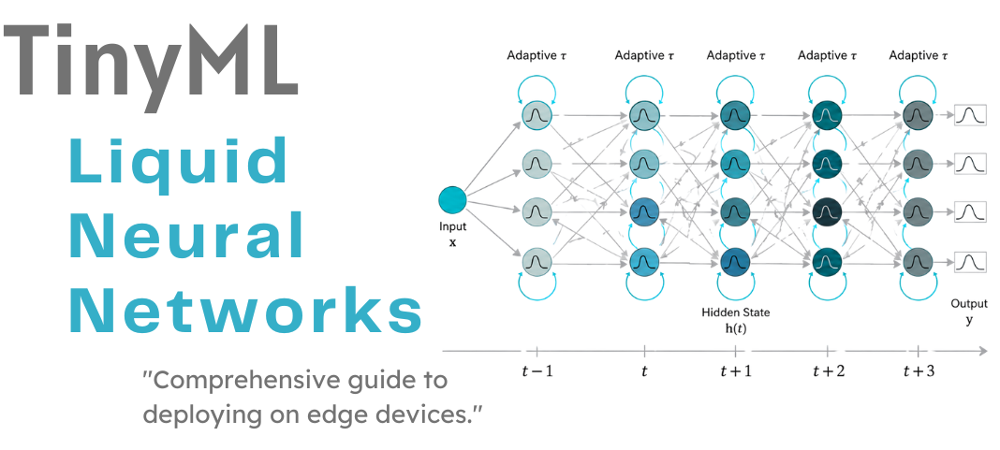

## SUMMARY

1 — Introduction

&nbsp;&nbsp;1.1 — Limitations of Discrete-Time Recurrent Networks

&nbsp;&nbsp;1.2 — The Continuous-Time Perspective

&nbsp;&nbsp;1.3 — From Elman RNNs to Liquid Neural Networks

2 — Mathematical Foundations

&nbsp;&nbsp;2.1 — The Liquid Time-Constant ODE

&nbsp;&nbsp;2.2 — Input-Dependent Time Constants

&nbsp;&nbsp;2.3 — Numerical Integration: Fixed-Step Euler Method

&nbsp;&nbsp;2.4 — Stacked LTC Layers and Multi-Scale Dynamics

&nbsp;&nbsp;2.5 — Many-to-One and Many-to-Many Computation Patterns

&nbsp;&nbsp;2.6 — Training: Backpropagation Through Unrolled ODE Steps

&nbsp;&nbsp;2.7 — Numerical Walkthrough

3 — TinyML Implementation

&nbsp;&nbsp;3.1 — Example 1: LNN Regression

&nbsp;&nbsp;3.2 — Example 2: LNN Binary Classification

&nbsp;&nbsp;3.3 — Example 3: LNN Multiclass Classification

&nbsp;&nbsp;3.4 — Example 4: LNN Seq2Seq

## 1 — Introduction

Liquid Neural Networks (LNNs), introduced under the name **Liquid Time-Constant (LTC) Networks** by Hasani et al. (2021), are a class of continuous-time recurrent neural networks whose hidden-state dynamics are governed by a system of ordinary differential equations (ODEs). Unlike discrete-time recurrent networks such as the Elman RNN, LSTM, or GRU, which update the hidden state by evaluating a fixed algebraic expression at each time step, an LNN defines a differential equation whose solution continuously evolves the hidden state over time. The key innovation is that the effective **time constant** of each neuron — governing how quickly it responds to new inputs and how long it retains past information — is not a fixed parameter but a **learned function of the current input and hidden state**. This property gives the architecture its name: the network is "liquid" because its temporal dynamics flow and adapt with the signal *(Figure 01)*.

This tutorial develops the mathematical foundations of Liquid Neural Networks in full, beginning with the limitations of discrete-time recurrent architectures and progressing to the LTC ODE, the input-dependent time-constant mechanism, fixed-step Euler integration, the training algorithm, and a step-by-step numerical walkthrough. The final section explains how LTC inference can be mapped to efficient embedded C implementations suitable for TinyML deployment on microcontrollers.

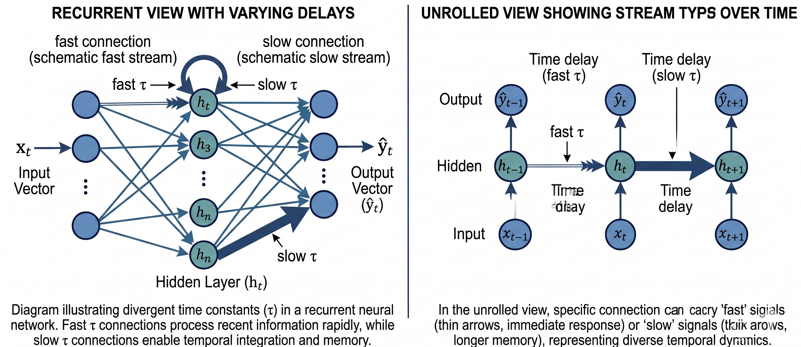
*Figure 01 — The liquid metaphor. A Liquid Neural Network adapts the speed at which each neuron integrates information (represented by flow rate) based on the current input. Fast-adapting neurons (bright, thin streams) respond to rapid transients; slow-adapting neurons (thick, viscous streams) maintain long-range memory. The effective flow speed — the time constant τ — is not fixed but varies dynamically with the signal, giving the architecture its name.*

### 1.1 — Limitations of Discrete-Time Recurrent Networks

A vanilla Elman RNN updates its hidden state with a fixed algebraic expression:

$$
\mathbf{h}_t = \tanh\!\left(W_{xh}\,\mathbf{x}_t + W_{hh}\,\mathbf{h}_{t-1} + \mathbf{b}_h\right)
$$

This formulation treats all neurons identically: every hidden unit responds to a new input with the same temporal resolution, determined entirely by the sequence index $t$ rather than the content of the signal. A neuron that should track a slow trend and a neuron that should respond to rapid transients share the same discrete update rule and the same effective time constant of one time step *(Figure 02)*.

In practice this limitation manifests in two ways. First, RNNs trained on sequences with multiple temporal scales — such as a biosignal containing both fast spikes and slow drift — must implicitly encode multi-scale dynamics in the weight matrices alone, without any structural support. Second, the recurrent weight matrix $W_{hh}$ must simultaneously serve as a state transition and as a temporal smoothing filter, creating a fundamental trade-off between expressivity and stability.

Gated architectures such as the LSTM and GRU partially address this by introducing learned gating coefficients that modulate how much of the previous state is retained. However, the gates are binary-like (bounded between 0 and 1 by a sigmoid), the effective time constant remains fixed per neuron per data point, and the relationship between gate values and continuous-time dynamics is indirect.

*Figure 02 — The fixed time-step limitation of discrete-time RNNs. A real-world signal (top) contains events at multiple temporal scales: slow trends and rapid transients. A vanilla RNN applies an identical update at every integer time step (left), allocating the  same representational effort to a slowly changing background and a sharp spike. An ideal model (right) would adapt the update magnitude and memory depth to the local structure of the signal — exactly what the Liquid Time-Constant Network achieves.*

### 1.2 — The Continuous-Time Perspective

The continuous-time formulation of a recurrent neural network views the hidden state $\mathbf{h}(t) \in \mathbb{R}^{d_h}$ as the solution to an ODE of the form:

$$
\frac{d\mathbf{h}}{dt} = F\!\left(\mathbf{h}(t),\, \mathbf{x}(t),\, \boldsymbol{\theta}\right)
$$

where $\mathbf{x}(t)$ is the input signal at continuous time $t$ and $\boldsymbol{\theta}$ are learnable parameters. The hidden state at any time is the result of integrating this ODE forward from an initial condition $\mathbf{h}(0) = \mathbf{h}_0$ *(Figure 03)*.

This perspective offers three immediate advantages over the discrete-time formulation. First, the dynamics are described at an infinitesimal resolution, allowing the model to naturally handle irregularly sampled sequences and sequences of variable length. Second, the structure of $F$ can be chosen to encode inductive biases about how biological neural circuits operate, grounding the model in neuroscience. Third, the effective temporal sensitivity of each neuron can be made to depend on the input, allowing the network to automatically slow down or speed up its integration based on the information content of the signal.

Liquid Time-Constant Networks instantiate this perspective with a specific choice of $F$ that leads to tractable, interpretable dynamics and efficient embedded implementations.

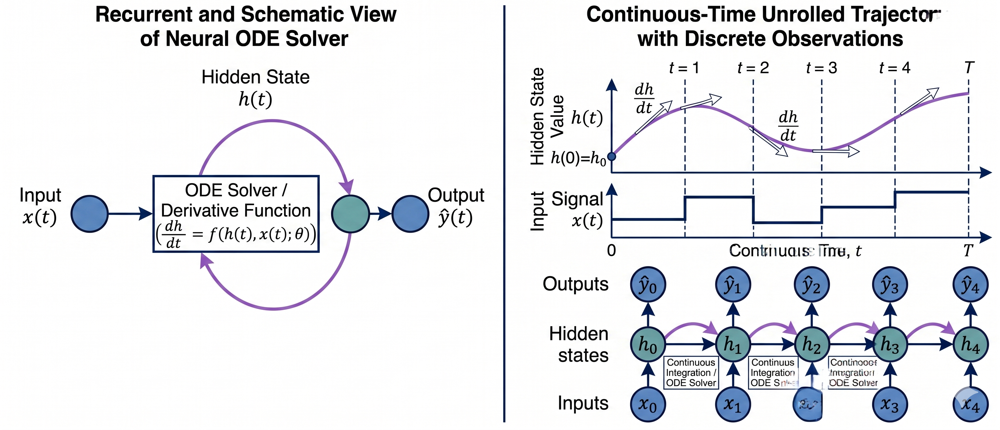
*Figure 03 — Continuous-time hidden state dynamics. The hidden state h(t) evolves as the solution to an ODE, driven by the input signal x(t). Between consecutive observations (vertical dashed lines), the state follows the smooth trajectory defined by dh/dt = F(h, x, θ). The tangent vectors show the instantaneous direction of change. This formulation naturally handles irregular sampling: observations can arrive at arbitrary times without requiring any resampling or padding.*

### 1.3 — From Elman RNNs to Liquid Neural Networks

There is a direct theoretical line from the Elman RNN to the LTC network. The Elman update can be rewritten in residual form as:

$$
\mathbf{h}_t - \mathbf{h}_{t-1} = -\mathbf{h}_{t-1} + \tanh\!\left(W_{xh}\,\mathbf{x}_t + W_{hh}\,\mathbf{h}_{t-1} + \mathbf{b}\right)
$$

Dividing both sides by a time constant $\tau$ and taking the limit as $\Delta t \to 0$ gives the ODE:

$$
\frac{d\mathbf{h}}{dt} = \frac{-\mathbf{h} + f\!\left(W_{xh}\,\mathbf{x} + W_{hh}\,\mathbf{h} + \mathbf{b}\right)}{\tau}
$$

The LTC network replaces the fixed scalar $\tau$ with an **input-dependent matrix-valued time constant** $\boldsymbol{\tau}(\mathbf{x}, \mathbf{h}) \in \mathbb{R}^{d_h}_{>0}$, allowing each neuron to have a different and signal-dependent temporal sensitivity. This is the central architectural innovation of the LTC cell *(Figure 04)*.

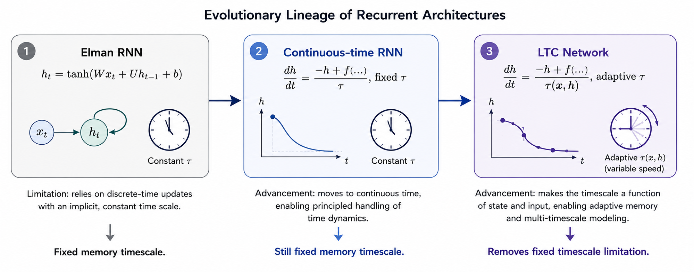
*Figure 04 — Evolutionary lineage from the Elman RNN to the Liquid Time-Constant  Network. Step 1: the Elman RNN applies a discrete, fixed update at every integer time step. Step 2: rewriting the update as a finite difference and taking the continuous-time limit yields an ODE with a fixed time constant τ. Step 3: the LTC network replaces the fixed scalar τ with an input-dependent vector τ(x, h), enabling each neuron to adapt its memory depth to the current signal. Each arrow marks the removal of a structural limitation.*

## 2 — Mathematical Foundations

This section develops the mathematical foundations of Liquid Time-Constant Networks in full. We begin with the LTC ODE, derive the input-dependent time-constant mechanism, describe the Euler integration scheme used in training and inference, and conclude with a step-by-step numerical walkthrough.

### 2.1 — The Liquid Time-Constant ODE

The LTC cell defines the hidden-state dynamics as:

$$
\boldsymbol{\tau}(\mathbf{x}, \mathbf{h})\, \frac{d\mathbf{h}}{dt} = -\mathbf{h} + f\!\left(W_{ih}\,\mathbf{x} + W_{hh}\,\mathbf{h} + \mathbf{b}_{ih} + \mathbf{b}_{hh}\right)
$$

or equivalently:

$$
\frac{d\mathbf{h}}{dt} = \frac{-\mathbf{h} + f\!\left(W_{ih}\,\mathbf{x} + W_{hh}\,\mathbf{h} + \mathbf{b}\right)}{\boldsymbol{\tau}(\mathbf{x}, \mathbf{h})}
$$

where:

- $\mathbf{x} \in \mathbb{R}^{d_x}$ is the current input vector,
- $\mathbf{h} \in \mathbb{R}^{d_h}$ is the hidden (liquid) state,
- $W_{ih} \in \mathbb{R}^{d_h \times d_x}$ and $W_{hh} \in \mathbb{R}^{d_h \times d_h}$ are the input-to-hidden and hidden-to-hidden weight matrices,
- $\mathbf{b}_{ih}, \mathbf{b}_{hh} \in \mathbb{R}^{d_h}$ are bias vectors,
- $f : \mathbb{R} \to \mathbb{R}$ is the backbone activation (applied element-wise, default: $\tanh$),
- $\boldsymbol{\tau}(\mathbf{x}, \mathbf{h}) \in \mathbb{R}^{d_h}_{>0}$ is the input-dependent time constant (described in Section 2.2).

The term $-\mathbf{h}$ in the numerator acts as a **leak**: in the absence of input, the hidden state decays exponentially toward zero at a rate controlled by $\boldsymbol{\tau}$. The backbone nonlinearity $f(\cdot)$ provides the saturating nonlinearity needed for stability and expressivity. The time constant $\boldsymbol{\tau}$ controls the rate at which the hidden state integrates new information *(Figure 05)*.

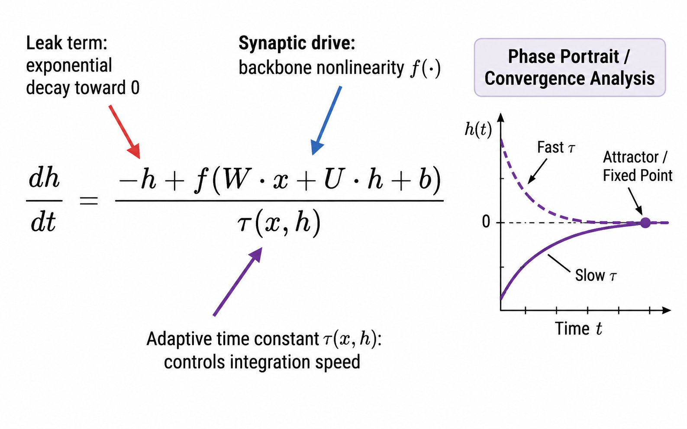
*Figure 05 — Anatomy of the LTC ODE. The hidden state derivative has three functional components: (1) the leak term −h, which drives the state toward zero when no input is present, creating bounded stable dynamics; (2) the synaptic drive f(W_ih·x + W_hh·h + b), which pulls the state toward a target value determined by the current input; and (3) the adaptive time constant τ(x, h) in the denominator, which scales the overall integration speed. Large τ produces slow, smoothly varying trajectories (solid); small τ produces fast, reactive responses (dashed).*

### 2.2 — Input-Dependent Time Constants

The time constant $\boldsymbol{\tau}(\mathbf{x}, \mathbf{h})$ is computed in three sequential stages *(Figure 06)*:

**Stage 1 — Gating signal (sigmoid unit):**

$$
\mathbf{g}(\mathbf{x}, \mathbf{h}) = \sigma\!\left(W_\tau\,\mathbf{x} + W_{\tau h}\,\mathbf{h} + \mathbf{b}_\tau\right)
$$

where $W_\tau \in \mathbb{R}^{d_h \times d_x}$, $W_{\tau h} \in \mathbb{R}^{d_h \times d_h}$, and $\mathbf{b}_\tau \in \mathbb{R}^{d_h}$ are learnable parameters. The sigmoid ensures $\mathbf{g} \in (0, 1)^{d_h}$.

**Stage 2 — Amplitude-modulated activation:**

$$
\mathbf{a}(\mathbf{x}, \mathbf{h}) = \mathbf{A} \odot \mathbf{g}(\mathbf{x}, \mathbf{h})
$$

where $\mathbf{A} \in \mathbb{R}^{d_h}$ is a learnable amplitude vector (initialised to $\mathbf{1}$) and $\odot$ denotes element-wise multiplication. The amplitude $\mathbf{A}$ allows the network to scale the modulation range independently per neuron.

**Stage 3 — Softplus floor:**

$$
\boldsymbol{\tau}(\mathbf{x}, \mathbf{h}) = \tau_{\min} + \mathrm{softplus}\!\left(\mathbf{a}(\mathbf{x}, \mathbf{h})\right)
$$

where $\mathrm{softplus}(z) = \log(1 + e^z)$ is a smooth approximation of the ReLU, and $\tau_{\min} > 0$ is a fixed floor that prevents the time constant from collapsing to zero and causing numerical instability.

Combining all three stages:

$$
\boxed{
\boldsymbol{\tau}(\mathbf{x}, \mathbf{h}) = \tau_{\min} + \log\!\left(1 + e^{\,\mathbf{A} \odot \sigma(W_\tau \mathbf{x} + W_{\tau h} \mathbf{h} + \mathbf{b}_\tau)}\right)
}
$$

**Interpretation.** When the gating signal $\mathbf{g}$ is close to 1 (i.e., the input strongly activates the gate), $\boldsymbol{\tau}$ is large — the neuron integrates information **slowly** and has **long memory**. When $\mathbf{g}$ is close to 0, $\boldsymbol{\tau}$ approaches $\tau_{\min}$ — the neuron responds **quickly** and has **short memory**. The network can thus simultaneously maintain slow-adapting neurons (tracking trends) and fast-adapting neurons (responding to transients), with the balance determined by the content of the current input sequence *(Figure 07)*.

*Figure 06 — The three-stage pipeline for computing the input-dependent time constant τ(x, h). Stage 1 computes a gating signal g ∈ (0,1) using a sigmoid applied to a learned linear combination of x and h. Stage 2 scales the gate with a learnable per-neuron amplitude A. Stage 3 passes the result through softplus and adds a fixed floor τ_min, guaranteeing strict positivity. The final output τ(x, h) > τ_min for all inputs.*

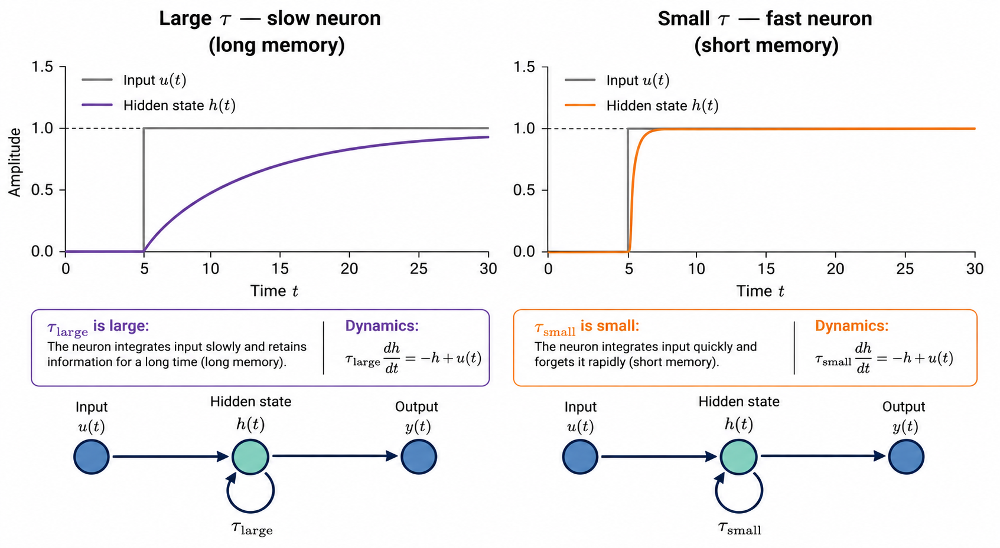
*Figure 07 — Effect of the time constant τ on hidden-state dynamics in response to a step input (grey). A neuron with large τ (left) responds slowly: the hidden state h(t) rises smoothly over many time steps, effectively averaging the input over a long window and providing long-term memory. A neuron with small τ (right) responds almost instantaneously, tracking rapid changes in the input. In an LTC network, τ is not fixed but adapts dynamically to the input signal, allowing the same neuron to alternate between these two regimes.*

### 2.3 — Numerical Integration: Fixed-Step Euler Method

The LTC ODE does not have a closed-form solution in general. Following Hasani et al. (2021), we solve it numerically using a **fixed-step Euler method** over $K$ micro-steps within each input time step *(Figure 08)*.

Let $\Delta t$ be the nominal continuous-time step and $\delta = \Delta t / K$ be the micro-step size. Starting from $\mathbf{h}_0 = \mathbf{h}_{t-1}$ (the previous hidden state), the Euler update for micro-step $k \in \{1, \ldots, K\}$ is:

$$
\mathbf{h}_{(k)} = \mathbf{h}_{(k-1)} + \delta \cdot \frac{-\mathbf{h}_{(k-1)} + f\!\left(W_{ih}\,\mathbf{x} + W_{hh}\,\mathbf{h}_{(k-1)} + \mathbf{b}\right)}{\boldsymbol{\tau}\!\left(\mathbf{x},\, \mathbf{h}_{(k-1)}\right)}
$$

After $K$ micro-steps, the new hidden state is $\mathbf{h}_t = \mathbf{h}_{(K)}$.

The input $\mathbf{x}$ is held constant over all $K$ micro-steps within a single input time step, which is appropriate when the input signal is piecewise constant (zero-order hold). In practice, $K = 6$ provides a good balance between integration accuracy and computational cost.

**Trade-off.** Larger $K$ improves ODE accuracy but increases both training time and Arduino inference time proportionally. For TinyML deployment, $K = 4$ to $6$ is typically sufficient. If the input signal has very fine temporal structure, consider using a smaller $\Delta t$ rather than increasing $K$.

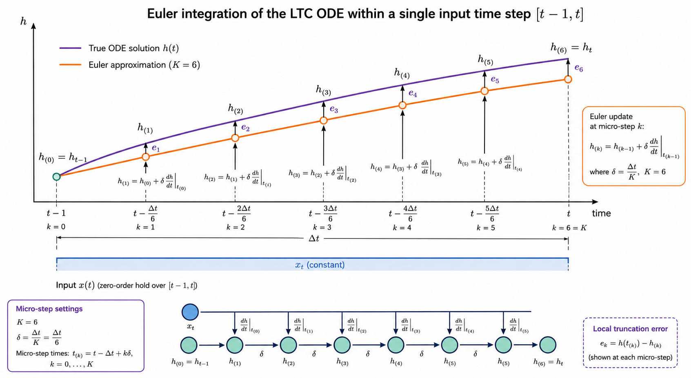
*Figure 08 — Fixed-step Euler integration of the LTC ODE within a single input time step (from t−1 to t, divided into K=6 micro-steps). The violet curve is the true ODE solution; the orange segments are the Euler approximation. At each micro-step, the hidden state advances by δ·dh/dt, accumulating small local errors (shown by gaps between the curves). The input x is held constant over all micro-steps (zero-order hold, grey bar). More micro-steps reduce the accumulated integration error at the cost of proportionally more computation.*

### 2.4 — Stacked LTC Layers and Multi-Scale Dynamics

Multiple LTC cells can be stacked in the same way as Elman RNN layers. If layer $\ell$ has hidden size $d_h^{(\ell)}$ and the previous layer has hidden size $d_h^{(\ell-1)}$, then the input to layer $\ell$ at each time step is $\mathbf{h}_t^{(\ell-1)}$, the output of layer $\ell-1$ *(Figure 09)*.

Each layer has its own independent set of parameters $(W_{ih}^{(\ell)}, W_{hh}^{(\ell)}, W_\tau^{(\ell)}, W_{\tau h}^{(\ell)}, \mathbf{A}^{(\ell)})$ and its own time-constant floor $\tau_{\min}^{(\ell)}$. This allows different layers to operate at genuinely different temporal scales:

- **Layer 0** (closest to input): small $\tau_{\min}$ and $\Delta t$ → fast adapting, captures rapid transients.
- **Layer 1** (higher level): larger $\tau_{\min}$ or larger $\Delta t$ → slow adapting, integrates over longer context.

This multi-scale property is structurally enforced and does not depend on gradient descent discovering the appropriate dynamics from scratch. It is a key advantage of LNNs over stacked Elman RNNs for time series with hierarchical temporal structure.

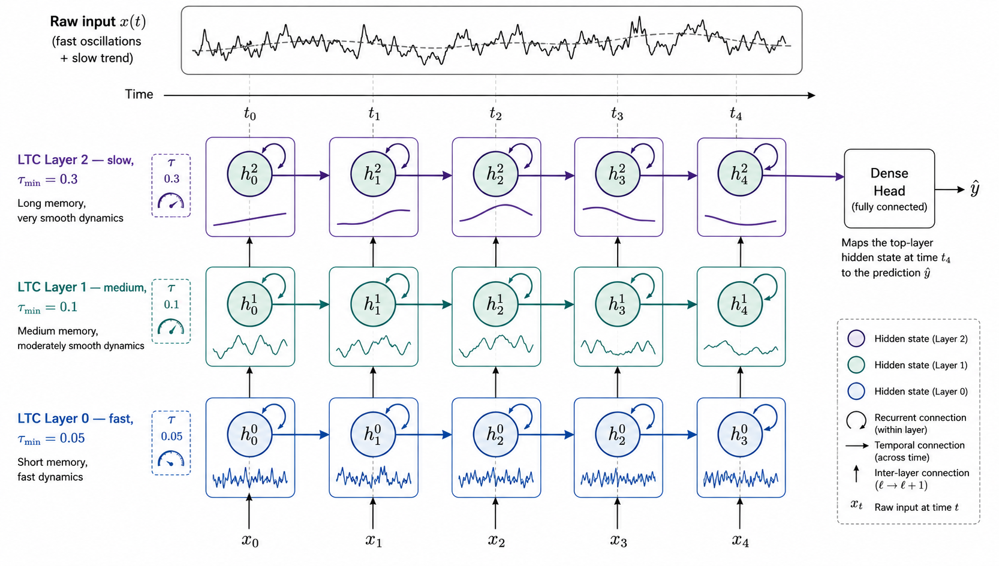
*Figure 09 — A two-layer stacked LTC network unrolled over five time steps. Layer 0 (bottom) operates with a small τ_min and responds rapidly to changes in the raw input, capturing fast transients. Layer 1 (top) receives the smoothed output of Layer 0 and operates with a larger τ_min, integrating information over a longer context window. This architectural hierarchy allows the network to simultaneously represent short-range and long-range temporal patterns without relying exclusively on gradient descent to discover the multi-scale structure.*

### 2.5 — Many-to-One and Many-to-Many Computation Patterns

The LNN framework supports the same two computation patterns as the Elman RNN *(Figure 10)*:

**Many-to-one (`forward`):** Process the full input sequence of length $T$ through the LTC stack, then apply the dense head to the hidden state $\mathbf{h}_T^{(L)}$ at the **last** time step only.

$$
\hat{y} = \text{Dense}\!\left(\mathbf{h}_T^{(L)}\right)
$$

**Many-to-many (`forward_sequence`):** Apply the dense head at **every** time step, producing an output sequence of length $T$.

$$
\hat{y}_t = \text{Dense}\!\left(\mathbf{h}_t^{(L)}\right), \quad t = 1, \ldots, T
$$

The dense head can contain multiple fully-connected layers with arbitrary activations, allowing arbitrary output shapes (scalar regression, binary logit, multiclass logits).

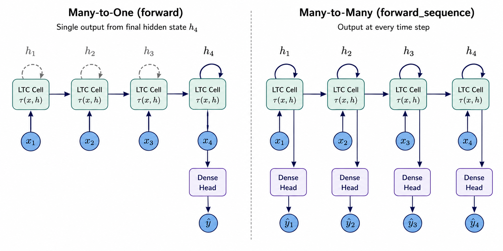
*Figure 10 — The two computation patterns supported by LNNModel. Left: many-to-one (forward), in which the dense head is applied only to the final hidden state h_T, producing a single output ŷ. This pattern is used for sequence classification and regression where a single label per sequence is required. Right: many-to-many (forward_sequence), in which the dense head is applied at every time step, producing a sequence of outputs ŷ_1, …, ŷ_T. This pattern is used for sequence-to-sequence tasks such as next-step prediction and signal denoising.*

### 2.6 — Training: Backpropagation Through Unrolled ODE Steps

LTC networks are trained by standard stochastic gradient descent. The ODE integration is implemented as a sequence of differentiable Euler steps, so the computational graph is identical to that of a standard RNN with $T \times K$ time steps *(Figure 11)*.

Backpropagation through the unrolled Euler steps computes gradients with respect to all learnable parameters: $W_{ih}$, $W_{hh}$, $\mathbf{b}_{ih}$, $\mathbf{b}_{hh}$, $W_\tau$, $W_{\tau h}$, $\mathbf{b}_\tau$, $\mathbf{A}$, and all dense-head parameters. The gradient of the task loss $\mathcal{L}$ with respect to parameter $\boldsymbol{\theta}$ is computed by accumulating contributions from all micro-steps through the chain rule:

$$
\frac{\partial \mathcal{L}}{\partial \boldsymbol{\theta}} = \sum_{t=1}^{T} \sum_{k=1}^{K} \frac{\partial \mathcal{L}}{\partial \mathbf{h}_{t,(k)}} \cdot \frac{\partial \mathbf{h}_{t,(k)}}{\partial \boldsymbol{\theta}}
$$

**Gradient flow.** The Euler update $\mathbf{h}_{(k)} = \mathbf{h}_{(k-1)} + \delta \cdot \dot{\mathbf{h}}_{(k-1)}$ has a residual connection structure (similar to ResNet skip connections), which helps gradients flow backward through many micro-steps without vanishing. The time constant $\boldsymbol{\tau}$ in the denominator provides an additional gradient scaling: neurons with large $\tau$ receive smaller gradient signals from the ODE derivative, acting as a form of implicit regularisation on fast neurons.

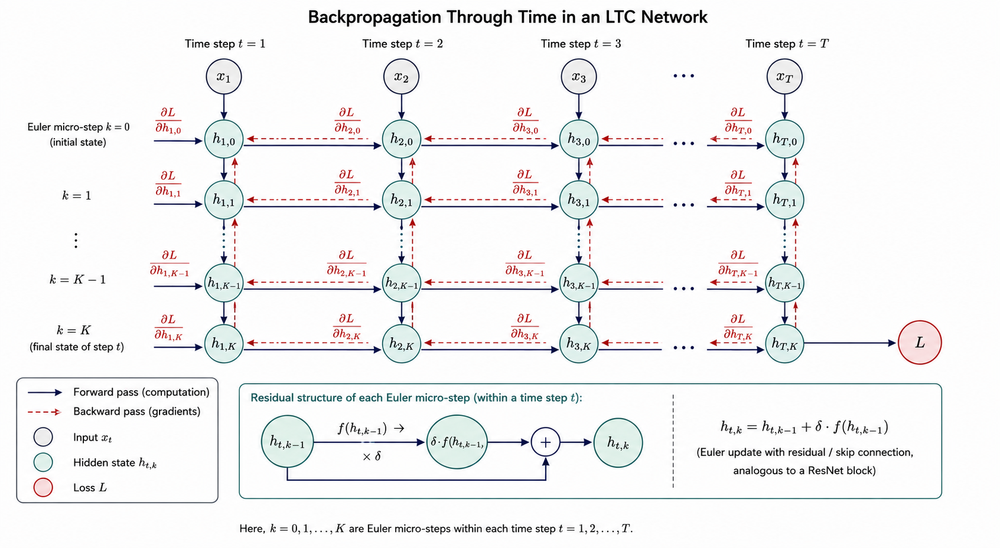
*Figure 11 — Unrolled computational graph for backpropagation through an LTC network with T=3 input time steps and K=3 Euler micro-steps per step (total 9 nodes per layer). Forward pass: orange arrows left to right. Backward pass: red dashed arrows right to left, accumulating ∂L/∂θ contributions from every micro-step. The residual structure of the Euler update (callout box) — identical to a ResNet skip connection — helps gradients flow backward without vanishing across the T×K unrolled steps.*

### 2.7 — Numerical Walkthrough

We perform a complete forward pass for a single LTC cell with $d_x = 2$, $d_h = 3$, $K = 3$ Euler micro-steps, $\Delta t = 1.0$ (so $\delta = 1/3$), $\tau_{\min} = 0.1$, and activation $\tanh$. All steps are shown explicitly to make the computation transparent *(Figure 12)*.

**Setup.** All weight matrices are chosen as small illustrative values; the initial hidden state is $\mathbf{h}_0 = [0, 0, 0]^\top$.

Input: $\mathbf{x} = [0.5,\; -0.3]^\top$.

Let the pre-activations for the backbone be:

$$
\mathbf{z} = W_{ih}\,\mathbf{x} + \mathbf{b}_{ih} + W_{hh}\,\mathbf{h}_0 + \mathbf{b}_{hh} = [0.25,\; -0.15,\; 0.40]^\top
$$

**Backbone activation (micro-step 1):**

$$
f(\mathbf{z}) = \tanh([0.25,\; -0.15,\; 0.40]^\top) = [0.245,\; -0.149,\; 0.380]^\top
$$

**Gating signal:**

$$
\mathbf{g} = \sigma(W_\tau\,\mathbf{x} + \mathbf{b}_\tau + W_{\tau h}\,\mathbf{h}_0) = \sigma([0.10,\; -0.08,\; 0.20]^\top)
= [0.525,\; 0.480,\; 0.550]^\top
$$

**Amplitude modulation** (with $\mathbf{A} = [1.0, 1.0, 1.0]^\top$ at initialisation):

$$
\mathbf{a} = \mathbf{A} \odot \mathbf{g} = [0.525,\; 0.480,\; 0.550]^\top
$$

**Time constant:**

$$
\boldsymbol{\tau} = 0.1 + \mathrm{softplus}([0.525,\; 0.480,\; 0.550]^\top)
$$

$$
\mathrm{softplus}(0.525) = \log(1 + e^{0.525}) = \log(2.691) = 0.990
$$

$$
\boldsymbol{\tau} = [0.1 + 0.990,\; 0.1 + 0.974,\; 0.1 + 1.009]^\top = [1.090,\; 1.074,\; 1.109]^\top
$$

**Euler step 1:**

$$
\dot{\mathbf{h}} = \frac{-\mathbf{h}_0 + f(\mathbf{z})}{\boldsymbol{\tau}} = \frac{[0.245,\; -0.149,\; 0.380]^\top}{[1.090,\; 1.074,\; 1.109]^\top} = [0.225,\; -0.139,\; 0.343]^\top
$$

$$
\mathbf{h}_{(1)} = \mathbf{h}_0 + \tfrac{1}{3} \cdot \dot{\mathbf{h}} = [0.075,\; -0.046,\; 0.114]^\top
$$

**Micro-steps 2 and 3** repeat the same computation with the updated $\mathbf{h}_{(k-1)}$, gradually refining the hidden state. After step 3, the final hidden state $\mathbf{h}_1$ is fed into the dense head.

**Output (regression example with $W_{hy} \in \mathbb{R}^{1 \times 3}$, $b_y \in \mathbb{R}$):**

$$
\hat{y} = W_{hy}\,\mathbf{h}_1 + b_y
$$

The ODE integration ensures that the hidden state evolves smoothly from $\mathbf{h}_0$ toward the attractor defined by $f(W_{ih}\,\mathbf{x} + \ldots)$, at a speed controlled by $\boldsymbol{\tau}$. For the chosen input $\mathbf{x}$, the time constants are approximately 1.09, 1.07, and 1.11, meaning each neuron takes roughly one full time step to integrate the new input — moderate-memory behaviour. With a different input that strongly activates the gate, $\boldsymbol{\tau}$ would increase, slowing integration and producing longer-range memory *(Figure 12)*.

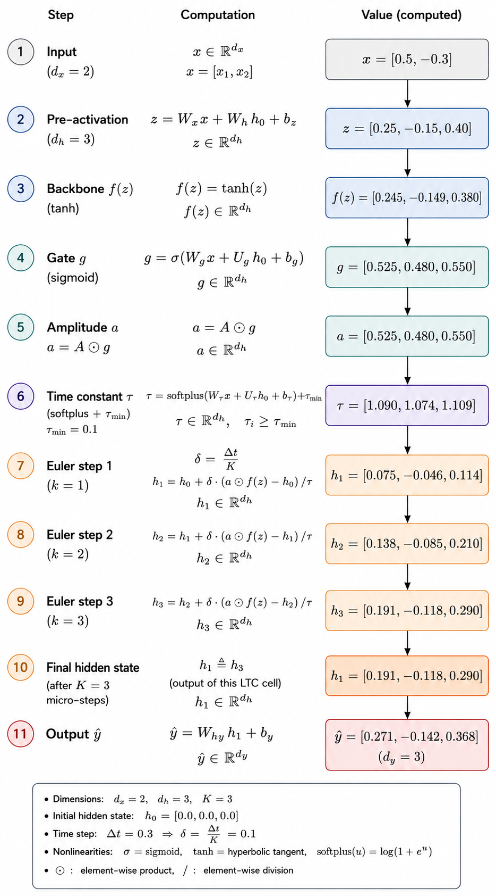
*Figure 12 — Complete numerical walkthrough of a single LTC cell forward pass(d_x=2, d_h=3, K=3 micro-steps, δ=1/3). Each row shows one computational stage with its result. The computation proceeds in two parallel tracks: the backbone track (blue/orange) computes the synaptic drive f(W_ih·x + W_hh·h + b) and applies Euler updates; the time-constant track (teal/violet) computes τ(x,h) at each micro-step to scale the update. After K=3 micro-steps, the final hidden state h_1 is passed to the dense head.*

## 3 — TinyML Implementation

With this example you can implement the machine learning algorithm in ESP32, Arduino, Arduino Portenta H7 with Vision Shield, Raspberry Pi, and other microcontrollers or IoT devices *(Figure 13)*.

### 3.1 — Jupyter Notebooks

-  Liquid Neural Network Training

### 3.2 — Arduino Code

-  Example 1: LNN Regression

-  Example 2: LNN Binary Classification

-  Example 3: LNN Multiclass Classification

-  Example 4: LNN Seq2Seq

## References

[1] Hasani, R., Lechner, M., Amini, A., Rus, D., & Grosu, R. (2021). Liquid Time-constant Networks. *Proceedings of the 35th AAAI Conference on Artificial Intelligence*, 7657–7666.

[2] Lechner, M., Hasani, R., Amini, A., Henzinger, T. A., Rus, D., & Grosu, R. (2020). Neural Circuit Policies Enabling Auditable Autonomy. *Nature Machine Intelligence*, 2(10), 642–652.

[3] Hasani, R., Lechner, M., Amini, A., Liebenwein, L., Ray, A., Tschaikowski, M., Tanner, G., & Rus, D. (2022). Closed-form Continuous-time Neural Networks. *Nature Machine Intelligence*, 4, 992–1003.

[4] Chen, R. T. Q., Rubanova, Y., Bettencourt, J., & Duvenaud, D. (2018). Neural Ordinary Differential Equations. *Advances in Neural Information Processing Systems (NeurIPS)*, 31.

[5] Rumelhart, D. E., Hinton, G. E., & Williams, R. J. (1986). Learning Representations by Back-Propagating Errors. *Nature*, 323(6088), 533–536.

[6] Hochreiter, S., & Schmidhuber, J. (1997). Long Short-Term Memory. *Neural Computation*, 9(8), 1735–1780.

[7] Cho, K., van Merrienboer, B., Gulcehre, C., Bahdanau, D., Bougares, F., Schwenk, H., & Bengio, Y. (2014). Learning Phrase Representations Using RNN Encoder-Decoder for Statistical Machine Translation. *EMNLP 2014*, 1724–1734.

[8] Funahashi, K., & Nakamura, Y. (1993). Approximation of Dynamical Systems by Continuous Time Recurrent Neural Networks. *Neural Networks*, 6(6), 801–806.

[9] Kidger, P., Morrill, J., Foster, J., & Lyons, T. (2020). Neural Controlled Differential Equations for Irregular Time Series. *NeurIPS*, 33, 6696–6707.

[10] Goodfellow, I., Bengio, Y., & Courville, A. (2016). *Deep Learning*. MIT Press.

[11] Lane, N. D., Bhattacharya, S., Georgiev, P., Forlivesi, C., & Kawsar, F. (2015). An Early Resource Characterization of Deep Learning on Wearables, Smartphones and Internet-of-Things Devices. *IoT-App 2015*, 7–12.

[12] Werbos, P. J. (1990). Backpropagation Through Time: What It Does and How to Do It. *Proceedings of the IEEE*, 78(10), 1550–1560.

[13] Dormand, J. R., & Prince, P. J. (1980). A Family of Embedded Runge-Kutta Formulae. *Journal of Computational and Applied Mathematics*, 6(1), 19–26.
