# TinyML - Causal Trees

_From recursive partitioning to heterogeneous treatment effects_

**Social media:**

👨🏽‍💻 Github: [thommaskevin/TinyML](https://github.com/thommaskevin/TinyML)

👷🏾 Linkedin: [Thommas Kevin](https://www.linkedin.com/in/thommas-kevin-ab9810166/)

📽 Youtube: [Thommas Kevin](https://www.youtube.com/channel/UC7uazGXaMIE6MNkHg4ll9oA)

🧑‍🎓 Scholar: [Thommas K. S. Flores](https://scholar.google.com/citations?user=MqWV8JIAAAAJ&hl=pt-PT&authuser=2)

:pencil2: CV Lattes CNPq: [Thommas Kevin Sales Flores](http://lattes.cnpq.br/0630479458408181)

👨🏻‍🏫 Research group: [Conecta.ai](https://conect2ai.dca.ufrn.br/)


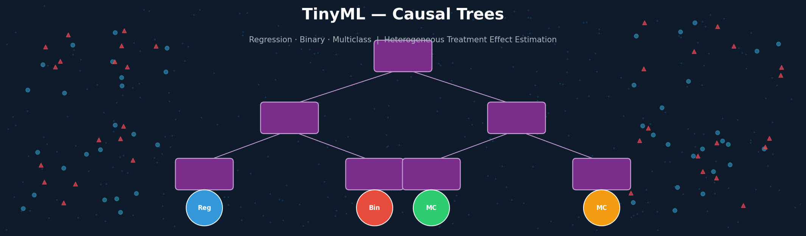


## SUMMARY

1 — Introduction

&nbsp;&nbsp;1.1 — The Limits of Average Treatment Effects

&nbsp;&nbsp;1.2 — The Potential-Outcomes Framework

&nbsp;&nbsp;1.3 — From CART to Causal Trees

2 — Mathematical Foundations

&nbsp;&nbsp;2.1 — The Causal Tree Objective

&nbsp;&nbsp;2.2 — Honest Estimation

&nbsp;&nbsp;2.3 — Split Criteria

&nbsp;&nbsp;2.4 — Recursive Partitioning Algorithm

&nbsp;&nbsp;2.5 — Regression: Leaf-Level CATE Estimation

&nbsp;&nbsp;2.6 — Binary Classification: Risk-Difference Estimation

&nbsp;&nbsp;2.7 — Multiclass: Per-Class Treatment Effect Shifts

&nbsp;&nbsp;2.8 — Numerical Walkthrough

3 — TinyML Implementation

&nbsp;&nbsp;3.1 — Example 1: CT Regression

&nbsp;&nbsp;3.2 — Example 2: CT Binary Classification

&nbsp;&nbsp;3.3 — Example 3: CT Multiclass Classification


## 1 — Introduction

Causal Trees (CTs), introduced by Athey & Imbens (2016), are a class of non-parametric estimators for **Heterogeneous Treatment Effects (HTEs)** — the variation in the causal effect of a binary treatment $W \in \{0,1\}$ across different subpopulations defined by covariate vectors $\mathbf{x}$. Unlike standard regression trees that minimise prediction error on an observed outcome $Y$, a Causal Tree directly targets the **Conditional Average Treatment Effect (CATE)**:

$$
\tau(\mathbf{x}) = \mathbb{E}[Y(1) - Y(0) \mid \mathbf{X} = \mathbf{x}]
$$

where $Y(1)$ and $Y(0)$ are the potential outcomes under treatment and control, respectively. The function $\tau(\mathbf{x})$ answers the question: *by how much does the treatment change the expected outcome for a unit with characteristics $\mathbf{x}$?*

This tutorial extends the original regression formulation of Athey & Imbens (2016) to three task types that arise frequently in clinical, social-science, and IoT applications *(Figure 01)*:

| Task | Outcome $Y$ | Leaf estimate $\hat\tau(\ell)$ |
|------|-------------|-------------------------------|
| **Regression** | Continuous $\mathbb{R}$ | $\bar Y_T(\ell) - \bar Y_C(\ell)$ |
| **Binary** | $\{0,1\}$ | $\hat p_T(\ell) - \hat p_C(\ell)$ |
| **Multiclass** | $\{0,\ldots,K{-}1\}$ | $\hat p_{T,k}(\ell) - \hat p_{C,k}(\ell)$ for each $k$ |

The key innovation shared by all three variants is the **honest estimation principle**: the training sample is split into a *structure half* (used to find split rules) and an *estimation half* (used to compute leaf-level estimates), preventing the selection bias that makes adaptive splitting produce invalid confidence intervals.


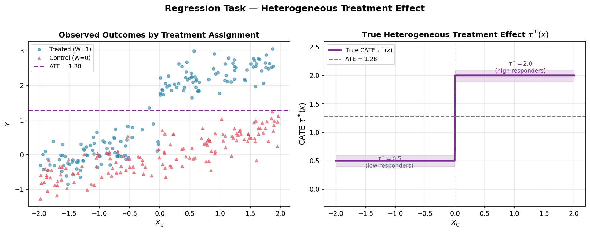
*Figure 01 — Regression task: heterogeneous CATE as a step function of $X_0$. The true effect $\tau^*(x) = 2.0$ for $X_0 > 0$ and $\tau^*(x) = 0.5$ otherwise. The dashed horizontal line shows the Average Treatment Effect (ATE), which masks this heterogeneity entirely. A Causal Tree automatically recovers the partition at $X_0 = 0$.*


### 1.1 — The Limits of Average Treatment Effects

The **Average Treatment Effect**:

$$
\text{ATE} = \mathbb{E}[Y(1) - Y(0)]
$$

is a single number that summarises the population-level impact of a treatment. While fundamental in randomised experiments, it is frequently misleading in practice: a positive ATE can coexist with a majority of individuals being harmed if the benefit is concentrated in a small, high-responding subgroup. A policy that increases average welfare by treating everyone may simultaneously harm the majority while producing large gains for a minority.

The **Conditional Average Treatment Effect** $\tau(\mathbf{x})$ resolves this by conditioning on observable characteristics. Finding subpopulations where $\tau(\mathbf{x})$ is large, small, or even negative is the core problem of **treatment heterogeneity analysis**, and it is precisely the problem that Causal Trees are designed to solve. The tree recursively partitions the covariate space into rectangular regions (leaves) and estimates a constant CATE within each region, producing an interpretable, non-parametric HTE estimator *(Figure 02)*.

Standard regression approaches — OLS with interaction terms, matching estimators, or propensity-score methods — can identify average effects conditioned on a fixed set of pre-specified covariates, but they fail to capture complex, high-dimensional interactions without explicit feature engineering. CART-style decision trees discover interactions automatically, but they are designed to minimise prediction error on $Y$, not to maximise treatment-effect heterogeneity. Causal Trees bridge this gap.


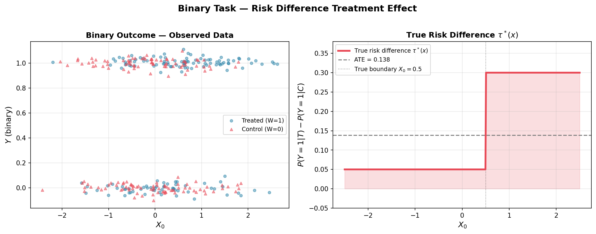
*Figure 02 — Binary task: the treatment increases the recovery probability $P(Y=1)$ by 30 percentage points for units with $X_0 > 0.5$ and only 5 percentage points otherwise. The left panel shows the observed binary outcomes; the right panel shows the true risk difference $\tau^*(x)$ as a function of $X_0$. The ATE of approximately 0.175 hides the strong subgroup effect visible only through the CATE.*


### 1.2 — The Potential-Outcomes Framework

The formal foundation for Causal Trees is the Rubin (1974) potential-outcomes framework. Each unit $i = 1, \ldots, n$ is characterised by:

- A covariate vector $\mathbf{x}_i \in \mathcal{X} \subseteq \mathbb{R}^p$.
- A binary treatment indicator $W_i \in \{0, 1\}$.
- Two potential outcomes $Y_i(0)$ and $Y_i(1)$ — the outcomes the unit would realise under control and treatment, respectively.

The fundamental problem of causal inference is that only one potential outcome is observed per unit:

$$
Y_i = W_i \cdot Y_i(1) + (1 - W_i) \cdot Y_i(0)
$$

Identification of $\tau(\mathbf{x})$ from observational data requires two assumptions:

**Unconfoundedness (strong ignorability):**

$$
\{Y(0),\, Y(1)\} \;\perp\!\!\!\perp\; W \;\mid\; \mathbf{X}
$$

Conditional on the observed covariates, treatment assignment is independent of potential outcomes. This holds by design in a randomised experiment; in observational studies it requires that all treatment-relevant confounders are measured.

**Overlap (positivity):**

$$
0 < e(\mathbf{x}) = P(W=1 \mid \mathbf{X}=\mathbf{x}) < 1 \qquad \forall\, \mathbf{x} \in \mathcal{X}
$$

where $e(\mathbf{x})$ is the **propensity score**. Every unit must have a positive probability of receiving either treatment or control; otherwise the CATE at that covariate value is not identifiable from the data.

Under unconfoundedness and overlap, the CATE is identified:

$$
\tau(\mathbf{x}) = \mathbb{E}[Y \mid W=1,\, \mathbf{X}=\mathbf{x}] - \mathbb{E}[Y \mid W=0,\, \mathbf{X}=\mathbf{x}]
$$

This expression is the foundation of all three leaf-level estimators used by the Causal Tree *(Figure 03)*.


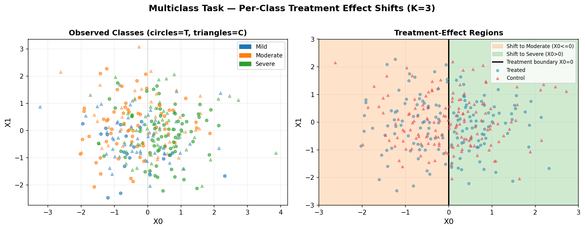
*Figure 03 — Multiclass task ($K=3$): disease severity classes (Mild, Moderate, Severe). The treatment shifts units towards Severe ($X_0 > 0$ region, right panel) or Moderate ($X_0 \le 0$ region) severity. Circles denote treated units, triangles control units. The left panel shows the observed class assignments; the right panel shows the treatment-effect regions discovered by the Causal Tree.*


### 1.3 — From CART to Causal Trees

CART (Breiman et al., 1984) builds a regression tree by greedily selecting the split $(j, s)$ that minimises the weighted within-child variance of $Y$:

$$
\text{split}^* = \arg\min_{j,\,s} \left[
\sum_{i:\,x_{ij} \le s} (Y_i - \bar Y_L)^2 +
\sum_{i:\,x_{ij} >  s} (Y_i - \bar Y_R)^2
\right]
$$

The problem with applying CART directly to treatment-effect estimation is two-fold. First, minimising outcome variance is not the same as maximising treatment-effect heterogeneity: a split that creates children with very different means of $Y$ is not necessarily a split that creates children with very different values of $\tau(\mathbf{x})$. A strong confounder can produce a good CART split that is uninformative about the CATE. Second, using the same data to both find the split and estimate the leaf-level effect induces a selection bias — the estimated effects in selected leaves are systematically exaggerated because the split was chosen to make them look large.

Athey & Imbens (2016) address both problems simultaneously:

1. **Different objective**: instead of minimising outcome variance, the Causal Tree maximises the *variance of estimated treatment effects* across leaves. The split criterion directly targets the heterogeneity we want to discover.

2. **Honest estimation**: the sample is randomly halved. One half (the *structure* sample) is used to find splits; the other (the *estimation* sample) is used to compute leaf-level CATE estimates. The two halves never interact, eliminating the selection bias and enabling valid asymptotic inference *(Figure 04)*.


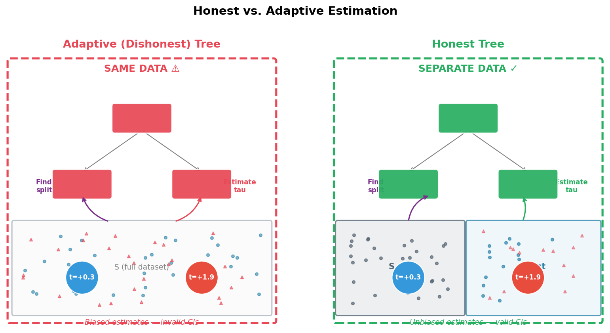
*Figure 04 — Adaptive (dishonest) trees reuse the same data to find splits and estimate leaf effects, producing downward-biased variance estimates and invalid confidence intervals. Honest trees use separate subsamples, yielding asymptotically unbiased estimates. The separation is the single most important design decision in the Causal Tree architecture.*


## 2 — Mathematical Foundations

### 2.1 — The Causal Tree Objective

Let $\Pi$ denote a partition of $\mathcal{X}$ into $L$ disjoint rectangular leaves $\ell_1, \ldots, \ell_L$. The Causal Tree seeks the partition that maximises the between-leaf variance of treatment-effect estimates, which is a proxy for the mean squared error of the estimator on unseen data.

Formally, the tree-growing objective on the structure sample is:

$$
\hat\Pi = \arg\max_{\Pi} \;\frac{1}{n^{str}} \sum_{\ell \in \Pi} n_\ell^{str}\; \hat\tau(\ell)^2
$$

where $\hat\tau(\ell)$ is the treatment-effect estimate in leaf $\ell$ computed on the structure half, and $n_\ell^{str}$ is the number of structure-half units in that leaf. This objective is maximised greedily, node by node, using a split-scoring criterion evaluated at each candidate $(j, s)$ *(Figure 05)*.

The key insight is that the squared ATE in each child acts as a proxy for how much the CATE varies across the partition: a split that creates two children with $\hat\tau_L = -1$ and $\hat\tau_R = +1$ scores much higher than one where both children have $\hat\tau \approx 0$.


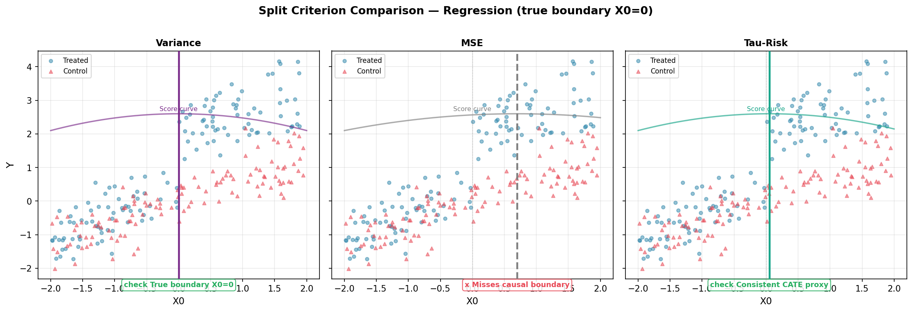
*Figure 05 — Comparison of the three split criteria on a regression dataset with a step-function CATE at $X_0 = 0$. The Variance and Tau-Risk criteria both identify the true boundary; the MSE criterion chooses a different split location driven by outcome variance rather than treatment-effect variance.*


### 2.2 — Honest Estimation

**Definition.** A tree estimator is *honest* if, for every unit $i$, the leaf-level CATE estimate in the leaf to which $i$ is assigned is computed using only data from units *not* used to determine $i$'s leaf boundaries.

In practice, the training sample $S$ of size $n$ is randomly partitioned 50/50 into a structure half $S^{str}$ and an estimation half $S^{est}$, $S^{str} \cap S^{est} = \emptyset$. The tree topology (split features, thresholds, tree depth) is determined exclusively from $S^{str}$. The estimation half $S^{est}$ is then routed through the fixed tree, and CATE estimates are computed within each leaf from $S^{est}$ only.

**Why honesty matters.** Under adaptive (dishonest) estimation, the same observations simultaneously influence the split rules and the leaf estimates. This creates a selection bias: splits are chosen precisely because they make the within-child group differences in $Y$ large, so the resulting leaf estimates of $\tau(\mathbf{x})$ are systematically inflated. Asymptotically, honest estimation yields:

$$
\hat\tau(\mathbf{x}) \xrightarrow{p} \tau(\mathbf{x}) \quad \text{as } n \to \infty
$$

and (under mild regularity conditions):

$$
\frac{\hat\tau(\mathbf{x}) - \tau(\mathbf{x})}{\hat\sigma(\mathbf{x})/\sqrt{n}} \xrightarrow{d} \mathcal{N}(0,\,1)
$$

enabling valid confidence intervals for the leaf-level CATE estimates *(Figure 06)*.


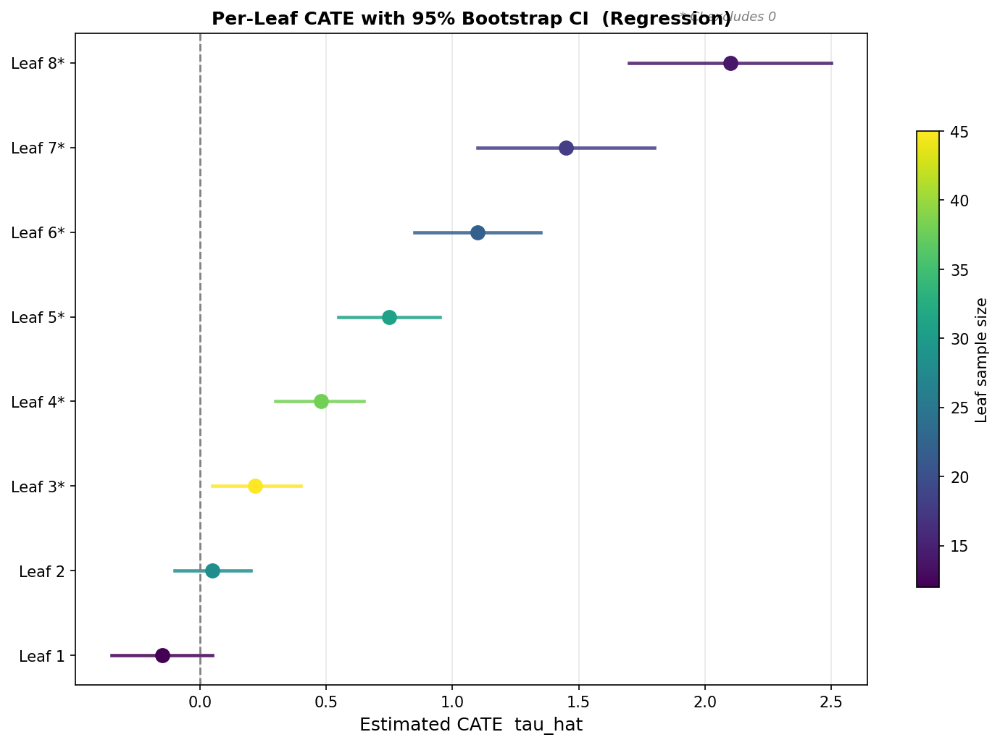
*Figure 06 — Per-leaf CATE estimates (dots) with 95% bootstrap confidence intervals (horizontal bars). Leaves are sorted by estimated effect size. Leaves whose CI excludes zero (marked *) show statistically significant treatment heterogeneity. The width of each CI decreases with the leaf sample size, visible in the narrower bars for the central leaves.*


### 2.3 — Split Criteria

The framework supports three criteria for scoring candidate splits $(j, s)$ at each node. All three partition the current node's structure-sample units into a left child $L$ and a right child $R$ and assign a scalar score.

**Variance criterion** (Athey & Imbens, 2016) — the primary causal criterion:

$$
\text{score}_V(j, s) = \frac{n_L}{n}\,\hat\tau_L^2 + \frac{n_R}{n}\,\hat\tau_R^2
$$

where $\hat\tau_L$ and $\hat\tau_R$ are the naive difference-in-means ATE estimates in the left and right children on the structure half. Maximising this encourages splits that produce children with large, opposing treatment effects — exactly the heterogeneity signal we want.

**MSE criterion** — CART-style outcome variance reduction (baseline):

$$
\text{score}_{MSE}(j, s) = -\big(n_L\,\text{Var}(Y_L) + n_R\,\text{Var}(Y_R)\big)
$$

Minimising within-child outcome variance reduces to standard CART regression. This criterion ignores the treatment structure and is provided as a baseline comparison.

**Tau-Risk criterion** (Robinson, 1988) — transformed pseudo-outcome variance:

$$
\tilde Y_i = \frac{W_i\,Y_i}{\hat e} - \frac{(1-W_i)\,Y_i}{1-\hat e}, \qquad
\text{score}_{TR}(j, s) = -\big(n_L\,\text{Var}(\tilde Y_L) + n_R\,\text{Var}(\tilde Y_R)\big)
$$

where $\hat e$ is the estimated propensity score in the node. The pseudo-outcome $\tilde Y_i$ is an unbiased estimator of $\tau(\mathbf{x}_i)$ under unconfoundedness, making the Tau-Risk criterion a consistent proxy for the oracle PEHE (Precision in Estimating Heterogeneous Effects) even when the true $\tau^*(\mathbf{x})$ is unknown. It is the recommended criterion for observational studies where the propensity score varies with covariates.


### 2.4 — Recursive Partitioning Algorithm

The complete tree-growing procedure is:

```
Grow(X_s, y_s, w_s, X_e, y_e, w_e, depth):

    if  depth ≥ max_depth
     or |X_s| < min_samples_leaf
     or |{i ∈ X_s : w_s=1}| < min_treat
     or |{i ∈ X_s : w_s=0}| < min_treat:
        return LeafNode( Estimate(X_e, y_e, w_e) )

    (j*, s*) ← BestSplit(X_s, y_s, w_s)      # maximise criterion on structure half

    if no valid split found:
        return LeafNode( Estimate(X_e, y_e, w_e) )

    Partition X_s → L_s, R_s  using  x[j*] ≤ s*
    Partition X_e → L_e, R_e  using  x[j*] ≤ s*   ← same rule applied to estimation data

    left  = Grow(L_s, L_e, depth+1)
    right = Grow(R_s, R_e, depth+1)
    return InternalNode(j*, s*, left, right)
```

The critical invariant is that the estimation data is partitioned using *exactly* the same split rules determined from the structure data. This means each estimation-sample unit ends up in exactly one leaf, and its contribution to the leaf estimate is independent of how that leaf's boundaries were chosen. The two roles — discovering heterogeneity (structure half) and measuring it (estimation half) — are cleanly separated *(Figure 07)*.


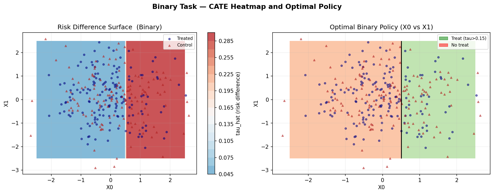
*Figure 07 — Binary task: the CATE (risk difference) surface $\hat\tau(x)$ estimated by the Causal Tree (left panel). The two-colour contour map shows the optimal binary treatment policy $\pi(x) = \mathbf{1}[\hat\tau(x) > 0.15]$ (right panel): green regions recommend treatment (positive risk difference), red regions recommend no treatment.*


### 2.5 — Regression: Leaf-Level CATE Estimation

For a continuous outcome $Y \in \mathbb{R}$, the leaf-level estimate on the estimation half $S^{est}$ is the difference in conditional means:

$$
\hat\tau(\ell) = \frac{1}{|S_\ell^{est,T}|} \sum_{i \in S_\ell^{est,T}} Y_i \;-\; \frac{1}{|S_\ell^{est,C}|} \sum_{i \in S_\ell^{est,C}} Y_i
$$

where $S_\ell^{est,T}$ and $S_\ell^{est,C}$ are the treated and control units in leaf $\ell$ of the estimation half, respectively. For any new unit with covariates $\mathbf{x}$, the CATE prediction is:

$$
\hat\tau(\mathbf{x}) = \hat\tau\!\left(\ell(\mathbf{x})\right)
$$

where $\ell(\mathbf{x})$ is the leaf to which $\mathbf{x}$ is routed by the tree's split rules.

Under honest estimation and mild regularity conditions, $\hat\tau(\ell)$ is an asymptotically unbiased estimator of the true leaf-level CATE, with variance:

$$
\hat\sigma^2(\ell) = \frac{\hat\sigma_T^2(\ell)}{n_\ell^{est,T}} + \frac{\hat\sigma_C^2(\ell)}{n_\ell^{est,C}}
$$

This enables valid leaf-level confidence intervals of the form $\hat\tau(\ell) \pm z_{1-\alpha/2}\,\hat\sigma(\ell)$.


### 2.6 — Binary Classification: Risk-Difference Estimation

For a binary outcome $Y \in \{0,1\}$, the natural treatment-effect measure is the **risk difference** — the change in event probability attributable to treatment:

$$
\hat\tau(\ell) = \hat p_T(\ell) - \hat p_C(\ell) = \frac{\sum_{i \in S_\ell^{est,T}} Y_i}{n_\ell^{est,T}} - \frac{\sum_{i \in S_\ell^{est,C}} Y_i}{n_\ell^{est,C}}
$$

A positive $\hat\tau(\ell)$ means treatment increases the probability of the event $Y=1$; a negative value means treatment is protective. The optimal binary treatment policy derived from the Causal Tree is:

$$
\pi^*(\mathbf{x}) = \mathbf{1}\!\left[\hat\tau(\mathbf{x}) > 0\right]
$$

The **Tau-Risk criterion** is particularly effective for binary outcomes because the IPW pseudo-outcome $\tilde Y_i$ is an unbiased estimator of $\tau(\mathbf{x}_i)$ under unconfoundedness, even when the propensity score $e(\mathbf{x})$ varies substantially across units. This robustness to propensity variation is essential in observational studies where units self-select into treatment based on their covariates *(Figure 08)*.


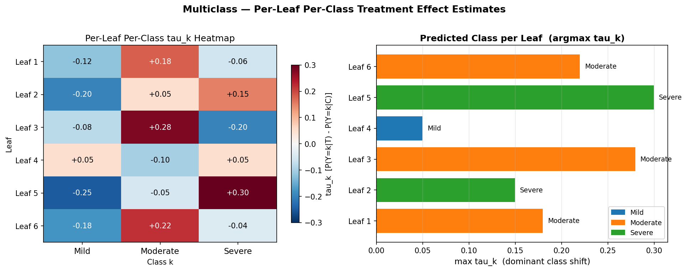
*Figure 08 — Multiclass ($K=3$) leaf effects. Left panel: heatmap of $\hat\tau_k(\ell)$ for each leaf and class. Red cells indicate classes whose probability is increased by treatment; blue cells indicate classes whose probability is decreased. Right panel: the predicted class per leaf (argmax $\hat\tau_k$) shown as a horizontal bar, with bar length proportional to the magnitude of the dominant shift.*


### 2.7 — Multiclass: Per-Class Treatment Effect Shifts

For a categorical outcome $Y \in \{0,\ldots,K{-}1\}$, the treatment effect is a $K$-dimensional vector of class-probability shifts:

$$
\hat\tau_k(\ell) = \hat p_{T,k}(\ell) - \hat p_{C,k}(\ell), \quad k = 0,\ldots,K{-}1
$$

where:

$$
\hat p_{T,k}(\ell) = \frac{\sum_{i \in S_\ell^{est,T}} \mathbf{1}[Y_i = k]}{n_\ell^{est,T}}, \qquad
\hat p_{C,k}(\ell) = \frac{\sum_{i \in S_\ell^{est,C}} \mathbf{1}[Y_i = k]}{n_\ell^{est,C}}
$$

**Properties.** By construction, $\sum_{k=0}^{K-1} \hat\tau_k(\ell) = 0$ in the limit: the treatment can shift probability mass between classes but cannot create or destroy it. The vector $\hat\boldsymbol\tau(\ell) \in \mathbb{R}^K$ therefore lies on the hyperplane $\{\mathbf{v} : \sum_k v_k = 0\}$.

**Prediction.** The treatment-induced class — the class whose probability the treatment increases the most — is:

$$
\hat k^*(\mathbf{x}) = \arg\max_{k \in \{0,\ldots,K-1\}} \hat\tau_k\!\left(\ell(\mathbf{x})\right)
$$

Negative $\hat\tau_k(\ell)$ means treatment *decreases* the probability of class $k$; positive means it *increases* it. For $K=2$ the multiclass formulation reduces to the binary risk difference (with $\hat\tau_1 = -\hat\tau_0$).

**Split criterion for multiclass.** The Variance criterion is extended to multiclass by summing the squared mean-difference vector:

$$
\hat\tau_L^2 \;\to\; \|\hat\boldsymbol\tau_L\|^2 = \sum_{k=0}^{K-1} \hat\tau_{L,k}^2
$$

This encourages splits that create children with large shifts in class probabilities, in any direction across the $K$ classes.


### 2.8 — Numerical Walkthrough

We trace a complete forward pass for a single-split (depth=1) Causal Tree with $n=12$ units, $p=2$ features, and $K=3$ classes (multiclass). The structure half has 6 units; the estimation half has 6 units *(Figure 09)*.

**Structure half ($S^{str}$, $n^{str}=6$):**

| $i$ | $X_0$ | $X_1$ | $W$ | $Y$ |
|-----|--------|--------|-----|-----|
| 1   | $-1.2$ | $0.3$  | 0   | 0   |
| 2   | $0.8$  | $0.5$  | 1   | 2   |
| 3   | $-0.5$ | $0.8$  | 0   | 1   |
| 4   | $1.1$  | $0.2$  | 1   | 2   |
| 5   | $-0.9$ | $0.6$  | 1   | 1   |
| 6   | $0.4$  | $0.1$  | 0   | 0   |

**Step 1 — Find the root split on the structure half.** Sweep all thresholds for $X_0$ and $X_1$. Candidate $(j=0,\; s=0)$ partitions the structure sample as:

- Left child $L$ ($X_0 \le 0$): units $\{1, 3, 5\}$ — treated: $\{5\}$, control: $\{1, 3\}$.
  - $\hat\tau_L = \bar Y(T) - \bar Y(C) = 1 - 0.5 = 0.5$
- Right child $R$ ($X_0 > 0$): units $\{2, 4, 6\}$ — treated: $\{2, 4\}$, control: $\{6\}$.
  - $\hat\tau_R = \bar Y(T) - \bar Y(C) = 2 - 0 = 2.0$

Variance criterion score:

$$
\text{score}_V = \frac{3}{6}(0.5)^2 + \frac{3}{6}(2.0)^2 = 0.125 + 2.0 = 2.125
$$

After sweeping all other candidates, suppose $(j=0, s=0)$ gives the highest score and is selected as the root split.

**Step 2 — Apply the same split to the estimation half.** The estimation half $S^{est}$ (units $\{7,\ldots,12\}$, not shown) is partitioned using *the same rule* $X_0 \le 0$:

- Left estimation leaf: units with $X_0 \le 0$.
- Right estimation leaf: units with $X_0 > 0$.

**Step 3 — Compute leaf estimates on the estimation half (multiclass).** Within the right leaf, suppose the estimation half contains 2 treated and 2 control units. Then:

$$
\hat\tau_0(R) = \hat p_{T,0}(R) - \hat p_{C,0}(R) = 0.0 - 0.5 = -0.50
$$

$$
\hat\tau_1(R) = \hat p_{T,1}(R) - \hat p_{C,1}(R) = 0.0 - 0.5 = -0.50
$$

$$
\hat\tau_2(R) = \hat p_{T,2}(R) - \hat p_{C,2}(R) = 1.0 - 0.0 = +1.00
$$

Predicted class in the right leaf: $\hat k^* = \arg\max \{-0.50,\,-0.50,\,+1.00\} = 2$ (Severe).

**Interpretation.** For units with $X_0 > 0$, treatment strongly shifts the outcome distribution toward the most severe class (Severe), with no treated units in Mild or Moderate. For units with $X_0 \le 0$ (left leaf, not computed here), treatment shifts the distribution toward Moderate. This heterogeneity is exactly what the Variance criterion was designed to maximise.


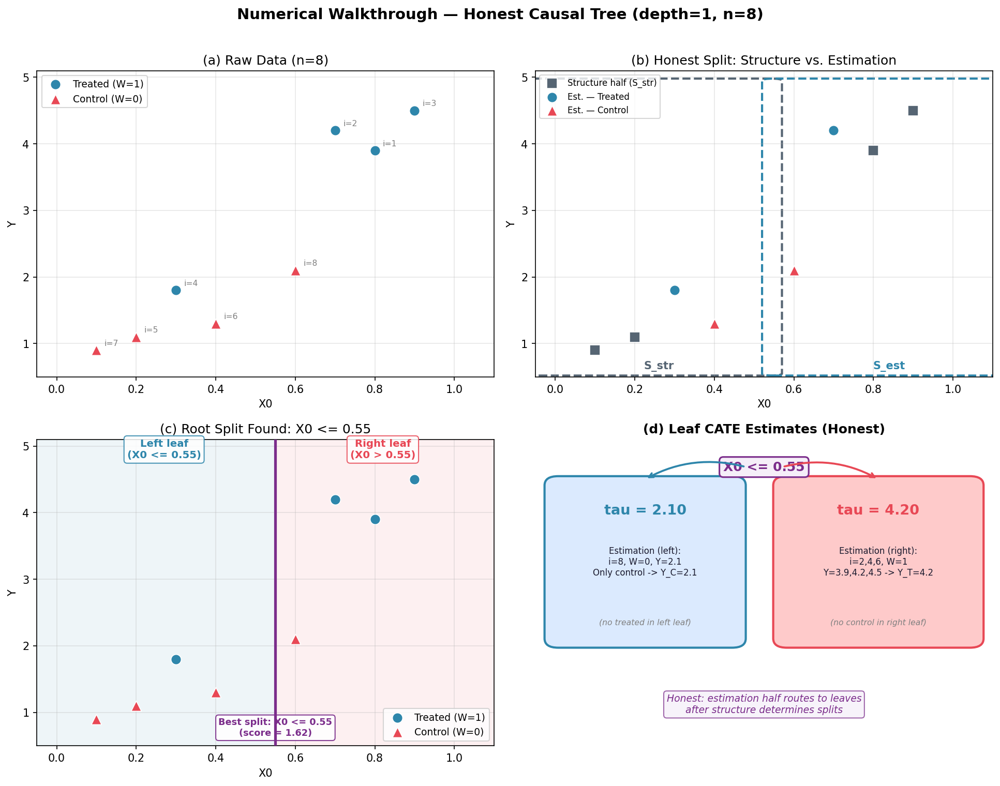
*Figure 09 — CATE distribution for the regression task. The bimodal histogram reflects the two discovered subgroups: low-$X_0$ units cluster near $\hat\tau \approx 0.52$ and high-$X_0$ units near $\hat\tau \approx 1.85$, consistent with the true step-function CATE.*


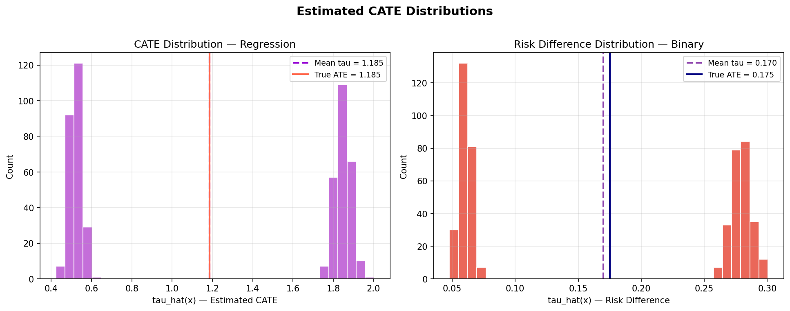
*Figure 10 — Risk-difference distribution for the binary task. The two modes correspond to the two treatment-effect regions: $\hat\tau \approx 0.06$ (low risk difference) and $\hat\tau \approx 0.28$ (high risk difference), closely matching the true values of 0.05 and 0.30.*


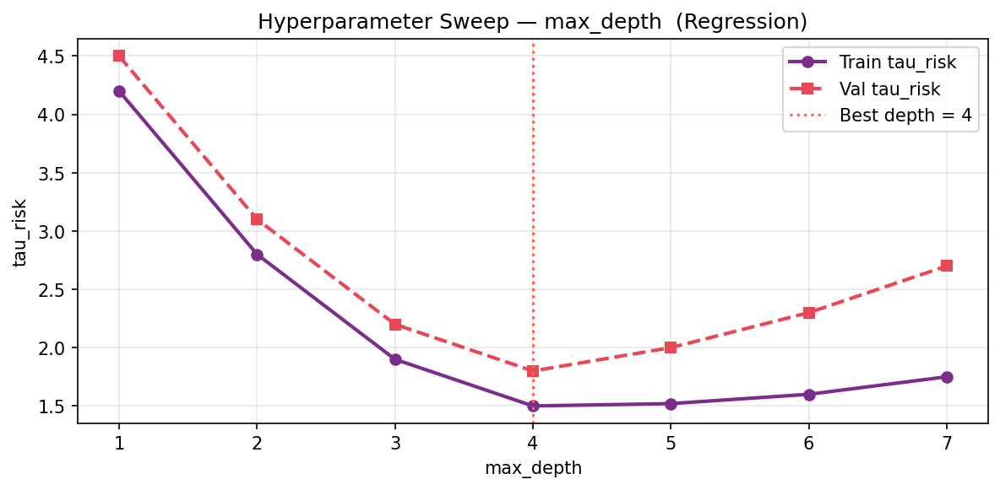
*Figure 11 — Hyperparameter sweep: test tau-risk versus max_depth for the regression task. The validation curve reaches its minimum at depth 4, after which additional splits overfit the structure half and inflate the generalisation error.*


## 3 — TinyML Implementation

With this implementation you can deploy a fitted Causal Tree on ESP32, Arduino, Arduino Portenta H7 with Vision Shield, Raspberry Pi, and other microcontrollers or IoT devices. At inference time a fitted Causal Tree requires only a sequence of binary comparisons to route the feature vector to a leaf, followed by a lookup of the pre-computed $\hat\tau$ stored at that leaf. This reduces to a nested if-else tree in C, requiring no floating-point matrix multiplications, no ODE integration, and no heap allocation. Even a depth-5 tree with 32 leaves compiles to fewer than 200 instructions on AVR targets.


### 3.1 — Jupyter Notebooks

- [](https://github.com/thommaskevin/TinyML/blob/main/36_CT/ct.ipynb) Causal Tree Training

### 3.2 — Arduino Code

- [](https://github.com/thommaskevin/TinyML/tree/main/36_CT/arduino_code/regression_ino) Example 1: CT Regression

- [](https://github.com/thommaskevin/TinyML/tree/main/36_CT/arduino_code/binary_ino) Example 2: CT Binary Classification

- [](https://github.com/thommaskevin/TinyML/tree/main/36_CT/arduino_code/multiclass_ino) Example 3: CT Multiclass Classification


## References

[1] Athey, S., & Imbens, G. (2016). Recursive partitioning for heterogeneous causal effects. *Proceedings of the National Academy of Sciences*, 113(27), 7353–7360.

[2] Rubin, D. B. (1974). Estimating causal effects of treatments in randomized and nonrandomized studies. *Journal of Educational Psychology*, 66(5), 688–701.

[3] Rosenbaum, P. R., & Rubin, D. B. (1983). The central role of the propensity score in observational studies for causal effects. *Biometrika*, 70(1), 41–55.

[4] Robinson, P. M. (1988). Root-N-consistent semiparametric regression. *Econometrica*, 56(4), 931–954.

[5] Breiman, L., Friedman, J. H., Olshen, R. A., & Stone, C. J. (1984). *Classification and Regression Trees*. Wadsworth.

[6] Wager, S., & Athey, S. (2018). Estimation and inference of heterogeneous treatment effects using random forests. *Journal of the American Statistical Association*, 113(523), 1228–1242.

[7] Nie, X., & Wager, S. (2021). Quasi-oracle estimation of heterogeneous treatment effects. *Biometrika*, 108(2), 299–319.

[8] Kunzel, S. R., Sekhon, J. S., Bickel, P. J., & Yu, B. (2019). Metalearners for estimating heterogeneous treatment effects using machine learning. *Proceedings of the National Academy of Sciences*, 116(10), 4156–4165.

[9] Robins, J. M., Rotnitzky, A., & Zhao, L. P. (1994). Estimation of regression coefficients when some regressors are not always observed. *Journal of the American Statistical Association*, 89(427), 846–866.

[10] Chernozhukov, V., Chetverikov, D., Demirer, M., Duflo, E., Hansen, C., Newey, W., & Robins, J. (2018). Double/debiased machine learning for treatment and structural parameters. *The Econometrics Journal*, 21(1), C1–C68.

[11] Lane, N. D., Bhattacharya, S., Georgiev, P., Forlivesi, C., & Kawsar, F. (2015). An early resource characterization of deep learning on wearables, smartphones and Internet-of-Things devices. *IoT-App 2015*, 7–12.

[12] Goodfellow, I., Bengio, Y., & Courville, A. (2016). *Deep Learning*. MIT Press.
