# TinyML — Generative Adversarial Networks

_Comprehensive guide to deploying on edge devices_

**Social media:**

👨🏽‍💻 Github: [thommaskevin/TinyML](https://github.com/thommaskevin/TinyML)

👷🏾 Linkedin: [Thommas Kevin](https://www.linkedin.com/in/thommas-kevin-ab9810166/)

📽 Youtube: [Thommas Kevin](https://www.youtube.com/channel/UC7uazGXaMIE6MNkHg4ll9oA)

🧑‍🎓 Scholar: [Thommas K. S. Flores](https://scholar.google.com/citations?user=MqWV8JIAAAAJ&hl=pt-PT&authuser=2)

:pencil2: CV Lattes CNPq: [Thommas Kevin Sales Flores](http://lattes.cnpq.br/0630479458408181)

👨🏻‍🏫 Research group: [Conecta.ai](https://conect2ai.dca.ufrn.br/)

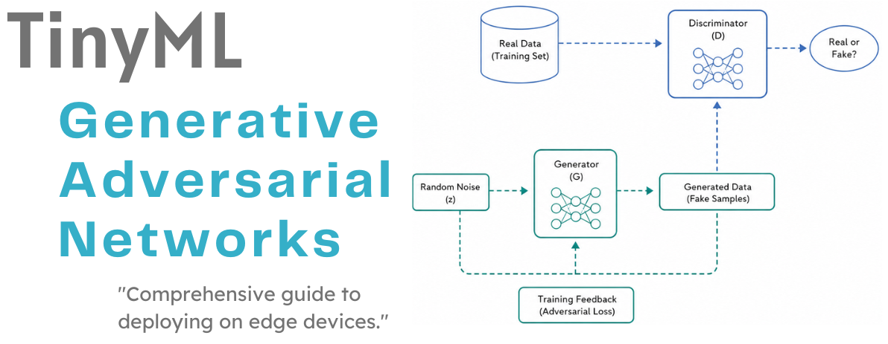

## SUMMARY

1 — Introduction

&nbsp;&nbsp;1.1 — The Generative Modeling Problem

&nbsp;&nbsp;1.2 — The Adversarial Principle

&nbsp;&nbsp;1.3 — From Vanilla GANs to the Modern Landscape

2 — Mathematical Foundations

&nbsp;&nbsp;2.1 — The Minimax Objective

&nbsp;&nbsp;2.2 — The Non-Saturating Generator Loss

&nbsp;&nbsp;2.3 — Training Dynamics and the Nash Equilibrium

&nbsp;&nbsp;2.4 — Failure Modes: Mode Collapse and Discriminator Saturation

&nbsp;&nbsp;2.5 — Least-Squares GAN (LSGAN)

&nbsp;&nbsp;2.6 — Wasserstein GAN (WGAN) and the Earth Mover's Distance

&nbsp;&nbsp;2.7 — Wasserstein GAN with Gradient Penalty (WGAN-GP)

&nbsp;&nbsp;2.8 — Hinge Loss GAN and Spectral Normalization

&nbsp;&nbsp;2.9 — Conditional GAN (cGAN)

&nbsp;&nbsp;2.10 — Regularization: Feature Matching, R1 Penalty, Mode Seeking

&nbsp;&nbsp;2.11 — Numerical Walkthrough: One Full GAN Training Step

3 — TinyML Implementation

&nbsp;&nbsp;3.1 — Example 1: Vanilla GAN — Two Moons

&nbsp;&nbsp;3.2 — Example 2: WGAN-GP — Gaussian Mixture

&nbsp;&nbsp;3.3 — Example 3: Conditional GAN — Three Blobs

&nbsp;&nbsp;3.4 — Example 4: Hinge GAN + Spectral Norm — Sensor Data

## 1 — Introduction

Generative Adversarial Networks (GANs), introduced by Goodfellow et al. in 2014, are a class of deep generative models that learn to synthesize new data by framing the generation problem as a two-player game. Unlike variational autoencoders, which optimize an explicit likelihood lower bound, or normalizing flows, which require invertible architectures, a GAN places no direct constraint on the form of the generator distribution. Instead, it trains two networks in opposition: a **Generator** that produces synthetic samples and a **Discriminator** that attempts to distinguish them from real ones (Figure 01). The tension between these two networks drives the Generator to learn increasingly realistic distributions, without ever computing a likelihood.

Since their introduction, GANs have become one of the most influential frameworks in machine learning, enabling high-fidelity image synthesis, data augmentation for imbalanced datasets, domain adaptation, anomaly detection, and, increasingly, on-device synthetic data generation for embedded systems. This document develops the mathematical foundations of GANs in full, covering all loss variants implemented in this framework, and concludes with a guide to deploying a trained Generator on Arduino and ESP32 microcontrollers for TinyML applications.

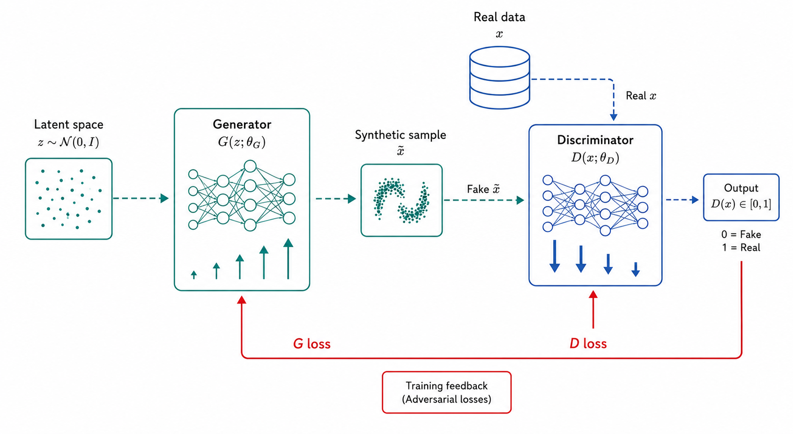
*Figure 01 — The GAN framework. A Generator G maps latent noise z ~ N(0,I) to synthetic samples x̃. A Discriminator D receives both real samples x ~ $p_data$ and fake samples x̃ ~ $p_G$, and outputs a real/fake score. Both networks are trained simultaneously: D is trained to maximize its classification accuracy, while G is trained to minimize it. The adversarial feedback loop forces G to produce increasingly realistic samples over the course of training.*

---

### 1.1 — The Generative Modeling Problem

Let $\mathbf{x} \in \mathbb{R}^d$ be a data point drawn from an unknown real distribution $p_{\text{data}}(\mathbf{x})$. The goal of generative modeling is to learn a model distribution $p_G(\mathbf{x})$ that approximates $p_{\text{data}}(\mathbf{x})$ closely enough that samples drawn from $p_G$ are indistinguishable from real data (Figure 02).

Classical approaches to this problem include:

- **Maximum Likelihood Estimation (MLE):** Directly fit a parametric model $p_\theta(\mathbf{x})$ by maximizing $\mathbb{E}_{\mathbf{x} \sim p_{\text{data}}} [\log p_\theta(\mathbf{x})]$. Requires computing a tractable likelihood, which is difficult for complex distributions in high dimensions.
- **Variational Autoencoders (VAEs):** Maximize a lower bound on the log-likelihood using an encoder-decoder architecture. The log-likelihood surrogate introduces a Gaussian prior that can blur generated samples.
- **Normalizing Flows:** Learn an invertible mapping between a simple distribution and the data distribution. Exact likelihood, but architecture is constrained to invertible functions.

GANs take a fundamentally different approach: they **implicitly** define $p_G$ through a deterministic mapping $G : \mathbb{R}^k \to \mathbb{R}^d$ applied to a simple noise distribution:

$$
\mathbf{z} \sim p_z(\mathbf{z}), \quad \tilde{\mathbf{x}} = G(\mathbf{z};\, \theta_G) \implies \tilde{\mathbf{x}} \sim p_G(\mathbf{x})
$$

The distribution $p_G$ is never computed explicitly. Instead, the quality of the Generator is measured indirectly through the Discriminator, which acts as an adaptive loss function.

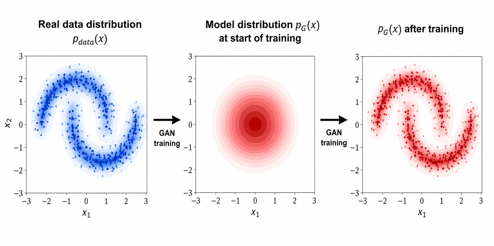
*Figure 02 — The generative modeling problem. The goal is to learn a model distribution $p_G(x)$ (red) that approximates the unknown real data distribution $p_{data}(x)$ (blue). At the start of training (center), $p_G$ is an unstructured Gaussian. After adversarial training (right), $p_G$ matches the topology of the real distribution, producing samples that are statistically indistinguishable from real data.*

### 1.2 — The Adversarial Principle

The key insight of GANs is that the distance between $p_{\text{data}}$ and $p_G$ can be estimated by a **learned classifier** rather than by an analytical formula. The Discriminator $D : \mathbb{R}^d \to [0,1]$ is trained to output a high probability for real samples and a low probability for generated ones. Its accuracy at this task is a proxy for how dissimilar the two distributions are: if $D$ can perfectly separate real from fake, the distributions are far apart; if $D$ cannot do better than random chance, the distributions are identical.

This formulation is elegant for three reasons. First, it does not require computing $p_G(\mathbf{x})$ explicitly. Second, the Discriminator automatically focuses on the most discriminative features of the data, providing informative gradients even in high-dimensional spaces. Third, as $p_G$ improves, the Discriminator's task becomes harder, providing a natural curriculum that drives the Generator to continuously improve *(Figure 03)*.

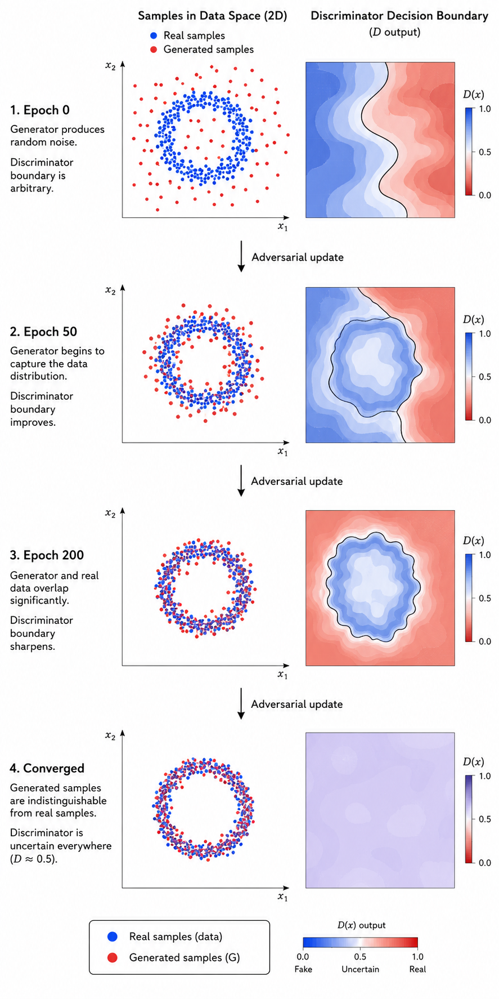
*Figure 03 — The adversarial training curriculum. As training progresses, the Generator produces increasingly realistic samples (left column), while the Discriminator refines its decision boundary (right column). At convergence, the generated distribution matches the real distribution so closely that the Discriminator can no longer reliably distinguish them; its output approaches 0.5 everywhere, indicating that the Nash equilibrium has been reached.*

### 1.3 — From Vanilla GANs to the Modern Landscape

The original GAN formulation of Goodfellow et al. (2014) used binary cross-entropy as the adversarial objective. While conceptually clean, this formulation suffers from **training instability** and **mode collapse**, pathologies that led to a decade of research into improved GAN training procedures (Figure 04).

The most significant advances include:

- **DCGAN** (Radford et al., 2015): Architectural guidelines (batch normalization, strided convolutions) that dramatically stabilize training.
- **LSGAN** (Mao et al., 2017): Least-squares loss that avoids gradient saturation.
- **WGAN** (Arjovsky et al., 2017): Wasserstein distance objective with theoretical convergence guarantees.
- **WGAN-GP** (Gulrajani et al., 2017): Gradient penalty to enforce the Lipschitz constraint without weight clipping.
- **Spectral Normalization** (Miyato et al., 2018): Per-layer normalization of Discriminator weights that enforces the Lipschitz constraint without additional terms in the loss.
- **cGAN** (Mirza & Osindero, 2014): Class-conditional generation by feeding labels to both networks.

This framework implements all of the above as interchangeable loss functions and layer options, allowing the user to select the appropriate variant for their dataset and deployment target.

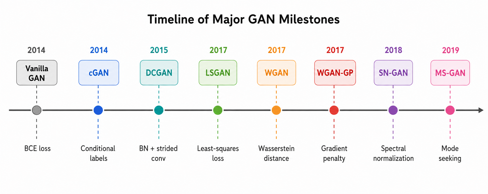
*Figure 04 — Major milestones in GAN development. Each variant addressed a specific limitation of its predecessor: DCGAN stabilized training through architectural guidelines; LSGAN and WGAN replaced BCE with losses that provide informative gradients throughout training; WGAN-GP and SN-GAN enforced Lipschitz constraints without weight clipping; and cGAN extended unconditional generation to class-conditional synthesis. This framework implements all highlighted variants as interchangeable modules.*

## 2 — Mathematical Foundations

### 2.1 — The Minimax Objective

Let $G_\theta : \mathbb{R}^k \to \mathbb{R}^d$ be the Generator with parameters $\theta_G$ and $D_\phi : \mathbb{R}^d \to [0,1]$ be the Discriminator with parameters $\theta_D$. The original GAN objective is the following minimax game (Figure 05):

$$
\min_{\theta_G} \max_{\theta_D} \; V(D, G) = \mathbb{E}_{\mathbf{x} \sim p_{\text{data}}} [\log D(\mathbf{x})] + \mathbb{E}_{\mathbf{z} \sim p_z} [\log (1 - D(G(\mathbf{z})))]
$$

The Discriminator $D$ maximizes $V$ by assigning high $\log D(\mathbf{x})$ to real samples and high $\log(1 - D(G(\mathbf{z})))$ to fake samples, i.e., low $D(G(\mathbf{z}))$.

The Generator $G$ minimizes $V$ because it wants to maximize $D(G(\mathbf{z}))$ so that the second term $\log(1 - D(G(\mathbf{z})))$ is small.

**Optimal Discriminator.** For a fixed Generator $G$, the optimal Discriminator is:

$$
D^*(\mathbf{x}) = \frac{p_{\text{data}}(\mathbf{x})}{p_{\text{data}}(\mathbf{x}) + p_G(\mathbf{x})}
$$

This is the Bayes-optimal classifier that assigns to each point the posterior probability that it came from the real distribution rather than the Generator.

**Global optimum.** Substituting $D^*$ back into $V$, the Generator's optimal solution is $p_G = p_{\text{data}}$, at which point $D^*(\mathbf{x}) = 1/2$ everywhere, so the Discriminator cannot do better than a coin flip. At this point, the value of the game equals $-\log 4$, and the minimax objective is equivalent to minimizing twice the **Jensen-Shannon Divergence** between $p_{\text{data}}$ and $p_G$:

$$
V(D^*, G) = -\log 4 + 2 \cdot \text{JSD}(p_{\text{data}} \,\|\, p_G)
$$

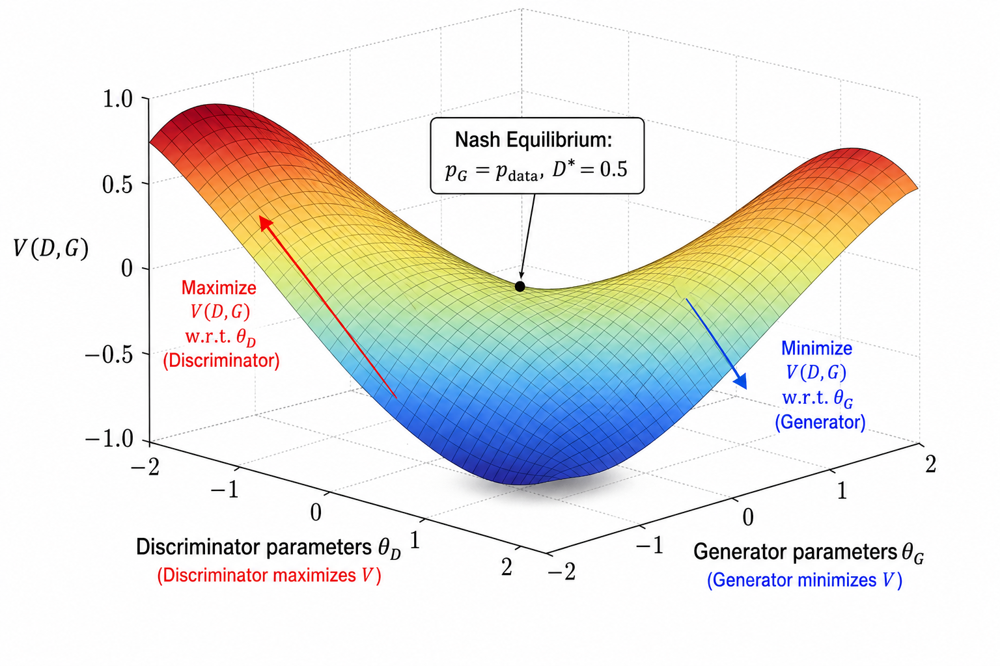
*Figure 05 — The minimax objective V(D, G) as a saddle-shaped surface. The Discriminator (red arrow) ascends the surface to maximize V, while the Generator (blue arrow) descends to minimize it. The Nash equilibrium (center) is a saddle point where neither player can improve unilaterally: $p_G$ = $p_{data}$ and D\* = 0.5 everywhere. In practice, gradient descent-ascent on this surface is highly non-convex, which motivates the improved loss variants discussed in Sections 2.5–2.8.*

### 2.2 — The Non-Saturating Generator Loss

A critical practical issue with the minimax formulation is that early in training, when the Generator produces obviously fake samples, the Discriminator can easily assign $D(G(\mathbf{z})) \approx 0$, making $\log(1 - D(G(\mathbf{z}))) \approx 0$. The gradient of this term with respect to $\theta_G$ **vanishes**, providing no learning signal to the Generator, a phenomenon known as the **discriminator saturation** problem.

Goodfellow et al. (2014) proposed the **non-saturating Generator loss** as a practical fix: instead of minimizing $\log(1 - D(G(\mathbf{z})))$, the Generator maximizes $\log D(G(\mathbf{z}))$:

$$
\mathcal{L}_G^{\text{NS}} = -\mathbb{E}_{\mathbf{z} \sim p_z} [\log D(G(\mathbf{z}))]
$$

This is equivalent to minimizing the binary cross-entropy between $D(G(\mathbf{z}))$ and the label 1. The gradient is large when $D(G(\mathbf{z})) \approx 0$ (the Generator is failing) and small when $D(G(\mathbf{z})) \approx 1$ (the Generator is succeeding), providing informative gradients throughout training (Figure 06).

The corresponding Discriminator loss (on real and fake batches separately) is:

$$
\mathcal{L}_D = -\mathbb{E}_{\mathbf{x} \sim p_{\text{data}}} [\log D(\mathbf{x})] - \mathbb{E}_{\mathbf{z} \sim p_z} [\log (1 - D(G(\mathbf{z})))]
$$

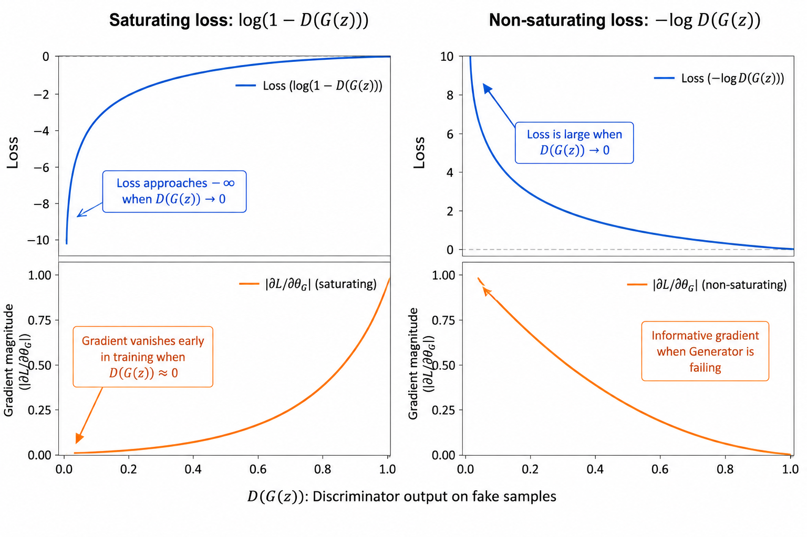
*Figure 06 — Comparison of the saturating (original minimax) and non-saturating Generator loss. Left: in the saturating formulation, the gradient $∂L_G/∂θ_G$ vanishes when D(G(z)) ≈ 0, i.e., when the Generator most needs to improve. Right: the non-saturating formulation −log D(G(z)) has large gradients exactly when the Generator is failing, providing a consistently informative learning signal. All GAN variants in this framework use the non-saturating formulation for the Generator.*

### 2.3 — Training Dynamics and the Nash Equilibrium

In the ideal theoretical analysis, the Discriminator is trained to its global optimum before each Generator update. In practice, both networks are updated by **simultaneous gradient descent-ascent** using mini-batches (Figure 07):

**For each training step:**

1. Sample $\mathbf{x}^{(i)} \sim p_{\text{data}}$ and $\mathbf{z}^{(i)} \sim p_z$ for $i = 1, \ldots, B$.
2. Compute $\tilde{\mathbf{x}}^{(i)} = G(\mathbf{z}^{(i)})$ (no gradient through $G$ for D update).
3. Update $\theta_D$: $\theta_D \leftarrow \theta_D + \alpha \nabla_{\theta_D} \mathcal{L}_D$ (gradient ascent on $D$).
4. Sample fresh $\mathbf{z}^{(i)} \sim p_z$.
5. Update $\theta_G$: $\theta_G \leftarrow \theta_G - \alpha \nabla_{\theta_G} \mathcal{L}_G$ (gradient descent on $G$).

A key design choice is how many Discriminator updates to perform per Generator update. For WGAN variants, the Critic is typically updated $n_{\text{critic}} = 5$ times per Generator step to ensure the Critic approximates the true Wasserstein distance accurately before the Generator moves. For vanilla GAN and LSGAN, $n_{\text{critic}} = 1$ is standard.

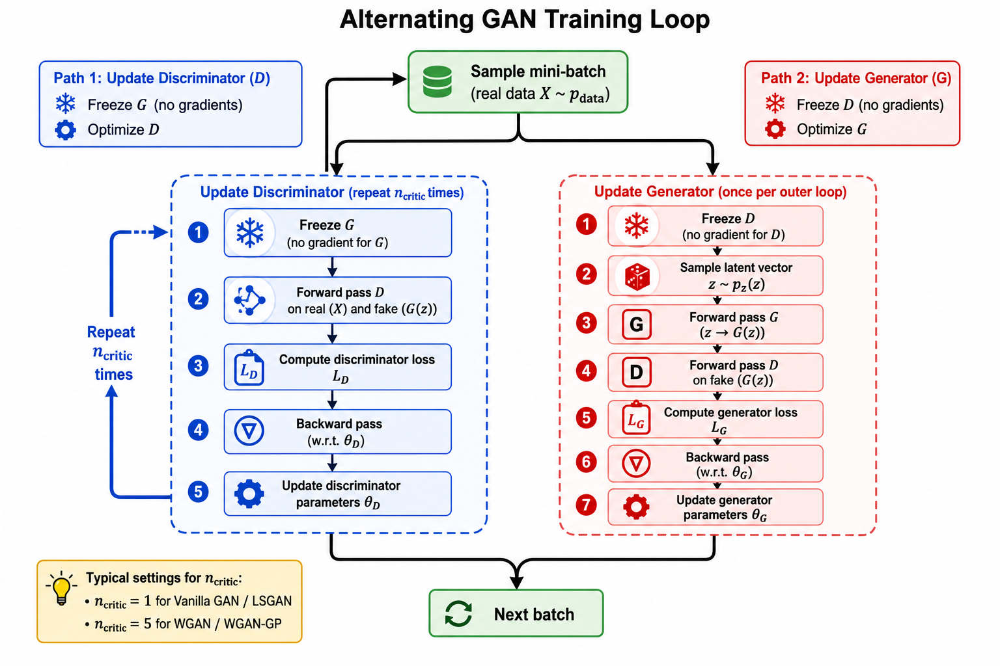
*Figure 07 — The alternating gradient update loop in GAN training. In each outer iteration: (blue path) the Discriminator is updated $n_{critic}$ times on real and fake batches with G frozen; (red path) the Generator is updated once with D frozen. Separating the two updates prevents gradient interference and allows the Discriminator to provide a meaningful signal before the Generator moves. The number of Critic updates $n_{critic}$ is a key hyperparameter: larger values improve the Wasserstein distance estimate for WGAN variants at the cost of proportionally more computation.*

### 2.4 — Failure Modes: Mode Collapse and Discriminator Saturation

GANs are notoriously difficult to train. Two failure modes dominate in practice (Figure 08):

**Mode collapse.** The Generator learns to produce a limited variety of outputs, sometimes only a single sample, that consistently fool the Discriminator. This occurs because the Generator can find a local strategy (mapping many different $\mathbf{z}$ values to the same $\tilde{\mathbf{x}}$) that maximizes $D(G(\mathbf{z}))$ without covering the full data distribution. Diagnostically: the Generator loss decreases rapidly while the FID proxy stagnates or worsens.

**Discriminator saturation.** The Discriminator becomes too powerful too quickly, assigning near-zero probability to all generated samples. The Generator's gradient vanishes (in the saturating formulation) and training stalls. Diagnostically: D loss collapses to zero early in training.

Remedies implemented in this framework:

| Failure mode | Remedy |
|---|---|
| Mode collapse | WGAN-GP (Earth Mover's distance), mode-seeking loss, feature matching |
| D saturation | Non-saturating G loss, label smoothing, spectral normalization |
| Both | LSGAN, WGAN-GP, hinge + spectral norm |

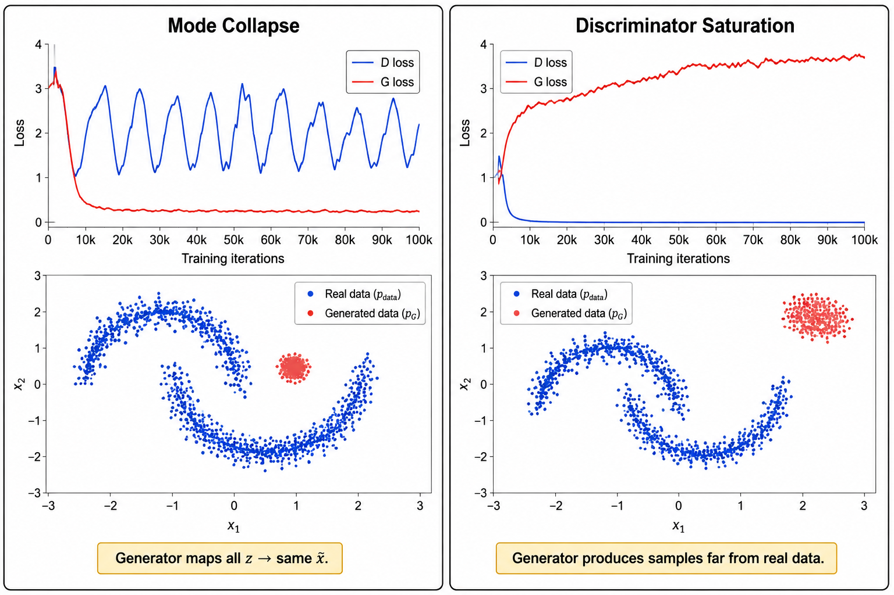
*Figure 08 — The two dominant GAN failure modes. Left: mode collapse, where the Generator produces samples concentrated in a small region of the data space, covering only one or a few modes of the real distribution. The loss curves show the Generator loss suddenly decreasing while diversity collapses. Right: Discriminator saturation, where the Discriminator becomes perfect too quickly and the Generator receives near-zero gradients. Both failure modes can be diagnosed from the loss curves and mitigated by the WGAN-GP, LSGAN, or hinge + spectral normalization objectives described in Sections 2.5–2.8.*

### 2.5 — Least-Squares GAN (LSGAN)

Mao et al. (2017) observed that the BCE-based Discriminator assigns near-zero gradients to samples that are correctly classified but far from the decision boundary. LSGAN replaces the logarithmic loss with a quadratic (mean-squared error) objective (Figure 09):

$$
\mathcal{L}_D^{\text{LS}} = \frac{1}{2} \mathbb{E}_{\mathbf{x} \sim p_{\text{data}}} [(D(\mathbf{x}) - b)^2] + \frac{1}{2} \mathbb{E}_{\mathbf{z} \sim p_z} [(D(G(\mathbf{z})) - a)^2]
$$

$$
\mathcal{L}_G^{\text{LS}} = \frac{1}{2} \mathbb{E}_{\mathbf{z} \sim p_z} [(D(G(\mathbf{z})) - c)^2]
$$

where $(a, b, c)$ are target values for fake, real, and generated samples respectively. The canonical choice is $a = 0$, $b = 1$ and $c = 1$.

The key advantage: the quadratic loss penalizes samples that are on the correct side of the decision boundary but far from it, forcing the Generator to move fake samples toward the real data manifold rather than simply past the boundary. LSGAN is also equivalent to minimizing the **Pearson $\chi^2$ divergence** between $p_{\text{data}}$ and $p_G$, which has useful theoretical properties.

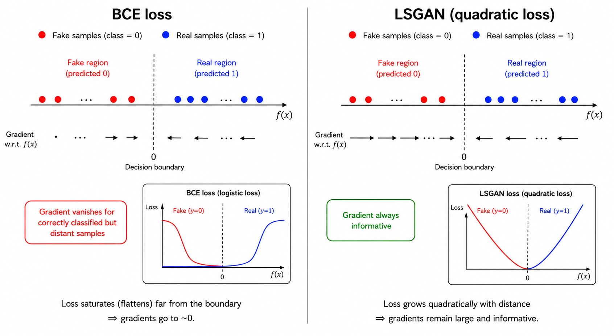
*Figure 09 — Behavioral comparison of BCE and LSGAN decision boundaries. With BCE (left), correctly classified samples that lie far from the decision boundary receive near-zero gradients, so the Generator has no incentive to move these samples closer to the real data manifold. LSGAN (right) uses a quadratic penalty that grows with distance from the boundary, providing informative gradients for all generated samples regardless of their classification status. This produces smoother training curves and better sample diversity.*

### 2.6 — Wasserstein GAN (WGAN) and the Earth Mover's Distance

Arjovsky et al. (2017) identified the root cause of GAN instability: when $p_{\text{data}}$ and $p_G$ have **disjoint or nearly disjoint supports** (which is typical in high dimensions), the Jensen-Shannon Divergence is constant and its gradient is zero or undefined. They proposed replacing JSD with the **Earth Mover's Distance** (also called Wasserstein-1 distance):

$$
W(p_{\text{data}}, p_G) = \inf_{\gamma \in \Pi(p_{\text{data}}, p_G)} \mathbb{E}_{(\mathbf{x}, \tilde{\mathbf{x}}) \sim \gamma} [\|\mathbf{x} - \tilde{\mathbf{x}}\|]
$$

where $\Pi$ is the set of all joint distributions with marginals $p_{\text{data}}$ and $p_G$.

The Earth Mover's Distance has a meaningful gradient even when the two distributions do not overlap, because it measures the minimum amount of "work" (mass times distance) required to transform one distribution into the other. By the Kantorovich-Rubinstein duality theorem, $W$ can be computed as:

$$
W(p_{\text{data}}, p_G) = \sup_{\|f\|_L \leq 1} \mathbb{E}_{\mathbf{x} \sim p_{\text{data}}} [f(\mathbf{x})] - \mathbb{E}_{\tilde{\mathbf{x}} \sim p_G} [f(\tilde{\mathbf{x}})]
$$

where the supremum is over all 1-Lipschitz functions $f$. The WGAN Critic $C$ approximates this supremum:

$$
\mathcal{L}_C^{\text{WGAN}} = \mathbb{E}_{\tilde{\mathbf{x}} \sim p_G} [C(\tilde{\mathbf{x}})] - \mathbb{E}_{\mathbf{x} \sim p_{\text{data}}} [C(\mathbf{x})]
$$

$$
\mathcal{L}_G^{\text{WGAN}} = -\mathbb{E}_{\mathbf{z} \sim p_z} [C(G(\mathbf{z}))]
$$

The Lipschitz constraint $\|f\|_L \leq 1$ is enforced by **weight clipping**: after each Critic update, all parameters of $C$ are clipped to $[-c, c]$ for a small constant $c$ (typically 0.01).

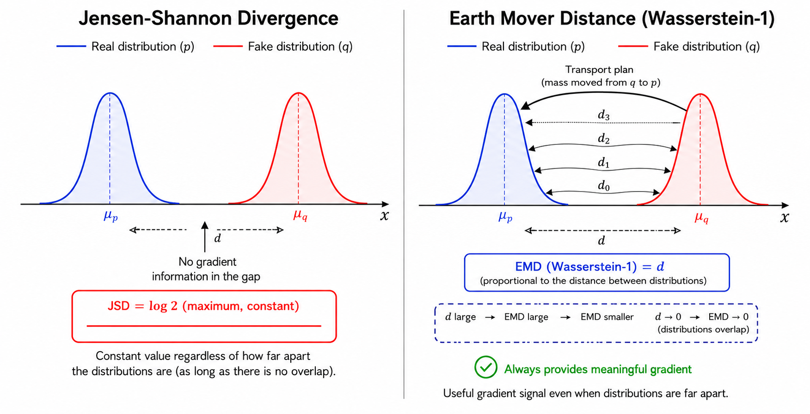
*Figure 10 — Comparison of the Jensen-Shannon Divergence (JSD) and Earth Mover's Distance (EMD/Wasserstein-1) for two distributions with disjoint support. When $p_{data}$ and $p_G$ do not overlap (left), JSD reaches its maximum value of log 2 and provides no gradient, which is the root cause of GAN instability. The EMD (right) measures the minimum transport cost to move mass from $p_G$ to $p_{data}$, which remains finite and meaningful even with disjoint support, providing an informative gradient signal throughout training.*

---

### 2.7 — Wasserstein GAN with Gradient Penalty (WGAN-GP)

Weight clipping in WGAN introduces new problems: it forces the Critic toward simple weight configurations that use only the extreme values $\pm c$, limiting capacity, and requires careful tuning of $c$. Gulrajani et al. (2017) proposed enforcing the Lipschitz constraint more directly via a **gradient penalty** on interpolated samples:

$$
\mathcal{L}_C^{\text{GP}} = \mathcal{L}_C^{\text{WGAN}} + \lambda \, \mathbb{E}_{\hat{\mathbf{x}} \sim p_{\hat{\mathbf{x}}}} \left[ \left( \|\nabla_{\hat{\mathbf{x}}} C(\hat{\mathbf{x}})\|_2 - 1 \right)^2 \right]
$$

where $\hat{\mathbf{x}} = \varepsilon \mathbf{x} + (1 - \varepsilon) \tilde{\mathbf{x}}$, $\varepsilon \sim \text{Uniform}(0, 1)$ is a random interpolation between real and fake samples, and $\lambda = 10$ is the standard coefficient.

The penalty forces $\|\nabla_{\hat{\mathbf{x}}} C(\hat{\mathbf{x}})\|_2 = 1$ along straight lines between real and generated samples, which is a sufficient condition for 1-Lipschitz continuity on the interpolation paths. Crucially, WGAN-GP does **not** require weight clipping, and the Critic can use **LayerNorm** (but not BatchNorm, which introduces inter-sample dependencies that invalidate the penalty).

WGAN-GP is the most stable and widely used GAN variant for tabular and low-dimensional data, and is the recommended default in this framework (Figure 10 shows the EMD motivation).

### 2.8 — Hinge Loss GAN and Spectral Normalization

The Hinge GAN (Lim & Ye, 2017; Miyato et al., 2018) uses a hinge loss that enforces a **margin** between the real and fake scores:

$$
\mathcal{L}_D^{\text{Hinge}} = \mathbb{E}_{\mathbf{x} \sim p_{\text{data}}} [\max(0, 1 - D(\mathbf{x}))] + \mathbb{E}_{\mathbf{z} \sim p_z} [\max(0, 1 + D(G(\mathbf{z})))]
$$

$$
\mathcal{L}_G^{\text{Hinge}} = -\mathbb{E}_{\mathbf{z} \sim p_z} [D(G(\mathbf{z}))]
$$

The hinge loss is paired with **Spectral Normalization** (SN, Miyato et al. 2018), which constrains the Lipschitz constant of each Discriminator layer by dividing its weight matrix by its largest singular value $\sigma_1(W)$:

$$
\tilde{W} = W / \sigma_1(W)
$$

SN is applied at every forward pass via power iteration, making it computationally efficient. Combined with the hinge loss, it produces one of the most stable GAN training regimes available (Figure 11).

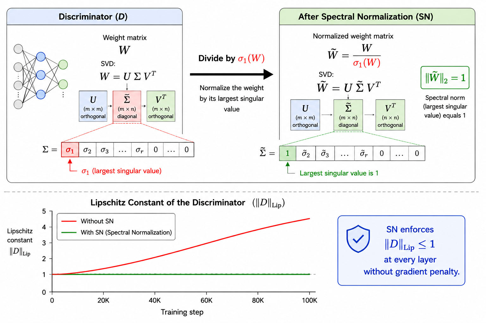
*Figure 11 — Spectral normalization (SN) constrains the Lipschitz constant of each Discriminator layer by normalizing its weight matrix W by the largest singular value $σ_1(W)$, computed efficiently via power iteration at each forward pass. This ensures $||W̃||_2 = 1$ for every layer, bounding the overall Lipschitz constant of the network. Unlike WGAN-GP, SN does not add a gradient penalty term to the loss and is compatible with BatchNorm, making it a lightweight alternative for enforcing stability.*

### 2.9 — Conditional GAN (cGAN)

Mirza & Osindero (2014) extended the GAN framework to **class-conditional generation** by providing both the Generator and Discriminator with an additional conditioning signal $\mathbf{c}$ (e.g., a class label):

$$
\mathcal{L}^{\text{cGAN}} = \mathbb{E}_{\mathbf{x}, \mathbf{c}} [\log D(\mathbf{x}, \mathbf{c})] + \mathbb{E}_{\mathbf{z}, \mathbf{c}} [\log (1 - D(G(\mathbf{z}, \mathbf{c}), \mathbf{c}))]
$$

For tabular data with integer class labels, this framework implements cGAN by:

1. **Embedding the label** into a dense vector $\mathbf{e} = W_{\text{emb}}[\mathbf{c}]$ via `nn.Embedding`.
2. **Generator:** concatenating $\mathbf{e}$ to $\mathbf{z}$ before the first layer, and using **Conditional Batch Normalization** (CBN) in hidden layers, where the BN scale and shift are predicted from $\mathbf{e}$.
3. **Discriminator:** concatenating $\mathbf{e}$ to $\mathbf{x}$ before the first layer.

Conditional Batch Normalization for a feature vector $\mathbf{h}$ with label $\mathbf{c}$:

$$
\text{CBN}(\mathbf{h}, \mathbf{c}) = \gamma(\mathbf{c}) \odot \frac{\mathbf{h} - \mu_B}{\sqrt{\sigma_B^2 + \varepsilon}} + \beta(\mathbf{c})
$$

where $\gamma(\mathbf{c}) = W_\gamma \mathbf{e}$ and $\beta(\mathbf{c}) = W_\beta \mathbf{e}$ are linearly predicted from the label embedding. This allows each class to have its own effective normalization parameters, substantially increasing the Generator's ability to produce class-specific features (Figure 12).

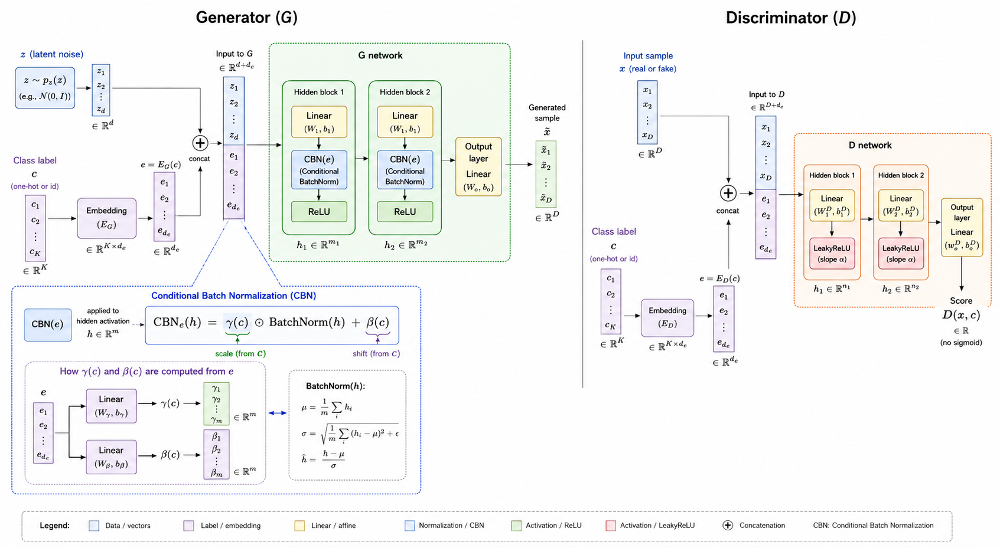
*Figure 12 — Conditional GAN (cGAN) architecture. Both the Generator and Discriminator receive the class label c through an embedding layer that produces a dense vector e. In the Generator, e is concatenated to the latent vector z and used to modulate the batch normalization parameters at each hidden layer via Conditional Batch Normalization (CBN): γ(c) and β(c) are predicted from e, giving each class its own effective normalization. In the Discriminator, e is concatenated to x before the first layer. This design allows the Generator to produce class-specific samples that are evaluated by a class-aware Discriminator.*

### 2.10 — Regularization: Feature Matching, R1 Penalty, Mode Seeking

Beyond the main loss objectives, three regularization techniques are implemented in `vi.py`:

**Feature Matching** (Salimans et al., 2016): Instead of maximizing $D(G(\mathbf{z}))$ directly, the Generator is trained to match intermediate Discriminator activation statistics between real and fake batches:

$$
\mathcal{L}_{\text{FM}} = \sum_{\ell} \| \mathbb{E}[f_\ell(\mathbf{x})] - \mathbb{E}[f_\ell(G(\mathbf{z}))] \|^2
$$

where $f_\ell(\cdot)$ denotes the $\ell$-th layer activations of the Discriminator. This stabilizes training and reduces mode collapse.

**R1 Gradient Penalty** (Mescheder et al., 2018): Penalizes the gradient of the Discriminator on **real data** only:

$$
\mathcal{L}_{R1} = \frac{\gamma}{2} \mathbb{E}_{\mathbf{x} \sim p_{\text{data}}} [\|\nabla_{\mathbf{x}} D(\mathbf{x})\|^2]
$$

Unlike WGAN-GP, R1 does not require interpolated samples and converges for a broader class of GAN objectives.

**Mode Seeking** (Mao et al., 2019): Discourages the Generator from mapping different latent vectors to the same output:

$$
\mathcal{L}_{\text{MS}} = -\mathbb{E} \left[ \frac{\|G(\mathbf{z}_1) - G(\mathbf{z}_2)\|}{\|\mathbf{z}_1 - \mathbf{z}_2\| + \varepsilon} \right]
$$

Adding $\mathcal{L}_{\text{MS}}$ to the Generator loss directly penalizes mode collapse by requiring the Generator's output to be diverse relative to the diversity of its inputs.

### 2.11 — Numerical Walkthrough: One Full GAN Training Step

We trace through one complete WGAN-GP training step with a 2-D Generator mapping $k = 2$ latent dimensions to $d = 2$ data dimensions, hidden size $H = 4$, batch size $B = 3$, and $n_{\text{critic}} = 1$ for clarity *(Figure 13)*.

**Setup.** Real batch: $\mathbf{X} = \{[0.8, 0.3], [-0.5, 0.7], [0.1, -0.9]\}$.

**Step 1 — Sample latent vectors:**

$$
\mathbf{Z} = \{[0.4, -0.2], [-0.3, 0.6], [0.1, 0.5]\} \sim \mathcal{N}(0, I)
$$

**Step 2 — Forward pass through Generator:**

$$
\tilde{\mathbf{X}} = G(\mathbf{Z}) = \{[0.52, 0.18], [-0.41, 0.63], [0.07, 0.44]\}
$$

(output values depend on current weights; shown symbolically).

**Step 3 — Critic scores:**

$$
C(\mathbf{X}) = [0.83, 0.79, 0.81], \quad C(\tilde{\mathbf{X}}) = [0.12, 0.19, 0.15]
$$

**Step 4 — Wasserstein estimate:**

$$
\hat{W} = \overline{C(\tilde{\mathbf{X}})} - \overline{C(\mathbf{X})} = 0.153 - 0.810 = -0.657
$$

(minimizing $\mathcal{L}_C$ means maximizing $\hat{W}$, so the Critic is trained to increase this gap.)

**Step 5 — Gradient penalty:** Draw $\varepsilon = [0.7, 0.4, 0.2]$ per sample.

$$
\hat{\mathbf{X}} = \varepsilon \mathbf{X} + (1 - \varepsilon) \tilde{\mathbf{X}}, \quad \text{compute } \nabla_{\hat{\mathbf{X}}} C(\hat{\mathbf{X}})
$$

$$
\text{GP} = \lambda \cdot \overline{(\|\nabla C(\hat{\mathbf{X}})\|_2 - 1)^2} = 10 \times 0.043 = 0.43
$$

**Step 6 — Total Critic loss:**

$$
\mathcal{L}_C = \hat{W} + \text{GP} = -0.657 + 0.43 = -0.227
$$

**Step 7 — Update Critic** via Adam; then sample new $\mathbf{Z}'$ for the Generator.

**Step 8 — Generator loss:**

$$
\mathcal{L}_G = -\overline{C(G(\mathbf{Z}'))} = -0.16 \quad \text{(new fake batch)}
$$

**Step 9 — Update Generator** via Adam. One full training step complete.

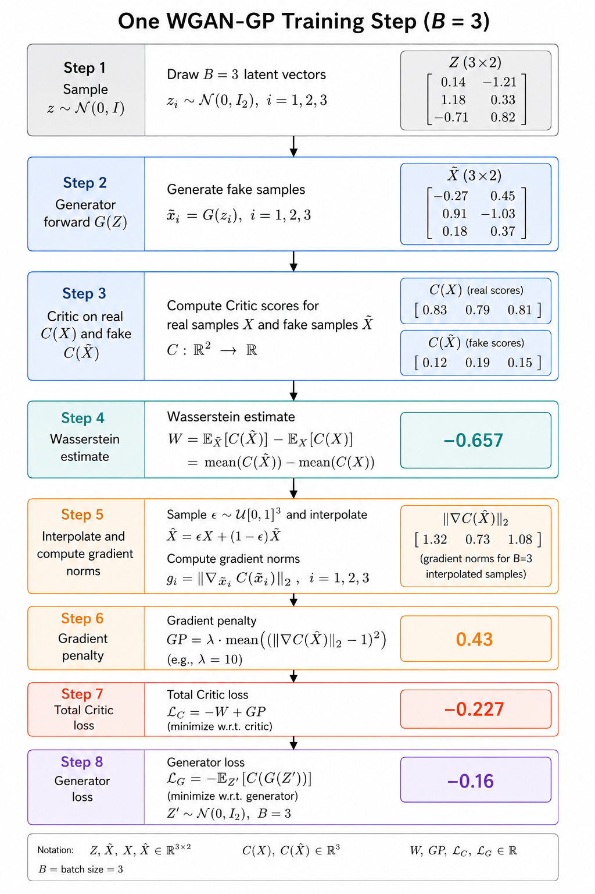
**Caption:** *Figure 13 — Numerical walkthrough of one complete WGAN-GP training step with batch size B=3. Steps 1–7 constitute the Critic update: latent vectors are sampled, passed through the Generator, Critic scores are computed for real and fake batches, the  Wasserstein estimate and gradient penalty are combined into $L_C$, and the Critic is updated. Step 8 constitutes the Generator update: a fresh batch of latent vectors is sampled, and the Generator is updated to maximize the Critic score on its outputs (minimize −C(G(z))).  The gradient penalty (Step 6) ensures the Critic remains 1-Lipschitz throughout training.*

## 3 — TinyML Implementation

With this example you can implement the machine learning algorithm in ESP32, Arduino, Arduino Portenta H7 with Vision Shield, Raspberry Pi, and other microcontrollers or IoT devices.

The **trained Generator** (not the Discriminator) is deployed to the embedded device. The Generator forward pass is a simple stack of matrix-vector multiplications with optional batch normalization and activation functions — ideal for microcontroller deployment.

**Deployment workflow:**

1. Train the GAN using `GANTrainer` with the desired loss variant.
2. Call `model.eval()` to freeze batch normalization running statistics.
3. Export the Generator with `export_to_json(G, path)`.
4. Append BN running stats with `add_bn_stats_to_json(G, path)`.
5. Generate Arduino C++ code with `generate_ino(path, output_dir, board='esp32')`.
6. Flash `GANModel.h` + `sketch.ino` to the target device.

**On-device usage:** The Generator runs `model.generate(z, out)` where `z` is a float array of `latent_dim` values (e.g., sampled from a simple LFSR pseudo-random number generator on the microcontroller) and `out` receives the generated sample.

### 3.1 — Jupyter Notebooks

-  Generative Adversarial Network Training

### 3.2 — Arduino Code

-  Example 1: Vanilla GAN — Two Moons

-  Example 2: WGAN-GP — Gaussian Mixture

-  Example 3: Conditional GAN — Three Blobs

-  Example 4: Hinge GAN — Sensor Data

## References

[1] Goodfellow, I., Pouget-Abadie, J., Mirza, M., Xu, B., Warde-Farley, D., Ozair, S., Courville, A., & Bengio, Y. (2014). Generative Adversarial Nets. *Advances in Neural Information Processing Systems (NeurIPS)*, 27.

[2] Mirza, M., & Osindero, S. (2014). Conditional Generative Adversarial Nets. *arXiv:1411.1784*.

[3] Radford, A., Metz, L., & Chintala, S. (2015). Unsupervised Representation Learning with Deep Convolutional Generative Adversarial Networks (DCGAN). *arXiv:1511.06434*.

[4] Mao, X., Li, Q., Xie, H., Lau, R. Y. K., Wang, Z., & Smolley, S. P. (2017). Least Squares Generative Adversarial Networks. *ICCV 2017*.

[5] Arjovsky, M., Chintala, S., & Bottou, L. (2017). Wasserstein GAN. *Proceedings of ICML 2017*.

[6] Gulrajani, I., Ahmed, F., Arjovsky, M., Dumoulin, V., & Courville, A. (2017). Improved Training of Wasserstein GANs. *NeurIPS 2017*.

[7] Miyato, T., Kataoka, T., Koyama, M., & Yoshida, Y. (2018). Spectral Normalization for Generative Adversarial Networks. *ICLR 2018*.

[8] Lim, J. H., & Ye, J. C. (2017). Geometric GAN. *arXiv:1705.02894*.

[9] Salimans, T., Goodfellow, I., Zaremba, W., Cheung, V., Radford, A., & Chen, X. (2016). Improved Techniques for Training GANs. *NeurIPS 2016*.

[10] Mescheder, L., Geiger, A., & Nowozin, S. (2018). Which Training Methods for GANs Do Actually Converge? *ICML 2018*.

[11] Mao, Q., Lee, H.-Y., Tseng, H.-Y., Ma, S., & Yang, M.-H. (2019). Mode Seeking Generative Adversarial Networks for Diverse Image Synthesis. *CVPR 2019*.

[12] Chen, X., Duan, Y., Houthooft, R., Schulman, J., Sutskever, I., & Abbeel, P. (2016). InfoGAN: Interpretable Representation Learning by Information Maximizing Generative Adversarial Nets. *NeurIPS 2016*.

[13] Larsen, A. B. L., Sønderby, S. K., Larochelle, H., & Winther, O. (2016). Autoencoding beyond Pixels Using a Learned Similarity Metric (VAE-GAN). *ICML 2016*.

[14] Heusel, M., Ramsauer, H., Unterthiner, T., Nessler, B., & Hochreiter, S. (2017). GANs Trained by a Two Time-Scale Update Rule Converge to a Local Nash Equilibrium (FID). *NeurIPS 2017*.

[15] Goodfellow, I., Bengio, Y., & Courville, A. (2016). *Deep Learning*. MIT Press.
