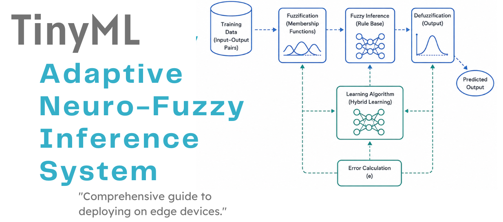
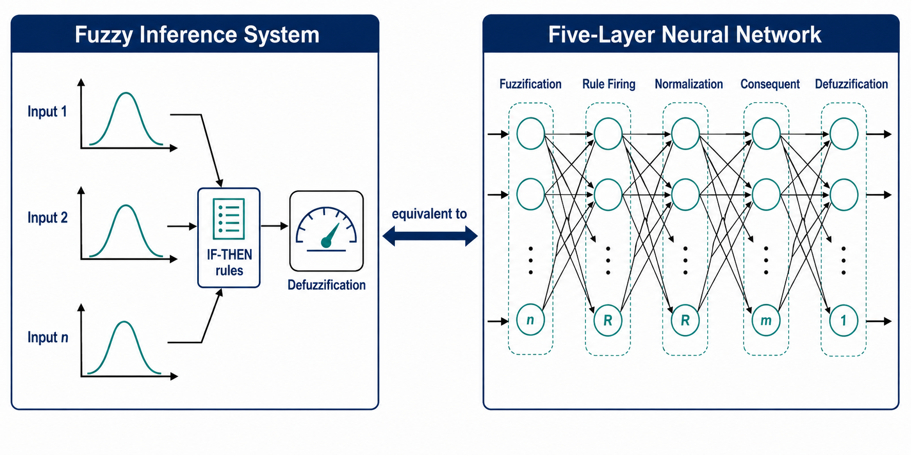
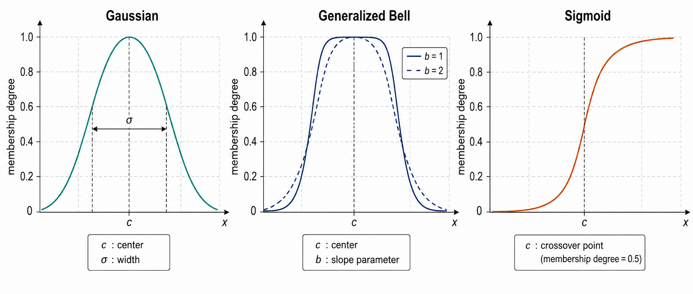
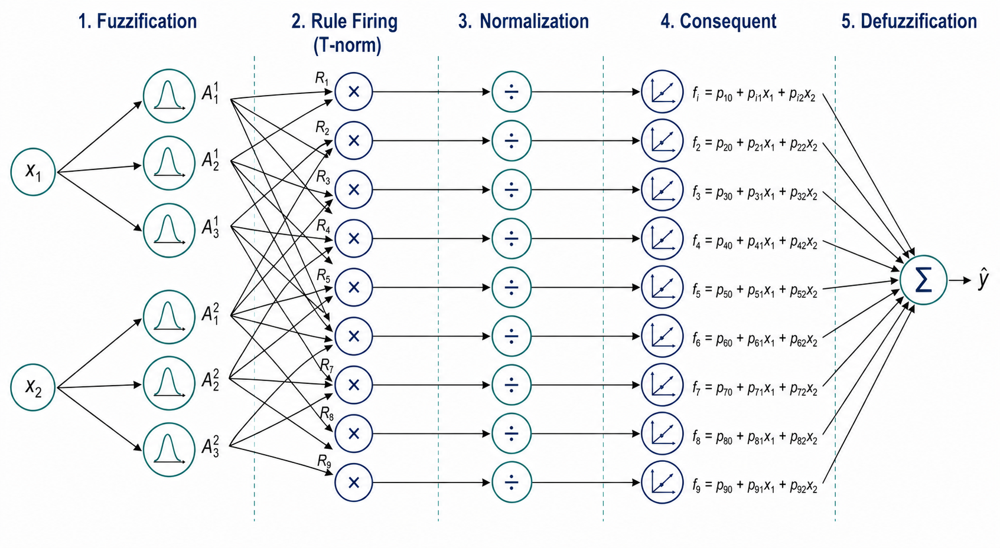
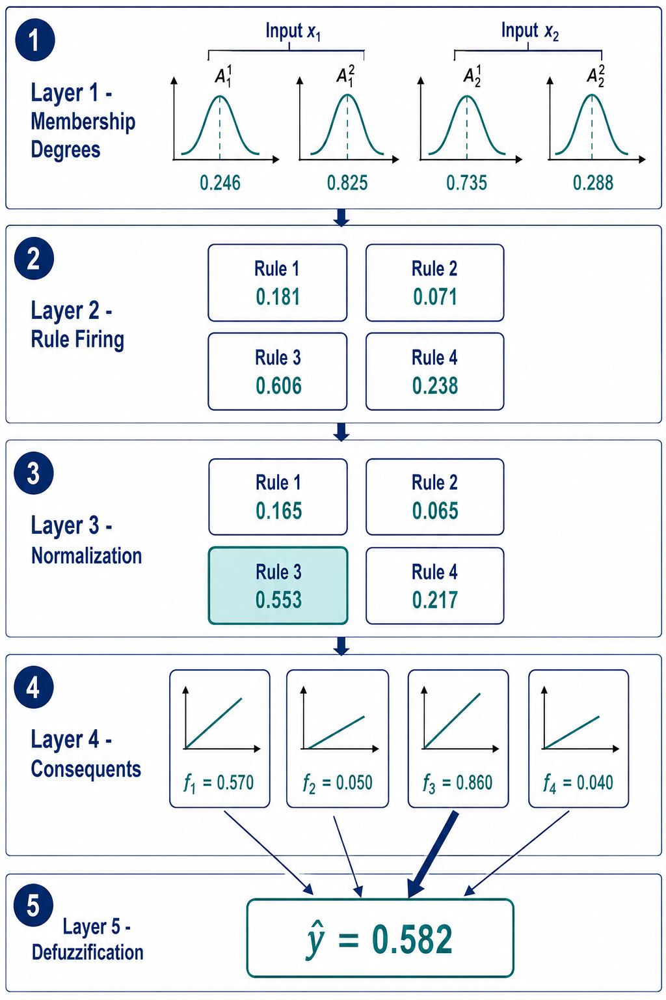

# TinyML - Adaptive Neuro-Fuzzy Inference System

_From fuzzy logic to edge implementation_

**Social media:**

👨🏽‍💻 Github: [thommaskevin/TinyML](https://github.com/thommaskevin/TinyML)

👷🏾 Linkedin: [Thommas Kevin](https://www.linkedin.com/in/thommas-kevin-ab9810166/)

📽 Youtube: [Thommas Kevin](https://www.youtube.com/channel/UC7uazGXaMIE6MNkHg4ll9oA)

🧑‍🎓 Scholar: [Thommas K. S. Flores](https://scholar.google.com/citations?user=MqWV8JIAAAAJ&hl=pt-PT&authuser=2)

:pencil2: CV Lattes CNPq: [Thommas Kevin Sales Flores](http://lattes.cnpq.br/0630479458408181)

## SUMMARY

1 — Introduction

&nbsp;&nbsp;1.1 — From Fuzzy Logic to Neuro-Fuzzy Systems

&nbsp;&nbsp;1.2 — Why ANFIS for TinyML?

2 — Mathematical Foundations

&nbsp;&nbsp;2.1 — Fuzzy Sets and Membership Functions

&nbsp;&nbsp;2.2 — The Sugeno Fuzzy Inference System

&nbsp;&nbsp;2.3 — The Five-Layer ANFIS Architecture

&nbsp;&nbsp;2.4 — First-Order Takagi-Sugeno Consequents

&nbsp;&nbsp;2.5 — Product T-Norm and Weighted-Average Defuzzification

&nbsp;&nbsp;2.6 — Training: Hybrid Learning (Gradient Descent + Least Squares)

&nbsp;&nbsp;2.7 — Numerical Walkthrough

3 — TinyML Implementation

&nbsp;&nbsp;3.1 — Jupyter Notebooks

&nbsp;&nbsp;3.2 — Arduino Code

## 1 — Introduction

The **Adaptive Neuro-Fuzzy Inference System (ANFIS)**, introduced by Jang (1993), is a hybrid architecture that combines the interpretability of fuzzy logic with the learning capability of neural networks. Unlike conventional neural networks, which are often treated as black boxes because their internal weights carry no direct meaning, an ANFIS model exposes a transparent rule base of the form:

> **IF** x₁ is A₁ **AND** x₂ is A₂ **THEN** y = p₀ + p₁·x₁ + p₂·x₂

These rules are linguistically meaningful. A student, an engineer, or a domain expert can read a trained ANFIS model and understand, in plain language, why the system produced a given output. This property makes ANFIS particularly attractive for applications where model explainability is required, such as medical diagnosis, industrial process control, and safety-critical embedded systems, where a purely numerical black-box prediction is often not acceptable for certification or regulatory purposes *(Figure 01)*.

This tutorial develops the mathematical foundations of ANFIS in full, starting from fuzzy sets and membership functions, proceeding to the five-layer network architecture, then to the hybrid learning algorithm, and finally to a step-by-step numerical walkthrough that a student can reproduce by hand. The final section explains how ANFIS inference can be mapped to efficient embedded C implementations suitable for TinyML deployment on microcontrollers, where memory and processing power are severely limited compared to a desktop or cloud environment.

*Figure 01 — The ANFIS architecture bridges fuzzy logic and neural networks. The left side shows a fuzzy inference system with membership functions, rules, and defuzzification. The right side shows the equivalent five-layer neural network where every parameter is differentiable and learnable via back-propagation. The result is a white-box model: every weight has a direct linguistic interpretation.*

### 1.1 — From Fuzzy Logic to Neuro-Fuzzy Systems

**Fuzzy logic**, introduced by Zadeh (1965), generalizes classical Boolean logic. In Boolean logic, a statement is either entirely true or entirely false, and an element either belongs to a set or does not. Fuzzy logic relaxes this rigid distinction by allowing partial membership of an element in a set. A **fuzzy set** A is defined by a **membership function** μₐ(x) ∈ [0, 1] that quantifies the degree to which a crisp value x belongs to the concept represented by A.

Consider a concrete example that students often find intuitive: the linguistic term "high temperature" can be modeled as a Gaussian curve centered at 35 °C. Under this model, a temperature of 30 °C might have a membership degree of 0.3 in the set "high," meaning it is only somewhat high, while 37 °C might have a membership degree of 0.9, meaning it is almost certainly considered high. Note that both values can simultaneously have nonzero membership in adjacent sets, such as "moderate" and "high," which is precisely the behavior that Boolean logic cannot represent.

A **fuzzy inference system (FIS)** maps crisp numerical inputs to crisp numerical outputs through three sequential stages:

1. **Fuzzification** — compute the membership degree of each input with respect to every relevant linguistic term (for example, "low," "medium," "high").
2. **Rule evaluation** — combine the membership degrees using fuzzy logic operators, known as T-norms, to determine how strongly each rule "fires" for the given input.
3. **Defuzzification** — aggregate the outputs of all fired rules into a single crisp numerical value that can be used, for instance, as a control signal or a prediction.

Traditional FIS design requires human experts to define the membership functions and the rule base manually, based on domain knowledge. This manual process does not scale well and depends heavily on the expert's intuition. **Neuro-fuzzy systems** address this limitation by treating the membership-function parameters and the rule consequents as learnable weights, optimized directly from data via gradient descent, in the same way that the weights of a neural network are learned. ANFIS is the canonical and most widely studied example of this hybrid approach, and it is the system this tutorial focuses on.

### 1.2 — Why ANFIS for TinyML?

TinyML refers to the deployment of machine learning models on microcontrollers and other extremely resource-constrained devices, typically with only a few hundred kilobytes of RAM and no floating-point accelerator. In this context, ANFIS offers three advantages that make it particularly well suited for embedded deployment, especially when compared to deep neural networks:

1. **Compactness** — a small rule base (for example, 2 inputs with 3 linguistic terms each yields 3² = 9 rules) can approximate complex nonlinear functions using far fewer parameters than a deep neural network would require for a comparable task. Fewer parameters translate directly into smaller flash and RAM footprints on a microcontroller.

2. **Interpretability** — the learned rules can be read and audited by humans after training, which enables debugging, certification, and regulatory compliance in safety-critical applications, such as industrial control loops or medical monitoring devices, where an engineer may need to justify why the model behaves as it does.

3. **Deterministic inference** — the forward pass of ANFIS involves only elementary arithmetic operations, namely exponentials, products, and sums. There is no sequential recurrence, as in recurrent neural networks, and no numerical integration, as in some fuzzy systems that use centroid defuzzification. This makes the execution time of ANFIS highly predictable, which is a valuable property for real-time embedded systems operating under strict timing constraints.

## 2 — Mathematical Foundations

This section develops the mathematical foundations of ANFIS in full. We begin with fuzzy sets and membership functions, derive the Sugeno inference system, describe the five-layer network architecture in detail, and conclude with a step-by-step numerical walkthrough that students can follow with pencil and paper.

### 2.1 — Fuzzy Sets and Membership Functions

A **membership function (MF)** μ: ℝ → [0, 1] maps a crisp input to a degree of membership in a fuzzy set. Several parametric forms are commonly used in practice; each has different smoothness and shape properties that affect both the expressiveness of the model and the ease of training.

**Gaussian MF:**

$$
\mu(x; c, \sigma) = \exp\!\left(-\frac{1}{2} \left(\frac{x - c}{\sigma}\right)^{\!2}\right)
$$

where c is the center of the curve and σ > 0 controls its width. This is the most commonly used membership function in ANFIS because it is smooth and infinitely differentiable, which is essential for gradient-based learning.

**Generalized Bell MF:**

$$
\mu(x; a, b, c) = \frac{1}{1 + \left|\frac{x - c}{a}\right|^{2b}}
$$

where a controls the width of the curve, b controls the steepness of its slopes, and c is the center. This function offers more shape flexibility than the Gaussian MF, at the cost of one additional learnable parameter per term.

**Sigmoid MF:**

$$
\mu(x; a, c) = \frac{1}{1 + \exp(-a(x - c))}
$$

where a controls the steepness of the transition and c is the crossover point at which membership equals 0.5. Unlike the Gaussian and bell functions, the sigmoid is monotonic and open-ended, which makes it useful for representing concepts without a natural upper or lower bound, such as "large" or "small."

In ANFIS, the parameters (c, σ, a, b) are **learnable**. They are typically initialized so that the membership functions are evenly spread across the expected range of each input variable, ensuring that every region of the input space is covered by at least one term before training begins *(Figure 02)*.

*Figure 02 — Common membership function shapes. Gaussian (left) is smooth and differentiable everywhere, making it ideal for gradient-based learning. Generalized bell (center) offers asymmetric control via the slope parameter b. Sigmoid (right) is useful for open-ended concepts such as "large" or "small". All parameters are learnable in ANFIS.*

### 2.2 — The Sugeno Fuzzy Inference System

ANFIS uses the **first-order Takagi-Sugeno (T-S)** fuzzy model, in which the consequent (the "THEN" part) of each rule is a linear function of the inputs, rather than a fuzzy set as in the classical Mamdani model. For a system with n inputs and R rules, the i-th rule is written as:

$$
\text{Rule } i: \quad \text{IF } x_1 \text{ is } A_{i1} \text{ AND } \dots \text{ AND } x_n \text{ is } A_{in} \text{ THEN } f_i = p_{i0} + p_{i1} x_1 + \dots + p_{in} x_n
$$

The **Sugeno** architecture is chosen over the Mamdani model for three practical reasons that matter for both training and embedded deployment:

- The linear consequent is computationally efficient to evaluate, requiring only multiplications and additions.
- The defuzzification step reduces to a simple weighted average, avoiding the numerical integration that Mamdani-style centroid defuzzification requires.
- The overall model remains a universal approximator, meaning that with a sufficiently rich rule base it can approximate any continuous nonlinear function to arbitrary precision.

### 2.3 — The Five-Layer ANFIS Architecture

ANFIS implements the Sugeno FIS as a feed-forward neural network organized into five layers, each performing one clearly defined stage of the fuzzy inference process *(Figure 03)*. Representing the fuzzy system as a layered network is what allows the entire model to be trained end to end using the same back-propagation algorithm used for conventional neural networks.

*Figure 03 — The five-layer ANFIS architecture for a system with 2 inputs, 3 terms per input, and 9 rules. Layer 1 computes membership degrees. Layer 2 computes rule firing strengths via product T-norm. Layer 3 normalizes firing strengths. Layer 4 computes linear consequents. Layer 5 performs weighted-average defuzzification. Every arrow carries a differentiable operation, enabling end-to-end back-propagation.*

**Layer 1 — Fuzzification:**

Each node in this layer computes the membership function value for one input variable with respect to one linguistic term:

$$
O_{j,k}^{(1)} = \mu_{jk}(x_j), \quad j = 1\dots n, \; k = 1\dots m
$$

where m is the number of linguistic terms defined for each input. The parameters of every membership function, such as the Gaussian centers and widths, are learnable and are adjusted during training.

**Layer 2 — Rule Firing (T-norm):**

Each node in this layer represents one fuzzy rule and computes the **firing strength** of that rule as the product of the membership degrees of all its antecedents:

$$
w_i = \prod_{j=1}^{n} \mu_{j, \text{term}_i(j)}(x_j), \quad i = 1\dots R
$$

where R = mⁿ is the total number of rules, obtained by forming every possible combination of terms across all inputs (a combinatorial grid). The product T-norm is used here specifically because it is differentiable everywhere and preserves gradient flow during back-propagation, which is a requirement for training the network.

**Layer 3 — Normalization:**

Each node computes the **normalized firing strength** of one rule relative to the sum of all firing strengths:

$$
\bar{w}_i = \frac{w_i}{\sum_{j=1}^{R} w_j}
$$

This normalization step ensures that the contributions of all rules sum to exactly 1, so that the final output is a proper convex combination of the individual rule consequents, rather than an arbitrarily scaled sum.

**Layer 4 — Consequent:**

Each node computes the linear consequent associated with one rule:

$$
f_i = p_{i0} + \sum_{j=1}^{n} p_{ij} \cdot x_j
$$

The coefficients pᵢⱼ are learnable parameters, one linear model per rule. The output of each node in this layer is the product of the rule's normalized firing strength and its consequent value:

$$
O_i^{(4)} = \bar{w}_i \cdot f_i
$$

**Layer 5 — Defuzzification:**

A single summation node combines the outputs of all Layer 4 nodes to produce the final crisp output of the network:

$$
\hat{y} = \sum_{i=1}^{R} \bar{w}_i \cdot f_i = \frac{\sum_{i} w_i f_i}{\sum_{i} w_i}
$$

This operation is known as **weighted-average defuzzification**. It is exact for first-order Sugeno systems, meaning it introduces no approximation error, and it requires no numerical integration, unlike the centroid method used in Mamdani-type fuzzy systems.

### 2.4 — First-Order Takagi-Sugeno Consequents

It is often convenient, especially for implementation purposes, to express the first-order T-S consequent in vector form:

$$
f_i = \mathbf{p}_i^{\top} \tilde{\mathbf{x}}, \quad \tilde{\mathbf{x}} = [1, x_1, \dots, x_n]^{\top}
$$

where **p**ᵢ ∈ ℝⁿ⁺¹ is the coefficient vector for rule i, and the leading 1 in the augmented input vector accounts for the bias term pᵢ₀. Collecting all rule consequents together, the entire consequent layer can be expressed as a single matrix-vector product:

$$
\mathbf{f} = P \tilde{\mathbf{x}}
$$

where P ∈ ℝ^(R×(n+1)) is the coefficient matrix containing every rule's linear parameters as its rows. Writing the model in this compact linear-algebra form is particularly useful for embedded implementation, since it allows the consequent layer to be computed with a single, efficient matrix-vector multiplication and stored compactly in flash memory.

### 2.5 — Product T-Norm and Weighted-Average Defuzzification

The choice of the **product T-norm** (as opposed to the minimum, which is common in classical fuzzy logic) is deliberate and has three concrete justifications that are worth understanding:

- **Differentiability** — the product operation is smooth everywhere, which enables gradient-based learning throughout the entire network. The minimum operator, by contrast, is not differentiable at points where two membership degrees are equal.
- **Sensitivity** — the product responds to changes in every antecedent membership degree, whereas the minimum operator only depends on the single smallest membership degree and ignores the rest, discarding potentially useful information.
- **Probabilistic interpretation** — under an assumption of statistical independence between the fuzzy events represented by each antecedent, the product corresponds exactly to their joint probability, giving the T-norm a principled probabilistic meaning in addition to its practical advantages.

Similarly, the **weighted-average** defuzzification method is optimal for Sugeno-type systems for three reasons:

- It is exact, introducing no approximation error, unlike centroid-based methods that must be computed numerically.
- It is computationally trivial, requiring only one division per output sample, which is important for real-time embedded execution.
- It preserves the linearity of the consequent layer, which is what makes the hybrid learning algorithm described in the next section possible.

### 2.6 — Training: Hybrid Learning (Gradient Descent + Least Squares)

ANFIS can be trained in two different ways. The first option is **pure gradient descent**, in which back-propagation is applied through all five layers simultaneously, exactly as it would be for a conventional neural network. The second, more efficient option is the **hybrid learning algorithm**, which exploits the fact that the output is linear in the consequent parameters P. The hybrid algorithm alternates between two passes:

1. **Forward pass** — the antecedent parameters (membership function centers and widths) are temporarily held fixed. The firing strengths wᵢ are computed for the entire training batch, and the optimal consequent coefficients P are then solved directly and exactly using **linear least squares**, since the output f is a linear function of P for fixed antecedents.

2. **Backward pass** — the consequent coefficients P found in the forward pass are now held fixed, and the antecedent parameters are updated by ordinary **gradient descent** on the prediction error, propagated back through Layers 1 through 3.

The hybrid algorithm typically converges faster than pure gradient descent, because the consequent parameters are optimized globally and exactly in every forward pass, rather than being nudged gradually by small gradient steps. For TinyML applications, however, pure gradient descent is often entirely sufficient, since the rule base is usually small and the least-squares step of the hybrid algorithm adds implementation complexity that may not be justified by the modest gain in convergence speed.

**Gradient flow.** As a concrete illustration of how error signals propagate backward through the network, the derivative of the output with respect to a Gaussian center cⱼₖ is obtained by the chain rule:

$$
\frac{\partial \hat{y}}{\partial c_{jk}} = \sum_{i} \frac{\partial \hat{y}}{\partial w_i} \cdot \frac{\partial w_i}{\partial \mu_{jk}} \cdot \frac{\partial \mu_{jk}}{\partial c_{jk}}
$$

All of the partial derivatives that appear in this expression are elementary functions of exponentials and products, and they are numerically well behaved, which is one reason ANFIS tends to train robustly even on small datasets, a common situation in TinyML applications where data collection is expensive or limited.

### 2.7 — Numerical Walkthrough

To consolidate the concepts developed above, we now perform a complete forward pass, by hand, for a 2-input, 2-term ANFIS with Gaussian membership functions and 4 rules. Every intermediate quantity is shown explicitly so that students can reproduce the calculation themselves *(Figure 04)*.

**Setup.** The input vector is **x** = [0.5, −0.3]ᵀ.

**Membership functions (Layer 1):**

For input x₁ (terms: low, high):
- c₁,low = −1.0, σ₁,low = 0.8 → μ₁,low(0.5) = exp(−0.5·(1.5/0.8)²) = 0.246
- c₁,high = 1.0, σ₁,high = 0.8 → μ₁,high(0.5) = exp(−0.5·(0.5/0.8)²) = 0.825

For input x₂ (terms: low, high):
- c₂,low = −1.0, σ₂,low = 0.8 → μ₂,low(−0.3) = exp(−0.5·(0.7/0.8)²) = 0.735
- c₂,high = 1.0, σ₂,high = 0.8 → μ₂,high(−0.3) = exp(−0.5·(1.3/0.8)²) = 0.288

**Rule firing (Layer 2):**

| Rule | Antecedent | wᵢ |
|------|-----------|-----|
| 1 | x₁ is low  AND x₂ is low  | 0.246 × 0.735 = 0.181 |
| 2 | x₁ is low  AND x₂ is high | 0.246 × 0.288 = 0.071 |
| 3 | x₁ is high AND x₂ is low  | 0.825 × 0.735 = 0.606 |
| 4 | x₁ is high AND x₂ is high | 0.825 × 0.288 = 0.238 |

Sum: Σw = 1.096

**Normalization (Layer 3):**

- w̄₁ = 0.181 / 1.096 = 0.165
- w̄₂ = 0.071 / 1.096 = 0.065
- w̄₃ = 0.606 / 1.096 = 0.553
- w̄₄ = 0.238 / 1.096 = 0.217

**Consequents (Layer 4):**

Assume the following (previously learned) coefficients:
- Rule 1: f₁ = 0.5 + 0.2·x₁ + 0.1·x₂ = 0.5 + 0.1 − 0.03 = 0.570
- Rule 2: f₂ = −0.3 + 0.4·x₁ − 0.5·x₂ = −0.3 + 0.2 + 0.15 = 0.050
- Rule 3: f₃ = 1.0 − 0.1·x₁ + 0.3·x₂ = 1.0 − 0.05 − 0.09 = 0.860
- Rule 4: f₄ = −0.2 + 0.6·x₁ + 0.2·x₂ = −0.2 + 0.3 − 0.06 = 0.040

**Defuzzification (Layer 5):**

$$
\hat{y} = 0.165\times0.570 + 0.065\times0.050 + 0.553\times0.860 + 0.217\times0.040 = 0.094 + 0.003 + 0.476 + 0.009 = 0.582
$$

The output ŷ = 0.582 is a convex combination of the four linear consequents, weighted by the normalized firing strengths computed in Layer 3. Because w̄₃ is the largest normalized firing strength, Rule 3, "x₁ is high AND x₂ is low," dominates the prediction. This is precisely the kind of linguistically interpretable conclusion that distinguishes ANFIS from a conventional black-box neural network: a student can state, in plain words, which rule was primarily responsible for the output and why.

*Figure 04 — Complete numerical walkthrough of a 2-input, 2-term ANFIS forward pass. Each row corresponds to one layer. The membership degrees (Layer 1) are computed from Gaussian parameters. The rule strengths (Layer 2) are products of antecedent memberships. Normalization (Layer 3) rescales strengths to sum to 1. Linear consequents (Layer 4) are evaluated per rule. The final output (Layer 5) is the weighted average, dominated by Rule 3 (w̄₃ = 0.553).*

## 3 — TinyML Implementation

With this example you can implement the machine learning algorithm on the ESP32, Arduino, Arduino Portenta H7 with Vision Shield, Raspberry Pi, and other microcontrollers or IoT devices. The compact rule base and elementary arithmetic operations described in Section 2 translate directly into a small, predictable embedded C implementation, which is the key practical advantage of ANFIS in the TinyML setting.

### 3.1 — Jupyter Notebooks

-  ANFIS Training

### 3.2 — Arduino Code

-  Example 1: ANFIS Regression

-  Example 2: ANFIS Binary Classification

-  Example 3: ANFIS Multiclass Classification

## References

[1] Jang, J.-S. R. (1993). ANFIS: Adaptive-Network-Based Fuzzy Inference System. *IEEE Transactions on Systems, Man, and Cybernetics*, 23(3), 665-685.

[2] Takagi, T., & Sugeno, M. (1985). Fuzzy Identification of Systems and Its Applications to Modeling and Control. *IEEE Transactions on Systems, Man, and Cybernetics*, SMC-15(1), 116-132.

[3] Zadeh, L. A. (1965). Fuzzy Sets. *Information and Control*, 8(3), 338-353.

[4] Mamdani, E. H., & Assilian, S. (1975). An Experiment in Linguistic Synthesis with a Fuzzy Logic Controller. *International Journal of Man-Machine Studies*, 7(1), 1-13.

[5] Kosko, B. (1994). Fuzzy Systems as Universal Approximators. *IEEE Transactions on Computers*, 43(11), 1329-1333.

[6] Nauck, D., Klawonn, F., & Kruse, R. (1997). *Foundations of Neuro-Fuzzy Systems*. John Wiley & Sons.

[7] Lin, C. T., & Lee, C. S. G. (1996). *Neural Fuzzy Systems: A Neuro-Fuzzy Synergism to Intelligent Systems*. Prentice Hall.

[8] Goodfellow, I., Bengio, Y., & Courville, A. (2016). *Deep Learning*. MIT Press.

[9] Lane, N. D., Bhattacharya, S., Georgiev, P., Forlivesi, C., & Kawsar, F. (2015). An Early Resource Characterization of Deep Learning on Wearables, Smartphones and Internet-of-Things Devices. *IoT-App 2015*, 7-12.
