# TinyML — Quantile Regression Neural Networks

_From distributional forecasting to edge implementation_

**Social media:**

👨🏽‍💻 Github: [thommaskevin/TinyML](https://github.com/thommaskevin/TinyML)

👷🏾 Linkedin: [Thommas Kevin](https://www.linkedin.com/in/thommas-kevin-ab9810166/)

📽 Youtube: [Thommas Kevin](https://www.youtube.com/channel/UC7uazGXaMIE6MNkHg4ll9oA)

🧑‍🎓 Scholar: [Thommas K. S. Flores](https://scholar.google.com/citations?user=MqWV8JIAAAAJ&hl=pt-PT&authuser=2)

:pencil2: CV Lattes CNPq: [Thommas Kevin Sales Flores](http://lattes.cnpq.br/0630479458408181)

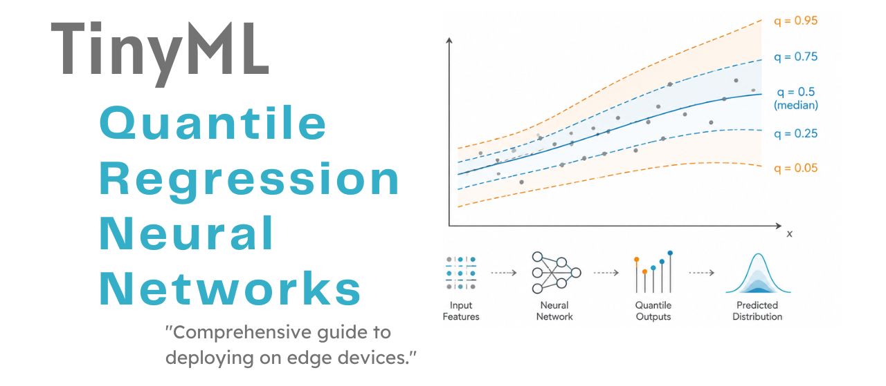

## SUMMARY

1 — Introduction

&nbsp;&nbsp;1.1 — Limitations of Mean Regression

&nbsp;&nbsp;1.2 — The Distributional Forecasting Perspective

&nbsp;&nbsp;1.3 — From Linear Quantile Regression to Quantile Regression Neural Networks

2 — Mathematical Foundations

&nbsp;&nbsp;2.1 — The Pinball (Check) Loss Function

&nbsp;&nbsp;2.2 — Simultaneous Multi-Quantile Estimation

&nbsp;&nbsp;2.3 — Quantile Crossing and Monotonicity Enforcement

&nbsp;&nbsp;2.4 — The Huber-Smoothed Pinball Loss

&nbsp;&nbsp;2.5 — Prediction Interval Scoring: The Winkler Score

&nbsp;&nbsp;2.6 — Coverage Calibration

&nbsp;&nbsp;2.7 — Network Architecture and Training

&nbsp;&nbsp;2.8 — Numerical Walkthrough

3 — TinyML Implementation

&nbsp;&nbsp;3.1 — Example 1: Single-Quantile Median Regression

&nbsp;&nbsp;3.2 — Example 2: Multi-Quantile with Prediction Intervals

&nbsp;&nbsp;3.3 — Example 3: Combined Loss on Multivariate Data

&nbsp;&nbsp;3.4 — Example 4: Huber-Pinball for Robust Tail Estimation

## 1 — Introduction

Quantile Regression Neural Networks (QRNNs) extend the theoretical framework of Koenker and Bassett (1978), together with the neural-network formulation introduced by Taylor (2000). These feed-forward networks estimate the \textbf{conditional quantile function} $Q_{\tau}(Y \mid X)$ of a response variable $Y$ given covariates $X$, for one or more quantile levels $\tau \in (0,1)$. Conventional regression networks typically minimise the mean squared error (MSE) and therefore estimate the conditional mean $\mathbb{E}[Y \mid X]$. By contrast, a QRNN minimises the asymmetric \textbf{pinball loss} to estimate the conditional $\tau$-quantile of the response distribution. When trained jointly for $K$ quantile levels, the network produces a distributional forecast that includes the median, prediction intervals, and tail quantiles in a single forward pass. This property is particularly valuable for uncertainty quantification in TinyML systems, where repeated inference calls may be prohibitively expensive (Figure 01).

This tutorial presents the mathematical foundations of Quantile Regression Neural Networks, starting with the limitations of mean regression and then introducing the pinball loss, multi-quantile training, methods for preventing quantile crossing, interval scoring, and calibration diagnostics. The final section describes how QRNN inference can be translated into efficient embedded C implementations for deployment on microcontrollers.

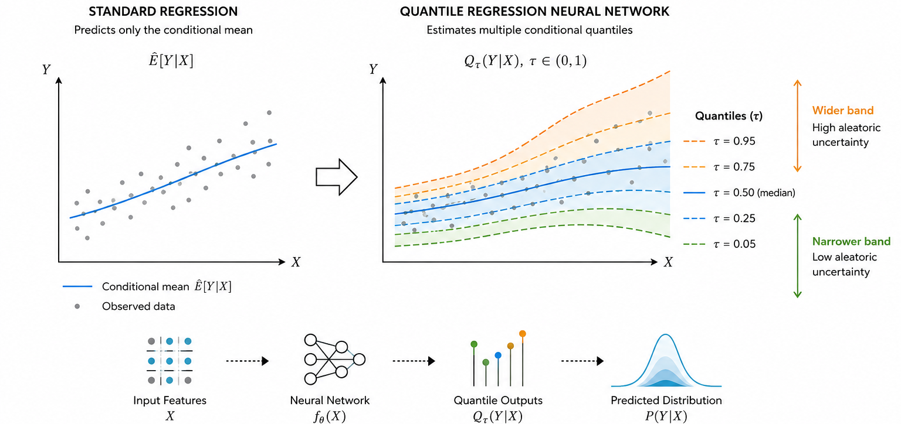
*Figure 01 — The distributional forecasting paradigm. A standard regression network predicts only the conditional mean Ê[Y|X] (center line). A Quantile Regression Neural Network simultaneously estimates multiple conditional quantiles $Q_τ(Y|X)$, producing a fan-shaped prediction band that captures the full shape of the response distribution. The band widens in regions of high aleatoric uncertainty and narrows where the response is more predictable, providing actionable uncertainty estimates at the cost of a single forward pass.*

### 1.1 — Limitations of Mean Regression

A standard feed-forward network trained with the MSE loss converges to:

$$
\hat{y}(x) \;\to\; \mathbb{E}[Y \mid X = x]
$$

This estimator is optimal under squared loss, but it discards all information about the *shape* of the conditional distribution of Y | X. In practice, three situations make the conditional mean an inadequate summary:

- **Heteroskedasticity:** When the variance of Y | X depends on x, a single mean prediction gives no indication of how confident the model is at different operating points. A temperature sensor that is reliable at 25°C and noisy at −40°C requires a model that expresses this difference quantitatively.

- **Asymmetric cost functions:** In inventory management, underestimating demand carries a different cost than overestimating it. Predicting only the mean ignores the asymmetry in the loss surface; the decision-theoretically optimal action depends on the full conditional distribution.

- **Heavy-tailed noise:** MSE is highly sensitive to outliers because its penalty increases quadratically with the magnitude of the error. In settings characterized by frequent extreme events, such as power grids, financial markets, and physiological monitoring, observations in the tails of the distribution can therefore substantially distort estimates of the conditional mean.

Quantile regression addresses all three limitations by targeting specific percentiles of the conditional distribution rather than its mean *(Figure 02)*.

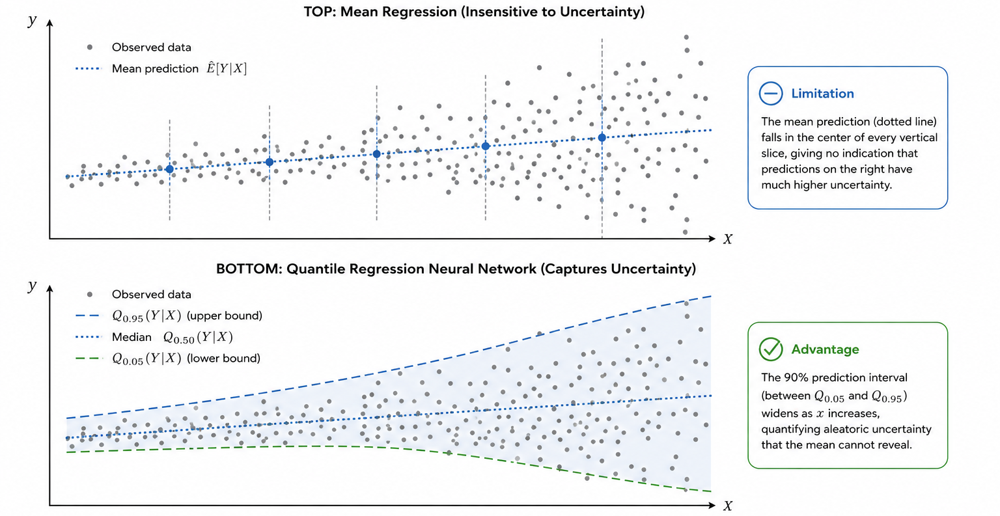
*Figure 02 — Why the conditional mean is insufficient. Top: a heteroskedastic signal where variance increases with x. A mean regression (dotted line) falls in the center of every vertical slice, giving no indication that predictions in the right half carry far greater uncertainty. Bottom: the same signal with a 90% prediction interval estimated by a QRNN (Q0.05 lower bound, Q0.95 upper bound). The interval widens correctly as x increases, quantifying aleatoric uncertainty that is invisible to the mean estimator.*

### 1.2 — The Distributional Forecasting Perspective

Let (X, Y) be a random pair with X ∈ ℝ^p and Y ∈ ℝ. The conditional quantile function at level τ is defined as:

$$
Q_\tau(Y \mid X = x) \;=\; \inf\!\left\{ q \in \mathbb{R} : \Pr(Y \leq q \mid X = x) \geq \tau \right\}
$$

Estimating $Q_τ$ for a grid of values $τ_1$ < $τ_2$ < … < $τ_K$ effectively *reconstructs* the conditional cumulative distribution function $F(y | x)$
at $K$ points. The resulting quantile fan (Figure 01) encodes:

- The **conditional median** $Q_{0.5}(Y|X)$ — robust location estimate.
- The **prediction interval** $[Q_{α/2}(Y|X), Q_{1−α/2}(Y|X)] — a (1−α) × 100%$  probability region for future observations.
- **Tail quantiles** $Q_{0.05}(Y|X) and Q_{0.95}(Y|X)$ — risk-relevant extremes for safety-critical applications.

The quantile function is directly actionable for decision making: the optimal action under an asymmetric cost function c(y, a) is obtained by minimising the expected cost using the estimated conditional distribution, without any further modelling assumption.

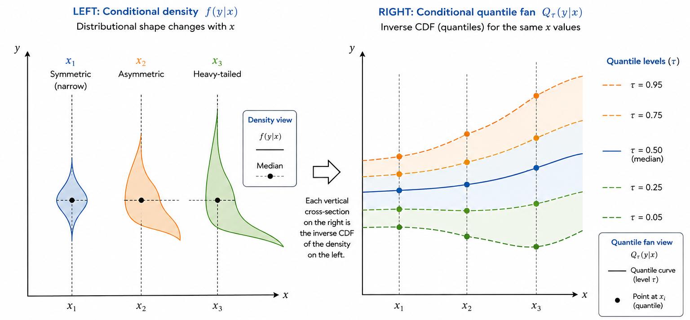
*Figure 03 — The conditional quantile function as a distributional summary. Left: conditional density $f(y|x)$ for three fixed values of $x$. The distributional shape changes with $x$: symmetric and narrow at $x_1$, asymmetric at $x_2, heavy-tailed at $x_3$. Right: the conditional quantile fan $Q_τ(y|x)$ for the same three points. Each vertical cross-section of the fan corresponds to the inverse CDF of the conditional density on the left. The QRNN estimates this fan directly without modelling the density.*

### 1.3 — From Linear Quantile Regression to Quantile Regression Neural Networks

Classical linear quantile regression (Koenker & Bassett, 1978) estimates:

$$
Q_\tau(Y \mid X = x) \;=\; x^\top \boldsymbol{\beta}_\tau
$$

by solving the convex linear programme:

$$
\hat{\boldsymbol{\beta}}_\tau \;=\; \arg\min_{\boldsymbol{\beta}} \sum_{i=1}^n \rho_\tau(y_i - x_i^\top \boldsymbol{\beta})
$$

where $\rho_\tau(\cdot)$ is the pinball loss function defined in Section 2.1. The linear model is computationally efficient and yields exact confidence intervals via asymptotic theory, but it cannot capture nonlinear covariate-quantile relationships that arise in complex physical systems.

Quantile Regression Neural Networks replace the linear predictor with a feed-forward network f(x; θ), yielding:

$$
\hat{Q}_\tau(Y \mid X = x) \;=\; f(x;\, \boldsymbol{\theta}_\tau)
$$

The network is trained by minimising the expected pinball loss over the training data using gradient-based optimisation (backpropagation). Unlike the linear case, the neural network version requires no prior knowledge of the functional form of the quantile-covariate relationship and can model interactions, thresholds, and saturation effects automatically *(Figure 04)*.

## 2 — Mathematical Foundations

### 2.1 — The Pinball (Check) Loss Function

The pinball loss (also called the *check function* or *tick function*) is the fundamental training objective for quantile regression. For a scalar prediction $\hat{q}$ and ground-truth outcome $y$, the pinball loss at quantile level τ is:

$$
\rho_\tau(y,\, \hat{q}) \;=\;
\begin{cases}
\tau \cdot (y - \hat{q})       & \text{if } y \geq \hat{q} \\[4pt]
(1 - \tau) \cdot (\hat{q} - y) & \text{if } y < \hat{q}
\end{cases}
$$

which can be written compactly as:

$$
\rho_\tau(r) \;=\; \max\!\bigl(\tau \cdot r,\; (\tau-1) \cdot r\bigr)
\;=\; r\!\left[\tau - \mathbf{1}(r < 0)\right]
$$

where $r = y - \hat{q}$ is the residual *(Figure 05)*.

- **Interpretation:** the loss penalises positive residuals (true value above the prediction) at rate τ and negative residuals (true value below) at rate 1 − τ. For τ = 0.5, both penalties are equal and the loss reduces to (1/2) × MAE, so the median is the solution that minimises the expected MAE. For τ = 0.9, under-prediction (positive residuals) is penalised nine times more heavily than over-prediction, driving the estimate toward the 90th percentile of the conditional distribution.

- **Statistical property:** the minimiser of the expected pinball loss over a dataset is exactly the conditional τ-quantile:

$$
\hat{q}^* \;=\; \arg\min_{\hat{q}} \; \mathbb{E}[\rho_\tau(Y - \hat{q}) \mid X = x]
\;=\; Q_\tau(Y \mid X = x)
$$

This result, analogous to the well-known fact that the conditional mean minimises the MSE, provides the theoretical justification for using the
pinball loss as a training objective.

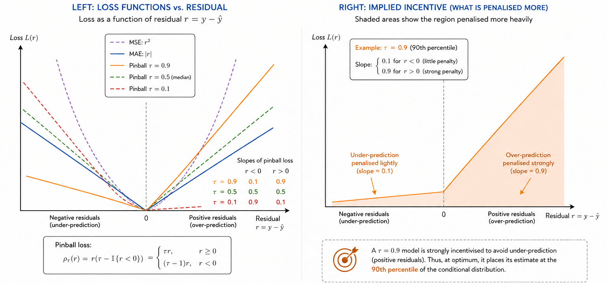
*Figure 04 — Comparison of MSE, MAE, and three pinball losses. Left: the five loss functions plotted against the residual r = y − ŷ. The MSE (quadratic) is symmetric; the MAE is symmetric and linear; the pinball losses are asymmetric and linear, with the slope ratio determined by τ. Right: the implied incentive structure — shaded areas show the region the loss penalises more heavily. A τ = 0.9 model is strongly incentivised to avoid under-prediction (positive residuals), correctly placing its estimate at the 90th percentile.*

### 2.2 — Simultaneous Multi-Quantile Estimation

Rather than training a separate model for each quantile level, a QRNN can
estimate $K$ quantiles simultaneously by using an output layer with $K$
neurons, one for each quantile, and summing the corresponding pinball losses:

$$
\mathcal{L}_{\text{multi}}(\boldsymbol{\theta}) \;=\;
\frac{1}{K} \sum_{k=1}^{K} \frac{1}{n} \sum_{i=1}^{n}
\rho_{\tau_k}\!\left(y_i - \hat{q}_{\tau_k}(x_i;\boldsymbol{\theta})\right)
$$

The K quantile estimates share all hidden layers and only diverge at the output head. This parameter sharing provides two advantages:

1. **Efficiency** — a single forward pass produces the full quantile fan.
2. **Regularisation** — information from the data distribution propagates through the shared backbone, improving estimates at under-represented
   quantile levels.

A critical constraint is that the estimates must satisfy the monotonicity property $\hat{q}_{\tau_1} \leq \hat{q}_{\tau_2} \leq \cdots \leq
\hat{q}_{\tau_K}$ for all $\tau_1 < \tau_2 < \cdots < \tau_K$, which is enforced by the ``QuantileHead`` layer described in Section 2.3.

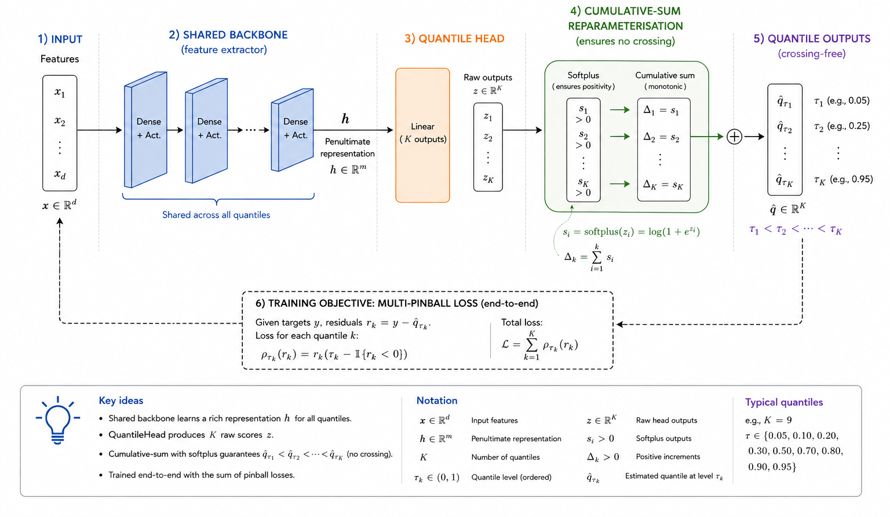
*Figure 05 — Multi-quantile QRNN architecture. A shared feed-forward backbone (blue blocks) maps the input x to a penultimate representation h. The QuantileHead (orange block) maps h to K raw outputs, then applies the cumulative-sum reparameterisation (green arrows) to produce K crossing-free quantile estimates. The entire graph is differentiated end-to-end with respect to the combined multi-pinball loss.*

### 2.3 — Quantile Crossing and Monotonicity Enforcement

When a single network estimates $K$ quantile levels, its raw outputs may
violate the required ordering constraint. Specifically, for
$\tau_k < \tau_{k+1}$, the inequality
$\hat{q}_{\tau_k} > \hat{q}_{\tau_{k+1}}$ may hold for some inputs. This
phenomenon, known as \textbf{quantile crossing}, produces internally
inconsistent predictions, such as a 90th-percentile estimate that is lower
than the corresponding 50th-percentile estimate.

The ``QuantileHead`` layer prevents crossing by parameterising the output as a base level plus a set of non-negative increments:

$$
\hat{q}_{\tau_1} = \mathbf{w}_1^\top h + b_1 \qquad \text{(base — unconstrained)}
$$

$$
\hat{q}_{\tau_k} = \hat{q}_{\tau_{k-1}} + \mathrm{softplus}(\mathbf{w}_k^\top h + b_k)
\qquad k = 2, \ldots, K
$$

where $\mathrm{softplus}(z) = \log(1 + e^z) > 0$ ensures that each increment is strictly positive. Equivalently, the K outputs are:

$$
\hat{\mathbf{q}} = \mathrm{cumsum}\bigl([\hat{q}_{\tau_1},\; \mathrm{softplus}(\delta_2),\; \ldots,\; \mathrm{softplus}(\delta_K)]\bigr)
$$

where $\delta_k = \mathbf{w}_k^\top h + b_k$ are the raw linear outputs for $k \geq 2$. This reparameterisation guarantees strict ordering for any network weights and input, without requiring any post-hoc sorting, projection, or constraint on the optimiser *(Figure 06)*.

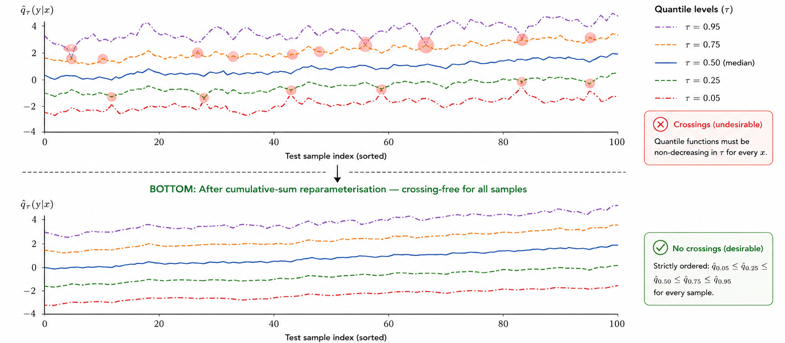
*Figure 06 — Quantile crossing prevention via cumulative-sum reparameterisation. Top: raw network outputs for five quantile levels across 100 test samples — crossings (shaded red) occur frequently. Bottom: after applying the cumulative-sum decode, all quantile estimates are strictly ordered for every sample. The reparameterisation is applied inside the QuantileHead forward pass and is fully differentiable, imposing no constraints on the optimiser.*

### 2.4 — The Huber-Smoothed Pinball Loss

The standard pinball loss has a non-differentiable kink at $r = 0$, which nmcan cause gradient noise in mini-batch training when many residuals are near zero. The Huber-smoothed pinball loss replaces the kink with a smooth quadratic region of half-width $\delta > 0$:

$$
H_\delta(r) \;=\;
\begin{cases}
\dfrac{r^2}{2\delta}         & \text{if } |r| \leq \delta \\[8pt]
|r| - \dfrac{\delta}{2}      & \text{if } |r| > \delta
\end{cases}
$$

The Huber-pinball loss then applies this smoothed absolute value with asymmetric weights:

$$
L_\tau^\delta(y,\,\hat{q}) \;=\;
\begin{cases}
\tau \cdot H_\delta(y - \hat{q})       & \text{if } y \geq \hat{q} \\[4pt]
(1-\tau) \cdot H_\delta(\hat{q} - y)   & \text{if } y < \hat{q}
\end{cases}
$$

As $\delta \to 0$, the Huber-pinball recovers the standard pinball loss; as $\delta \to \infty$, it approaches a weighted MSE. For moderate values of $\delta$ (e.g. $\delta = 0.5$), it retains the quantile-consistency property while producing smoother gradient signals, particularly beneficial for estimating extreme quantiles ($\tau$ near 0 or 1) from noisy data.

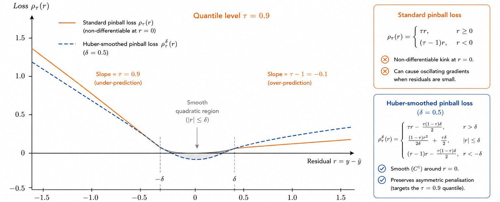
*Figure 07 — Comparison of the standard pinball loss and the Huber-smoothed pinball loss for τ = 0.9. The standard loss (solid orange) has a non-differentiable kink at r = 0 that can cause oscillating gradients when residuals are small. The Huber-pinball (dashed blue, δ = 0.5) replaces the kink with a smooth parabolic region (grey shading), reducing gradient noise while maintaining the asymmetric penalisation structure that targets the 90th percentile.*

### 2.5 — Prediction Interval Scoring: The Winkler Score

A K-quantile QRNN trained with τ_1 = α/2 and τ_K = 1 − α/2 produces a nominal (1 − α) × 100% prediction interval $[\hat{l}, \hat{u}] =
[\hat{q}_{\alpha/2}, \hat{q}_{1-\alpha/2}]$. The **Winkler interval score** (Winkler, 1972) evaluates the quality of this interval:

$$
\mathrm{IS}_\alpha(\hat{l}, \hat{u}, y) \;=\;
(\hat{u} - \hat{l}) + \frac{2}{\alpha} \cdot
\bigl[\underbrace{(\hat{l} - y)_+}_{\text{miss below}} +
      \underbrace{(y - \hat{u})_+}_{\text{miss above}}\bigr]
$$

where $(z)_+ = \max(z, 0)$. The score rewards **narrower intervals** (smaller $\hat{u} - \hat{l}$) while penalising **coverage failures** at rate $2/\alpha$. For a 90% interval ($\alpha = 0.1$), a missed observation carries a penalty 20 times the unit interval width.

The Winkler score is a **proper scoring rule**: it is minimised in expectation by the true predictive interval, and no interval that misrepresents the underlying distribution can score better in expectation. This makes it the canonical metric for evaluating probabilistic forecasts on microcontroller systems where the full predictive distribution cannot be stored.

### 2.6 — Coverage Calibration

A quantile estimate $\hat{q}_\tau(x)$ is **calibrated** if:

$$
\Pr(Y \leq \hat{q}_\tau(X)) \;=\; \tau
$$

for all τ ∈ (0, 1). Empirically, this means that a fraction τ of the test observations should lie below the predicted τ-quantile. The **reliability diagram** (Figure 08) plots the empirical coverage against the nominal quantile level τ; perfect calibration corresponds to points lying on the 45-degree diagonal.

Deviations from the diagonal indicate systematic miscalibration:

- **Points above the diagonal**, where empirical coverage exceeds nominal coverage, indicate that the model is overly conservative and produces intervals that are wider than necessary.
- **Points below the diagonal**, where empirical coverage is lower than nominal coverage, indicate that the model undercovers. Its intervals are too narrow and therefore exclude more observations than the nominal coverage level implies.

The calibration error (CE) summarises the diagram as a scalar:

$$
\mathrm{CE} \;=\; \frac{1}{K} \sum_{k=1}^K \left|\hat{F}(\hat{q}_{\tau_k}) - \tau_k\right|
$$

where $\hat{F}(\hat{q}_{\tau_k})$ is the empirical fraction of test observations below $\hat{q}_{\tau_k}$. A well-calibrated QRNN achieves
$\mathrm{CE} \approx 0$.

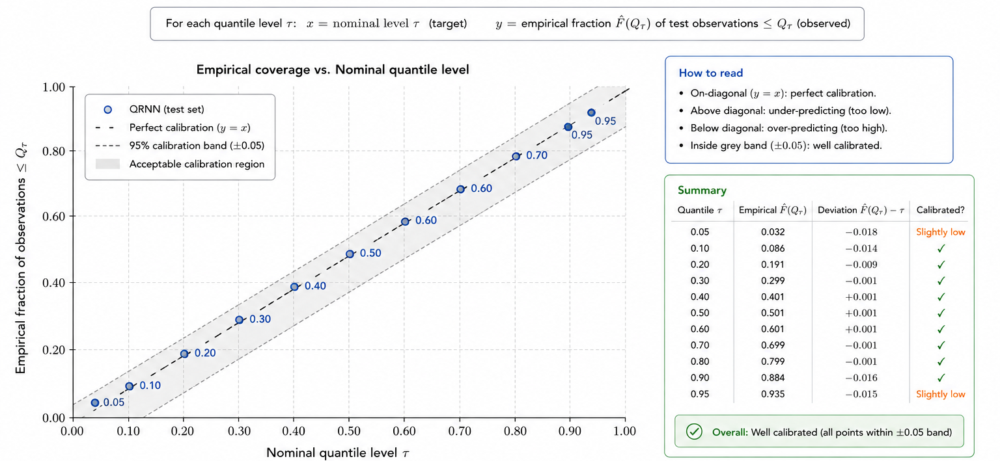
*Figure 08 — Calibration reliability diagram for a QRNN trained on the heteroskedastic dataset from Example 2. Each point corresponds to one quantile level: its x-coordinate is the nominal level τ and its y-coordinate is the empirical fraction of test observations below the predicted τ-quantile. The grey shaded region shows the acceptable calibration band. The model is slightly conservative at the tails (Q0.05, Q0.95) and nearly perfectly calibrated at the central quantiles.*

### 2.7 — Network Architecture and Training

The QRNN implemented in this framework consists of:

**Backbone.** L fully-connected ``DenseLayer`` blocks with nonlinear activations (ReLU, GELU, Swish, or tanh), optional dropout, and Kaiming / Xavier weight initialisation:

$$
h^{(\ell)} = \sigma\!\left(W^{(\ell)} h^{(\ell-1)} + b^{(\ell)}\right), \qquad \ell = 1, \ldots, L
$$

**Quantile head.** A ``QuantileHead`` layer maps the penultimate representation to K ordered quantile estimates via the cumulative-sum
reparameterisation (Section 2.3):

$$
\hat{\mathbf{q}} = \mathrm{QHead}(h^{(L)}) \;\in\; \mathbb{R}^K
$$

**Training.** The model is trained end-to-end using the multi-pinball loss (or one of its variants) with the Adam optimiser:

$$
\boldsymbol{\theta}^* = \arg\min_{\boldsymbol{\theta}} \;\mathcal{L}_\text{multi}(\boldsymbol{\theta})
$$

Backpropagation through the cumulative-sum operation is exact: the gradient of the cumulative sum with respect to each raw output $\delta_k$ is an upper-triangular all-ones matrix, which PyTorch computes automatically.

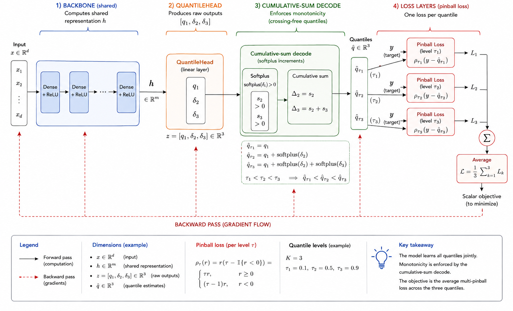
*Figure 09 — QRNN computational graph for K = 3 quantile levels. The backbone (blue) computes a shared representation h; the QuantileHead (orange) produces raw outputs [q₁, δ₂, δ₃]; the cumulative-sum decode (green) enforces monotonicity. Three separate pinball losses (red, one per quantile) are summed and averaged to produce the scalar training objective. Gradients flow backward through all paths simultaneously.*

### 2.8 — Numerical Walkthrough

We perform a complete forward pass for a QRNN with $d_x = 2$, two hidden layers of width 4, K = 3 quantile levels (τ = 0.1, 0.5, 0.9), and ReLU
activations. All values are chosen to make the computation explicit.

**Input:** $\mathbf{x} = [1.0,\; -0.5]^\top$.

**Hidden layer 1** (2 → 4, ReLU):

$$
\mathbf{z}^{(1)} = W^{(1)}\mathbf{x} + b^{(1)} = [0.50,\; -0.20,\; 0.85,\; 0.10]^\top
$$

$$
\mathbf{h}^{(1)} = \mathrm{ReLU}(\mathbf{z}^{(1)}) = [0.50,\; 0.00,\; 0.85,\; 0.10]^\top
$$

**Hidden layer 2** (4 → 4, ReLU):

$$
\mathbf{h}^{(2)} = \mathrm{ReLU}(W^{(2)}\mathbf{h}^{(1)} + b^{(2)})
= [0.30,\; 0.55,\; 0.00,\; 0.72]^\top
$$

**Quantile head — raw outputs** (4 → 3):

$$
\mathbf{r} = W_\text{head}\,\mathbf{h}^{(2)} + b_\text{head}
= [-0.40,\; 0.60,\; 1.20]^\top
$$

**Cumulative-sum decode:**

$$
\hat{q}_1 = r_1 = -0.40 \qquad \text{(base — unconstrained)}
$$

$$
\hat{q}_2 = \hat{q}_1 + \mathrm{softplus}(r_2) = -0.40 + \log(1 + e^{0.60}) = -0.40 + 1.093 = 0.693
$$

$$
\hat{q}_3 = \hat{q}_2 + \mathrm{softplus}(r_3) = 0.693 + \log(1 + e^{1.20}) = 0.693 + 1.474 = 2.167
$$

**Output:** $[\hat{q}_{0.1},\; \hat{q}_{0.5},\; \hat{q}_{0.9}] = [-0.40,\; 0.693,\; 2.167]^\top$,
which is strictly increasing as required.

**Pinball losses** (for an observed $y = 1.1$):

$$
\rho_{0.1}(1.1,\; -0.40) = 0.1 \times (1.1 - (-0.40)) = 0.1 \times 1.50 = 0.150
$$

$$
\rho_{0.5}(1.1,\; 0.693) = 0.5 \times (1.1 - 0.693) = 0.5 \times 0.407 = 0.204
$$

$$
\rho_{0.9}(1.1,\; 2.167) = (1 - 0.9) \times (2.167 - 1.1) = 0.1 \times 1.067 = 0.107
$$

$$
\mathcal{L}_\text{multi} = \frac{1}{3}(0.150 + 0.204 + 0.107) = 0.154
$$

The gradient of each pinball loss with respect to the head raw output flows back through the cumulative-sum (an upper-triangular Jacobian of ones) into the backbone parameters, updating all layers simultaneously *(Figure 10)*.

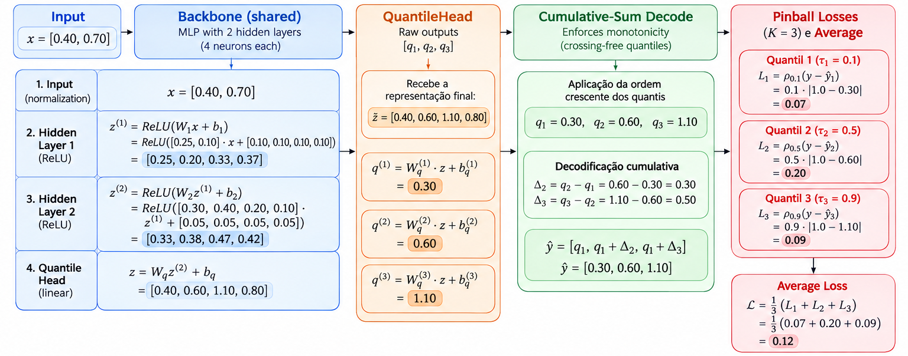
*Figure 10 — Complete numerical walkthrough of a QRNN forward pass (d_x = 2, two hidden layers of width 4, K = 3 quantiles, ReLU activations). Each row shows one computational stage. The computation proceeds in a single track through the backbone, then branches at the QuantileHead into three quantile outputs. The cumulative-sum decode is highlighted in green; the three pinball losses and their average are shown in red at the bottom.*

## 3 — TinyML Implementation

With this example you can implement the quantile regression model on ESP32, Arduino, Arduino Portenta H7 with Vision Shield, Raspberry Pi, and other microcontrollers or IoT devices *(Figure 11)*.

### 3.1 — Jupyter Notebooks

-  Quantile Regression Neural Network Training

### 3.2 — Arduino Code

-  Example 1: Single-Quantile Median Regression

-  Example 2: Multi-Quantile with Prediction Intervals

-  Example 3: Combined Loss on Multivariate Data

-  Example 4: Huber-Pinball for Robust Tail Estimation

## References

[1] Koenker, R., & Bassett, G. (1978). Regression Quantiles. *Econometrica*, 46(1), 33–50.

[2] Taylor, J. W. (2000). A Quantile Regression Neural Network Approach to Estimating the Conditional Density of Multiperiod Returns. *Journal of Forecasting*, 19(4), 299–311.

[3] Cannon, A. J. (2011). Quantile Regression Neural Networks: Implementation in R and Application to Precipitation Downscaling. *Computers & Geosciences*, 37(9), 1277–1284.

[4] Winkler, R. L. (1972). A Decision Theoretic Approach to Interval Estimation. *Journal of the American Statistical Association*, 67(337), 187–191.

[5] Meinshausen, N. (2006). Quantile Regression Forests. *Journal of Machine Learning Research*, 7, 983–999.

[6] Gneiting, T., & Raftery, A. E. (2007). Strictly Proper Scoring Rules, Prediction, and Estimation. *Journal of the American Statistical Association*, 102(477), 359–378.

[7] Chung, Y., Neiswanger, W., Char, I., & Schneider, J. (2021). Beyond Pinball Loss: Quantile Methods for Calibrated Uncertainty Quantification. *NeurIPS 34*.

[8] Rodrigues, F., & Pereira, F. C. (2020). Beyond Expectation: Deep Joint Mean and Quantile Regression for Spatiotemporal Problems. *IEEE Transactions on Neural Networks and Learning Systems*, 31(12).

[9] Pearce, T., Brintrup, A., Zaki, M., & Neely, A. (2018). High-Quality Prediction Intervals for Deep Learning: A Distribution-Free, Ensembled Approach. *ICML 2018*.

[10] Lane, N. D., Bhattacharya, S., Georgiev, P., Forlivesi, C., & Kawsar, F. (2015). An Early Resource Characterization of Deep Learning on Wearables, Smartphones and Internet-of-Things Devices. *IoT-App 2015*, 7–12.

[11] Koenker, R. (2005). *Quantile Regression*. Cambridge University Press.

[12] Goodfellow, I., Bengio, Y., & Courville, A. (2016). *Deep Learning*. MIT Press.

[13] He, K., Zhang, X., Ren, S., & Sun, J. (2015). Delving Deep into Rectifiers: Surpassing Human-Level Performance on ImageNet Classification. *ICCV 2015*.
