# TinyML — Self-Organizing Maps

_From mathematical foundations to edge implementation_

**Social media:**

👨🏽‍💻 Github: [thommaskevin/TinyML](https://github.com/thommaskevin/TinyML)

👷🏾 Linkedin: [Thommas Kevin](https://www.linkedin.com/in/thommas-kevin-ab9810166/)

📽 Youtube: [Thommas Kevin](https://www.youtube.com/channel/UC7uazGXaMIE6MNkHg4ll9oA)

🧑‍🎓 Scholar: [Thommas K. S. Flores](https://scholar.google.com/citations?user=MqWV8JIAAAAJ&hl=pt-PT&authuser=2)

:pencil2: CV Lattes CNPq: [Thommas Kevin Sales Flores](http://lattes.cnpq.br/0630479458408181)

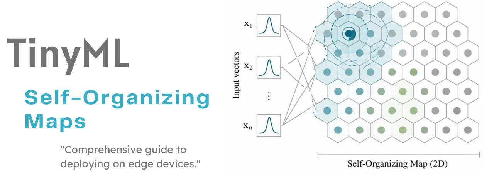

## SUMMARY

1 — Introduction

&nbsp;&nbsp;1.1 — Competitive Learning and Vector Quantization

&nbsp;&nbsp;1.2 — The Topology-Preservation Principle

&nbsp;&nbsp;1.3 — From Linear Projection to Nonlinear Manifold Learning

2 — Mathematical Foundations

&nbsp;&nbsp;2.1 — SOM Architecture and Weight Representation

&nbsp;&nbsp;2.2 — Best Matching Unit (BMU) Search

&nbsp;&nbsp;2.3 — Neighborhood Functions

&nbsp;&nbsp;2.4 — The Online (Sequential) Learning Rule

&nbsp;&nbsp;2.5 — Batch Training: The Generalized Lloyd Algorithm

&nbsp;&nbsp;2.6 — Learning Rate and Neighborhood Radius Schedules

&nbsp;&nbsp;2.7 — The Unified Distance Matrix (U-Matrix)

&nbsp;&nbsp;2.8 — Quality Metrics: Quantization and Topographic Error

&nbsp;&nbsp;2.9 — Numerical Walkthrough

3 — TinyML Implementation

&nbsp;&nbsp;3.1 — Example 1: Iris Dataset — 2-D Topology Preservation

&nbsp;&nbsp;3.2 — Example 2: Hexagonal Topology with Mexican Hat Kernel

&nbsp;&nbsp;3.3 — Example 3: Weight Trajectories and Schedule Comparison

&nbsp;&nbsp;3.4 — Example 4: Digits Dataset — Large Map and Batch Training

## 1 — Introduction

The self-organising map (SOM), introduced by Teuvo Kohonen in 1982, is an established unsupervised neural network architecture. Whereas principal component analysis (PCA) and autoencoders represent inputs in a continuous latent space, the SOM represents them using a finite set of prototype vectors arranged on a low-dimensional, typically two-dimensional, lattice. Training encourages neighbouring lattice units to represent similar regions of the input space, yielding a discrete representation that aims to preserve neighbourhood relationships.

This organisation makes the SOM useful for tasks where the goal is not merely to compress data but to understand the structure of the input distribution. Applications include exploring clusters, visualising high-dimensional data, and detecting anomalies. Spatial or temporal patterns can also be explored when the input features encode the relevant relationships.

In the context of TinyML, the SOM offers a simple inference procedure: once trained, an input is mapped to its best-matching unit by searching for the nearest of (K) prototype vectors. For (D)-dimensional inputs, an exhaustive search using squared Euclidean distance requires ($\mathcal{O}(KD)$) operations, with no backpropagation, nonlinear activation functions, divisions, or square roots needed for this search. A ($10 \times 10$) SOM with (64)-dimensional inputs evaluates (6,400) squared differences per input, together with the corresponding accumulations and comparisons. Deployment on a resource-constrained microcontroller such as an Arduino Uno therefore requires assessing both execution time and the memory needed to store the (6,400) prototype components, rather than relying on the arithmetic count alone.

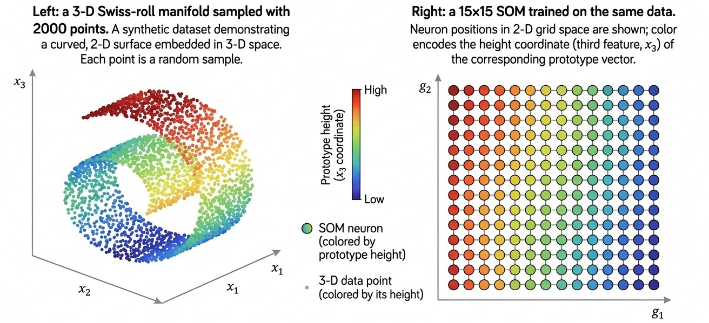
*Figure 01 — The Self-Organizing Map as a topology-preserving projector. Left: a 3-D Swiss-roll manifold sampled with 2000 points. Right: a 15x15 SOM trained on the same data. Each neuron's position in 2-D grid space is shown; its color encodes the height coordinate (third feature) of the corresponding prototype vector. The map has unrolled the manifold: points that were nearby on the 3-D surface are mapped to nearby grid positions, preserving the topological structure in the projected space.*

### 1.1 — Competitive Learning and Vector Quantization

A useful starting point for understanding the self-organising map (SOM) is (k)-means clustering, which partitions the input space into (K) Voronoi cells by alternating between assigning samples to their nearest prototype and updating each prototype to the mean of its assigned samples. This procedure seeks to minimise the sum of squared distances between samples and their assigned prototypes. Given these assignments, each prototype is updated independently: the method imposes no neighbourhood structure on the prototypes, although their positions still encode geometric relationships in the input space.

The SOM introduces two key features relative to (k)-means. First, its (K) prototypes are associated with units on a structured, usually two-dimensional grid, which defines neighbourhood relationships independently of the prototypes' positions in the input space. Second, during online training, both the best-matching prototype and its neighbours on the grid are moved towards the training sample. The strength of each update is controlled by a neighbourhood function that typically decreases with grid distance from the winning unit and narrows as training progresses. This cooperative update encourages topological organisation, rather than guaranteeing perfect topology preservation, and adds computational work beyond updating the winner alone.

Both (k)-means and the SOM can be viewed as vector quantisation (VQ) methods: they represent inputs drawn from a distribution ($p(\mathbf{x})$) using a finite set of prototype vectors ($\{\mathbf{w}_k\}_{k=1}^{K}$). One measure of representation quality is the expected quantisation error:

$$
    \mathrm{QE}
    = \mathbb{E}_{\mathbf{x} \sim p}\!\left[
        \min_{1 \leq k \leq K}
        \lVert \mathbf{x} - \mathbf{w}_k \rVert_2
      \right].
$$

This measure uses Euclidean distances, whereas the (k)-means objective uses squared Euclidean distances. Standard SOM training does not, in general, minimise either of these objectives directly; instead, its neighbourhood-based updates encourage nearby grid units to represent similar inputs. This organisation can come at the expense of quantisation accuracy, but the size of the trade-off depends on the data, grid structure, and training settings.

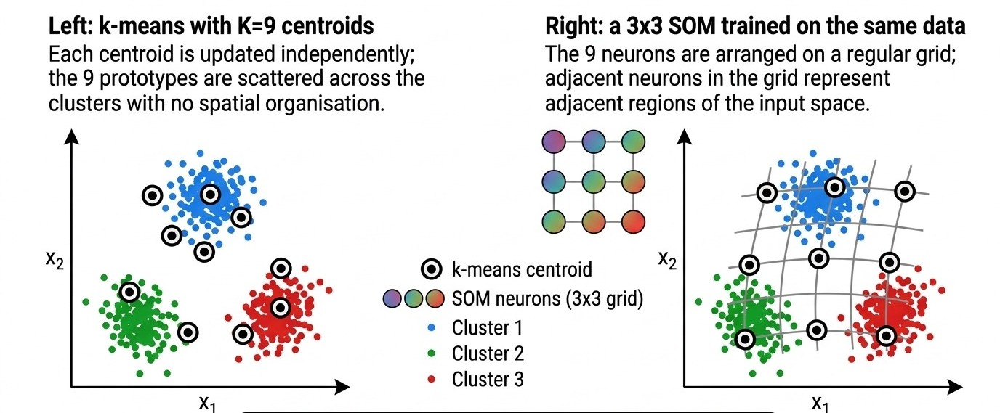
*Figure 02 — Comparison of k-means and SOM on the same 2-D dataset with 3 clusters. Left: k-means with K=9 centroids. Each centroid is updated independently; the 9 prototypes are scattered across the clusters with no spatial organisation. Right: a 3x3 SOM trained on the same data. The 9 neurons are arranged on a regular grid; adjacent neurons in the grid represent adjacent regions of the input space. The SOM's spatial structure allows the map to be read as a 2-D image of the data distribution.*

### 1.2 — The Topology-Preservation Principle

In the context of a self-organising map (SOM), topology preservation refers to the approximate preservation of neighbourhood relationships: nearby inputs should generally map to nearby grid units, while neighbouring grid units should represent similar inputs. For a rectangular grid, the trained SOM assigns each input to the location of its best-matching unit through the mapping

$$
    \phi\colon \mathbb{R}^{d} \longrightarrow
    \{1,\ldots,n_{\mathrm{rows}}\}
    \times \{1,\ldots,n_{\mathrm{cols}}\},
    \qquad
    \phi(\mathbf{x}) = \mathbf{r}_{b(\mathbf{x})},
$$

where ($\mathbf{r}_k$) is the grid location of unit (k), and
$$
    b(\mathbf{x}) = \operatorname*{arg\,min}_{k}
    \lVert \mathbf{x} - \mathbf{w}_k \rVert_2
$$

identifies the nearest prototype ($\mathbf{w}_k)$, with ties resolved consistently. Grid separation can be measured by:

$$
 d_{\mathrm{grid}}(\mathbf{r}_j,\mathbf{r}_k) = \lVert \mathbf{r}_j-\mathbf{r}_k \rVert_2
$$
 
 Because this assignment is discrete, arbitrarily close inputs on opposite sides of a quantisation boundary can map to different units. Neighbourhood preservation is therefore an approximate organisational goal, not a continuity guarantee for every pair of inputs.

The cooperative update rule encourages this organisation but does not guarantee it. Its quality depends on the data, grid structure, initialisation, and training settings. A common diagnostic is the topographic error (TE): the fraction of evaluated samples whose first- and second-best matching units are not adjacent on the grid. For (N) samples, it is defined as:

$$
    \mathrm{TE} = \frac{1}{N}\sum_{i=1}^{N}
    \mathbf{1}\!\left[
        b_2(\mathbf{x}_i) \notin
        \mathcal{N}\bigl(b_1(\mathbf{x}_i)\bigr)
    \right],
$$
where ($b_1$) and ($b_2$) denote the closest and second-closest distinct units in input space, ($\mathcal{N}(k)$) is the set of grid units adjacent to unit (k), and ($\mathbf{1}[\cdot]$) is the indicator function. The adjacency convention must be specified, including whether diagonal neighbours count on a rectangular grid. Lower TE indicates fewer local adjacency violations under this convention, but does not establish global topology preservation. A threshold such as ($\mathrm{TE}<0.05$) should therefore be justified for the particular dataset and application rather than treated as a universal benchmark.

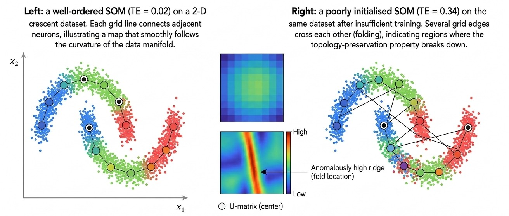
*Figure 03 — Topographic error as a diagnostic tool. Left: a well-ordered SOM (TE = 0.02) on a 2-D crescent dataset. The grid lines connect adjacent neurons; the map smoothly follows the curvature of the data manifold. Right: a poorly initialised SOM (TE = 0.34) on the same dataset after insufficient training. Several grid edges cross each other (folding), indicating regions where the topology-preservation property breaks down. The U-matrix (center) reveals the fold as an anomalously high ridge.*

### 1.3 — From Linear Projection to Nonlinear Manifold Learning

Principal component analysis (PCA) projects centred data onto the subspace spanned by the eigenvectors associated with the largest eigenvalues of the covariance matrix. For a fixed target dimension, it minimises the squared Frobenius norm of the reconstruction error among linear subspace approximations. However, a linear projection cannot generally unfold a nonlinear manifold: for example, a two-dimensional PCA projection of a Swiss roll can superimpose distinct layers rather than recover the manifold's intrinsic coordinates.

The nonlinear dimensionality reduction methods t-SNE and UMAP are widely used to visualise high-dimensional data in two dimensions, with an emphasis on local neighbourhood relationships. Standard t-SNE optimises an embedding of the training samples without learning an explicit mapping for unseen inputs. However, non-parametric methods do not necessarily preclude out-of-sample extension: UMAP supports transforming new samples into an existing embedding, and parametric variants of both methods learn explicit mappings. Their suitability for microcontrollers therefore depends on the implementation, model size, and inference procedure; training cost alone does not determine deployment feasibility.

The self-organising map (SOM) offers a complementary, prototype-based representation. After training, it assigns a new input to the grid location of its nearest prototype, requiring ($\mathcal{O}(Kd)$) time for an exhaustive search over (K) prototypes in (d) dimensions and ($\mathcal{O}(Kd)$) storage for the prototype vectors. Unlike PCA, this assignment is discrete and nonlinear. Like (k)-means, it induces a hard partition of the input space, although individual grid units need not correspond to distinct, meaningful clusters. Its distinguishing feature is a predefined grid whose neighbourhood relationships guide cooperative prototype updates during training. This encourages nearby grid units to represent similar inputs, providing an interpretable spatial organisation without guaranteeing topology preservation or faithful global distances. For TinyML applications, the main advantage is the straightforward nearest-prototype inference procedure, provided that the prototype storage and search cost fit the device's resource budget.

## 2 — Mathematical Foundations

### 2.1 — SOM Architecture and Weight Representation

A self-organising map (SOM) with ($n_{\mathrm{rows}}$) rows and ($n_{\mathrm{cols}}$) columns consists of ($K = n_{\mathrm{rows}}n_{\mathrm{cols}}$) units arranged on a two-dimensional rectangular or hexagonal grid. Each unit ((i,j)) is associated with a weight vector, or prototype,

$$
    \mathbf{w}_{ij} \in \mathbb{R}^{d},
    \qquad i = 1,\ldots,n_{\mathrm{rows}},
    \qquad j = 1,\ldots,n_{\mathrm{cols}}.
$$

The prototypes form a weight tensor (W) of shape ($n_{\mathrm{rows}} \times n_{\mathrm{cols}} \times d$). In the standard SOM, these prototype components are the learned parameters, whereas the grid structure is fixed. After training, the prototypes provide a discrete representation of the input distribution, with neighbouring grid units encouraged to represent similar inputs.

For a rectangular grid with unit spacing along both axes, the lattice coordinates can be written as ($\mathbf{r}_{ij}=(j,i)$). Each interior unit has four equidistant cardinal neighbours. An eight-neighbour convention additionally includes the diagonal units, which are at Euclidean distance ($\sqrt{2}$), rather than (1). In a hexagonal grid, units occupy the centres of regular hexagonal cells, giving each interior unit six equidistant nearest neighbours. With unit horizontal spacing, one coordinate convention is

$$
    \mathbf{r}_{ij}
    = \left(j + \delta_i,\,\frac{\sqrt{3}}{2}i\right),
    \qquad
    \delta_i =
    \begin{cases}
        \tfrac{1}{2}, & \text{if } i \text{ is odd},\\
        0, & \text{if } i \text{ is even}.
    \end{cases}
$$

Thus, shifting alternate rows by half a column must be accompanied by a vertical row spacing of ($\sqrt{3}/2$) to obtain equal nearest-neighbour distances. The six neighbour directions provide a more uniform angular arrangement than the four cardinal directions of a rectangular grid, but do not guarantee a lower topographic error.

For planar grids without wrap-around connections, we use Euclidean grid distance,
$$
    d_{\mathrm{grid}}\bigl((i_1,j_1),(i_2,j_2)\bigr)
    = \lVert \mathbf{r}_{i_1j_1}-\mathbf{r}_{i_2j_2} \rVert_2.
$$

For the rectangular grid, this reduces to

$$(\sqrt{(i_1-i_2)^2+(j_1-j_2)^2})$$

For the hexagonal convention above, it becomes

$$
    d_{\mathrm{grid}}\bigl((i_1,j_1),(i_2,j_2)\bigr)
    = \sqrt{
        \bigl(j_1-j_2+\delta_{i_1}-\delta_{i_2}\bigr)^2
        + \frac{3}{4}(i_1-i_2)^2
      }.
$$

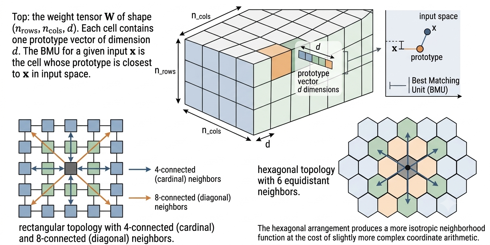
*Figure 04 — SOM weight tensor and lattice topologies. Top: the weight tensor W of shape (n_{rows}, n_{cols}, d). Each cell contains one prototype vector of dimension d. The BMU for a given input x is the cell whose prototype is closest to x in input space. Bottom left: rectangular topology with 4-connected (cardinal) and 8-connected (diagonal) neighbors. Bottom right: hexagonal topology with 6 equidistant neighbors. The hexagonal arrangement produces a more isotropic neighborhood function at the cost of slightly more complex coordinate arithmetic.*

### 2.2 — Best Matching Unit (BMU) Search

Given an input vector ($\mathbf{x} \in \mathbb{R}^{d}$), the best-matching unit (BMU) is the unit whose prototype vector is closest to ($\mathbf{x}$) under the chosen dissimilarity measure:

$$
    \operatorname{BMU}(\mathbf{x})
    = \operatorname*{arg\,min}_{(i,j)}
      D\bigl(\mathbf{x},\mathbf{w}_{ij}\bigr).
$$

The standard choice is the squared Euclidean distance,

$$
    D_{\mathrm{E}}(\mathbf{x},\mathbf{w})
    = \sum_{k=1}^{d}(x_k-w_k)^2.
$$

Minimising this quantity yields the same BMU as minimising the Euclidean norm because the square-root function is strictly increasing. Omitting the square root therefore avoids an unnecessary operation. Depending on the data and the training rule, other dissimilarity measures may also be appropriate:

- **Manhattan distance ($L_1$):** It is less sensitive than squared Euclidean distance to large deviations in individual features and may be useful for some sparse or heavy-tailed data.
    $$
        D_{\mathrm{M}}(\mathbf{x},\mathbf{w})
        = \sum_{k=1}^{d}\lvert x_k-w_k\rvert.
    $$
   

- **Cosine dissimilarity:** It compares vector direction rather than magnitude and is often useful for text or spectral data. It is undefined when either vector has zero norm, so implementations must handle that case explicitly.
$$
        D_{\mathrm{C}}(\mathbf{x},\mathbf{w})
        = 1 - \frac{\mathbf{x}^{\mathsf{T}}\mathbf{w}}
        {\lVert\mathbf{x}\rVert_2\lVert\mathbf{w}\rVert_2}.
$$
    

An exhaustive BMU search over (K) prototypes has time complexity ($\mathcal{O}(Kd)$) per input. It is the principal inference cost and is often a major component of training cost. For additive, non-negative dissimilarities such as squared Euclidean or Manhattan distance, an implementation may stop evaluating a candidate as soon as its accumulated partial distance exceeds the best complete distance found so far. This early-abandonment optimisation preserves the exact result, but its practical benefit depends on the prototype traversal order and the distribution of candidate distances (Figure 05).

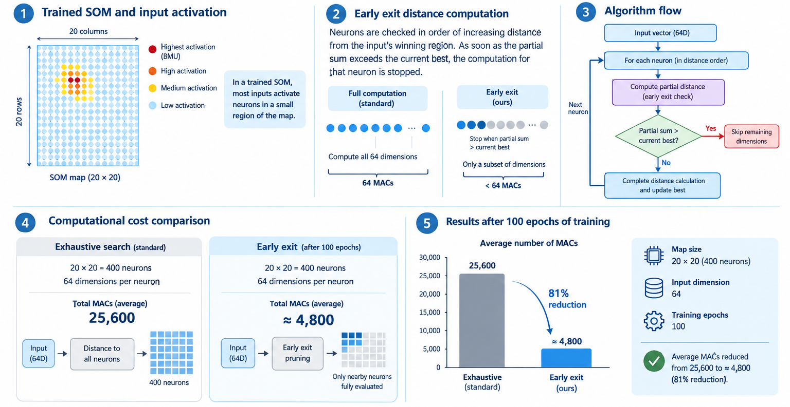
*Figure 05 — BMU search with early exit optimisation. For a trained SOM, most inputs activate neurons in a small region of the map. The early exit prunes the distance computation for distant neurons as soon as the partial sum exceeds the current best. On a 20x20 map with 64-dimensional inputs, early exit reduces the average number of multiply-accumulate operations from 25600 (exhaustive) to approximately 4800 (81% reduction) after 100 epochs of training.*

### 2.3 — Neighborhood Functions

The neighborhood function h(i, j, bmu, sigma) determines how strongly neuron (i, j) is updated when the BMU is at grid position bmu and the current radius is sigma.  All four kernels implemented in this framework are functions of the squared grid distance 

$$
d^2 = d_{grid}(bmu, (i,j))^2
$$

- **Gaussian (Kohonen kernel):** The standard kernel introduced by Kohonen (1982).  Smooth, infinitely supported, and strictly positive everywhere.  The Gaussian neighborhood ensures that all neurons are updated at every step, with the update magnitude falling off rapidly with grid distance.

$$
h_G(d,\sigma)
=
\exp\left(-\frac{d^2}{2\sigma^2}\right)
$$

- **Mexican Hat:** A second-derivative-of-Gaussian kernel with a positive central lobe and a negative lateral inhibition ring.  The inhibition ring suppresses neurons at intermediate distances from the BMU, producing sharper cluster boundaries in the U-matrix and tighter feature selectivity.  The Mexican Hat can cause training instability if sigma is too large relative to the map.
$$

h_{MH}(d,\sigma)
=
\left(1-2\left(\frac{d}{\sigma}\right)^2\right)
\exp\left(-\frac{d^2}{\sigma^2}\right)
$$

- **Bubble:** A tophat function: all neurons within radius sigma are updated identically, and all neurons outside are not updated at all.  Produces uniform weight distributions within the bubble radius; computationally very efficient.
$$
h_B(d,\sigma)=
\begin{cases}
1, & \text{if } d \leq \sigma,\\[4pt]
0, & \text{otherwise}.
\end{cases}
$$

- **Epanechnikov:** The kernel of minimum mean-squared error among all compact-support kernels (Epanechnikov, 1969).  Smooth quadratic falloff with compact support; a good compromise between the Gaussian (smooth, infinite support) and the bubble (flat, compact support) (Figure 06).

$$
h_G(d,\sigma)
=
\exp\left(-\frac{d^2}{2\sigma^2}\right)
$$

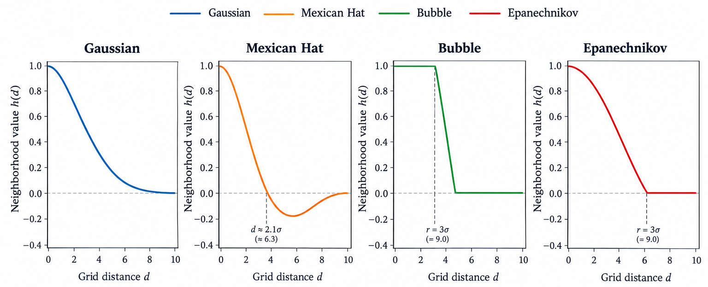
*Figure 06 — The four neighborhood kernels as functions of grid distance d for sigma=3. The Gaussian (blue) is smooth and always positive. The Mexican Hat (orange) has a negative inhibition ring at d ~ 2.1 sigma, producing lateral competition. The bubble (green) is flat within the radius and zero outside. The Epanechnikov (red) has a smooth quadratic falloff within the radius and zero outside. The Mexican Hat is the only kernel that can produce negative updates, which accelerates ordering but can destabilise training.*

### 2.4 — The Online (Sequential) Learning Rule

In online (sequential) mode, the weight update is applied after each individual training sample.  At training step t:

1. **Present** input $x_t$ drawn from the training set.

2. **Find BMU**:
$$
        bmu_t = argmin_{(i,j)} ||x_t - w_{ij}(t)||^2
$$

3. **Compute neighborhood influence** for every neuron (i, j):
$$
        h_{ij}(t) = h(d_grid(bmu_t, (i,j))^2, sigma(t))
$$
4. **Update all weights**:
$$
        w_{ij}(t+1) = w_{ij}(t) + alpha(t) * h_{ij}(t) * (x_t - w_{ij}(t))
$$

The update is a convex combination of the current weight and the training sample, weighted by the neighborhood influence.  For the BMU itself, $h_{bmu} = 1$ and the update reduces to:

$$
        w_{bmu}(t+1) = w_{bmu}(t) + alpha(t) * (x_t - w_{bmu}(t))

$$

which is an exponential moving average of the input samples that activate that neuron.

The learning rate alpha(t) and neighborhood radius sigma(t) are both decreasing functions of t.  During early training, alpha and sigma are large: the entire map moves toward each input and large-scale topological ordering emerges.  During late training, alpha and sigma are small: only the BMU and its immediate neighbors are updated, and the map fine-tunes its local approximation of the data distribution (Figure 07).

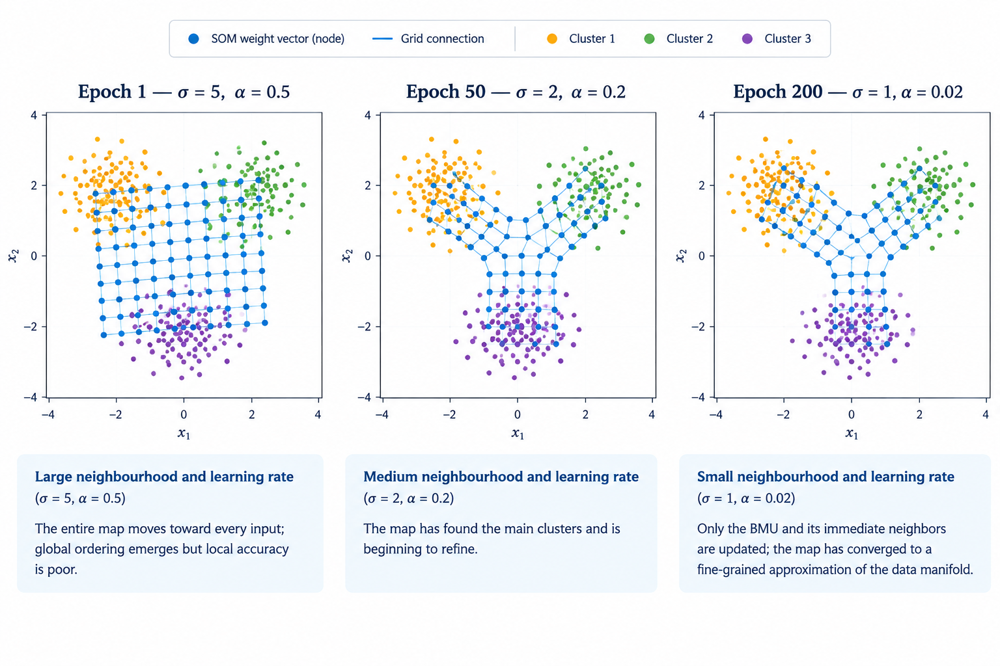
*Figure 07 — Three stages of SOM training visualized in a two-dimensional input space. Each panel shows the SOM weight vectors (dots) connected according to the grid topology (lines). Left: At epoch 1, $\sigma$ is large ($\sigma = 5$) and $\alpha$ is high ($\alpha = 0.5$). The entire map moves toward each input, producing global ordering but poor local accuracy. Center: At epoch 50, $\sigma$ and $\alpha$ have decreased to 2 and 0.2, respectively. The map has identified the main clusters and begun to refine its representation. Right: At epoch 200, $\sigma$ and $\alpha$ are small ($\sigma = 1$ and $\alpha = 0.02$). Only the BMU and its immediate neighbors are updated, and the map has converged to a fine-grained approximation of the data manifold.*

### 2.5 — Batch Training: The Generalized Lloyd Algorithm

In batch (epoch) mode, the weight update is computed from all N training samples simultaneously.  The new weight vector for neuron (i, j) is the neighborhood-kernel-weighted mean of all training inputs:

$$
w_{ij}^{\mathrm{new}}
=
\frac{
\displaystyle
\sum_{n=1}^{N}
h\left(
d_{\mathrm{grid}}\left(\mathrm{BMU}_n,(i,j)\right)^2,
\sigma
\right)
x_n
}{
\displaystyle
\sum_{n=1}^{N}
h\left(
d_{\mathrm{grid}}\left(\mathrm{BMU}_n,(i,j)\right)^2,
\sigma
\right)
}
$$

where ${BMU}_n$ is the BMU for sample $x_n$ computed using the **current** weights.

This is equivalent to one step of the Generalized Lloyd Algorithm (GLA), the batch version of k-means, extended with neighborhood weighting.  Each epoch of batch training is more expensive than one pass of online training (it requires computing ${BMU}_n$ for all N samples before any update), but convergence is typically achieved in far fewer epochs because the update direction is the expected gradient rather than a stochastic estimate.

Batch training is preferred when:

- The dataset fits comfortably in memory.
- Reproducible results are required (no stochastic sample order).
- The number of epochs needs to be minimised (e.g. for embedded deployment where training is performed on a more powerful host before flashing).

### 2.6 — Learning Rate and Neighborhood Radius Schedules

Both alpha(t) and sigma(t) must decrease monotonically from their initial values (${alpha}_0$, ${sigma}_0$) to their minimum values (alpha_min, sigma_min) over the course of training to guarantee convergence.  This framework provides four standard decay schedules.

- **Exponential decay** (default): Rapid early decay, slow late convergence.  The most widely used schedule in practice; simple to implement and robust to hyperparameter variation.

$$
v(t)
=
v_0\exp\left(-\frac{t}{\tau}\right),
\qquad
\tau
=
\frac{T-1}{\ln\left(\frac{v_0}{v_{\min}}\right)}
$$

- **Linear decay**: Uniform rate of decrease.  Appropriate when early and late training phases should receive equal weight.

$$
v(t)
=
v_0\left(1-\frac{t}{T}\right)
$$

- **Inverse-time decay**: Slower decay than exponential; useful for large maps (n_rows * n_cols > 400)
where convergence requires more late-stage fine-tuning.

$$
    v(t) = \frac{v_0}{(1 + decay * t)}
$$

- **Cyclical (warm-restart cosine)**: Periodically increases the learning rate and neighborhood radius, allowing the map to escape local ordering minima.  Useful for complex, multi-modal data distributions (Figure 08).

$$
v(t)
=
v_{\min}
+
\frac{1}{2}(v_0-v_{\min})
\left(
1+\cos\left(\frac{\pi t}{T_{\mathrm{half}}}\right)
\right)
$$

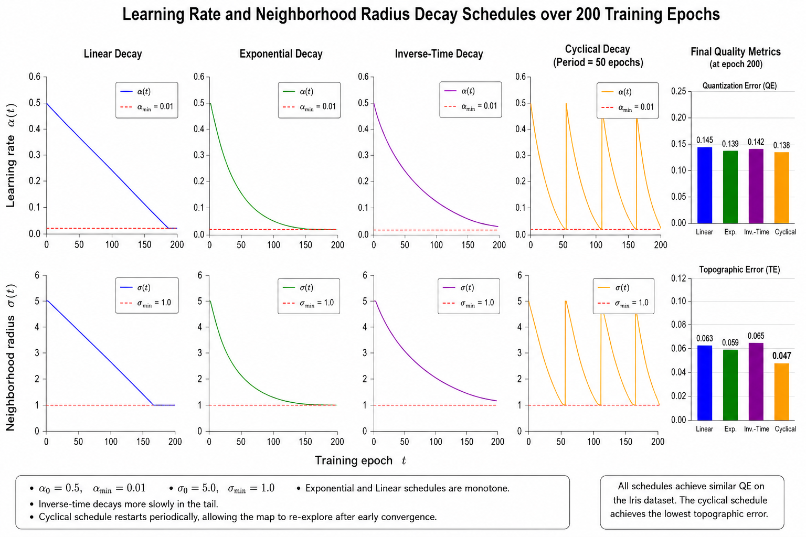
*Figure 08 — Learning rate and neighborhood radius decay schedules over 200 training epochs. Top row: learning rate alpha(t) for all four schedules (alpha_0=0.5, alpha_min=0.01). Bottom row: neighborhood radius sigma(t) (sigma_0=5.0, sigma_min=1.0). The exponential and linear schedules are monotone; the inverse-time schedule decays more slowly in the tail; the cyclical schedule restarts periodically, allowing the map to re-explore after early convergence. Final QE (rightmost bars) is similar for all four schedules on the Iris dataset, with the cyclical schedule achieving the lowest topographic error.*

### 2.7 — The Unified Distance Matrix (U-Matrix)

The Unified Distance Matrix (U-matrix, Ultsch & Siemon, 1990) is the primary tool for visualising cluster structure in a trained SOM.  The U-matrix entry for neuron (i, j) is the mean Euclidean distance between the weight vector $w_{ij}$ and the weight vectors of its immediate neighbors:

$$
U_{ij}
=
\frac{1}{\lvert N(i,j)\rvert}
\sum_{(r,c)\in N(i,j)}
\left\lVert
w_{ij}-w_{rc}
\right\rVert_2
$$

where N(i, j) is the set of direct neighbors on the grid.  For an interior neuron in a rectangular topology, |N(i,j)| = 4 (cardinal) or 8 (Chebyshev); for a hexagonal topology, 

$$
|N(i,j)| = 6.
$$

**Interpretation** (Figure 09):

- **Low U-matrix values** (dark in the ``bone_r`` colormap) indicate that   neighboring neurons represent similar regions of input space.  These   form the **interiors** of clusters.

- **High U-matrix values** (light) indicate a large weight distance between   adjacent neurons — a sharp transition in the feature space.  These form   the **boundaries** between clusters.

The U-matrix thus reveals the cluster structure of the data in a resolution-free, model-free way: the number of clusters, their relative sizes, and their boundaries can all be read directly from the 2-D image without any additional clustering algorithm.

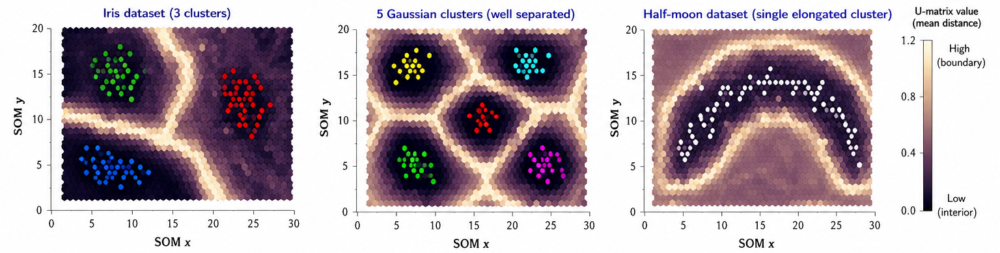
*Figure 09 — U-matrix interpretation on three datasets. Left: the Iris dataset (3 clusters). The U-matrix shows two prominent ridges separating the setosa cluster (bottom-left, very distinct) from the versicolor and virginica clusters (which are adjacent and partially overlapping). Center: a dataset with 5 well-separated Gaussian clusters. Five distinct dark islands (low U-values) are visible, surrounded by a bright ridge network. Right: a single elongated cluster (half-moon). The U-matrix shows a uniformly low interior with moderate edges, indicating no sub-cluster structure.*

### 2.8 — Quality Metrics: Quantization and Topographic Error

Two metrics are universally used to assess SOM training quality.

- **Quantization Error (QE):** The mean Euclidean distance between each input and its BMU weight vector. This is the SOM's analogue of the k-means within-cluster sum of squares. QE decreases monotonically during training (for well-tuned hyperparameters) and measures how accurately the prototype vectors represent the training data. A lower QE indicates a better vector quantisation.

$$
\mathrm{QE}
=
\frac{1}{N}
\sum_{n=1}^{N}
\left\lVert
x_n-w_{\mathrm{BMU}(x_n)}
\right\rVert_2
$$

- **Topographic Error (TE)** (Kiviluoto, 1996): where bmu1(x) and bmu2(x) are the first and second best-matching units for x. TE measures how often the two closest prototypes to an input are non-adjacent on the grid.  A perfectly topology-preserving map achieves TE = 0; random weight arrangements typically yield TE close to 1.

$$
\mathrm{TE}
=
\frac{1}{N}
\sum_{n=1}^{N}
\mathbb{1}
\left[
\mathrm{BMU}_2(x_n)
\not\sim
\mathrm{BMU}_1(x_n)
\right]
$$

The two metrics capture different aspects of quality: QE measures approximation accuracy, TE measures topology preservation.  A map can have low QE (accurate prototypes) but high TE (disordered), or low TE (ordered) but high QE (coarse prototypes) (Figure 10).

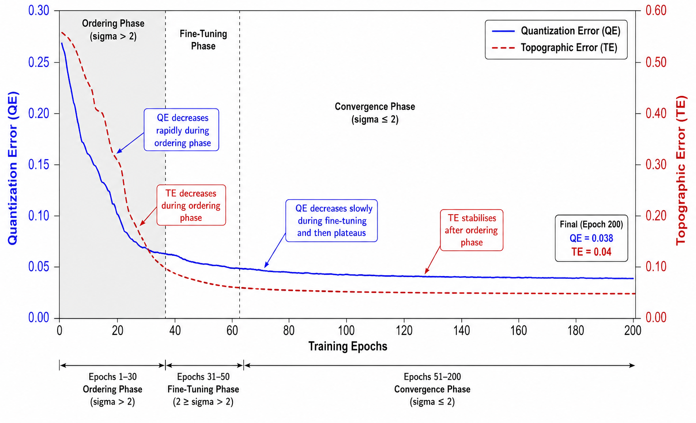
*Figure 10 — Relationship between quantization error (QE) and topographic error (TE) as a function of training epochs on the Digits dataset. Both metrics decrease during training but at different rates: QE decreases rapidly during the ordering phase (epochs 1-30) and slowly during fine-tuning; TE decreases during the ordering phase and stabilises. The gray shaded region marks the ordering phase (sigma > 2). After epoch 50, both metrics plateau, indicating convergence. The final map achieves QE=0.038, TE=0.04.*

### 2.9 — Numerical Walkthrough

We perform a complete online training step for a 3x3 SOM with d=2,
Gaussian kernel, and a single input x = [0.8, 0.3].

**Initial weights** (arranged on the 3x3 grid):
$$
    Row 0:  w_{00}=[0.1, 0.9]   w_{01}=[0.5, 0.7]   w_{02}=[0.9, 0.5] \\

    Row 1:  w_{10}=[0.2, 0.4]   w_{11}=[0.6, 0.3]   w_{12}=[0.8, 0.1] \\

    Row 2:  w_{20}=[0.0, 0.1]   w_{21}=[0.3, 0.2]   w_{22}=[0.7, 0.0]\\
$$
**BMU search** (squared Euclidean distances to x = [0.8, 0.3]):
$$
    D_{00} = (0.8-0.1)^2 + (0.3-0.9)^2 = 0.49 + 0.36 = 0.85 \\
    D_{01} = (0.8-0.5)^2 + (0.3-0.7)^2 = 0.09 + 0.16 = 0.25\\
    D_{02} = (0.8-0.9)^2 + (0.3-0.5)^2 = 0.01 + 0.04 = 0.05  <- BMU\\
    D_{10} = (0.8-0.2)^2 + (0.3-0.4)^2 = 0.36 + 0.01 = 0.37\\
    D_{11} = (0.8-0.6)^2 + (0.3-0.3)^2 = 0.04 + 0.00 = 0.04  (close 2nd)\\
    D_{12} = (0.8-0.8)^2 + (0.3-0.1)^2 = 0.00 + 0.04 = 0.04  (tie)\\
    ...\\

    BMU = (0, 2)  with distance^2 = 0.05  (d_eucl = 0.224)\\
$$
**Grid distances** from BMU (0, 2):
$$

    d_{00}^2 = (0-0)^2 + (2-0)^2 = 4   ,\  d_{01}^2 = 1  ,\   d_{02}^2 = 0 \\
    d_{10}^2 = (1-0)^2 + (2-0)^2 = 5   ,\  d_{11}^2 = 2  ,\  d_{12}^2 = 1 \\
    d_{20}^2 = (2-0)^2 + (2-0)^2 = 8   ,\  d_{21}^2 = 5  ,\   d_{22}^2 = 4 \\
$$
**Gaussian neighborhood** (sigma = 2.0):
$$
    h_{ij} = exp(-d_{ij}^2 / (2 * 4.0))
$$
$$
    h_{00}=exp(-0.50)=0.607  ,\ h_{01}=exp(-0.125)=0.882 ,\ h_{02}=exp(0)=1.000 \\
    h_{10}=exp(-0.625)=0.535 ,\  h_{11}=exp(-0.250)=0.779 ,\  h_{12}=exp(-0.125)=0.882 \\
    h_{20}=exp(-1.000)=0.368 ,\ h_{21}=exp(-0.625)=0.535  ,\ h_{22}=exp(-0.500)=0.607
$$
**Weight update** (alpha = 0.3):

$$
    w_{ij}^{new} = w_{ij} + 0.3 * h_{ij} * (x - w_{ij})
$$

For the BMU (0, 2):
$$
 h=1.0 \\
 delta = [0.8-0.9, 0.3-0.5] = [-0.1, -0.2] \\
    w_{02}^{new} = [0.9, 0.5] + 0.3 * 1.0 * [-0.1, -0.2] = [0.9 - 0.03, 0.5 - 0.06] = [0.870, 0.440]
$$

For neighbor (0, 1): 
$$

h=0.882 \\
delta = [0.8-0.5, 0.3-0.7] = [0.3, -0.4]  \\
    w_{01}^{new} = [0.5, 0.7] + 0.3 * 0.882 * [0.3, -0.4] = [0.5 + 0.079, 0.7 - 0.106] = [0.579, 0.594]
$$

For distant neuron (2, 0): 

$$
h=0.368 \\
 delta = [0.8-0.0, 0.3-0.1] = [0.8, 0.2]  \\
    w_{20}^{new} = [0.0, 0.1] + 0.3 * 0.368 * [0.8, 0.2] = [0.0 + 0.088, 0.1 + 0.022] = [0.088, 0.122]
$$

All 9 weight vectors are updated simultaneously.  The BMU moves most strongly toward x; distant neurons receive only a small nudge.

## 3 — TinyML Implementation

With this example you can implement the SOM model on ESP32, Arduino,
Arduino Portenta H7 with Vision Shield, Raspberry Pi, and other
microcontrollers or IoT devices *(Figure 12)*.

### 3.1 — Jupyter Notebooks

-  Self-Organizing Map Training and Evaluation

### 3.2 — Arduino Code

-  Example 1: Iris Dataset — 2-D Topology Preservation

-  Example 2: Hexagonal Topology with Mexican Hat Kernel

-  Example 3: Weight Trajectories and Schedule Comparison

-  Example 4: Digits Dataset — Large Map and Batch Training

## References

[1] Kohonen, T. (1982). Self-Organized Formation of Topologically Correct Feature Maps. *Biological Cybernetics*, 43(1), 59-69.

[2] Kohonen, T. (2001). *Self-Organizing Maps* (3rd ed.). Springer-Verlag.

[3] Ultsch, A., & Siemon, H. P. (1990). Kohonen's Self Organizing Feature Maps for Exploratory Data Analysis. *Proceedings of INNC*, 305-308.

[4] Kiviluoto, K. (1996). Topology Preservation in Self-Organizing Maps. *Proceedings of ICNN*, 294-299.

[5] Vesanto, J., & Alhoniemi, E. (2000). Clustering of the Self-Organizing Map. *IEEE Transactions on Neural Networks*, 11(3), 586-600.

[6] Bishop, C. M., Svensen, M., & Williams, C. K. I. (1998). GTM: The Generative Topographic Mapping. *Neural Computation*, 10(1), 215-234.

[7] Xie, J., Girshick, R., & Farhadi, A. (2016). Unsupervised Deep Embedding for Clustering Analysis. *ICML 2016*, 478-487.

[8] Fortuin, V., Huber, M., Rios, F., Zimmermann, T., & Ratsch, G. (2019). SOM-VAE: Interpretable Discrete Representation Learning on Time Series. *ICLR 2019*.

[9] Epanechnikov, V. A. (1969). Non-Parametric Estimation of a Multivariate Probability Density. *Theory of Probability and its Applications*, 14(1), 153-158.

[10] Rousseeuw, P. J. (1987). Silhouettes: A Graphical Aid to the Interpretation and Validation of Cluster Analysis. *Journal of Computational and Applied Mathematics*, 20, 53-65.

[11] Lloyd, S. P. (1982). Least Squares Quantization in PCM. *IEEE Transactions on Information Theory*, 28(2), 129-137.

[12] Lane, N. D., Bhattacharya, S., Georgiev, P., Forlivesi, C., & Kawsar, F. (2015). An Early Resource Characterization of Deep Learning on Wearables, Smartphones and Internet-of-Things Devices. *IoT-App 2015*, 7-12.

[13] Rauber, A., Merkl, D., & Dittenbach, M. (2002). The Growing Hierarchical Self-Organizing Map: Exploratory Analysis of High-Dimensional Data. *IEEE Transactions on Neural Networks*, 13(6), 1331-1341.
